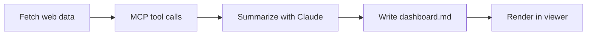

# מפתח התקציב - דפי overview

## הצורך
- כרגע אין דפים מסדרים ל"נושאים" בתקציב - רק לסעיפים תקציביים קונקרטיים.
  - למשל יש כמה דפים על מחוננים כאשר זה מחולק בעצם בכמה סעיפים, לאנרגיה מתחדשת לא ברור מה יש בכלל
- הבעיה היא לא אינדוקס, ולא שאין בכלל תוכן מאוגרג מעניין (יש 2-4 דברים כאלה בראש הדף), אדם כן חושב שיש מה "לשפר" שם שליצור דפי overview יעזור בו
- גם החיפוש בתוך האתר לא נותן תוצאות חד משמעיות - כי אין באמת (ה-UI לא מראה דף ספציפי כי לא בטוח שיש אחד ולא רוצים להטעות)
- זה דורש שני שלבים:
  1. מה רשימת נושאי ה"גג" שצריכים overview?
  2. בהינתן נושא גג, לייצר pipeline שעושה לו overview על בסיס המידע של האתר

**מבחינתנו שלב 1 יקרה בצוות של הסדנה והם מצפים מאיתנו רק ל-2.** אנחנו עדיין נצטרך להבין מה השאלות המעניינות כדי לבנות עבורן פתרונות וכלים בהתאם. 

## הפתרון
ה-pipeline יהיה בגדול:

## שאלות מחקריות
1. איך החיפוש הפנימי עובד? למה "נוער מחונן" מחזיר את "מימון בניית בית כנסת החורבה 70.69.11.33"?
2. האם זה עובד אחרת ב-MCP? מה הוא מחזיר כשמחפשים "דפים בנושא נוער מחונן"?

## מבנה ה-repo 
(כלומר talpiot-hasdna-budget-hackathon)
1. talpihackathon: בעצם התיקייה הראשית
   1. content: דפי md שיצרנו
   2. main_agent: הקוד של הסוכן שלנו ששולף את המידע
   3. server, src: מודולים זמניים של ההצגה הנוכחית של הקבצים 