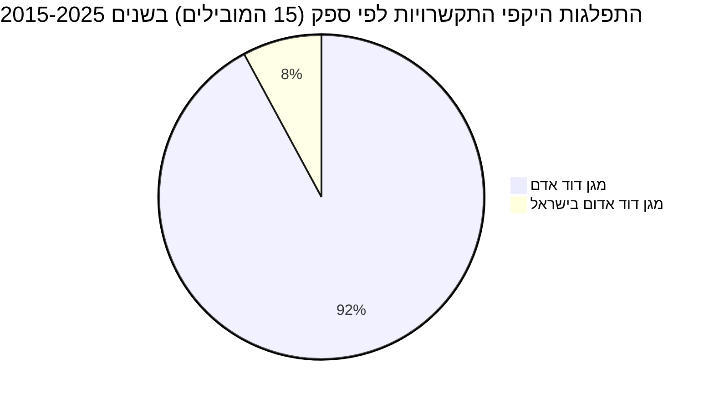
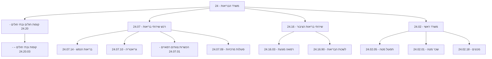

# נתוני תקציב, התקשרויות והחלטות ממשלה בתחום מגן דוד אדום

מגן דוד אדום (מד"א) הוא ארגון ההצלה הלאומי של ישראל, המספק שירותי רפואת חירום, דם, עזרה ראשונה והדרכה. הנתונים המוצגים כאן משקפים את פעילותו דרך התקשרויות עם משרדי ממשלה שונים, בעיקר [משרד הבריאות](https://next.obudget.org/i/budget/0024/2026) ומשרד החינוך, וכן החלטות ממשלה הנוגעות לתפקידו ותפעולו. בין השנים 2015-2025, מד"א זכה להתקשרויות בהיקף מצטבר של למעלה מ-500 מיליון ש"ח, עבור מגוון רחב של שירותים, כולל בדיקות אנטיגן, מבצעי חיסונים, הקמת בנק דם לאומי, והדרכות עזרה ראשונה במוסדות חינוך. החלטות הממשלה מדגישות את מעורבותו של מד"א בהיערכות לאומית, תגובה למגפת הקורונה ותיקוני חקיקה רלוונטיים.

## מגמה תקציבית לאורך זמן

לא נמצא מידע רלוונטי לנושא מגן דוד אדום

## תכניות פעילות כיום

### התפלגות היקפי התקשרויות לפי ספק (15 הספקים המובילים) בשנים 2015-2025

## מקורות תקציב

מגן דוד אדום מקבל תקצוב משמעותי באמצעות התקשרויות עם משרדי ממשלה שונים. סעיפי התקציב המפורטים מטה משקפים את ההקצאות התקציביות הרלוונטיות במסגרת [משרד הבריאות](https://next.obudget.org/i/budget/0024/2026), אשר דרכו מתבצעות רבות מההתקשרויות עם מד"א.

### רשימת סעיפי תקציב נבחרים (עם קישורים)
* [24 - משרד הבריאות](https://next.obudget.org/i/budget/0024/2026)
    * [24.20 - קופות חולים ובתי חולים](https://next.obudget.org/i/budget/002420/2026)
        * [24.20.03 - קופות ובתי חולים –](https://next.obudget.org/i/budget/00242003/2026)
    * [24.07 - רכש שירותי בריאות](https://next.obudget.org/i/budget/002407/2026)
        * [24.07.14 - בריאות הנפש](https://next.obudget.org/i/budget/00240714/2026)
        * [24.07.10 - גריאטריה](https://next.obudget.org/i/budget/00240710/2026)
        * [24.07.01 - הכשרות צוותים רפואיים](https://next.obudget.org/i/budget/00240701/2026)
        * [24.07.09 - פעולות מרכזיות](https://next.obudget.org/i/budget/00240709/2026)
    * [24.16 - שירותי בריאות הציבור](https://next.obudget.org/i/budget/002416/2026)
        * [24.16.03 - רפואה מונעת](https://next.obudget.org/i/budget/00241603/2026)
        * [24.16.90 - לשכות הבריאות](https://next.obudget.org/i/budget/00241690/2026)
    * [24.02 - משרד ראשי](https://next.obudget.org/i/budget/002402/2026)
        * [24.02.05 - תפעול מטה](https://next.obudget.org/i/budget/00240205/2026)
        * [24.02.01 - שכר מטה](https://next.obudget.org/i/budget/00240201/2026)
        * [24.02.18 - מכונים](https://next.obudget.org/i/budget/00240218/2026)

## נושאים נוספים

### התקשרויות/חוזים
| Purpose | Purchasing Ministry | Supplier Entity Name | Volume | Executed | Start Year | End Year | Item URL |
|---|---|---|---|---|---|---|---|
| מכרז 8/2022 מכרז מתחמי אנטיגן מוסדי | משרד הבריאות | [מגן דוד אדם](https://next.obudget.org/s?q=%D7%9E%D7%92%D7%9F%20%D7%93%D7%95%D7%93%20%D7%90%D7%93%D7%9D) | 58,646,229.00 | 58,495,128.00 | 2022 | 2022 | [Link](https://next.obudget.org/i/488b0669ffce) |
| מכרז 8/2022 מכרז מתחמי אנטיגן מוסדי | משרד הבריאות | [מגן דוד אדם](https://next.obudget.org/s?q=%D7%9E%D7%92%D7%9F%20%D7%93%D7%95%D7%93%20%D7%90%D7%93%D7%9D) | 45,500,000.00 | 45,249,176.00 | 2022 | 2022 | [Link](https://next.obudget.org/i/c4526e9323a9) |
| הפעלת מוקד בנתב"ג ובדיקות הדבקות בנגיף הקורונה בקהילה | משרד הבריאות | [מגן דוד אדם](https://next.obudget.org/s?q=%D7%9E%D7%92%D7%9F%20%D7%93%D7%95%D7%93%20%D7%90%D7%93%D7%9D) | 26,836,000.00 | 0.00 | 2020 | 2020 | [Link](https://next.obudget.org/i/de2461d4ab2b) |
| הפעלת מוקד בנתב"ג ובדיקות הדבקות בנגיף הקורונה בקהילה | משרד הבריאות | [מגן דוד אדם](https://next.obudget.org/s?q=%D7%9E%D7%92%D7%9F%20%D7%93%D7%95%D7%93%20%D7%90%D7%93%D7%9D) | 26,836,000.00 | 0.00 | 2020 | 2020 | [Link](https://next.obudget.org/i/376020ed696d) |
| מסד 686, 694 - חלוקת ערכות דיגום אנטיגן ע"י מד"א | משרד הבריאות | [מגן דוד אדם](https://next.obudget.org/s?q=%D7%9E%D7%92%D7%9F%20%D7%93%D7%95%D7%93%20%D7%90%D7%93%D7%9D) | 26,579,376.00 | 25,004,456.62 | 2021 | 2021 | [Link](https://next.obudget.org/i/a5fe3a138c05) |
| מסד 661 + 702 מכרז 103/2021 בדיקות מהירות אנטיגן קורונה תו ירוק | משרד הבריאות | [מגן דוד אדם](https://next.obudget.org/s?q=%D7%9E%D7%92%D7%9F%20%D7%93%D7%95%D7%93%20%D7%90%D7%93%D7%9D) | 25,441,728.00 | 25,441,728.00 | 2021 | 2022 | [Link](https://next.obudget.org/i/eda1624c1d9a) |
| הקמת בנק דם לאומי | משרד הבריאות | [מגן דוד אדם](https://next.obudget.org/s?q=%D7%9E%D7%92%D7%9F%20%D7%93%D7%95%D7%93%20%D7%90%D7%93%D7%9D) | 23,620,000.00 | 2,047,896.97 | 2019 | 2020 | [Link](https://next.obudget.org/i/f9a255645ea3) |
| מסד 457, 565 - הפעלת מד"א בפעילות התחסנות דיירי מוסדות מגן אבות | משרד הבריאות | [מגן דוד אדם](https://next.obudget.org/s?q=%D7%9E%D7%92%D7%9F%20%D7%93%D7%95%D7%93%20%D7%90%D7%93%D7%9D) | 17,002,740.00 | 16,975,260.00 | 2021 | 2021 | [Link](https://next.obudget.org/i/2b728a84d68a) |
| הקמת בנק דם לאומי | משרד הבריאות | [מגן דוד אדם](https://next.obudget.org/s?q=%D7%9E%D7%92%D7%9F%20%D7%93%D7%95%D7%93%20%D7%90%D7%93%D7%9D) | 15,420,000.00 | 15,419,999.13 | 2019 | 2021 | [Link](https://next.obudget.org/i/3a18094fd394) |
| מס"ד 661 +702 מכרז 111/20211 בדיקות מהירות תו ירוק | משרד הבריאות | [מגן דוד אדם](https://next.obudget.org/s?q=%D7%9E%D7%92%D7%9F%20%D7%93%D7%95%D7%93%20%D7%90%D7%93%D7%9D) | 13,745,732.00 | 13,465,504.00 | 2021 | 2022 | [Link](https://next.obudget.org/i/9beb2df802d6) |
| מכרז 34/10.2012 טיפול ראשוני לתלמידים שנפצעובמוסדו | משרד החינוך | [מגן דוד אדם](https://next.obudget.org/s?q=%D7%9E%D7%92%D7%9F%20%D7%93%D7%95%D7%93%20%D7%90%D7%93%D7%9D) | 9,120,000.00 | 6,840,000.00 | 2017 | 2018 | [Link](https://next.obudget.org/i/5f868de69e7c) |
| מכרז 34.10/2012 מתן מענה טיפול ראשוני לתלמידים שנפצעו/נפגעו במוסדות חינוך | משרד החינוך | [מגן דוד אדם](https://next.obudget.org/s?q=%D7%9E%D7%92%D7%9F%20%D7%93%D7%95%D7%93%20%D7%90%D7%93%D7%9D) | 9,120,000.00 | 6,840,000.00 | 2018 | 2019 | [Link](https://next.obudget.org/i/12dba5a860b2) |
| מתן מענה טיפול רפואי ראשוני לתלמידים שנפגעו במוסדו | משרד החינוך | [מגן דוד אדם](https://next.obudget.org/s?q=%D7%9E%D7%92%D7%9F%20%D7%93%D7%95%D7%93%20%D7%90%D7%93%D7%9D) | 9,120,000.00 | 9,120,000.00 | 2015 | 2016 | [Link](https://next.obudget.org/i/b3a86eb47a59) |
| מכרז 34.10/2012 מתן מענה טיפול ראשוני לתלמידים שנפצעו/נפגעו במוסדות חינוך | משרד החינוך | [מגן דוד אדם](https://next.obudget.org/s?q=%D7%9E%D7%92%D7%9F%20%D7%93%D7%95%D7%93%20%D7%90%D7%93%D7%9D) | 9,120,000.00 | 9,120,000.00 | None | None | [Link](https://next.obudget.org/i/ffa5548c87f0) |
| מתן מענה טיפול רפואי ראשוני לתלמידים במוסדות חינוך | משרד החינוך | [מגן דוד אדם](https://next.obudget.org/s?q=%D7%9E%D7%92%D7%9F%20%D7%93%D7%95%D7%93%20%D7%90%D7%93%D7%9D) | 9,120,000.00 | 9,120,000.00 | 2016 | 2017 | [Link](https://next.obudget.org/i/bcb09f4f508f) |
| מסד 653, מ-41, מ-45 פנייה פרטנית חיסונים 5-8 מכרז 52/2021 - מד"א | משרד הבריאות | [מגן דוד אדם](https://next.obudget.org/s?q=%D7%9E%D7%92%D7%9F%20%D7%93%D7%95%D7%93%20%D7%90%D7%93%D7%9D) | 7,800,000.00 | 3,144,881.80 | 2021 | 2021 | [Link](https://next.obudget.org/i/f2b4073181b6) |
| חיסוני ילדים בגילאי 12-15 | משרד הבריאות | [מגן דוד אדם](https://next.obudget.org/s?q=%D7%9E%D7%92%D7%9F%20%D7%93%D7%95%D7%93%20%D7%90%D7%93%D7%9D) | 7,568,071.00 | 7,532,554.00 | 2021 | 2021 | [Link](https://next.obudget.org/i/edee4b1e5f3f) |
| הפעלת מודל מ.ד.א. - עפ"י ועדת חריגים 22.3.20 | משרד הבריאות | [מגן דוד אדם](https://next.obudget.org/s?q=%D7%9E%D7%92%D7%9F%20%D7%93%D7%95%D7%93%20%D7%90%D7%93%D7%9D) | 7,288,170.00 | 0.00 | 2020 | 2020 | [Link](https://next.obudget.org/i/787a903b04c3) |
| הפעלת מודל מ.ד.א. - עפ"י ועדת חריגים 22.3.20 | משרד הבריאות | [מגן דוד אדם](https://next.obudget.org/s?q=%D7%9E%D7%92%D7%9F%20%D7%93%D7%95%D7%93%20%D7%90%D7%93%D7%9D) | 7,288,170.00 | 0.00 | 2020 | 2020 | [Link](https://next.obudget.org/i/ea945a671dff) |
| מערכת שו"ב תומ"ר | כבאות והצלה לישראל | [מגן דוד אדם](https://next.obudget.org/s?q=%D7%9E%D7%92%D7%9F%20%D7%93%D7%95%D7%93%20%D7%90%D7%93%D7%9D) | 7,050,000.00 | 0.00 | 2020 | 2020 | [Link](https://next.obudget.org/i/8d3ae2ecc08c) |
| מכרז 39/10.2018 מתן מענה להיפגעות תלמידים שנפגעו | משרד החינוך | [מגן דוד אדם](https://next.obudget.org/s?q=%D7%9E%D7%92%D7%9F%20%D7%93%D7%95%D7%93%20%D7%90%D7%93%D7%9D) | 6,930,000.00 | 6,982,452.65 | 2022 | 2023 | [Link](https://next.obudget.org/i/fe02b96b1644) |
| מכרז 39/10.2018 - מתן מענה רפואי ראשוני לתלמידים נפצעו/נפגעו במוסדות חינוך | משרד החינוך | [מגן דוד אדם](https://next.obudget.org/s?q=%D7%9E%D7%92%D7%9F%20%D7%93%D7%95%D7%93%20%D7%90%D7%93%D7%9D) | 6,930,000.00 | 3,465,000.00 | None | None | [Link](https://next.obudget.org/i/62e882d122fd) |
| מכרז 39/10.2018 - מתן מענה רפואי ראשוני לתלמידים נפצעו/נפגעו במוסדות חינוך | משרד החינוך | [מגן דוד אדם](https://next.obudget.org/s?q=%D7%9E%D7%92%D7%9F%20%D7%93%D7%95%D7%93%20%D7%90%D7%93%D7%9D) | 6,930,000.00 | 6,352,500.00 | 2019 | 2020 | [Link](https://next.obudget.org/i/fc0489872e76) |
| מכרז 39/10.2018 מתן מענה טיפולי ראשוני לתלמידים שנפגעו במערכת החינוך | משרד החינוך | [מגן דוד אדום בישראל](https://next.obudget.org/s?q=%D7%9E%D7%92%D7%9F%20%D7%93%D7%95%D7%93%20%D7%90%D7%93%D7%95%D7%9D%20%D7%91%D7%99%D7%A9%D7%A8%D7%90%D7%9C) | 6,930,000.00 | 0.00 | 2024 | 2025 | [Link](https://next.obudget.org/i/47ca87f33c16) |
| מכרז 39/10.2018 - מתן מענה טיפול רפואי ראשוני לתלמידים | משרד החינוך | [מגן דוד אדם](https://next.obudget.org/s?q=%D7%9E%D7%92%D7%9E%D7%9F%20%D7%93%D7%95%D7%93%20%D7%90%D7%93%D7%9D) | 6,930,000.00 | 6,545,000.00 | 2020 | 2021 | [Link](https://next.obudget.org/i/feb2933f2931) |
| מכרז 39/10.2018 מתן מענה רפואי לתלמידים שנפגעו | משרד החינוך | [מגן דוד אדם](https://next.obudget.org/s?q=%D7%9E%D7%92%D7%9F%20%D7%93%D7%95%D7%93%20%D7%90%D7%93%D7%9D) | 6,930,000.00 | 4,865,235.36 | 2023 | 2024 | [Link](https://next.obudget.org/i/bf5060c091bf) |
| מערכת שו"ב תומ"ר | כבאות והצלה לישראל | [מגן דוד אדום בישראל](https://next.obudget.org/s?q=%D7%9E%D7%92%D7%9E%D7%9F%20%D7%93%D7%95%D7%93%20%D7%90%D7%93%D7%95%D7%9D%20%D7%91%D7%99%D7%A9%D7%A8%D7%90%D7%9C) | 5,149,250.00 | 0.00 | 2024 | 2024 | [Link](https://next.obudget.org/i/e16386caa6c0) |
| מכרז 9/3.2019 בצוע הדרכה בעזרה ראונה לכיתות י\' | משרד החינוך | [מגן דוד אדם](https://next.obudget.org/s?q=%D7%9E%D7%92%D7%9F%20%D7%93%D7%95%D7%93%20%D7%90%D7%93%D7%9D) | 4,799,360.00 | 0.00 | 2022 | 2023 | [Link](https://next.obudget.org/i/6a898c2df9ed) |
| מכרז מס\' 9/3.2019 - ביצוע הדרכה בעזרה ראשונה לתלמידי כיתות י\' | משרד החינוך | [מגן דוד אדם](https://next.obudget.org/s?q=%D7%9E%D7%92%D7%9F%20%D7%93%D7%95%D7%93%20%D7%90%D7%93%D7%9D) | 4,799,360.00 | 0.00 | 2021 | 2022 | [Link](https://next.obudget.org/i/5f4893276c40) |
| הקמת בנק דם לאומי | משרד הבריאות | [מגן דוד אדום בישראל](https://next.obudget.org/s?q=%D7%9E%D7%92%D7%9E%D7%9F%20%D7%93%D7%95%D7%93%20%D7%90%D7%93%D7%95%D7%9D%20%D7%91%D7%99%D7%A9%D7%A8%D7%90%D7%9C) | 4,700,000.00 | 0.00 | 2024 | 2025 | [Link](https://next.obudget.org/i/be31ecb59874) |
| הקמת בנק דם לאומי | משרד הבריאות | [מגן דוד אדם](https://next.obudget.org/s?q=%D7%9E%D7%92%D7%9E%D7%9F%20%D7%93%D7%95%D7%93%20%D7%90%D7%93%D7%9D) | 4,700,000.00 | 0.00 | 2019 | 2021 | [Link](https://next.obudget.org/i/e25adad5e243) |
| מכרז 19/5.2023 ביצוע תוכניות ללימודי עזר ראשונה לתלמידי כיתות י\' | משרד החינוך | [מגן דוד אדם](https://next.obudget.org/s?q=%D7%9E%D7%92%D7%9E%D7%9F%20%D7%93%D7%95%D7%93%20%D7%90%D7%93%D7%9D) | 4,440,620.00 | 638,780.00 | 2023 | 2024 | [Link](https://next.obudget.org/i/eb04cf676aeb) |
| מכרז 19/5.2023 בצוע תוכניות לימודי עזרה ראשונה כיתות י\' | משרד החינוך | [מגן דוד אדום בישראל](https://next.obudget.org/s?q=%D7%9E%D7%92%D7%9E%D7%9F%20%D7%93%D7%95%D7%93%20%D7%90%D7%93%D7%95%D7%9D%20%D7%91%D7%99%D7%A9%D7%A8%D7%90%D7%9C) | 4,440,620.00 | 0.00 | 2024 | 2025 | [Link](https://next.obudget.org/i/52010180227f) |
| מכרז 19/5.2023 ביצוע תוכניות ללימודי עזר ראשונה לתלמידי כיתות י\' | משרד החינוך | [מגן דוד אדום בישראל](https://next.obudget.org/s?q=%D7%9E%D7%92%D7%9E%D7%9F%20%D7%93%D7%95%D7%93%20%D7%90%D7%93%D7%95%D7%9D%20%D7%91%D7%99%D7%A9%D7%A8%D7%90%D7%9C) | 3,801,840.00 | 0.00 | 2024 | 2024 | [Link](https://next.obudget.org/i/a71c54e1465f) |
| מסד 679 - פעילות מדא באומן | משרד הבריאות | [מגן דוד אדם](https://next.obudget.org/s?q=%D7%9E%D7%92%D7%9E%D7%9F%20%D7%93%D7%95%D7%93%20%D7%90%D7%93%D7%9D) | 3,672,027.74 | 3,455,770.00 | 2021 | 2021 | [Link](https://next.obudget.org/i/e556400a79ae) |
| מכרז 9/3.2019 - ביצוע תכניות ללימודי עזרה ראשונה לתלמידי כיתות י\' | משרד החינוך | [מגן דוד אדם](https://next.obudget.org/s?q=%D7%9E%D7%92%D7%9E%D7%9F%20%D7%93%D7%95%D7%93%20%D7%90%D7%93%D7%9D) | 3,668,960.00 | 1,102,370.00 | 2019 | 2020 | [Link](https://next.obudget.org/i/e0ebba8f9ae2) |
| ח-176,ח-184, 531, ח-209, 565 - חיסוני מד"א בפריפריה, חסרי מעמד ובתי הסוהר. | משרד הבריאות | [מגן דוד אדם](https://next.obudget.org/s?q=%D7%9E%D7%92%D7%9E%D7%9F%20%D7%93%D7%95%D7%93%20%D7%90%D7%93%D7%9D) | 3,590,754.00 | 3,545,890.00 | 2021 | 2021 | [Link](https://next.obudget.org/i/5773ab79be4d) |
| מסד 545,546 - חיסון פועלים פלסטינאים במעברים | משרד הבריאות | [מגן דוד אדם](https://next.obudget.org/s?q=%D7%9E%D7%92%D7%9E%D7%9F%20%D7%93%D7%95%D7%93%20%D7%90%D7%93%D7%9D) | 2,844,890.00 | 2,839,802.00 | 2021 | 2022 | [Link](https://next.obudget.org/i/de4aecdf4b55) |
| הפעלת 15 צוותי דיגום מד"א | משרד הבריאות | [מגן דוד אדם](https://next.obudget.org/s?q=%D7%9E%D7%92%D7%9E%D7%9F%20%D7%93%D7%95%D7%93%20%D7%90%D7%93%D7%9D) | 2,829,750.00 | 1,614,305.00 | 2021 | 2021 | [Link](https://next.obudget.org/i/d56bc6629be5) |
| מכרז 35/11.2019 בצוע קורסי עזרה ראונה לעובדי הוראה | משרד החינוך | [מגן דוד אדם](https://next.obudget.org/s?q=%D7%9E%D7%92%D7%9E%D7%9F%20%D7%93%D7%95%D7%93%20%D7%90%D7%93%D7%9D) | 2,596,700.00 | 1,482,339.00 | 2021 | 2022 | [Link](https://next.obudget.org/i/fb0bfa0a4bd7) |
| מכרז 35/11.2019 ביצוע קורס עזרה ראשונה לעובדי הוראה | משרד החינוך | [מגן דוד אדם](https://next.obudget.org/s?q=%D7%9E%D7%92%D7%9E%D7%9F%20%D7%93%D7%95%D7%93%20%D7%90%D7%93%D7%9D) | 2,596,421.00 | 1,349,183.75 | 2022 | 2023 | [Link](https://next.obudget.org/i/3d55b7fdbcc6) |
| מכרז 35/11.2019 ביצוע קורס עזרה ראשונה לעובדי הוראה | משרד החינוך | [מגן דוד אדם](https://next.obudget.org/s?q=%D7%9E%D7%92%D7%9E%D7%9F%20%D7%93%D7%95%D7%93%20%D7%90%D7%93%D7%9D) | 2,596,388.00 | 0.00 | 2023 | 2024 | [Link](https://next.obudget.org/i/ab4d080b523c) |
| מכרז 35/11.2019 בצועקורסים הכשרה והשתלמויות עzרה ראשונה עובדי הוראה | משרד החינוך | [מגן דוד אדום בישראל](https://next.obudget.org/s?q=%D7%9E%D7%92%D7%9E%D7%9F%20%D7%93%D7%95%D7%93%20%D7%90%D7%93%D7%95%D7%9D%20%D7%91%D7%99%D7%A9%D7%A8%D7%90%D7%9C) | 2,596,052.00 | 0.00 | 2024 | 2025 | [Link](https://next.obudget.org/i/2d0a30c9924c) |
| מכרז 39/10.2018 מתן מענה טיפולי רפואי ראשוני לתלמידים | משרד החינוך | [מגן דוד אדום בישראל](https://next.obudget.org/s?q=%D7%9E%D7%92%D7%9E%D7%9F%20%D7%93%D7%95%D7%93%20%D7%90%D7%93%D7%95%D7%9D%20%D7%91%D7%99%D7%A9%D7%A8%D7%90%D7%9C) | 2,541,000.00 | 0.00 | 2024 | 2024 | [Link](https://next.obudget.org/i/19575f8117fb) |
| צוותי דיגום "מגן חינוך" - מד"א | משרד הבריאות | [מגן דוד אדם](https://next.obudget.org/s?q=%D7%9E%D7%92%D7%9E%D7%9F%20%D7%93%D7%95%D7%93%20%D7%90%D7%93%D7%9D) | 2,300,000.00 | 826,868.00 | 2022 | 2022 | [Link](https://next.obudget.org/i/7b7e31f0f42f) |
| מכרז 35/11.2019 ביצוע קורסיהכשרה והשתלמויות בעזרה ראשונה לעובדי הוראה, לסגל המינהלי של מוס | משרד החינוך | [מגן דוד אדם](https://next.obudget.org/s?q=%D7%9E%D7%92%D7%9E%D7%9F%20%D7%93%D7%95%D7%93%20%D7%90%D7%93%D7%9D) | 2,237,904.00 | 1,516,632.00 | 2020 | 2021 | [Link](https://next.obudget.org/i/fc3a2606c4e2) |
| מכרז 35/11.2019 בצוע קורי עזרה רשונה והשתלמויות לעובדי הוראה במוסדות חינוך | משרד החינוך | [מגן דוד אדום בישראל](https://next.obudget.org/s?q=%D7%9E%D7%92%D7%9E%D7%9F%20%D7%93%D7%95%D7%93%20%D7%90%D7%93%D7%95%D7%9D%20%D7%91%D7%99%D7%A9%D7%A8%D7%90%D7%9C) | 2,036,637.00 | 0.00 | 2024 | 2024 | [Link](https://next.obudget.org/i/3844db149c02) |
| מכרז 9/3.2019 - ביצוע תכניות ללימודי עזרה ראשונה לתלמידי כיתות י\' | משרד החינוך | [מגן דוד אדם](https://next.obudget.org/s?q=%D7%9E%D7%92%D7%9E%D7%9F%20%D7%93%D7%95%D7%93%20%D7%90%D7%93%D7%9D) | 1,999,890.00 | 0.00 | None | None | [Link](https://next.obudget.org/i/db4037daee35) |
| מערכת שו"ב תומ"ר | כבאות והצלה לישראל | [מגן דוד אדום בישראל](https://next.obudget.org/s?q=%D7%9E%D7%92%D7%9E%D7%9F%20%D7%93%D7%95%D7%93%20%D7%90%D7%93%D7%95%D7%9D%20%D7%91%D7%99%D7%A9%D7%A8%D7%90%D7%9C) | 1,981,429.00 | 0.00 | 2024 | 2024 | [Link](https://next.obudget.org/i/9b263a338e5e) |
| מערכת שו"ב תומ"ר | כבאות והצלה לישראל | [מגן דוד אדם](https://next.obudget.org/s?q=%D7%9E%D7%92%D7%9E%D7%9F%20%D7%93%D7%95%D7%93%20%D7%90%D7%93%D7%9D) | 1,964,852.50 | 0.00 | 2020 | 2020 | [Link](https://next.obudget.org/i/89338624dec8) |

### ספקים
| Supplier Entity Name | Total Volume |
|---|---|
| [מגן דוד אדם](https://next.obudget.org/s?q=%D7%9E%D7%92%D7%9F%20%D7%93%D7%95%D7%93%20%D7%90%D7%93%D7%9D) | 479,087,899.59 |
| [מגן דוד אדום בישראל](https://next.obudget.org/s?q=%D7%9E%D7%92%D7%9F%20%D7%93%D7%95%D7%93%20%D7%90%D7%93%D7%95%D7%9D%20%D7%91%D7%99%D7%A9%D7%A8%D7%90%D7%9C) | 40,981,151.21 |

### החלטות ממשלה
| Title | Government | Decision Number | Publication Date | Item URL |
|---|---|---|---|---|
| צעדים לחיזוק העורף כתוצאה מהצרכים הנובעים ממבצע "צוק איתן" | None | 1897 | 2014-07-24 | [Link](https://next.obudget.org/i/a497875e6b90) |
| הסכם בילטרלי בין ישראל לבין יפן לעידוד ולהגנה על השקעות | הממשלה ה- 34, בנימין נתניהו | 1437 | 2016-05-04 | [Link](https://next.obudget.org/i/4437b7c6ea71) |
| תיקון אגרות מד"א ותיקון החלטת ממשלה | הממשלה ה- 37 | 3561 | 2025-12-04 | [Link](https://next.obudget.org/i/4c88753ff86b) |
| עדכון תורת ההפעלה המשולבת בנושא הטיפול באירועי חומרים מסוכנים במדינת ישראל | הממשלה ה- 34, בנימין נתניהו | 2750 | 2017-06-18 | [Link](https://next.obudget.org/i/38f0ce00f198) |
| הצעת חוק מגן דוד אדום (תיקון - מידע בגין אשפוז), התשע"ו-2016 של חה"כ שולי מועלם רפאלי ואורלי לוי אבקסיס (פ/2898) | הממשלה ה- 34, בנימין נתניהו | 1706 | 2016-07-21 | [Link](https://next.obudget.org/i/fb35e7a9741f) |
| תיעדוף הוצאות הממשלה בשנת 2025 ותיקון החלטות ממשלה | הממשלה ה- 37 | 3327 | 2025-08-19 | [Link](https://next.obudget.org/i/aef7843e7789) |
| הקמת ועדה למינוי חברים למועצה הארצית של מגן דוד אדום וביטול החלטת ממשלה | הממשלה ה- 37 | 1602 | 2024-03-28 | [Link](https://next.obudget.org/i/937c78cdadb2) |
| הכרזה על אזור עין בוקק-חמי זוהר כאזור תיירות מיוחד לפי חוק סמכויות מיוחדות להתמודדות עם נגיף הקורונה החדש (הוראת שעה), התש"ף-2020 | הממשלה ה- 35, בנימין נתניהו | 816 | 2021-02-19 | [Link](https://next.obudget.org/i/0f746290c2e5) |
| היערכות לאומית לפיתוח מערכת מטרו במטרופולין גוש דן ותיקון החלטת ממשלה | הממשלה ה- 36, נפתלי בנט | 200 | 2021-08-01 | [Link](https://next.obudget.org/i/fc273f917325) |
| תקנות סמכויות מיוחדות להתמודדות עם נגיף הקורונה החדש (הוראת שעה) (הגבלת פעילות במקומות עבודה), התש"ף-2020 | הממשלה ה- 35, בנימין נתניהו | 310 | 2020-08-09 | [Link](https://next.obudget.org/i/0258170db1e1) |
| תקנות שעת חירום (נגיף הקורונה החדש) (בידוד במקום לבידוד מטעם המדינה)(תיקון מס\' 7), התש"ף-2020 | הממשלה ה- 35, בנימין נתניהו | 106 | 2020-06-15 | [Link](https://next.obudget.org/i/cabdd14a395a) |
| תקנות שעת חירום (נגיף הקורונה החדש) (בידוד במקום לבידוד מטעם המדינה) (תיקון מס\' 6), התש"ף-2020 | הממשלה ה- 35, בנימין נתניהו | 47 | 2020-06-02 | [Link](https://next.obudget.org/i/300eeaba1423) |
| תקנות שעת חירום (נגיף הקורונה החדש ) (בידוד במקום לבידוד מטעם המדינה)(תיקון מס\' 5), התש"ף-2020 | הממשלה ה- 35, בנימין נתניהו | 3 | 2020-05-19 | [Link](https://next.obudget.org/i/633502933fef) |
| תקנות שעת חירום (נגיף הקורונה החדש) (בידוד במקום לבידוד מטעם המדינה) (תיקון מס\' 4), התש"ף-2020 | הממשלה ה- 34, בנימין נתניהו | 5061 | 2020-05-10 | [Link](https://next.obudget.org/i/42e5b10cf29c) |
| תקנות שעת חירום (הגבלת מספר העובדים במקום עבודה לשם צמצום התפשטות נגיף קורונה החדש), התש"ף-2020 | הממשלה ה- 34, בנימין נתניהו | 4912 | 2020-03-21 | [Link](https://next.obudget.org/i/fd22cd85e2d7) |

## מקורות
* **סעיפי תקציב:**
    * [משרד הבריאות - 24](https://next.obudget.org/i/budget/0024/2026)
    * [קופות חולים ובתי חולים - 24.20](https://next.obudget.org/i/budget/002420/2026)
    * [קופות ובתי חולים – - 24.20.03](https://next.obudget.org/i/budget/00242003/2026)
    * [רכש שירותי בריאות - 24.07](https://next.obudget.org/i/budget/002407/2026)
    * [בריאות הנפש - 24.07.14](https://next.obudget.org/i/budget/00240714/2026)
    * [גריאטריה - 24.07.10](https://next.obudget.org/i/budget/00240710/2026)
    * [שירותי בריאות הציבור - 24.16](https://next.obudget.org/i/budget/002416/2026)
    * [רפואה מונעת - 24.16.03](https://next.obudget.org/i/budget/00241603/2026)
    * [לשכות הבריאות - 24.16.90](https://next.obudget.org/i/budget/00241690/2026)
    * [משרד ראשי - 24.02](https://next.obudget.org/i/budget/002402/2026)
    * [תפעול מטה - 24.02.05](https://next.obudget.org/i/budget/00240205/2026)
    * [שכר מטה - 24.02.01](https://next.obudget.org/i/budget/00240201/2026)
    * [הכשרות צוותים רפואיים - 24.07.01](https://next.obudget.org/i/budget/00240701/2026)
    * [פעולות מרכזיות - 24.07.09](https://next.obudget.org/i/budget/00240709/2026)
    * [מכונים - 24.02.18](https://next.obudget.org/i/budget/00240218/2026)
* **התקשרויות:**
    * [מכרז 8/2022 מכרז מתחמי אנטיגן מוסדי (58,646,229.00 ש"ח)](https://next.obudget.org/i/488b0669ffce)
    * [מכרז 8/2022 מכרז מתחמי אנטיגן מוסדי (45,500,000.00 ש"ח)](https://next.obudget.org/i/c4526e9323a9)
    * [הפעלת מוקד בנתב"ג ובדיקות הדבקות בנגיף הקורונה בקהילה (26,836,000.00 ש"ח)](https://next.obudget.org/i/de2461d4ab2b)
    * [הפעלת מוקד בנתב"ג ובדיקות הדבקות בנגיף הקורונה בקהילה (26,836,000.00 ש"ח)](https://next.obudget.org/i/376020ed696d)
    * [מסד 686, 694 - חלוקת ערכות דיגום אנטיגן ע"י מד"א](https://next.obudget.org/i/a5fe3a138c05)
    * [מסד 661 + 702 מכרז 103/2021 בדיקות מהירות אנטיגן קורונה תו ירוק](https://next.obudget.org/i/eda1624c1d9a)
    * [הקמת בנק דם לאומי (23,620,000.00 ש"ח)](https://next.obudget.org/i/f9a255645ea3)
    * [מסד 457, 565 - הפעלת מד"א בפעילות התחסנות דיירי מוסדות מגן אבות](https://next.obudget.org/i/2b728a84d68a)
    * [הקמת בנק דם לאומי (15,420,000.00 ש"ח)](https://next.obudget.org/i/3a18094fd394)
    * [מכרז 111/20211 בדיקות מהירות תו ירוק](https://next.obudget.org/i/9beb2df802d6)
    * [מכרז 34/10.2012 טיפול ראשוני לתלמידים שנפצעובמוסדו](https://next.obudget.org/i/5f868de69e7c)
    * [מכרז 34.10/2012 מתן מענה טיפול ראשוני לתלמידים שנפצעו/נפגעו במוסדות חינוך (2018-2019)](https://next.obudget.org/i/12dba5a860b2)
    * [מתן מענה טיפול רפואי ראשוני לתלמידים שנפגעו במוסדו (2015-2016)](https://next.obudget.org/i/b3a86eb47a59)
    * [מכרז 34.10/2012 מתן מענה טיפול ראשוני לתלמידים שנפצעו/נפגעו במוסדות חינוך (ללא שנים)](https://next.obudget.org/i/ffa5548c87f0)
    * [מתן מענה טיפול רפואי ראשוני לתלמידים במוסדות חינוך (2016-2017)](https://next.obudget.org/i/bcb09f4f508f)
    * [מסד 653, מ-41, מ-45 פנייה פרטנית חיסונים 5-8 מכרז 52/2021 - מד"א](https://next.obudget.org/i/f2b4073181b6)
    * [חיסוני ילדים בגילאי 12-15](https://next.obudget.org/i/edee4b1e5f3f)
    * [הפעלת מודל מ.ד.א. - עפ"י ועדת חריגים 22.3.20 (ראשון)](https://next.obudget.org/i/787a903b04c3)
    * [הפעלת מודל מ.ד.א. - עפ"י ועדת חריגים 22.3.20 (שני)](https://next.obudget.org/i/ea945a671dff)
    * [מערכת שו"ב תומ"ר (כבאות והצלה, 7,050,000.00 ש"ח)](https://next.obudget.org/i/8d3ae2ecc08c)
    * [מכרז 39/10.2018 מתן מענה להיפגעות תלמידים שנפגעו](https://next.obudget.org/i/fe02b96b1644)
    * [מכרז 39/10.2018 - מתן מענה רפואי ראשוני לתלמידים נפצעו/נפגעו במוסדות חינוך (ללא שנים)](https://next.obudget.org/i/62e882d122fd)
    * [מכרז 39/10.2018 - מתן מענה רפואי ראשוני לתלמידים נפצעו/נפגעו במוסדות חינוך (2019-2020)](https://next.obudget.org/i/fc0489872e76)
    * [מכרז 39/10.2018 מתן מענה טיפולי ראשוני לתלמידים שנפגעו במערכת החינוך (מגן דוד אדום בישראל)](https://next.obudget.org/i/47ca87f33c16)
    * [מכרז 39/10.2018 - מתן מענה טיפול רפואי ראשוני לתלמידים (2020-2021)](https://next.obudget.org/i/feb2933f2931)
    * [מכרז 39/10.2018 מתן מענה רפואי לתלמידים שנפגעו (2023-2024)](https://next.obudget.org/i/bf5060c091bf)
    * [מערכת שו"ב תומ"ר (כבאות והצלה, 5,149,250.00 ש"ח)](https://next.obudget.org/i/e16386caa6c0)
    * [מכרז 9/3.2019 בצוע הדרכה בעזרה ראונה לכיתות י\'](https://next.obudget.org/i/6a898c2df9ed)
    * [מכרז מס\' 9/3.2019 - ביצוע הדרכה בעזרה ראשונה לתלמידי כיתות י\'](https://next.obudget.org/i/5f4893276c40)
    * [הקמת בנק דם לאומי (מגן דוד אדום בישראל)](https://next.obudget.org/i/be31ecb59874)
    * [הקמת בנק דם לאומי (מגן דוד אדם)](https://next.obudget.org/i/e25adad5e243)
    * [מכרז 19/5.2023 ביצוע תוכניות ללימודי עזר ראשונה לתלמידי כיתות י\' (מגן דוד אדם)](https://next.obudget.org/i/eb04cf676aeb)
    * [מכרז 19/5.2023 בצוע תוכניות לימודי עזרה ראשונה כיתות י\' (מגן דוד אדום בישראל, 4,440,620.00 ש"ח)](https://next.obudget.org/i/52010180227f)
    * [מכרז 19/5.2023 ביצוע תוכניות ללימודי עזר ראשונה לתלמידי כיתות י\' (מגן דוד אדום בישראל, 3,801,840.00 ש"ח)](https://next.obudget.org/i/a71c54e1465f)
    * [מסד 679 - פעילות מדא באומן](https://next.obudget.org/i/e556400a79ae)
    * [מכרז 9/3.2019 - ביצוע תכניות ללימודי עזרה ראשונה לתלמידי כיתות י\' (2019-2020)](https://next.obudget.org/i/e0ebba8f9ae2)
    * [ח-176,ח-184, 531, ח-209, 565 - חיסוני מד"א בפריפריה, חסרי מעמד ובתי הסוהר.](https://next.obudget.org/i/5773ab79be4d)
    * [מסד 545,546 - חיסון פועלים פלסטינאים במעברים](https://next.obudget.org/i/de4aecdf4b55)
    * [הפעלת 15 צוותי דיגום מד"א](https://next.obudget.org/i/d56bc6629be5)
    * [מכרז 35/11.2019 בצוע קורסי עזרה ראונה לעובדי הוראה (2021-2022)](https://next.obudget.org/i/fb0bfa0a4bd7)
    * [מכרז 35/11.2019 ביצוע קורס עזרה ראשונה לעובדי הוראה (2022-2023)](https://next.obudget.org/i/3d55b7fdbcc6)
    * [מכרז 35/11.2019 ביצוע קורס עזרה ראשונה לעובדי הוראה (2023-2024)](https://next.obudget.org/i/ab4d080b523c)
    * [מכרז 35/11.2019 בצועקורסים הכשרה והשתלמויות עzרה ראשונה עובדי הוראה](https://next.obudget.org/i/2d0a30c9924c)
    * [מכרז 39/10.2018 מתן מענה טיפולי רפואי ראשוני לתלמידים (2,541,000.00 ש"ח)](https://next.obudget.org/i/19575f8117fb)
    * [צוותי דיגום "מגן חינוך" - מד"א](https://next.obudget.org/i/7b7e31f0f42f)
    * [מכרז 35/11.2019 ביצוע קורסיהכשרה והשתלמויות בעזרה ראשונה לעובדי הוראה, לסגל המינהלי של מוס](https://next.obudget.org/i/fc3a2606c4e2)
    * [מכרז 35/11.2019 בצוע קורי עזרה רשונה והשתלמויות לעובדי הוראה במוסדות חינוך](https://next.obudget.org/i/3844db149c02)
    * [מכרז 9/3.2019 - ביצוע תכניות ללימודי עזרה ראשונה לתלמידי כיתות י\' (ללא שנים)](https://next.obudget.org/i/db4037daee35)
    * [מערכת שו"ב תומ"ר (כבאות והצלה, 1,981,429.00 ש"ח)](https://next.obudget.org/i/9b263a338e5e)
    * [מערכת שו"ב תומ"ר (כבאות והצלה, 1,964,852.50 ש"ח)](https://next.obudget.org/i/89338624dec8)
* **החלטות ממשלה:**
    * [צעדים לחיזוק העורף כתוצאה מהצרכים הנובעים ממבצע "צוק איתן"](https://next.obudget.org/i/a497875e6b90)
    * [הסכם בילטרלי בין ישראל לבין יפן לעידוד ולהגנה על השקעות](https://next.obudget.org/i/4437b7c6ea71)
    * [תיקון אגרות מד"א ותיקון החלטת ממשלה](https://next.obudget.org/i/4c88753ff86b)
    * [עדכון תורת ההפעלה המשולבת בנושא הטיפול באירועי חומרים מסוכנים במדינת ישראל](https://next.obudget.org/i/38f0ce00f198)
    * [הצעת חוק מגן דוד אדום (תיקון - מידע בגין אשפוז), התשע"ו-2016 של חה"כ שולי מועלם רפאלי ואורלי לוי אבקסיס (פ/2898)](https://next.obudget.org/i/fb35e7a9741f)
    * [תיעדוף הוצאות הממשלה בשנת 2025 ותיקון החלטות ממשלה](https://next.obudget.org/i/aef7843e7789)
    * [הקמת ועדה למינוי חברים למועצה הארצית של מגן דוד אדום וביטול החלטת ממשלה](https://next.obudget.org/i/937c78cdadb2)
    * [הכרזה על אזור עין בוקק-חמי זוהר כאזור תיירות מיוחד לפי חוק סמכויות מיוחדות להתמודדות עם נגיף הקורונה החדש (הוראת שעה), התש"ף-2020](https://next.obudget.org/i/0f746290c2e5)
    * [היערכות לאומית לפיתוח מערכת מטרו במטרופולין גוש דן ותיקון החלטת ממשלה](https://next.obudget.org/i/fc273f917325)
    * [תקנות סמכויות מיוחדות להתמודדות עם נגיף הקורונה החדש (הוראת שעה) (הגבלת פעילות במקומות עבודה), התש"ף-2020](https://next.obudget.org/i/0258170db1e1)
    * [תקנות שעת חירום (נגיף הקורונה החדש) (בידוד במקום לבידוד מטעם המדינה)(תיקון מס\' 7), התש"ף-2020](https://next.obudget.org/i/cabdd14a395a)
    * [תקנות שעת חירום (נגיף הקורונה החדש) (בידוד במקום לבידוד מטעם המדינה) (תיקון מס\' 6), התש"ף-2020](https://next.obudget.org/i/300eeaba1423)
    * [תקנות שעת חירום (נגיף הקורונה החדש ) (בידוד במקום לבידוד מטעם המדינה)(תיקון מס\' 5), התש"ף-2020](https://next.obudget.org/i/633502933fef)
    * [תקנות שעת חירום (נגיף הקורונה החדש) (בידוד במקום לבידוד מטעם המדינה) (תיקון מס\' 4), התש"ף-2020](https://next.obudget.org/i/42e5b10cf29c)
    * [תקנות שעת חירום (הגבלת מספר העובדים במקום עבודה לשם צמצום התפשטות נגיף קורונה החדש), התש"ף-2020](https://next.obudget.org/i/fd22cd85e2d7)

[חזרה לעמוד הראשי](../../README.md)