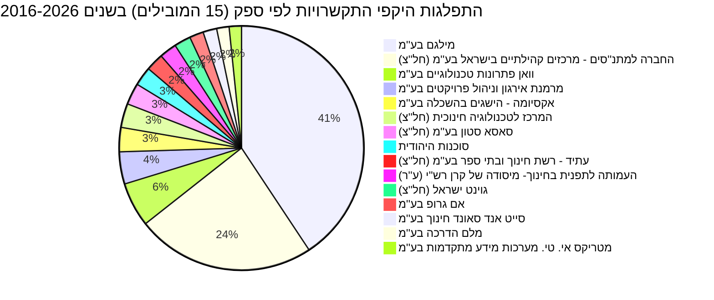

# נוער מחונן

התחום "נוער מחונן" עוסק במגוון תוכניות ופעילויות שמטרתן לזהות, לטפח ולקדם תלמידים בעלי יכולות גבוהות ומיוחדות במערכת החינוך הישראלית. תוכניות אלו כוללות פרויקטים לעידוד מצוינות בפריפריה, תוכניות אקדמיה למצטיינים, ומיזמים ייעודיים למחוננים ומצטיינים. התקציב המופנה לתחום זה משקף את חשיבות ההשקעה בפיתוח ההון האנושי והמצוינות בישראל. [משרד החינוך](https://next.obudget.org/i/budget/20/2026) הוא הגורם המרכזי האחראי על ניהול רוב התקציבים והתוכניות בתחום, כאשר [משרד ראש הממשלה](https://next.obudget.org/i/budget/04/2026) ומשרדים נוספים תומכים בפעילויות משלימות.

ניתוח הנתונים מראה תנודתיות משמעותית בתקציבים לאורך השנים. בעוד שבשנים הראשונות (1997-2014) התקציבים היו יציבים יחסית, החל משנת 2015 חלה עלייה חדה בהקצאות, שהגיעה לשיא בשנת 2019. שנת 2020 בלטה בהיעדר תקציב מאושר ראשוני (0 ₪), אך עם זאת נוצלו בפועל עשרות מיליוני שקלים מתקציבים מאושרים מתוקנים. בשנים האחרונות התקציב התייצב ברמה גבוהה יחסית לתקופה שלפני 2015, אך נמוכה מהשיאים שנרשמו ב-2017-2019.

## מגמה תקציבית לאורך זמן

```mermaid
xychart
    title מגמה תקציבית לנוער מחונן (1997-2026)
    x-axis "שנה"
    y-axis "סכום (₪)"
    bar הוקצה
    bar מאושר
    bar נוצל
    data:
        [1997, 1998, 1999, 2000, 2001, 2002, 2003, 2004, 2005, 2006, 2007, 2008, 2009, 2010, 2011, 2012, 2013, 2014, 2015, 2016, 2017, 2018, 2019, 2020, 2021, 2022, 2023, 2024, 2025, 2026]
        [21580000, 20902000, 18866000, 58788000, 59172000, 43516000, 26939000, 27086000, 27457000, 28349000, 31906000, 25281000, 22603000, 22347000, 29022000, 28787000, 27173000, 25696000, 147787000, 140857000, 233053000, 249624000, 254342000, 0, 91128000, 77290000, 54721000, 76263000, 39102000, 34301000]
        [19392000, 20504000, 30150000, 49434000, 56138000, 34997000, 27575000, 27125000, 34247000, 38354000, 46595000, 41353000, 53307000, 57713000, 63561000, 69622000, 68212000, 63273000, 183701000, 184706000, 274258000, 284194000, 282468000, 97507000, 108993000, 104404000, 98239000, 96539000, 85703000, 34301000]
        [18259094, 19157140, 28969092, 44528446, 55840825, 34575644, 28094894, 23138729, 29189338, 24489484, 28041720, 28742009, 40256855, 43569507, 37866607, 41993581, 50991806, 55442389, 125160440, 122054442, 169019939, 188430964, 211310343, 66568912, 58936774, 53507614, 52479293, 67805939, 55401444, 0]
```
 

## תכניות פעילות כיום

### התפלגות היקפי התקשרויות לפי ספק (15 הספקים המובילים) בשנים 2016-2026



## מקורות תקציב

התקציב לנוער מחונן ממוקם בעיקר במסגרת [משרד החינוך](https://next.obudget.org/i/budget/20/2026) (סעיף 20), ובפרט תחת תוכניות כמו "[פעולות משלימות לקידום](https://next.obudget.org/i/budget/2067/2026)" (סעיף 20.67), אשר כולל פעילויות ופרויקטים ייעודיים. [משרד ראש הממשלה](https://next.obudget.org/i/budget/04/2026) (סעיף 04) ובעבר [משרד המדע והטכנולוגיה](https://next.obudget.org/i/budget/19/2026) (סעיף 19, כיום מדע, תרבות וספורט) תורמים גם הם לתחום באמצעות סעיפי תקציב כלליים יותר או תמיכה בפרויקטים ספציפיים. ההיררכיה התקציבית מציגה את המבנה הארגוני של הקצאת המשאבים לנושא.

```mermaid
graph TD
    20[משרד החינוך] --> 20.63[יסודי וחטיבות ביניים]
    20.63 --> 20.63.01[יסודי וחטיבת ביניים]
    20.63 --> 20.63.02[החינוך העצמאי]
    20 --> 20.61[חינוך מיוחד]
    20.61 --> 20.61.01[חינוך מיוחד]
    20 --> 20.64[חטיבה עליונה]
    20.64 --> 20.64.01[חטיבה עליונה]
    20 --> 20.62[קדם יסודי]
    20.62 --> 20.62.01[קדם יסודי]
    20 --> 20.67[פעולות משלימות לקידום]
    20.67 --> 20.67.01[פעילויות ופרוייקטים]
    20.67 --> 20.67.02[הארכת יום הלימודים]
    20 --> 20.66[חינוך התיישבותי]
    20.66 --> 20.66.01[המינהל חינוך התיישבותי]
    20 --> 20.65[שירותי עזר, הסעות]
    20.65 --> 20.65.01[שירותי עזר, הסעות]
    20 --> 20.70[רזרבות]
    20.70 --> 20.70.01[רזרבה להתייקרויות]
    20 --> 20.60[יחידות מטה]
    20.60 --> 20.60.01[פעילויות מטה מרכזיות -]
    20 --> 20.68[מינהל עובדי הוראה]
    20.68 --> 20.68.01[תנאי שירות והכשרת]
    20 --> 20.69[תמיכה בנושאי יהדות]
    20.69 --> 20.69.02[מוסדות תורניים]

    04[משרד ראש הממשלה] --> 04.52[משרדי ממשלה ולשכות שרים]
    04 --> 04.70[רזרבות]
    04.70 --> 04.70.01[רזרבה לעמידה במגבלה]

    19[מדע, תרבות וספורט]

    21[ההשכלה הגבוהה] --> 21.11[השכלה גבוהה]
    21.11 --> 21.11.01[השכלה גבוהה]

    05[משרד האוצר] --> 05.52[רשות המיסים]
    05.52 --> 05.52.03[רשות המיסים ראשי]

    89[מפעלי משרד ראה"מ והאוצר]

    60[חינוך] --> 60.02[תכנית פיתוח חינוך]
    60.02 --> 60.02.10[בניית כיתות לימוד]
```

### רשימת סעיפי תקציב נבחרים (עם קישורים)
*   [04 | משרד ראש הממשלה](https://next.obudget.org/i/budget/0004/2026)
    *   [04.52 | משרדי ממשלה ולשכות שרים](https://next.obudget.org/i/budget/000452/2026)
    *   [04.70 | רזרבות](https://next.obudget.org/i/budget/000470/2026)
        *   [04.70.01 | רזרבה לעמידה במגבלה](https://next.obudget.org/i/budget/00047001/2026)
*   [05 | משרד האוצר](https://next.obudget.org/i/budget/0005/2026)
    *   [05.52 | רשות המיסים](https://next.obudget.org/i/budget/000552/2026)
        *   [05.52.03 | רשות המיסים ראשי](https://next.obudget.org/i/budget/00055203/2026)
*   [19 | מדע, תרבות וספורט](https://next.obudget.org/i/budget/0019/2026)
*   [20 | משרד החינוך](https://next.obudget.org/i/budget/0020/2026)
    *   [20.60 | יחידות מטה](https://next.obudget.org/i/budget/002060/2026)
        *   [20.60.01 | פעילויות מטה מרכזיות -](https://next.obudget.org/i/budget/00206001/2026)
    *   [20.61 | חינוך מיוחד](https://next.obudget.org/i/budget/002061/2026)
        *   [20.61.01 | חינוך מיוחד](https://next.obudget.org/i/budget/00206101/2026)
    *   [20.62 | קדם יסודי](https://next.obudget.org/i/budget/002062/2026)
        *   [20.62.01 | קדם יסודי](https://next.obudget.org/i/budget/00206201/2026)
    *   [20.63 | יסודי וחטיבות ביניים](https://next.obudget.org/i/budget/002063/2026)
        *   [20.63.01 | יסודי וחטיבת ביניים](https://next.obudget.org/i/budget/00206301/2026)
        *   [20.63.02 | החינוך העצמאי](https://next.obudget.org/i/budget/00206302/2026)
    *   [20.64 | חטיבה עליונה](https://next.obudget.org/i/budget/002064/2026)
        *   [20.64.01 | חטיבה עליונה](https://next.obudget.org/i/budget/00206401/2026)
    *   [20.65 | שירותי עזר, הסעות](https://next.obudget.org/i/budget/002065/2026)
        *   [20.65.01 | שירותי עזר, הסעות](https://next.obudget.org/i/budget/00206501/2026)
    *   [20.66 | חינוך התיישבותי](https://next.obudget.org/i/budget/002066/2026)
        *   [20.66.01 | המינהל חינוך התיישבותי](https://next.obudget.org/i/budget/00206601/2026)
    *   [20.67 | פעולות משלימות לקידום](https://next.obudget.org/i/budget/002067/2026)
        *   [20.67.01 | פעילויות ופרוייקטים](https://next.obudget.org/i/budget/00206701/2026)
        *   [20.67.02 | הארכת יום הלימודים](https://next.obudget.org/i/budget/00206702/2026)
    *   [20.68 | מינהל עובדי הוראה](https://next.obudget.org/i/budget/002068/2026)
        *   [20.68.01 | תנאי שירות והכשרת](https://next.obudget.org/i/budget/00206801/2026)
    *   [20.69 | תמיכה בנושאי יהדות](https://next.obudget.org/i/budget/002069/2026)
        *   [20.69.02 | מוסדות תורניים](https://next.obudget.org/i/budget/00206902/2026)
    *   [20.70 | רזרבות](https://next.obudget.org/i/budget/002070/2026)
        *   [20.70.01 | רזרבה להתייקרויות](https://next.obudget.org/i/budget/00207001/2026)
*   [21 | ההשכלה הגבוהה](https://next.obudget.org/i/budget/0021/2026)
    *   [21.11 | השכלה גבוהה](https://next.obudget.org/i/budget/002111/2026)
        *   [21.11.01 | השכלה גבוהה](https://next.obudget.org/i/budget/00211101/2026)
*   [60 | חינוך](https://next.obudget.org/i/budget/0060/2026)
    *   [60.02 | תכנית פיתוח חינוך](https://next.obudget.org/i/budget/006002/2026)
        *   [60.02.10 | בניית כיתות לימוד](https://next.obudget.org/i/budget/00600210/2026)
*   [89 | מפעלי משרד ראה"מ והאוצר](https://next.obudget.org/i/budget/0089/2026)

## נושאים נוספים

### התקשרויות/חוזים
להלן 20 ההתקשרויות הממשלתיות הגדולות ביותר הקשורות לתחום "נוער מחונן" בשנים 2016-2026:

| Purpose | Purchasing Ministry | Supplier Entity Name | Volume (₪) | Executed (₪) | Start Year | End Year | Item URL |
|---|---|---|---|---|---|---|---|
| מ.7/7.2020 -מתן שירותים מנהליים להפעלת תוכנית הזנה יוח"א תשפ"ד | משרד החינוך | [מילגם בע״מ](https://next.obudget.org/i/org/company/milgam-baam) | 654,547,036.04 | 0.00 | 2023 | 2024 | [Link](https://next.obudget.org/i/f7ad9dcd69ca) |
| מכרז היקפים משתנים מס\' 7/7.2013 הזנה עפ"י חוק תשע"ט | משרד החינוך | [מילגם בע״מ](https://next.obudget.org/i/org/company/milgam-baam) | 636,158,446.56 | 84,131,242.65 | 2018 | 2019 | [Link](https://next.obudget.org/i/35da620f6924) |
| מ.7/7.2020 - מתן שירותים מנהליים להפעלת תוכנית הזנה ניצנים תשפד | משרד החינוך | [מילגם בע״מ](https://next.obudget.org/i/org/company/milgam-baam) | 625,220,980.61 | 0.00 | 2023 | 2024 | [Link](https://next.obudget.org/i/f9fa7ac3fb3a) |
| מיזם משותף עם סאסא סטון בתכנית קו אור- הפעלת תכניות ללמידה מרחוק ללידים חולים בבתי חולים ר | משרד החינוך | [סאסא סטון בע״מ (חל״צ)](https://next.obudget.org/i/org/association/sasa-stone-baam-chalatz) | 591,366,980.50 | 1,092,639.75 | 2019 | 2019 | [Link](https://next.obudget.org/i/0e9da37fd2dd) |
| מ7/7.2020 מתן שירותיים מנהלתיים להפעלת תוכנית הזנה ואורח חיים בריא - הזנה בניצנים תשפה | משרד החינוך | [מילגם בע״מ](https://next.obudget.org/i/org/company/milgam-baam) | 409,961,432.74 | 0.00 | 2024 | 2025 | [Link](https://next.obudget.org/i/e700c3524f81) |
| מ. 7/7.2013 הזנה בניצנים שנה"ל תשע"ט | משרד החינוך | [מילגם בע״מ](https://next.obudget.org/i/org/company/milgam-baam) | 375,801,291.45 | 0.00 | 2018 | 2019 | [Link](https://next.obudget.org/i/574196f636ad) |
| מ. 7/7.2020 מתן שירותים מינהלתיים להפעלת תכנית הזנה ואורח חיים בריא - הזנה ביוחא תשפה | משרד החינוך | [מילגם בע״מ](https://next.obudget.org/i/org/company/milgam-baam) | 375,152,369.66 | 0.00 | 2024 | 2025 | [Link](https://next.obudget.org/i/e6ffafafb4cf) |
| מכרז היקפים משתנים מס\' 7/7.2013 הזנה בניצנים תש"ף | משרד החינוך | [מילגם בע״מ](https://next.obudget.org/i/org/company/milgam-baam) | 351,391,340.80 | 0.00 | 2019 | 2020 | [Link](https://next.obudget.org/i/a55ad5a694d1) |
| מ. 7/7.2020 - מתן שירותים מינהליים להפעלת תכנית הזנה ואורח חיים בריא - הזנה יוח"א | משרד החינוך | [מילגם בע״מ](https://next.obudget.org/i/org/company/milgam-baam) | 341,503,159.26 | 0.00 | 2022 | 2023 | [Link](https://next.obudget.org/i/4a88baa35bfb) |
| מכרז היקפים משתנים מס\' 7/7.2013 הזנה עפ"י חוק תש"ף | משרד החינוך | [מילגם בע״מ](https://next.obudget.org/i/org/company/milgam-baam) | 338,007,389.78 | 0.00 | 2019 | 2020 | [Link](https://next.obudget.org/i/3c2599d93bae) |
| מ. 7/7.2013 הזנה עפ"י חוק שנה"ל תשע"ט | משרד החינוך | [מילגם בע״מ](https://next.obudget.org/i/org/company/milgam-baam) | 336,158,447.04 | 0.00 | 2018 | 2019 | [Link](https://next.obudget.org/i/c4999c53257b) |
| מ. 7/7.2020 - מתן שירותים מינהליים להפעלת תכנית הזנה ואורח חיים בריא - הזנה בניצנים | משרד החינוך | [מילגם בע״מ](https://next.obudget.org/i/org/company/milgam-baam) | 326,741,484.34 | 0.00 | 2022 | 2023 | [Link](https://next.obudget.org/i/7352da00f772) |
| מכרז מס\' 7/7.2013 הזנה עפ"י חוק תשע"ח | משרד החינוך | [מילגם בע״מ](https://next.obudget.org/i/org/company/milgam-baam) | 324,958,708.48 | 0.00 | 2017 | 2018 | [Link](https://next.obudget.org/i/58efbb915232) |
| מכרז מס\' 7/7.2013 הזנה עפ"י חוק תשע"ח | משרד החינוך | [מילגם בע״מ](https://next.obudget.org/i/org/company/milgam-baam) | 322,204,821.12 | 316,284,907.77 | 2017 | 2018 | [Link](https://next.obudget.org/i/a5739a678f93) |
| פטור ממכרז-ספק יחיד מתן שירותים מנהליים להפעלת תוכנית הזנה בתוכנית הצהרונים הלאומית ניצני | משרד החינוך | [מילגם בע״מ](https://next.obudget.org/i/org/company/milgam-baam) | 289,040,656.45 | 0.00 | 2022 | 2022 | [Link](https://next.obudget.org/i/7ef31ae35da0) |
| מכרז מס\' 7/7.2013- הזנה עפ"י חוק תשע"ז | משרד החינוך | [מילגם בע״מ](https://next.obudget.org/i/org/company/milgam-baam) | 284,874,735.60 | 277,778,475.00 | 2016 | 2017 | [Link](https://next.obudget.org/i/1f7f8dc7b53b) |
| מכרז מס\' 7/7.2013- הזנה עפ"י חוק תשע"ז | משרד החינוך | [מילגם בע״מ](https://next.obudget.org/i/org/company/milgam-baam) | 284,874,735.60 | 277,778,475.00 | 2016 | 2017 | [Link](https://next.obudget.org/i/7deed16f1fbf) |
| פטור ממכרז-ספק יחיד מתן שירותים מינהליים להפעלת תוכנית הזנה בתוכנית יוח"א (יום לימודים ארו | משרד החינוך | [מילגם בע״מ](https://next.obudget.org/i/org/company/milgam-baam) | 283,952,913.27 | 0.00 | 2022 | 2022 | [Link](https://next.obudget.org/i/e9cebba3c282) |
| הזנה עפ"י חוק תשע"ו | משרד החינוך | [מילגם בע״מ](https://next.obudget.org/i/org/company/milgam-baam) | 257,147,634.51 | 255,197,163.82 | 2015 | 2016 | [Link](https://next.obudget.org/i/08cd8b7efb31) |
| הזנה עפ"י חוק תשע"ו | משרד החינוך | [מילגם בע״מ](https://next.obudget.org/i/org/company/milgam-baam) | 257,147,634.51 | 255,197,163.82 | 2015 | 2016 | [Link](https://next.obudget.org/i/406511be1f5c) |

### ספקים
להלן 15 הספקים המובילים לפי היקף התקשרויות כולל בתחום "נוער מחונן" בשנים 2016-2026:

| Supplier Entity Name | Total Volume (₪) |
|---|---|
| [מילגם בע״מ](https://next.obudget.org/i/org/company/milgam-baam) | 8,611,805,157.03 |
| [החברה למתנ״סים - מרכזים קהילתיים בישראל בע״מ (חל״צ)](https://next.obudget.org/i/org/association/hachevra-lematnasim-merkazim-kehilatiyim-beyisrael-baam-chalatz) | 5,009,040,749.56 |
| [וואן פתרונות טכנולוגיים בע״מ](https://next.obudget.org/i/org/company/wan-pitronot-technologiyim-baam) | 1,243,935,316.34 |
| [מרמנת אירגון וניהול פרויקטים בע״מ](https://next.obudget.org/i/org/company/marmnat-irgun-venihul-proyectim-baam) | 901,062,667.89 |
| [אקסיומה - הישגים בהשכלה בע״מ](https://next.obudget.org/i/org/company/aksioma-hessegim-behashkala-baam) | 680,619,626.29 |
| [המרכז לטכנולוגיה חינוכית (חל״צ)](https://next.obudget.org/i/org/association/hamerkaz-letechnologia-chinuchit-chalatz) | 671,510,057.73 |
| [סאסא סטון בע״מ (חל״צ)](https://next.obudget.org/i/org/association/sasa-stone-baam-chalatz) | 602,535,784.50 |
| [סוכנות היהודית](https://next.obudget.org/i/org/association/sochnut-hayehudit) | 529,044,374.03 |
| [עתיד - רשת חינוך ובתי ספר בע״מ (חל״צ)](https://next.obudget.org/i/org/association/atid-reshet-chinuch-uvatei-sefer-baam-chalatz) | 497,128,184.80 |
| [העמותה לתפנית בחינוך- מיסודה של קרן רש"י (ע"ר)](https://next.obudget.org/i/org/association/haamuta-letaflit-bachinuch-meysuda-shel-keren-rashi-ar) | 483,029,535.02 |
| [גוינט ישראל (חל״צ)](https://next.obudget.org/i/org/association/joint-yisrael-chalatz) | 464,040,620.41 |
| [אם גרופ בע״מ](https://next.obudget.org/i/org/company/em-group-baam) | 391,354,976.12 |
| [סייט אנד סאונד חינוך בע״מ](https://next.obudget.org/i/org/company/site-and-sound-chinuch-baam) | 384,132,934.82 |
| [מלם הדרכה בע״מ](https://next.obudget.org/i/org/company/malam-hadracha-baam) | 347,328,430.18 |
| [מטריקס אי. טי. מערכות מידע מתקדמות בע״מ](https://next.obudget.org/i/org/company/matrix-it-maarechot-meyda-mitkadmot-baam) | 344,305,892.29 |

### החלטות ממשלה
לא נמצאו החלטות ממשלה רלוונטיות לתחום "נוער מחונן" בנתונים שסופקו.

## מקורות
*   **סעיפי תקציב**:
    *   [נתוני תקציב מפורטים לנוער מחונן (1997-2026)](https://next.obudget.org/i/budget/00206701/2026)
    *   [משרד החינוך - עמוד ראשי בתקציב](https://next.obudget.org/i/budget/20/2026)
    *   [משרד ראש הממשלה - עמוד ראשי בתקציב](https://next.obudget.org/i/budget/04/2026)
    *   [מדע, תרבות וספורט - עמוד ראשי בתקציב](https://next.obudget.org/i/budget/19/2026)
*   **התקשרויות**:
    *   [הורדת נתונים מלאים של התקשרויות](https://next.obudget.org/api/download?query=U0VMRUNUIHB1cnBvc2UsIHB1cmNoYXNpbmdfbWluaXN0cnksIHN1cHBsaWVyX2VudGl0eV9uYW1lLCB2b2x1bWUsIGV4ZWN1dGVkLCBzdGFydF95ZWFhciwgZW5kX3llYXIsIGl0ZWxfdXJsIEZST00gY29udHJhY3RzX2RhdGEgV0hFUkUgKGJ1ZGdldF9jb2RlIExJS0UgJzA0JSUyNyBPUiBidWRnZXRfY29kZSBMSUtFICcxOSVcJyBPUiBidWRnZXRfY29kZSBMSUtFICcyMCVcJykgQU5EIGBwdXJjaGFzaW5nX21pbmlzdHJ5YCBJTiAoJ1xlXG5lXHFcZSVxXG4gXGVcblxlXGZcZVxlXGZcZScsICdceVxuXHFcZSVxXG4gXGVcblxlXGZcZVxlXGZcZSBceVxuXHFcZSVxXG4gXGVcblxlXGZcZSVxXG4nLCAnXGVcblxlXHFcZSVxXG4gXGVcblxlXHFcZSVxXG4gXGVcblxlXHFcZSVxXG4nLCAnXGVcblxlXHFcZSVxXG4gXGVcblxlXHFcZSVxXG4gXGVcblxlXHFcZSVxXG4nKSBBTkQgKHN0YXJ0X3llYXIgPD0gMjAyNiBBTkQgZW5kX3llYXIgPj0gMjAxNikpIE9SREVSIEJZIHZvbHVtZSBERUNMIEwgSU1JVCBPTkVfSEVOSiBBTkQgQ09VUlBPUyBPTkVfSEVOSg%3D%3D&headers=purpose%3Bpurchasing_ministry%3Bsupplier_entity_name%3Bvolume%3Bexecuted%3Bstart_year%3Bend_year%3Bitem_url)
*   **ספקים**:
    *   [הורדת נתונים מלאים של ספקים](https://next.obudget.org/api/download?query=U0VMRUNUIHN1cHBsaWVyX2VudGl0eV9uYW1lLCBTVU0odm9sdW1lKSBBUyB0b3RhbF92b2x1bWUgRlJPTSBjb250cmFjdHNfZGF0YSBXSEVSRSAoYnVkZ2V0X2NvZGUgTElLRSAnMDQlJyBPUiBidWRnZXRfY29kZSBMSUtFICcxOSUnIE9SIGJ1ZGdldF9jb2RlIExJS0UgJzIwJScpIEFORCBwdXJjaGFzaW5nX21pbmlzdHJ5IElOICgn157Xqdeo15Mg15TXl9eZ16DXldeaJywgJ9ee16nXqNeTINeU15fXmdeg15XXmiDXldeU16rXqNeR15XXqicsICfXntep16jXkyDXlNee15PXoiDXldeU15jXm9eg15XXnNeV15LXmdeUJywgJ9ee16nXqNeTINeo15DXqSDXlNee157Xqdec15QnKSBBTkQgKHN0YXJ0X3llYXIgPD0gMjAyNiBBTkQgZW5kX3llYXIgPj0gMjAxNikpIEdST1VQIEJZIHN1cHBsaWVyX2VudGl0eV9uYW1lIE9SREVSIEJZIHRvdGFsX3ZvbHVtZSBERUNMIEwgSU1JVCBPTkVfSEVOSiBBTkQgQ09VUlBPUyBPTkVfSEVOSg%3D%3D&headers=supplier_entity_name%3Btotal_volume)

[חזרה לעמוד הראשי](../../README.md)