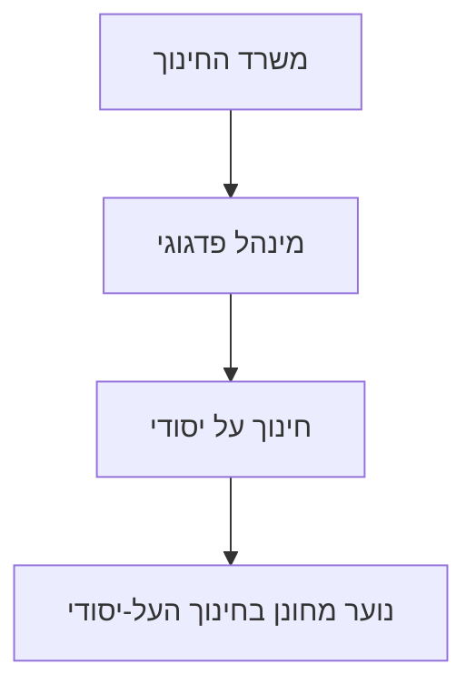
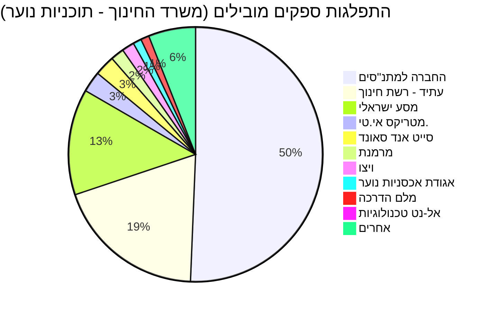

## תקציר

דשבורד זה מרכז נתונים אודות נוער מחונן, תוך התמקדות בסעיף התקציבי "[נוער מחונן בחינוך העל-יסודי](https://next.obudget.org/i/20.67.01.52)" של [משרד החינוך - מינהל פדגוגי](https://next.obudget.org/i/20.67).

מניתוח נתוני התקציב עולה כי ההקצאות והשימוש בפועל לסעיף "נוער מחונן בחינוך העל-יסודי" הראו מגמת ירידה משמעותית בין השנים 2020 ל-2023, עם התאוששות מסוימת בשנת 2024. תקציב 2026 מציג יציבות בהקצאה אך ללא נתוני שימוש מלאים.

בתחום ההתקשרויות, לא נמצאו חוזים המתייחסים ישירות ל"נוער מחונן". עם זאת, זוהו התקשרויות רבות של [משרד החינוך](https://next.obudget.org/i/20) הקשורות ל"נוער" ולשירותי חינוך כלליים. התקשרויות אלו כוללות הפעלת שירותי חינוך והשכלה לנוער מנותק, פעילויות בלתי פורמליות, תוכניות לשיפור זכאות לבגרות ואספקת ציוד כמו מחשבים ניידים. הספקים המובילים בתחום זה הם [החברה למתנ"סים](https://next.obudget.org/i/c02ce29be176), [עתיד - רשת חינוך](https://next.obudget.org/i/31087d7bc5be) ו[מסע ישראלי](https://next.obudget.org/i/716287e2d7cd).

החלטות הממשלה שנמצאו אינן מתייחסות באופן ספציפי ל"נוער מחונן", אך קשורות לנושאי "מצוינות" רחבים יותר, קידום השכלה טכנולוגית (STEM), דיגיטציה ופיתוח הון אנושי, שיכולים להשפיע בעקיפין על תוכניות לנוער מחונן.

## ניתוח תקציבי

התקציב המוקדש ל"[נוער מחונן בחינוך העל-יסודי](https://next.obudget.org/i/20.67.01.52)" מראה תנודתיות ניכרת. בשנת 2020, הסכום המתוקן עמד על כ-13.8 מיליון ש"ח, ונוצלו כ-11.8 מיליון ש"ח. בשנת 2021 נרשמה עלייה קלה בסכום המוקצה, שהסתכם בכ-15.6 מיליון ש"ח, מתוכם נוצלו כ-13.9 מיליון ש"ח. אולם, בין השנים 2022 ל-2023 חלה ירידה חדה בהקצאות ובניצול, כאשר בשנת 2023 הסכום המתוקן עמד על כ-4.3 מיליון ש"ח ונוצלו כ-2.8 מיליון ש"ח בלבד. בשנת 2024 נרשמה התאוששות קלה עם סכום מתוקן של כ-4.6 מיליון ש"ח וניצול כמעט מלא של הסכום. לשנת 2025, התקציב המתוקן קפץ לכ-7.4 מיליון ש"ח, מתוכם נוצלו כ-6 מיליון ש"ח. נתוני 2026 מציגים הקצאה של כ-7 מיליון ש"ח ללא נתוני ניצול סופיים. מגמה זו מצביעה על שינויים בסדרי העדיפויות או במדיניות התקצוב של [משרד החינוך](https://next.obudget.org/i/20) בתחום זה.

### נתוני תקציב: נוער מחונן בחינוך העל-יסודי

הטבלה הבאה מציגה את נתוני התקציב עבור סעיף "[נוער מחונן בחינוך העל-יסודי](https://next.obudget.org/i/20.67.01.52)" תחת [מינהל פדגוגי](https://next.obudget.org/i/20.67) במשרד החינוך.

| שנה | סכום כולל מוקצה (ש"ח) | סכום כולל מתוקן (ש"ח) | סכום כולל שנוצל (ש"ח) |
|---|---|---|---|
| 2020 | - | 13,866,000 | 11,823,789 |
| 2021 | 15,610,000 | 15,424,000 | 13,954,215 |
| 2022 | 6,809,000 | 4,774,000 | 3,302,851 |
| 2023 | 6,868,000 | 4,347,000 | 2,876,846 |
| 2024 | 6,925,000 | 4,649,000 | 4,647,310 |
| 2025 | 6,964,000 | 7,413,000 | 6,038,606 |
| 2026 | 7,004,000 | 7,004,000 | - |

### היררכיית תקציב

*   [20: משרד החינוך](https://next.obudget.org/i/20)
    *   [20.67: מינהל פדגוגי](https://next.obudget.org/i/20.67)
        *   [20.67.01: חינוך על יסודי](https://next.obudget.org/i/20.67.01)
            *   [20.67.01.52: נוער מחונן בחינוך העל-יסודי](https://next.obudget.org/i/20.67.01.52)

### תזרים תקציבי

## התקשרויות וספקים

בחיפוש אחר התקשרויות ממשלתיות הקשורות ל"נוער מחונן" לא נמצאו התאמות ישירות בשמות החוזים. עם זאת, זוהו התקשרויות רבות של [משרד החינוך](https://next.obudget.org/i/20) הקשורות לנוער ולחינוך באופן כללי. התקשרויות אלו מתמקדות בעיקר בהפעלת שירותי חינוך והשכלה לנוער מנותק (כגון תכנית היל"ה), ביצוע פעילויות בלתי פורמליות לילדים ובני נוער בעת משבר או חירום, תוכניות לשיפור זכאות לבגרות, אספקת ציוד (כמו מחשבים ניידים) לתלמידים נזקקים, ושירותי תמיכה וניהול לתוכניות נוער.

הספקים המובילים בתחומים אלה, על פי היקף ההתקשרות, כוללים את [החברה למתנ"סים](https://next.obudget.org/i/c02ce29be176) ו[עתיד - רשת חינוך](https://next.obudget.org/i/31087d7bc5be), שתיהן מעורבות בהפעלת שירותי חינוך והשכלה לנוער מנותק בהיקפים משמעותיים. [מסע ישראלי](https://next.obudget.org/i/716287e2d7cd) בולטת גם היא בהתקשרויות לביצוע פעילויות בלתי פורמליות בעת חירום.

### 50 ההתקשרויות המובילות לפי היקף (משרד החינוך - תוכניות נוער)

| מטרה | משרד רוכש | שם הספק | היקף (ש"ח) | בוצע (ש"ח) | שנת התחלה | שנת סיום | קישור |
|:--------------------------------------------------------------------------------------------------------------------------------------------|:--------------------|:------------------------------------------------------------|:----------------|:----------------|:-----------|:---------|:------------------------------------------------------------|
| [מ.2/1.2018 - הפעלת שירותי חינוך והשכלה לנוער מנותק](https://next.obudget.org/i/c02ce29be176) | משרד החינוך | החברה למתנ״סים - מרכזים קהילתיים בישראל בע״מ (חל״צ) | 147,116,147.61 | 145,931,497.62 | 2022 | 2023 | [קישור](https://next.obudget.org/i/c02ce29be176) |
| [מ.2/1.2018 הפעלת שירותי חינוך והשכלה לנוער מנותק](https://next.obudget.org/i/19aae9a6b45f) | משרד החינוך | החברה למתנ״סים - מרכזים קהילתיים בישראל בע״מ (חל״צ) | 146,768,503.26 | 0.0 | 2023 | 2024 | [קישור](https://next.obudget.org/i/19aae9a6b45f) |
| [מכרז מס' 2/1.2018-הפעלת שירותי חינוך והשכלה לנוער מנותק](https://next.obudget.org/i/6011a951ff6e) | משרד החינוך | החברה למתנ״סים - מרכזים קהילתיים בישראל בע״מ (חל״צ) | 144,398,395.85 | 137,486,597.15 | 2020 | 2021 | [קישור](https://next.obudget.org/i/6011a951ff6e) |
| [מכרז מס' 2/1.2018 - הפעלת שירותי חינוך והשכלה לנוער מנותק תכנית הילה](https://next.obudget.org/i/13c7db5dcf20) | משרד החינוך | החברה למתנ״סים - מרכזים קהילתיים בישראל בע״מ (חל״צ) | 143,735,898.20 | 134,086,006.13 | 2019 | 2020 | [קישור](https://next.obudget.org/i/13c7db5dcf20) |
| [מ. 2/1.2018 - הפעלת שירותי חינוך והשכלה לנוער מנותק..](https://next.obudget.org/i/1c246b420c87) | משרד החינוך | החברה למתנ״סים - מרכזים קהילתיים בישראל בע״מ (חל״צ) | 142,788,147.83 | 142,071,147.48 | 2021 | 2022 | [קישור](https://next.obudget.org/i/1c246b420c87) |
| [2/1.2018 הפעלת שירותי חינוך והשכלה לנוער מנותק תוכנית היל"ה](https://next.obudget.org/i/31cad6cff32b) | משרד החינוך | החברה למתנ״סים - מרכזים קהילתיים בישראל בע״מ (חל״צ) | 139,541,493.25 | 130,654,571.17 | 2018 | 2019 | [קישור](https://next.obudget.org/i/31cad6cff32b) |
| [7/3.2012 הפעלת שירותי חינוך והשכלה לנוער מנותק](https://next.obudget.org/i/31087d7bc5be) | משרד החינוך | עתיד - רשת חינוך ובתי ספר בע״מ (חל״צ) | 125,000,031.00 | 0.0 | 2017 | 2018 | [קישור](https://next.obudget.org/i/31087d7bc5be) |
| [מכרז 7/13.12 הפעלת שירותי חינוך והשכלה לנוער מנותק](https://next.obudget.org/i/105e6596519c) | משרד החינוך | עתיד - רשת חינוך ובתי ספר בע״מ (חל״צ) | 118,484,926.12 | 112,801,832.20 | 2016 | 2017 | [קישור](https://next.obudget.org/i/105e6596519c) |
| [מ.18/6/2023 הפעלת שירותי חינוך והשכלה לנוער מנותק (תכנית הילה) תשפ"ה](https://next.obudget.org/i/dfcd05e964ec) | משרד החינוך | עתיד - רשת חינוך ובתי ספר בע״מ (חל״צ) | 109,698,250.95 | 0.0 | 2024 | 2025 | [קישור](https://next.obudget.org/i/dfcd05e964ec) |
| [מ. 26/6.2023 - ביצוע פעילות בלתי פורמלים לילדים ובני נוער, בעת משבר או במצב חרום](https://next.obudget.org/i/716287e2d7cd) | משרד החינוך | מסע ישראלי בע״מ | 106,115,348.60 | 0.0 | 2024 | 2024 | [קישור](https://next.obudget.org/i/716287e2d7cd) |
| [מ. 26/6.2023 - ביצוע פעילות בלתי פורמלים לילדים ובני נוער, בעת משבר או במצב חרום](https://next.obudget.org/i/ebda78190f6e) | משרד החינוך | מסע ישראלי בע״מ | 99,886,441.60 | 0.0 | 2024 | 2025 | [קישור](https://next.obudget.org/i/ebda78190f6e) |
| [מכרז הילה תשפ"ד שיריון](https://next.obudget.org/i/5933a39c3fbd) | משרד החינוך | החברה למתנ״סים - מרכזים קהילתיים בישראל בע״מ (חל״צ) | 73,003,725.00 | 0.0 | 2023 | 2024 | [קישור](https://next.obudget.org/i/5933a39c3fbd) |
| [מכרז שעת חירום זכיין חדש מסע ישראלי לשיריון בלבד](https://next.obudget.org/i/a9f2f055c268) | משרד החינוך | מסע ישראלי בע״מ | 58,000,000.00 | 0.0 | 2023 | 2024 | [קישור](https://next.obudget.org/i/a9f2f055c268) |
| [מ.10/7.2021-הפעלת מערך תומך לליווי הנחייה והפעלה של תכניות בעלות אופי סוציו פדגוגי באגף](https://next.obudget.org/i/d9295fca7b70) | משרד החינוך | סייט אנד סאונד חינוך בע״מ | 27,681,525.60 | 0.0 | 2023 | 2024 | [קישור](https://next.obudget.org/i/d9295fca7b70) |
| [מ.מ. 18-2017 אספקת 20848 מחשבים ניידים לתלמידי צפון הארץ שפונו - מלחמת חרבות ברזל](https://next.obudget.org/i/3fa77f7eedc1) | משרד החינוך | מטריקס אי.טי. אינטגרציה ותשתיות בע״מ | 25,938,670.32 | 0.0 | 2023 | 2024 | [קישור](https://next.obudget.org/i/3fa77f7eedc1) |
| [זרוע ביצוע חברה למתנסים - קיץ תשפ"ד - מפונים צפון](https://next.obudget.org/i/36bb7630f73b) | משרד החינוך | החברה למתנ״סים - מרכזים קהילתיים בישראל בע״מ (חל״צ) | 24,640,456.00 | 0.0 | 2024 | 2024 | [קישור](https://next.obudget.org/i/36bb7630f73b) |
| [מ.מ. 18-2017 אספקת 4,000 מחשבים ניידים לתלמידים שמתגוררים באזור הצפון לצורך למידה מרחוק](https://next.obudget.org/i/7d59d6f4465e) | משרד החינוך | מטריקס אי.טי. אינטגרציה ותשתיות בע״מ | 17,949,711.60 | 0.0 | 2024 | 2025 | [קישור](https://next.obudget.org/i/7d59d6f4465e) |
| [מ.27/7.2018 ביצוע פעילות בלתי פורמלית לילדיפ נוער בעת משבר או בשעת חרום - חירום נצור 3](https://next.obudget.org/i/0a2751e04ab1) | משרד החינוך | אגודת אכסניות נוער בישראל (אנ"א) (ע"ר) | 15,994,163.01 | 16,561,640.24 | 2023 | 2024 | [קישור](https://next.obudget.org/i/0a2751e04ab1) |
| [מ.40/10.2023 הפעלת תוכניות לשיפור הזכאות לבגרות ליב"ם ומחצית שלישית תשפ"ה](https://next.obudget.org/i/0ecc94e66008) | משרד החינוך | ויצו - הסתדרות עולמית לנשים ציוניות (ע"ר) | 15,886,130.36 | 0.0 | 2024 | 2025 | [קישור](https://next.obudget.org/i/0ecc94e66008) |
| [מ.40/10.2023 הפעלת תוכניות לשיפור הזכאות לבגרות ליבמ ומחצית שלישית תשפ"ד](https://next.obudget.org/i/d8cc2e0fcf8f) | משרד החינוך | ויצו - הסתדרות עולמית לנשים ציוניות (ע"ר) | 15,061,262.00 | 0.0 | 2024 | 2024 | [קישור](https://next.obudget.org/i/d8cc2e0fcf8f) |
| [7/3.2012 הפעלת שירותי חינוך והשכלה לנוער מנותק](https://next.obudget.org/i/3a0a80d0a8db) | משרד החינוך | עתיד - רשת חינוך ובתי ספר בע״מ (חל״צ) | 13,080,423.31 | 13,080,423.31 | 2017 | 2018 | [קישור](https://next.obudget.org/i/3a0a80d0a8db) |
| [העסקת מומחים מלחמת חרבות ברזל בכל הארץ](https://next.obudget.org/i/a62dfe2e87e2) | משרד החינוך | מלם הדרכה בע״מ | 12,091,356.21 | 0.0 | 2023 | 2024 | [קישור](https://next.obudget.org/i/a62dfe2e87e2) |
| [מ.10/7.2021-הפעלת מערך תומך לליווי הנחייה והפעלה של תכניות בעלות אופי סוציו פדגוגי](https://next.obudget.org/i/0ed8a82bb38c) | משרד החינוך | סייט אנד סאונד חינוך בע״מ | 12,052,904.68 | 0.0 | 2024 | 2025 | [קישור](https://next.obudget.org/i/0ed8a82bb38c) |
| [מ.30/8.2016 הפעלת מערך תומך לליווי הנחייה והפעלה של תכניות בעלות אופי סוציו פדגוגי..](https://next.obudget.org/i/1538b5f0d926) | משרד החינוך | סייט אנד סאונד חינוך בע״מ | 10,999,889.55 | 0.0 | 2019 | 2020 | [קישור](https://next.obudget.org/i/1538b5f0d926) |
| [מ.18/6/2023 הפעלת שירותי חינוך והשכלה לנוער מנותק](https://next.obudget.org/i/fd7604491eea) | משרד החינוך | עתיד - רשת חינוך ובתי ספר בע״מ (חל״צ) | 10,711,103.63 | 0.0 | 2024 | 2025 | [קישור](https://next.obudget.org/i/fd7604491eea) |
| [לצורך שריון](https://next.obudget.org/i/3115f3c537c6) | משרד החינוך | המרכז לטכנולוגיה חינוכית (חל״צ) | 10,560,872.00 | 0.0 | 2023 | 2023 | [קישור](https://next.obudget.org/i/3115f3c537c6) |
| [זרוע ביצוע פעילות חנוכה - חרבות ברזל](https://next.obudget.org/i/c78035463260) | משרד החינוך | החברה למתנ״סים - מרכזים קהילתיים בישראל בע״מ (חל״צ) | 10,006,237.00 | 0.0 | 2023 | 2023 | [קישור](https://next.obudget.org/i/c78035463260) |
| [זרוע ביצוע חברה למתנסים - חופשת פסח - חרבות ברזל](https://next.obudget.org/i/e39c7c784a6c) | משרד החינוך | החברה למתנ״סים - מרכזים קהילתיים בישראל בע״מ (חל״צ) | 9,987,846.00 | 0.0 | 2024 | 2024 | [קישור](https://next.obudget.org/i/e39c7c784a6c) |
| [מ- 21/7.2017 אספקת שירותי מומחים חרבות ברזל](https://next.obudget.org/i/6f85b958328e) | משרד החינוך | מלם הדרכה בע״מ | 8,825,361.60 | 0.0 | 2024 | 2025 | [קישור](https://next.obudget.org/i/6f85b958328e) |
| [זרוע ביצוע - פעילות בחופשות לילדי הדרום הלא מפונים 2024](https://next.obudget.org/i/900d9e9847f5) | משרד החינוך | החברה למתנ״סים - מרכזים קהילתיים בישראל בע״מ (חל״צ) | 7,001,102.00 | 0.0 | 2024 | 2024 | [קישור](https://next.obudget.org/i/900d9e9847f5) |
| [מ.מ. 18-2017 אספקת מחשבים עבור תלמידי אשקלון: רכישת 2842 מחשבים - מלחמת חרבות ברזל](https://next.obudget.org/i/c1f22eed5c52) | משרד החינוך | מטריקס אי.טי. אינטגרציה ותשתיות בע״מ | 5,470,453.82 | 6,301,062.99 | 2023 | 2024 | [קישור](https://next.obudget.org/i/c1f22eed5c52) |
| [מ.60/12.2022 שרותי למידה באמצעות הרשת](https://next.obudget.org/i/7f1fb62627d8) | משרד החינוך | אל-נט טכנולוגיות מידע בע״מ | 5,199,554.62 | 0.0 | 2024 | 2025 | [קישור](https://next.obudget.org/i/7f1fb62627d8) |
| [שריון מתן שירותי למידה ואמצעים לקיום למידה באמצעות הרשת](https://next.obudget.org/i/3a9b44489aef) | משרד החינוך | מתודיקה למידה אפקטיבית בע״מ | 4,938,530.22 | 0.0 | 2023 | 2024 | [קישור](https://next.obudget.org/i/3a9b44489aef) |
| [מ.60/12.2022 שרותי למידה באמצעות הרשת](https://next.obudget.org/i/f74914ac67f9) | משרד החינוך | המרכז לטכנולוגיה חינוכית (חל״צ) | 4,608,926.68 | 0.0 | 2024 | 2024 | [קישור](https://next.obudget.org/i/f74914ac67f9) |
| [מ.60/12.2022 שרותי למידה באמצעות הרשת](https://next.obudget.org/i/5f3c701b63c3) | משרד החינוך | אל-נט טכנולוגיות מידע בע״מ | 4,187,297.79 | 0.0 | 2024 | 2024 | [קישור](https://next.obudget.org/i/5f3c701b63c3) |
| [16/08.2013 מרמנת- שירותי מידע ומינהל לנוער בסיכון הארכת הסכם](https://next.obudget.org/i/960790fbd165) | משרד החינוך | מרמנת אירגון וניהול פרויקטים בע״מ | 4,111,684.20 | 3,778,619.24 | 2017 | 2018 | [קישור](https://next.obudget.org/i/960790fbd165) |
| [לצורך שריון](https://next.obudget.org/i/bbdb4cf7ad4e) | משרד החינוך | אל-נט טכנולוגיות מידע בע״מ | 4,048,243.29 | 0.0 | 2023 | 2023 | [קישור](https://next.obudget.org/i/bbdb4cf7ad4e) |
| [הפקת סרטוני תוכן](https://next.obudget.org/i/59f1edf3c486) | משרד החינוך | סייף סקול אנליטיקס בע״מ | 4,034,188.13 | 0.0 | 2023 | 2024 | [קישור](https://next.obudget.org/i/59f1edf3c486) |
| [פיתוח חומרים ותוכן של מינהלחברה ונוער](https://next.obudget.org/i/daf7f908f2c8) | משרד החינוך | סייף סקול אנליטיקס בע״מ | 4,034,188.01 | 0.0 | 2023 | 2024 | [קישור](https://next.obudget.org/i/daf7f908f2c8) |
| [מ. 46/11.2018 -מתן שירותים מינהלתיים, ניהול המידע ובקרה על תכניות האגף המופעלות ברחבי הארץ](https://next.obudget.org/i/bebf2c52c191) | משרד החינוך | מרמנת אירגון וניהול פרויקטים בע״מ | 4,031,064.90 | 0.0 | 2022 | 2023 | [קישור](https://next.obudget.org/i/bebf2c52c191) |
| [מכרז מס' 46/11.2018 - מתן שירותים מינהלתיים, ניהול המידע ובקרה על תכניות האגף המופעלות](https://next.obudget.org/i/19184cb963f9) | משרד החינוך | מרמנת אירגון וניהול פרויקטים בע״מ | 4,031,064.90 | 0.0 | 2022 | 2022 | [קישור](https://next.obudget.org/i/19184cb963f9) |
| [תכנית חינוכית לנוער בגבעות באיזור יהודה ושומרון](https://next.obudget.org/i/26540a738427) | משרד החינוך | הרועה העברי (ע"ר) | 4,000,000.00 | 0.0 | 2023 | 2024 | [קישור](https://next.obudget.org/i/26540a738427) |
| [מרמנת- שירותי מידע ומינהל לנוער בסיכון הארכת הסכם](https://next.obudget.org/i/522c8fbeea47) | משרד החינוך | מרמנת אירגון וניהול פרויקטים בע״מ | 3,643,169.40 | 3,321,527.36 | 2016 | 2017 | [קישור](https://next.obudget.org/i/522c8fbeea47) |
| [בינה מלאכותית - תקנת חירום , מכרז מ.37/12.2019 פיתוח תשתיות למו"פ יזמות וחדשנות במערכת](https://next.obudget.org/i/b68e3ab11918) | משרד החינוך | מרמנת אירגון וניהול פרויקטים בע״מ | 3,248,541.65 | 0.0 | 2024 | 2024 | [קישור](https://next.obudget.org/i/b68e3ab11918) |
| [ממ - 2017-18 אספקה והחלפת 800 ניידים לעובדי המשרד](https://next.obudget.org/i/558eb3b82427) | משרד החינוך | זיפקום תקשורת בע״מ | 3,134,278.24 | 0.0 | 2024 | 2024 | [קישור](https://next.obudget.org/i/558eb3b82427) |
| [מכרז מס'46/11.2018-מתן שירותים מינהלתיים, ניהול המידע ובקרה על תכניות האגף המופעלות ברחבי](https://next.obudget.org/i/595121e6df38) | משרד החינוך | מרמנת אירגון וניהול פרויקטים בע״מ | 3,133,956.15 | 3,009,665.88 | 2020 | 2021 | [קישור](https://next.obudget.org/i/595121e6df38) |
| [מ.60/12.2022 שרותי למידה באמצעות הרשת](https://next.obudget.org/i/d16f11c543cb) | משרד החינוך | מתודיקה למידה אפקטיבית בע״מ | 3,105,386.18 | 0.0 | 2024 | 2025 | [קישור](https://next.obudget.org/i/d16f11c543cb) |
| [זרוע ביצוע - חוגים לכל ילד וילדה - חרבות ברזל](https://next.obudget.org/i/95314f2da314) | משרד החינוך | החברה למתנ״סים - מרכזים קהילתיים בישראל בע״מ (חל״צ) | 2,995,214.00 | 0.0 | 2023 | 2025 | [קישור](https://next.obudget.org/i/95314f2da314) |
| [מ.21/6.2023 מתן שירותים להפעלת סמינרים ומחנאות בתנאי פנימיה לתלמידים - מדצ"ים קיץ 2024](https://next.obudget.org/i/83ce446b4f1f) | משרד החינוך | אגודת אכסניות נוער בישראל (אנ"א) (ע"ר) | 2,911,782.50 | 0.0 | 2024 | 2025 | [קישור](https://next.obudget.org/i/83ce446b4f1f) |
| [הפעלת תכנית פותחים עתיד לילדים ונוער בסיכון](https://next.obudget.org/i/37339a42acfb) | משרד החינוך | סוכנות היהודית | 2,770,000.01 | 2,770,000.01 | 2022 | 2022 | [קישור](https://next.obudget.org/i/37339a42acfb) |

### 50 הספקים המובילים לפי היקף התקשרות כולל (משרד החינוך - תוכניות נוער)

| שם הספק | היקף כולל (ש"ח) |
|:------------------------------------------------------------|:----------------------|
| [החברה למתנ״סים - מרכזים קהילתיים בישראל בע״מ (חל״צ)](https://next.obudget.org/i/c02ce29be176) | 993,074,166.00 |
| [עתיד - רשת חינוך ובתי ספר בע״מ (חל״צ)](https://next.obudget.org/i/31087d7bc5be) | 376,974,735.01 |
| [מסע ישראלי בע״מ](https://next.obudget.org/i/716287e2d7cd) | 264,001,790.20 |
| [מטריקס אי.טי. אינטגרציה ותשתיות בע״מ](https://next.obudget.org/i/3fa77f7eedc1) | 52,001,741.56 |
| [סייט אנד סאונד חינוך בע״מ](https://next.obudget.org/i/d9295fca7b70) | 50,734,319.83 |
| [מרמנת אירגון וניהול פרויקטים בע״מ](https://next.obudget.org/i/960790fbd165) | 33,447,117.66 |
| [ויצו - הסתדרות עולמית לנשים ציוניות (ע"ר)](https://next.obudget.org/i/0ecc94e66008) | 30,947,392.36 |
| [אגודת אכסניות נוער בישראל (אנ"א) (ע"ר)](https://next.obudget.org/i/0a2751e04ab1) | 20,970,829.78 |
| [מלם הדרכה בע״מ](https://next.obudget.org/i/a62dfe2e87e2) | 20,916,717.81 |
| [אל-נט טכנולוגיות מידע בע״מ](https://next.obudget.org/i/7f1fb62627d8) | 15,633,966.70 |
| [המרכז לטכנולוגיה חינוכית (חל״צ)](https://next.obudget.org/i/3115f3c537c6) | 15,449,801.85 |
| [מתודיקה למידה אפקטיבית בע״מ](https://next.obudget.org/i/3a9b44489aef) | 11,470,994.54 |
| [סייף סקול אנליטיקס בע״מ](https://next.obudget.org/i/59f1edf3c486) | 8,068,376.14 |
| [הרועה העברי (ע"ר)](https://next.obudget.org/i/26540a738427) | 6,000,000.00 |
| [זיפקום תקשורת בע״מ](https://next.obudget.org/i/558eb3b82427) | 3,134,278.24 |
| [סוכנות היהודית](https://next.obudget.org/i/37339a42acfb) | 2,770,000.01 |
| אם גרופ בע״מ | 2,555,878.05 |
| ישרוטל ים המלח בע״מ | 2,339,736.75 |
| מנטבר אמנים והפקות בע״מ | 2,191,266.47 |
| וואן פתרונות טכנולוגיים בע״מ | 2,111,135.28 |
| מכון ארבל (ע"ר) | 2,109,849.60 |
| חמניות (ע"ר) | 2,000,000.00 |
| חברת פרטנר תקשורת בע״מ | 1,942,722.00 |
| אינפיניטי לאבס אר. אנד. די. בע״מ | 1,794,780.00 |
| א. יהודיוף רואי חשבון | 1,711,000.00 |
| ריבה יחזקאל ושות' | 1,594,063.24 |
| פלייסקייפ בע״מ | 1,507,948.38 |
| נבט, צמיחה לעתיד 2015 בע״מ (חל״צ) | 1,492,719.00 |
| בת עמי - אמונה אלומה (ע"ר) | 1,368,194.00 |
| א״ד מירז תעשיות בע״מ | 1,364,308.89 |
| אגודה להתנדבות - שירות לאומי (ע"ר) | 1,272,560.00 |
| אוסאמה חסן ושות' רואי חשבון | 1,121,000.00 |
| ארגון נהגי יבנה וגדרות בעמ | 1,070,079.46 |
| שלומית-עמותה להפעלת מתנדבים לשירות לאומי ואזרחי (ע"ר) | 1,057,800.00 |
| מטריקס אי. טי. בע״מ | 1,025,937.58 |
| מכון שלם א.מ. (1995) בע״מ | 1,010,451.89 |
| אקספרטים כתיבה והדרכה טכנית בע״מ | 1,002,734.39 |
| עמינדב - אגודה תורנית להתנדבות (ע"ר) | 994,018.00 |
| עזרא כדורי ושות' רואי חשבון | 958,160.00 |
| הראל טכנולוגיות מידע בע״מ | 949,707.37 |
| מגלקום בע״מ | 932,987.50 |
| ד.מ. (3000) הנדסה בע״מ | 859,459.14 |
| סיסטם מעבדות מתקדמות בע״מ | 755,458.67 |
| בנדה הפקות בע״מ | 692,668.57 |
| סלקום ישראל בע״מ | 549,900.00 |
| אל אל גי טרייד בע״מ | 504,273.51 |
| אשל חב"ד (ע"ר) | 500,027.80 |
| אס.פי דאטא בע״מ | 438,198.90 |
| מחשבים אי. די. פי. בע״מ | 419,859.00 |
| בי.אי.טי. תיירות וארועים בע״מ | 400,494.65 |

### התפלגות ספקים מובילים (לפי היקף התקשרות)

## החלטות ממשלה

החלטות הממשלה שנמצאו אינן מתייחסות באופן ישיר ל"נוער מחונן", אך הן נוגעות לנושאים רחבים יותר של מצוינות, חינוך, פיתוח הון אנושי וקידום טכנולוגי, שיכולים להשפיע על מסגרות לנוער מחונן.

בין ההחלטות הרלוונטיות ניתן למצוא את [החלטה 2983](https://next.obudget.org/i/61cf6d48a350) של [הממשלה ה-37](https://next.obudget.org/i/61cf6d48a350) משנת 2025, המפרטת תוכנית רב-שנתית למענה למצב החירום הלאומי במקצועות ה-STEM (מדע, טכנולוגיה, הנדסה ומתמטיקה). [החלטה 1819](https://next.obudget.org/i/a09d3bb69bce) מאותה ממשלה (2024) עוסקת בחיזוק שיתופי הפעולה הבין-לאומיים בתחומי המדע ומשיכת חוקרים לאקדמיה ולתעשייה. כמו כן, [החלטה 1294](https://next.obudget.org/i/1b1d32a046b1) (2024) מתייחסת לתוכנית להאצת ענף ההייטק ולשימור מעמדה של ישראל בחזית החדשנות העולמית, ו[החלטה 173](https://next.obudget.org/i/2245b2773c2d) (2023) לחיזוק המובילות הטכנולוגית של מדינת ישראל.

[הממשלה ה-36](https://next.obudget.org/i/3538f9e62136) קיבלה את [החלטה 1852](https://next.obudget.org/i/a733e5397e59) (2022) בנוגע לתוכנית לאומית להגדלה ופיתוח הון אנושי מיומן לתעשיית ההייטק והחדשנות, ושילוב קבוצות בייצוג חסר. החלטות אלו, אף שאינן ממוקדות ישירות בנוער מחונן, יוצרות תשתית ומסגרת רחבה שיכולה לתמוך בקידום תלמידים בעלי פוטנציאל גבוה בתחומי המדע והטכנולוגיה.

### החלטות ממשלה רלוונטיות

| כותרת | ממשלה | מספר החלטה | תאריך פרסום | קישור |
|---|---|---|---|---|
| [המשך חיזוק היחסים עם הרפובליקה של הודו ותיקון החלטת ממשלה](https://next.obudget.org/i/043e6eba6b1b) | הממשלה ה- 37 | 3911 | 2026-02-22 | [קישור](https://next.obudget.org/i/043e6eba6b1b) |
| [האצת הדיגיטציה, יכולות הדאטה והבינה המלאכותית בממשלה באמצעות ענן ציבורי נימבוס ותיקון החלטות ממשלה](https://next.obudget.org/i/bb90a8d47716) | הממשלה ה- 37 | 3574 | 2025-12-04 | [קישור](https://next.obudget.org/i/bb90a8d47716) |
| [הקמת חברת חוץ באיחוד האמירויות הערביות על ידי "קונטרופ טכנולוגיות מדויקות בע"מ"](https://next.obudget.org/i/bbf7ce63c65d) | הממשלה ה- 37 | 3423 | 2025-10-26 | [קישור](https://next.obudget.org/i/bbf7ce63c65d) |
| [התוכנית הממשלתית הרב שנתית לשיקום וצמיחה של יישובים בטווח המכונה 9-0 ק"מ מגבול הלבנון - פרק חינוך](https://next.obudget.org/i/1e0648f842d9) | הממשלה ה- 37 | 3374 | 2025-09-21 | [קישור](https://next.obudget.org/i/1e0648f842d9) |
| [מדיניות ממשלתית לשילובם של אזרחי ישראל ממוצא אתיופי בחברה הישראלית - המשך הפעלת תוכניות משרדי הממשלה, הארכת תקופת פעילותו של מטה היישום ותיקון החלטות ממשלה](https://next.obudget.org/i/f50dce480557) | הממשלה ה- 37 | 3243 | 2025-07-15 | [קישור](https://next.obudget.org/i/f50dce480557) |
| [ישראל ריאלית: תוכנית רב-שנתית למתן מענה למצב החירום הלאומי במקצועות ה-STEM לשנים תשפ"ה-תש"ץ](https://next.obudget.org/i/61cf6d48a350) | הממשלה ה- 37 | 2983 | 2025-04-27 | [קישור](https://next.obudget.org/i/61cf6d48a350) |
| [הקמת חברת חוץ באיחוד האמירויות הערביות על ידי "רפאל מערכות לחימה מתקדמות בע"מ"](https://next.obudget.org/i/c737cf9ed23b) | הממשלה ה- 37 | 2781 | 2025-02-21 | [קישור](https://next.obudget.org/i/c737cf9ed23b) |
| [חיזוק שיתופי הפעולה הבין-לאומיים בתחומי המדע ומשיכת חוקרים לאקדמיה ולתעשייה](https://next.obudget.org/i/a09d3bb69bce) | הממשלה ה- 37 | 1819 | 2024-06-06 | [קישור](https://next.obudget.org/i/a09d3bb69bce) |
| [הקמת חברה בהודו על ידי התעשייה האווירית לישראל בע"מ ביחד עם חברה הודית ממשלתית](https://next.obudget.org/i/10da1382290b) | הממשלה ה- 37 | 1476 | 2024-03-01 | [קישור](https://next.obudget.org/i/10da1382290b) |
| [מתן אישור לחברת התעשייה האווירית לישראל להקמת חברת בת בבעלות מלאה בגרמניה](https://next.obudget.org/i/20eaeaaa2223) | הממשלה ה- 37 | 1474 | 2024-03-01 | [קישור](https://next.obudget.org/i/20eaeaaa2223) |
| [מתן אישור לחברת התעשייה האווירית לישראל להקמת חברת בת בבעלות מלאה בבריטניה](https://next.obudget.org/i/cd9d8cb40287) | הממשלה ה- 37 | 1475 | 2024-03-01 | [קישור](https://next.obudget.org/i/cd9d8cb40287) |
| [תכנית להאצת ענף ההייטק ולשימור מעמדה של ישראל בחזית החדשנות העולמית](https://next.obudget.org/i/1b1d32a046b1) | הממשלה ה- 37 | 1294 | 2024-01-14 | [קישור](https://next.obudget.org/i/1b1d32a046b1) |
| [מתווה לתוכנית אסטרטגית רב-שנתית לשיקום ולפיתוח 'חבל התקומה' ואוכלוסייתו וכלים ליישום](https://next.obudget.org/i/50e5e4c35144) | הממשלה ה- 37 | 1127 | 2023-12-10 | [קישור](https://next.obudget.org/i/50e5e4c35144) |
| [מדיניות ממשלתית לשילובם של אזרחי ישראל ממוצא אתיופי בחברה הישראלית - המשך הפעלת תוכניות משרדי הממשלה, הארכת תקופת פעילותו של מטה היישום ותיקון החלטת ממשלה ותיקון החלטת ממשלה](https://next.obudget.org/i/0b26801ccd8f) | הממשלה ה- 37 | 787 | 2023-07-17 | [קישור](https://next.obudget.org/i/0b26801ccd8f) |
| [רכישת חברה ביוון על ידי התעשייה האווירית לישראל בע"מ](https://next.obudget.org/i/a02976457f0c) | הממשלה ה- 37 | 581 | 2023-05-28 | [קישור](https://next.obudget.org/i/a02976457f0c) |
| [האצת שוק העבודה באמצעות קידום ההון האנושי והתאמת המיומנויות לעידון הדיגיטלי](https://next.obudget.org/i/38946611184b) | הממשלה ה- 37 | 172 | 2023-02-24 | [קישור](https://next.obudget.org/i/38946611184b) |
| [חיזוק המובילות הטכנולוגית של מדינת ישראל](https://next.obudget.org/i/2245b2773c2d) | הממשלה ה- 37 | 173 | 2023-02-24 | [קישור](https://next.obudget.org/i/2245b2773c2d) |
| [הקמת חברת חוץ בהונגריה על ידי "רפאל מערכות לחימה מתקדמות בע"מ" ביחד עם חברה בבעלות ממשלת הונגריה](https://next.obudget.org/i/3538f9e62136) | הממשלה ה- 36, יאיר לפיד | 1909 | 2022-11-02 | [קישור](https://next.obudget.org/i/3538f9e62136) |
| [רכישת חברה בבריטניה על ידי V.B ERCAS (חברת בת של רפאל מערכות לחימה מתקדמות בע"מ)](https://next.obudget.org/i/3cdc81ca6b8a) | הממשלה ה- 36, יאיר לפיד | 1856 | 2022-09-14 | [קישור](https://next.obudget.org/i/3cdc81ca6b8a) |
| [תוכנית לאומית להגדלה ופיתוח הון אנושי מיומן לתעשיית ההייטק והחדשנות ושילוב קבוצות בייצוג חסר](https://next.obudget.org/i/a733e5397e59) | הממשלה ה- 36, יאיר לפיד | 1852 | 2022-09-11 | [קישור](https://next.obudget.org/i/a733e5397e59) |
| [תוכנית החומש "לביא" לפיתוחה הכלכלי של ירושלים](https://next.obudget.org/i/4dd520d30494) | הממשלה ה- 36, נפתלי בנט | 1512 | 2022-05-29 | [קישור](https://next.obudget.org/i/4dd520d30494) |
| [תכנית לפיתוח כלכלי חברתי בקרב האוכלוסייה הבדואית בנגב 2022 - 2026 ותיקון החלטות ממשלה](https://next.obudget.org/i/438af0450488) | הממשלה ה- 36, נפתלי בנט | 1279 | 2022-03-14 | [קישור](https://next.obudget.org/i/438af0450488) |
| [הקמת חברת חוץ בבריטניה על ידי "רפאל מערכות לחימה מתקדמות בע"מ"](https://next.obudget.org/i/918544be1e4c) | הממשלה ה- 36, נפתלי בנט | 991 | 2022-01-16 | [קישור](https://next.obudget.org/i/918544be1e4c) |
| [הקמת חברה בגרמניה על ידי חברת בת של "רפאל מערכות לחימה מתקדמות בע"מ"](https://next.obudget.org/i/99bca413ee35) | הממשלה ה- 36, נפתלי בנט | 992 | 2022-01-16 | [קישור](https://next.obudget.org/i/99bca413ee35) |
| [תכנית לעידוד צמיחה דמוגרפית בת קיימא ביישובי המועצה האזורית גולן וקצרין לשנים 2022 - 2025](https://next.obudget.org/i/7606e92077a2) | הממשלה ה- 36, נפתלי בנט | 864 | 2021-12-26 | [קישור](https://next.obudget.org/i/7606e92077a2) |
| [תוכנית להעצמה ולפיתוח כלכלי חברתי בקרב האוכלוסייה הדרוזית והצ'רקסית בגליל ובכרמל לשנים 2021 עד 2023 ותיקון החלטות ממשלה](https://next.obudget.org/i/628d5b37cbbb) | הממשלה ה- 36, נפתלי בנט | 716 | 2021-11-28 | [קישור](https://next.obudget.org/i/628d5b37cbbb) |
| [מבצע "צור ישראל" - יישום החלטת הממשלה להמשך הבאת הממתינים מאדיס אבבה וגונדר לישראל](https://next.obudget.org/i/9cfc5d224862) | הממשלה ה- 36, נפתלי בנט | 713 | 2021-11-28 | [קישור](https://next.obudget.org/i/9cfc5d224862) |
| [תוכנית להעצמה ולפיתוח כלכלי-חברתי ביישובים הדרוזיים ברמת הגולן לשנים 2021 עד 2023](https://next.obudget.org/i/ce8e81fceb7b) | הממשלה ה- 36, נפתלי בנט | 717 | 2021-11-28 | [קישור](https://next.obudget.org/i/ce8e81fceb7b) |
| [מדיניות ממשלתית לשילובם של אזרחי ישראל ממוצא אתיופי בחברה הישראלית - המשך הפעלת תכניות משרדי הממשלה ותיקון החלטת ממשלה](https://next.obudget.org/i/cea62f64e3c7) | הממשלה ה- 36, נפתלי בנט | 421 | 2021-09-12 | [קישור](https://next.obudget.org/i/cea62f64e3c7) |
| [החלטה מספר 74 של הממשלה מיום 04.07.2021](https://next.obudget.org/i/adf421a3d129) | הממשלה ה- 36, נפתלי בנט | 74 | 2021-07-04 | [קישור](https://next.obudget.org/i/adf421a3d129) |

## מקורות

### סעיפי תקציב
*   [נוער מחונן בחינוך העל-יסודי (20.67.01.52)](https://next.obudget.org/i/20.67.01.52)
*   [חינוך על יסודי (20.67.01)](https://next.obudget.org/i/20.67.01)
*   [מינהל פדגוגי (20.67)](https://next.obudget.org/i/20.67)
*   [משרד החינוך (20)](https://next.obudget.org/i/20)
*   [הורדת נתוני תקציב מלאים](https://next.obudget.org/api/download?query=U0VMRUNUIHllYXIsIFNVTShhbW91bnRfYWxsb2NhdGVkKSBBUyB0b3RhbF9hbW91bnRfYWxsb2NhdGVkLCBTVU0oYW1vdW50X3JldmlzZWQpIEFTIHRvdGFsX2Ftb3VudF9yZXZpc2VkLCBTVU0oYW1vdW50X3VzZWQpIEFTIHRvdGFsX2Ftb3VudF91c2VkLCBBUlJBWV9BR0coaXRlbV91cmwpIEFTIGl0ZW1fdXJscyBGUk9NIGJ1ZGdldF9pdGVtc19kYXRhIFdIRVJFIGNvZGUgPSAnMjAuNjcuMDEuNTInIEdST1VQIEJZIHllYXIgT1JERVIgQlkgeWVhcg%3D%3D&headers=year%3Btotal_amount_allocated%3Btotal_amount_revised%3Btotal_amount_used%3Bitem_urls)

### התקשרויות
*   [מ.2/1.2018 - הפעלת שירותי חינוך והשכלה לנוער מנותק](https://next.obudget.org/i/c02ce29be176)
*   [מ.2/1.2018 הפעלת שירותי חינוך והשכלה לנוער מנותק](https://next.obudget.org/i/19aae9a6b45f)
*   [מכרז מס' 2/1.2018-הפעלת שירותי חינוך והשכלה לנוער מנותק](https://next.obudget.org/i/6011a951ff6e)
*   [מכרז מס' 2/1.2018 - הפעלת שירותי חינוך והשכלה לנוער מנותק תכנית הילה](https://next.obudget.org/i/13c7db5dcf20)
*   [מ. 2/1.2018 - הפעלת שירותי חינוך והשכלה לנוער מנותק..](https://next.obudget.org/i/1c246b420c87)
*   [2/1.2018 הפעלת שירותי חינוך והשכלה לנוער מנותק תוכנית היל"ה](https://next.obudget.org/i/31cad6cff32b)
*   [7/3.2012 הפעלת שירותי חינוך והשכלה לנוער מנותק](https://next.obudget.org/i/31087d7bc5be)
*   [מכרז 7/13.12 הפעלת שירותי חינוך והשכלה לנוער מנותק](https://next.obudget.org/i/105e6596519c)
*   [מ.18/6/2023 הפעלת שירותי חינוך והשכלה לנוער מנותק (תכנית הילה) תשפ"ה](https://next.obudget.org/i/dfcd05e964ec)
*   [מ. 26/6.2023 - ביצוע פעילות בלתי פורמלים לילדים ובני נוער, בעת משבר או במצב חרום](https://next.obudget.org/i/716287e2d7cd)
*   [מכרז הילה תשפ"ד שיריון](https://next.obudget.org/i/5933a39c3fbd)
*   [מכרז שעת חירום זכיין חדש מסע ישראלי לשיריון בלבד](https://next.obudget.org/i/a9f2f055c268)
*   [מ.10/7.2021-הפעלת מערך תומך לליווי הנחייה והפעלה של תכניות בעלות אופי סוציו פדגוגי באגף](https://next.obudget.org/i/d9295fca7b70)
*   [מ.מ. 18-2017 אספקת 20848 מחשבים ניידים לתלמידי צפון הארץ שפונו - מלחמת חרבות ברזל](https://next.obudget.org/i/3fa77f7eedc1)
*   [זרוע ביצוע חברה למתנסים - קיץ תשפ"ד - מפונים צפון](https://next.obudget.org/i/36bb7630f73b)
*   [מ.מ. 18-2017 אספקת 4,000 מחשבים ניידים לתלמידים שמתגוררים באזור הצפון לצורך למידה מרחוק](https://next.obudget.org/i/7d59d6f4465e)
*   [מ.27/7.2018 ביצוע פעילות בלתי פורמלית לילדיפ נוער בעת משבר או בשעת חרום - חירום נצור 3](https://next.obudget.org/i/0a2751e04ab1)
*   [מ.40/10.2023 הפעלת תוכניות לשיפור הזכאות לבגרות ליב"ם ומחצית שלישית תשפ"ה](https://next.obudget.org/i/0ecc94e66008)
*   [מלם הדרכה בע״מ - העסקת מומחים](https://next.obudget.org/i/a62dfe2e87e2)
*   [המרכז לטכנולוגיה חינוכית (חל״צ) - לצורך שריון](https://next.obudget.org/i/3115f3c537c6)
*   [הרועה העברי (ע"ר) - תכנית חינוכית לנוער](https://next.obudget.org/i/26540a738427)
*   [סוכנות היהודית - הפעלת תכנית פותחים עתיד](https://next.obudget.org/i/37339a42acfb)

### החלטות ממשלה
*   [החלטה 3911: המשך חיזוק היחסים עם הרפובליקה של הודו ותיקון החלטת ממשלה](https://next.obudget.org/i/043e6eba6b1b)
*   [החלטה 3574: האצת הדיגיטציה, יכולות הדאטה והבינה המלאכותית בממשלה באמצעות ענן ציבורי נימבוס ותיקון החלטות ממשלה](https://next.obudget.org/i/bb90a8d47716)
*   [החלטה 3423: הקמת חברת חוץ באיחוד האמירויות הערביות על ידי "קונטרופ טכנולוגיות מדויקות בע"מ"](https://next.obudget.org/i/bbf7ce63c65d)
*   [החלטה 3374: התוכנית הממשלתית הרב שנתית לשיקום וצמיחה של יישובים בטווח המכונה 9-0 ק"מ מגבול הלבנון - פרק חינוך](https://next.obudget.org/i/1e0648f842d9)
*   [החלטה 3243: מדיניות ממשלתית לשילובם של אזרחי ישראל ממוצא אתיופי בחברה הישראלית - המשך הפעלת תוכניות משרדי הממשלה, הארכת תקופת פעילותו של מטה היישום ותיקון החלטות ממשלה](https://next.obudget.org/i/f50dce480557)
*   [החלטה 2983: ישראל ריאלית: תוכנית רב-שנתית למתן מענה למצב החירום הלאומי במקצועות ה-STEM לשנים תשפ"ה-תש"ץ](https://next.obudget.org/i/61cf6d48a350)
*   [החלטה 2781: הקמת חברת חוץ באיחוד האמירויות הערביות על ידי "רפאל מערכות לחימה מתקדמות בע"מ"](https://next.obudget.org/i/c737cf9ed23b)
*   [החלטה 1819: חיזוק שיתופי הפעולה הבין-לאומיים בתחומי המדע ומשיכת חוקרים לאקדמיה ולתעשייה](https://next.obudget.org/i/a09d3bb69bce)
*   [החלטה 1476: הקמת חברה בהודו על ידי התעשייה האווירית לישראל בע"מ ביחד עם חברה הודית ממשלתית](https://next.obudget.org/i/10da1382290b)
*   [החלטה 1474: מתן אישור לחברת התעשייה האווירית לישראל להקמת חברת בת בבעלות מלאה בגרמניה](https://next.obudget.org/i/20eaeaaa2223)
*   [החלטה 1475: מתן אישור לחברת התעשייה האווירית לישראל להקמת חברת בת בבעלות מלאה בבריטניה](https://next.obudget.org/i/cd9d8cb40287)
*   [החלטה 1294: תכנית להאצת ענף ההייטק ולשימור מעמדה של ישראל בחזית החדשנות העולמית](https://next.obudget.org/i/1b1d32a046b1)
*   [החלטה 1127: מתווה לתוכנית אסטרטגית רב-שנתית לשיקום ולפיתוח 'חבל התקומה' ואוכלוסייתו וכלים ליישום](https://next.obudget.org/i/50e5e4c35144)
*   [החלטה 787: מדיניות ממשלתית לשילובם של אזרחי ישראל ממוצא אתיופי בחברה הישראלית - המשך הפעלת תוכניות משרדי הממשלה, הארכת תקופת פעילותו של מטה היישום ותיקון החלטת ממשלה ותיקון החלטת ממשלה](https://next.obudget.org/i/0b26801ccd8f)
*   [החלטה 581: רכישת חברה ביוון על ידי התעשייה האווירית לישראל בע"מ](https://next.obudget.org/i/a02976457f0c)
*   [החלטה 172: האצת שוק העבודה באמצעות קידום ההון האנושי והתאמת המיומנויות לעידון הדיגיטלי](https://next.obudget.org/i/38946611184b)
*   [החלטה 173: חיזוק המובילות הטכנולוגית של מדינת ישראל](https://next.obudget.org/i/2245b2773c2d)
*   [החלטה 1909: הקמת חברת חוץ בהונגריה על ידי "רפאל מערכות לחימה מתקדמות בע"מ" ביחד עם חברה בבעלות ממשלת הונגריה](https://next.obudget.org/i/3538f9e62136)
*   [החלטה 1856: רכישת חברה בבריטניה על ידי V.B ERCAS (חברת בת של רפאל מערכות לחימה מתקדמות בע"מ)](https://next.obudget.org/i/3cdc81ca6b8a)
*   [החלטה 1852: תוכנית לאומית להגדלה ופיתוח הון אנושי מיומן לתעשיית ההייטק והחדשנות ושילוב קבוצות בייצוג חסר](https://next.obudget.org/i/a733e5397e59)
*   [החלטה 1512: תוכנית החומש "לביא" לפיתוחה הכלכלי של ירושלים](https://next.obudget.org/i/4dd520d30494)
*   [החלטה 1279: תכנית לפיתוח כלכלי חברתי בקרב האוכלוסייה הבדואית בנגב 2022 - 2026 ותיקון החלטות ממשלה](https://next.obudget.org/i/438af0450488)
*   [החלטה 991: הקמת חברת חוץ בבריטניה על ידי "רפאל מערכות לחימה מתקדמות בע"מ"](https://next.obudget.org/i/918544be1e4c)
*   [החלטה 992: הקמת חברה בגרמניה על ידי חברת בת של "רפאל מערכות לחימה מתקדמות בע"מ"](https://next.obudget.org/i/99bca413ee35)
*   [החלטה 864: תכנית לעידוד צמיחה דמוגרפית בת קיימא ביישובי המועצה האזורית גולן וקצרין לשנים 2022 - 2025](https://next.obudget.org/i/7606e92077a2)
*   [החלטה 716: תוכנית להעצמה ולפיתוח כלכלי חברתי בקרב האוכלוסייה הדרוזית והצ'רקסית בגליל ובכרמל לשנים 2021 עד 2023 ותיקון החלטות ממשלה](https://next.obudget.org/i/628d5b37cbbb)
*   [החלטה 713: מבצע "צור ישראל" - יישום החלטת הממשלה להמשך הבאת הממתינים מאדיס אבבה וגונדר לישראל](https://next.obudget.org/i/9cfc5d224862)
*   [החלטה 717: תוכנית להעצמה ולפיתוח כלכלי-חברתי ביישובים הדרוזיים ברמת הגולן לשנים 2021 עד 2023](https://next.obudget.org/i/ce8e81fceb7b)
*   [החלטה 421: מדיניות ממשלתית לשילובם של אזרחי ישראל ממוצא אתיופי בחברה הישראלית - המשך הפעלת תכניות משרדי הממשלה ותיקון החלטת ממשלה](https://next.obudget.org/i/cea62f64e3c7)
*   [החלטה 74: החלטה מספר 74 של הממשלה מיום 04.07.2021](https://next.obudget.org/i/adf421a3d129)
---