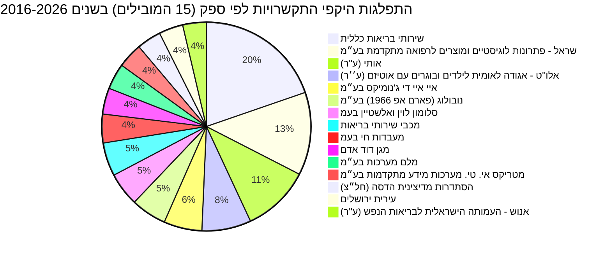

# נתוני תקציב, התקשרויות והחלטות ממשלה בתחום רפואת נשים

דוח זה מציג נתוני תקציב, התקשרויות והחלטות ממשלה הנוגעים לתחום [רפואת נשים](https://next.obudget.org/i/budget/24/2026) בישראל. חשוב לציין כי לא נמצאה קטגוריית תקציב ספציפית ל'רפואת נשים' במערכת התקציב. לפיכך, נתוני התקציב המוצגים מתייחסים לקטגוריה הרחבה יותר של [בריאות](https://next.obudget.org/i/budget/24/2026), שתחתיה נכללים שירותי רפואת נשים. ניתוח ההתקשרויות מראה שרוב החוזים הגדולים בתחום הבריאות הם עבור שירותים כלליים, פעילויות הקשורות למגפת הקורונה, חיסונים שגרתיים, ושירותים לאוכלוסיות עם צרכים מיוחדים (כמו אוטיזם ובריאות הנפש), ולא מתייחסים באופן מפורש לרפואת נשים. כמו כן, לא נמצאו החלטות ממשלה ספציפיות הנוגעות ישירות לנושא 'רפואת נשים' במסגרת הנתונים שסופקו.

## מגמה תקציבית לאורך זמן

לא נמצא מידע רלוונטי לנושא רפואת נשים באופן ספציפי. נתוני התקציב המצרפיים שסופקו עבור "בריאות" (1997-2026) קיימים, אך עם שתי נקודות נתון לדוגמה בלבד, לא ניתן להציג מגמה אמינה בתרשים קווי.

## תכניות פעילות כיום

### התפלגות היקפי התקשרויות לפי ספק (15 הספקים המובילים) בשנים 2016-2026



## מקורות תקציב

לא נמצא מידע רלוונטי לנושא רפואת נשים באופן ספציפי. המידע הקיים מתייחס לקטגוריה הרחבה יותר של [בריאות](https://next.obudget.org/i/budget/24/2026).

```mermaid
graph TD
    לא נמצא מידע רלוונטי לנושא רפואת נשים
```

### רשימת סעיפי תקציב נבחרים (עם קישורים)
לא נמצאו סעיפי תקציב ספציפיים לנושא 'רפואת נשים'. המידע הקיים מתייחס לקטגוריה הרחבה יותר של [בריאות](https://next.obudget.org/i/budget/24/2026).

## נושאים נוספים

### התקשרויות/חוזים
הטבלה הבאה מציגה את ההתקשרויות המובילות בתחום הבריאות, אשר עשויות לכלול שירותים רלוונטיים לרפואת נשים, בין היתר. יש לציין כי רוב ההתקשרויות הגדולות אינן מוגדרות במפורש כ"רפואת נשים" אלא כחלק משירותי בריאות כלליים, פעילויות הקשורות לקורונה או שירותים לאוכלוסיות ספציפיות.

| Purpose | Purchasing Ministry | Supplier Entity Name | Volume | Executed | Start Year | End Year | Item URL |
|---|---|---|---|---|---|---|---|\
| פעילות קורונה - בדיקות וחיסונים - קופת חולים כללית | משרד הבריאות | שירותי בריאות כללית | 258,050,645.0 | 258,050,645.0 | 2022 | 2022 | [Link](https://next.obudget.org/i/7d20d507eb7c) |\
| חיסוני שגרה לשנת 2018 | משרד הבריאות | נובולוג (פארם אפ 1966) בע״מ | 255,379,352.9 | 227,772,599.53 | 2017 | 2017 | [Link](https://next.obudget.org/i/92d6a0751314) |\
| חיסון קורונה אסטרה זניקה | משרד הבריאות | סלומון לוין ואלשטיין בעמ | 205,920,367.38 | 108,566,809.84 | 2021 | 2021 | [Link](https://next.obudget.org/i/df253063d6e8) |\
| מסד 505+ 668 627 הסבת התקשרות AIDמעבדה לבדיקות קורונה | משרד הבריאות | איי איי די ג'נומיקס בע״מ | 186,543,903.78 | 171,517,791.64 | 2021 | 2021 | [Link](https://next.obudget.org/i/93d7922a1d6b) |\
| רכש שירותים | משרד הבריאות | אותי (ע"ר) | 176,840,198.46 | 0.0 | 2023 | 2024 | [Link](https://next.obudget.org/i/73a3c789639d) |\
| רכש שירותים | משרד הבריאות | אותי (ע"ר) | 173,144,224.0 | 0.0 | 2019 | 2019 | [Link](https://next.obudget.org/i/a6816cd056e8) |\
| פעילות קורונה - בדיקות וחיסונים - קופת חולים מכבי | משרד הבריאות | מכבי שירותי בריאות | 169,423,481.0 | 169,423,481.0 | 2022 | 2022 | [Link](https://next.obudget.org/i/064825f63cd3) |\
| רכש שירותים | משרד הבריאות | אלו"ט - אגודה לאומית לילדים ובוגרים עם אוטיזם (ע''ר) | 156,733,958.5 | 0.0 | 2024 | 2024 | [Link](https://next.obudget.org/i/03daa13a46a0) |\
| הקמת מחלקה מתפרצת (קורונה )בתי החולים של קופת חולים | משרד הבריאות | שירותי בריאות כללית | 142,589,090.0 | 0.0 | 2020 | 2021 | [Link](https://next.obudget.org/i/67d998512bc2) |\
| מסד רכש ערכות אנטיגן | משרד הבריאות | גוד פארם בע״מ | 136,398,600.0 | 136,398,600.0 | 2022 | 2022 | [Link](https://next.obudget.org/i/d873c75ed6da) |\
| רכש שירותים | משרד הבריאות | אותי (ע"ר) | 128,011,905.0 | 118,326,368.88 | 2018 | 2018 | [Link](https://next.obudget.org/i/fba4e803cc7e) |\
| רכש שירותים | משרד הבריאות | אלו"ט - אגודה לאומית לילדים ובוגרים עם אוטיזם (ע''ר) | 126,400,449.0 | 125,033,275.32 | 2020 | 2020 | [Link](https://next.obudget.org/i/1d555d4a3ae3) |\
| מסד 505 + 668 627 MH הסבת התקשרות מעבדה פרטית בדיקות קורונה | משרד הבריאות | מייהריטאג' בע״מ | 111,597,740.0 | 102,956,102.45 | 2021 | 2021 | [Link](https://next.obudget.org/i/adaf15fdac62) |\
| חיסוני שגרה 2023 | משרד הבריאות | שראל - פתרונות לוגיסטיים ומוצרים לרפואה מתקדמת בע״מ | 106,232,263.61 | 0.0 | 2022 | 2022 | [Link](https://next.obudget.org/i/601ecf296db7) |\
| חיסוני שגרה | משרד הבריאות | נובולוג (פארם אפ 1966) בע״מ | 105,095,440.88 | 97,355,466.74 | 2016 | 2016 | [Link](https://next.obudget.org/i/e28506aee43b) |\
| חיסוני שגרה | משרד הבריאות | שראל - פתרונות לוגיסטיים ומוצרים לרפואה מתקדמת בע״מ | 104,722,279.62 | 95,955,190.86 | 2016 | 2016 | [Link](https://next.obudget.org/i/10dbe26ab337) |\
| בשל התפרצות נגיף הקורונה | משרד הבריאות | מעבדות חי בעמ | 103,199,481.56 | 99,370,926.45 | 2020 | 2021 | [Link](https://next.obudget.org/i/2188d1a5fe7e) |\
| רכש שירותים | משרד הבריאות | אותי (ע"ר) | 101,951,044.0 | 85,997,127.66 | 2021 | 2021 | [Link](https://next.obudget.org/i/e78324fbdf5a) |\
| חיסוני שגרה | משרד הבריאות | שראל - פתרונות לוגיסטיים ומוצרים לרפואה מתקדמת בע״מ | 101,544,874.94 | 100,361,495.16 | 2017 | 2017 | [Link](https://next.obudget.org/i/0bfc9ccb8e12) |\
| ריאגנטים לקורונה | משרד הבריאות | מעבדות חי בעמ | 99,585,029.95 | 94,937,077.63 | 2021 | 2021 | [Link](https://next.obudget.org/i/e4e67109d760) |\
| מסד מ 38 רכש אנטיגן בדיקות מהירות קורונה מכרז 1/2022 | משרד הבריאות | הדסה מדיקל בע״מ | 98,982,000.0 | 98,982,000.0 | 2022 | 2022 | [Link](https://next.obudget.org/i/9d56c83b9885) |\
| חיסוני שגרה לשנת 2018 | משרד הבריאות | פייזר פרמצבטיקה ישראל בע״מ | 97,120,397.79 | 87,354,552.87 | 2017 | 2017 | [Link](https://next.obudget.org/i/a490ced74dbc) |\
| הגדלת מלאי ברזל | משרד הבריאות | מעבדות חי בעמ | 96,578,979.01 | 93,926,278.63 | 2020 | 2020 | [Link](https://next.obudget.org/i/85bafba0b0c0) |\
| מסד 701+ 707 מ 51 מכרז מעבדות פרטיות איי איי די | משרד הבריאות | איי איי די ג'נומיקס בע״מ | 95,843,074.86 | 88,909,122.17 | 2021 | 2022 | [Link](https://next.obudget.org/i/bdf3300c069d) |\
| מסד 505+627 הסבת התקשרות מעבדה פרטית לבדיקות קורונה אלקטרה | משרד הבריאות | אלקטרה בעמ | 95,340,721.32 | 89,276,733.81 | 2021 | 2021 | [Link](https://next.obudget.org/i/9484388958c4) |\
| תשלום גנים ומעונות לאוטיסטים | משרד הבריאות | אותי (ע"ר) | 94,962,245.0 | 93,915,693.0 | 2016 | 2016 | [Link](https://next.obudget.org/i/3832ceb368b6) |\
| מסד מ 38 רכש אנטיגן בדיקות מהירות קורונה מכרז 1/2022 | משרד הבריאות | גוד פארם בע״מ | 93,147,964.65 | 93,133,397.6 | 2022 | 2022 | [Link](https://next.obudget.org/i/8fa0480d1820) |\
| שב"כ - מיגון - חרבות ברזל | משרד הבריאות | שירותי בריאות כללית | 92,314,339.0 | 0.0 | 2023 | 2024 | [Link](https://next.obudget.org/i/8ae1386ece35) |\
| פעילות קורונה - בדיקות וחיסונים - קופת חולים כללית | משרד הבריאות | שירותי בריאות כללית | 92,132,940.0 | 92,132,940.0 | 2022 | 2022 | [Link](https://next.obudget.org/i/0b89ad513800) |\
| רכש שירותים | משרד הבריאות | אלו"ט - אגודה לאומית לילדים ובוגרים עם אוטיזם (ע''ר) | 91,506,656.0 | 0.0 | 2019 | 2019 | [Link](https://next.obudget.org/i/e09a3d2a1e89) |\
| הקמת בית חולים לילדים וולפסון | משרד הבריאות | רם אדרת הנדסה אזרחית בע״מ | 91,075,652.46 | 96,541,309.87 | 2016 | 2021 | [Link](https://next.obudget.org/i/4b130a5e24d8) |\
| אנוש | משרד הבריאות | אנוש - העמותה הישראלית לבריאות הנפש (ע"ר) | 89,586,744.0 | 62,143,420.62 | 2018 | 2018 | [Link](https://next.obudget.org/i/ca4674e33d85) |\
| גן מעון אוטיסטים | משרד הבריאות | אלו"ט - אגודה לאומית לילדים ובוגרים עם אוטיזם (ע''ר) | 86,030,000.0 | 82,433,853.03 | 2018 | 2018 | [Link](https://next.obudget.org/i/d8785e7d7518) |\
| רכש שירותים | משרד הבריאות | טיפול לי עד הבית בע״מ | 85,242,692.87 | 0.0 | 2024 | 2024 | [Link](https://next.obudget.org/i/a7897cacb7cc) |\
| רכש שירותים | משרד הבריאות | אותי (ע"ר) | 81,427,233.0 | 79,846,966.89 | 2020 | 2020 | [Link](https://next.obudget.org/i/73c54b37caab) |\
| מסד 717 מכרז מעבדות פרטיות MH | משרד הבריאות | מייהריטאג' בע״מ | 80,842,989.24 | 80,608,458.06 | 2021 | 2022 | [Link](https://next.obudget.org/i/3dacc2aa45c1) |\
| מסד רכש ערכות אנטיגן | משרד הבריאות | רניום מדיקל בע״מ | 80,671,500.0 | 80,671,500.01 | 2022 | 2022 | [Link](https://next.obudget.org/i/247aa5e1d75f) |\
| חיסון פרבנר | משרד הבריאות | פייזר פרמצבטיקה ישראל בע״מ | 78,903,501.3 | 73,130,242.77 | 2016 | 2016 | [Link](https://next.obudget.org/i/dc3770e6ef4b) |\
| חיסון קורונה אסטרה זניקה | משרד הבריאות | סלומון לוין ואלשטיין בעמ | 78,340,995.72 | 55,353,685.73 | 2021 | 2021 | [Link](https://next.obudget.org/i/87a17d79de4a) |\
| מסד 701+ 707 מ 51 מכרז מעבדות פרטיות איילקס | משרד הבריאות | אילקס מדיקל בע״מ | 78,336,151.92 | 78,335,934.3 | 2021 | 2022 | [Link](https://next.obudget.org/i/f27d85103d16) |\
| אנוש | משרד הבריאות | אנוש - העמותה הישראלית לבריאות הנפש (ע"ר) | 76,861,375.67 | 67,263,816.54 | 2016 | 2016 | [Link](https://next.obudget.org/i/127f7d6f474b) |\
| אנוש | משרד הבריאות | אנוש - העמותה הישראלית לבריאות הנפש (ע"ר) | 76,065,930.0 | 70,077,604.23 | 2017 | 2017 | [Link](https://next.obudget.org/i/8c29682943ef) |\
| פעילות קורונה - בדיקות וחיסונים - קופת חולים כללית | משרד הבריאות | שירותי בריאות כללית | 75,563,500.0 | 0.0 | 2023 | 2023 | [Link](https://next.obudget.org/i/e7bcf68c10e5) |\
| שיפוי בתי חולים בגין ציוד מיגון | משרד הבריאות | שירותי בריאות כללית | 74,662,960.0 | 68,603,233.0 | 2020 | 2020 | [Link](https://next.obudget.org/i/cf8a98bdd187) |\
| שיפוי בתי חולים בגין ציוד מיגון | משרד הבריאות | שירותי בריאות כללית | 74,662,960.0 | 68,603,233.0 | 2020 | 2020 | [Link](https://next.obudget.org/i/f0dd71be38db) |\
| חיסוני שיגרה 2021 | משרד הבריאות | נובולוג (פארם אפ 1966) בע״מ | 74,017,843.38 | 66,000,048.57 | 2020 | 2021 | [Link](https://next.obudget.org/i/13c4e482277e) |\
| הקמת מתחם הנוער אברבנאל | משרד הבריאות | קן התור הנדסה ובנין בע״מ | 72,999,599.4 | 74,452,197.83 | 2018 | 2021 | [Link](https://next.obudget.org/i/e440e1e767d1) |\
| מסד מ בדיקות מעבדה קורונה פניה פרטנית 2 מכרז 98/2022 | משרד הבריאות | איי איי די ג'נומיקס בע״מ | 72,767,097.0 | 65,401,990.57 | 2022 | 2022 | [Link](https://next.obudget.org/i/fb5c2a9f99a0) |\
| רכש ערכות בדיקה מהירה אנטיגן לאבחון קורונה | משרד הבריאות | גוד פארם בע״מ | 70,785,000.0 | 68,537,131.65 | 2021 | 2021 | [Link](https://next.obudget.org/i/416e22cea474) |\
| רכש שירותים | משרד הבריאות | טיפול לי עד הבית בע״מ | 69,806,569.91 | 68,588,321.37 | 2023 | 2023 | [Link](https://next.obudget.org/i/e18e7c73c217) |

### ספקים

| Supplier Entity Name | Total Volume |
|---|---|
| שירותי בריאות כללית | 1,674,159,804.8 |
| שראל - פתרונות לוגיסטיים ומוצרים לרפואה מתקדמת בע״מ | 1,092,359,805.19 |
| אותי (ע"ר) | 893,112,482.5 |
| אלו"ט - אגודה לאומית לילדים ובוגרים עם אוטיזם (ע''ר) | 647,467,705.7 |
| איי איי די ג'נומיקס בע״מ | 502,527,942.65 |
| נובולוג (פארם אפ 1966) בע״מ | 467,115,139.18 |
| סלומון לוין ואלשטיין בעמ | 441,290,368.9 |
| מכבי שירותי בריאות | 439,743,069.06 |
| מעבדות חי בעמ | 378,524,943.36 |
| מגן דוד אדם | 343,570,087.97 |
| מלם מערכות בע״מ | 340,972,459.47 |
| מטריקס אי. טי. מערכות מידע מתקדמות בע״מ | 329,026,326.51 |
| הסתדרות מדיצינית הדסה (חל״צ) | 319,843,536.57 |
| עירית ירושלים | 317,399,476.4 |
| אנוש - העמותה הישראלית לבריאות הנפש (ע"ר) | 310,313,235.7 |
| גוד פארם בע״מ | 300,358,161.65 |
| פמי פרימיום בע״מ | 288,962,787.85 |
| קופת חולים מאוחדת מרכזית עממי | 283,910,935.4 |
| מייהריטאג' בע״מ | 253,585,152.71 |
| פייזר פרמצבטיקה ישראל בע״מ | 236,897,366.41 |
| תאגיד הבריאות ליד המרכז הרפואי תל-אביב (ע"ר) | 236,465,963.27 |
| אס. קיו. לינק בע״מ | 230,086,121.32 |
| קרן מחקרים ושירותי בריאות - שיבא (ע''ר) | 229,048,375.38 |
| קן התור הנדסה ובנין בע״מ | 227,200,482.99 |
| אומגה המכון להוראה מודרנית בע״מ | 221,350,793.07 |
| קידום פרוייקטים שיקומיים ב.ה. בע״מ | 219,892,483.18 |
| אלקטרה בעמ | 219,755,382.67 |
| טיפול רפואי מידי (טר״מ) בע״מ | 214,421,210.04 |
| אגודה לבריאות הציבור (ע"ר) | 210,618,628.92 |
| נס א.ט. בע״מ | 206,946,759.0 |
| אילקס מדיקל בע״מ | 198,404,858.07 |
| רם אדרת הנדסה אזרחית בע״מ | 186,956,030.43 |
| טיפול לי עד הבית בע״מ | 181,166,899.33 |
| גוינט ישראל (חל״צ) | 180,975,688.57 |
| עמל הולדינגס א.ד. בע״מ | 172,601,970.56 |
| קרן מחקרים רפואיים, פיתוח תשתית ושרותי בריאות - ליד המרכז הרפואי בני ציון (ע"ר) | 161,615,004.5 |
| קבוצת שכולו טוב (ע"ר) | 156,732,745.82 |
| שתית בע״מ | 154,486,412.73 |
| מרכז רפואי שערי צדק (ע"ר) | 149,831,084.76 |
| קופת חולים לעובדים לאומיים | 137,737,949.5 |
| מגן הלב (ע"ר) | 133,931,618.75 |
| טלדור יועצים בע״מ | 132,328,824.0 |
| ס.ו.ל.ם. - סיוע ועידוד לילדים מוגבלים (ע"ר) | 128,878,624.72 |
| מטריקס די אנד איי בע״מ | 126,085,658.71 |
| משרד רוה"מ/לשכת הפרסום הממשלתית | 125,796,324.95 |
| רניום ציוד למעבדות מחקר בע״מ | 120,111,662.47 |
| וואן ליין בע״מ | 117,819,816.89 |
| מעוף משאבי אנוש (מקבוצת מעוף) בע״מ | 116,904,003.56 |
| עירית תל-אביב-יפו | 115,872,246.93 |
| מרטנס יועצי מחשוב בע״מ | 114,751,216.09 |

### החלטות ממשלה
לא נמצא מידע רלוונטי לנושא רפואת נשים.

## מקורות
*   **סעיפי תקציב:**
    *   [נתוני תקציב מצרפיים לבריאות (1997-2026)](https://next.obudget.org/api/download?query=U0VMRUNUIHllYXIsIFNVTShhbW91bnRfYWxsb2NhdGVkKSBBUyB0b3RhbF9hbW91bnRfYWxsb2NhdGVkLCBTVU0oYW1vdW50X3JldmlzZWQpIEFTIHRvdGFsX3JldmlzZWQsIFNVTShhbW91bnRfdXNlZCkgQVMgdG90YWxfdXNlZCwgQVJSQVlfQUdHKGl0ZW1fdXJsKSBBUyBpdGVtX3VybHMgRlJPTSBidWRnZXRfaXRlbXNfZGF0YSBXSEVSRSBmdW5jdGlvbmFsX2NsYXNzX2RldGFpbGVkID0gJ1xl16zXqdeZ15DXldeqJyBHUk9VUCBCWSB5ZWFyIE9SREVSIEJZIHllYXI%3D&headers=year%3Btotal_amount_allocated%3Btotal_amount_revised%3Btotal_amount_used%3Bitem_urls)
    *   [משרד הבריאות - תקציב 2026](https://next.obudget.org/i/budget/24/2026)
*   **התקשרויות:**
    *   [התקשרויות משרד הבריאות - חיפוש "רפואת נשים"](https://next.obudget.org/i/contracts?q=%D7%A8%D7%A4%D7%95%D7%90%D7%AA+%D7%A0%D7%A9%D7%99%D7%9D) (הקישורים בטבלת ההתקשרויות מופנים לחוזים ספציפיים)

[חזרה לעמוד הראשי](../../README.md)