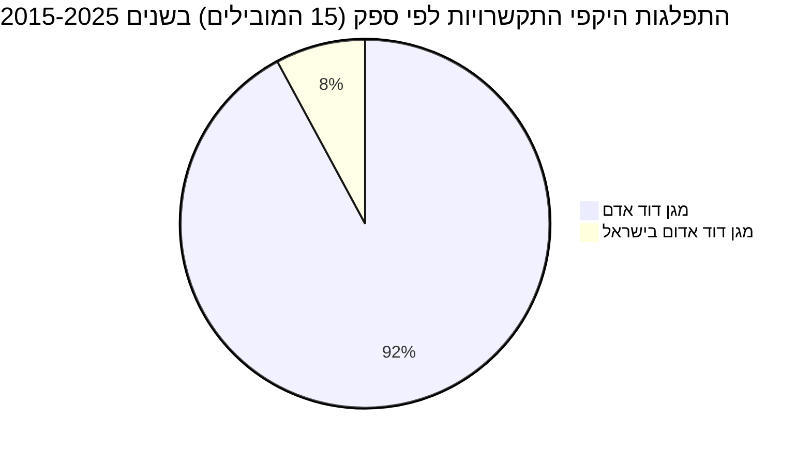
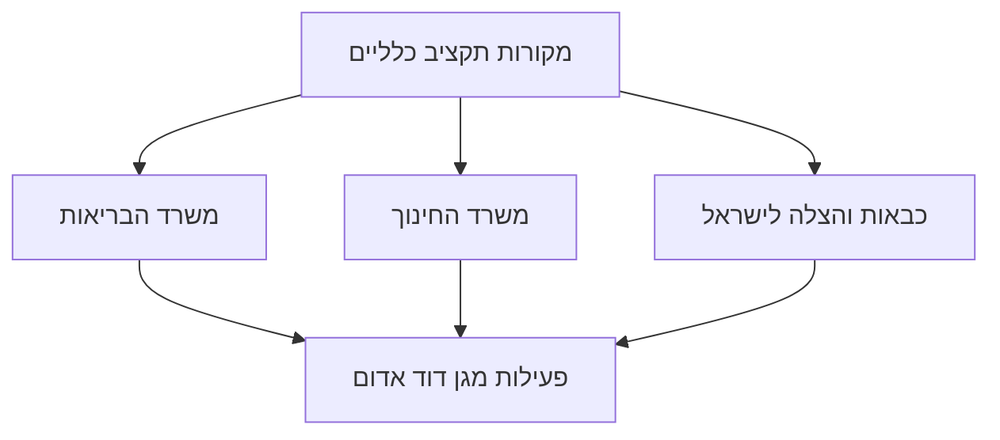

# נתוני תקציב, התקשרויות והחלטות ממשלה בתחום מגן דוד אדום

מגן דוד אדום (מד"א) הוא ארגון ההצלה הלאומי של ישראל, המספק שירותי חירום רפואיים, אמבולנסים, בנק דם ושירותי עזרה ראשונה. נתוני התקציב הישירים עבור "מגן דוד אדום" אינם מופיעים כסעיף תקציבי נפרד במערכת התקציב הממשלתית, אלא משולבים ככל הנראה במסגרת הקצאות רחבות יותר של משרדי ממשלה. עיקר המימון לפעילות הארגון מתבצע באמצעות התקשרויות וחוזים עם משרדים שונים, בראש ובראשונה [משרד הבריאות](https://next.obudget.org/i/unit/2000) ו[משרד החינוך](https://next.obudget.org/i/unit/2000). ההתקשרויות מתמקדות במגוון רחב של שירותים, כולל בדיקות וחיסוני קורונה, הקמת בנק דם לאומי, והדרכות עזרה ראשונה במוסדות חינוך. החלטות הממשלה משקפות את חשיבותו האסטרטגית של מד"א, במיוחד בהתמודדות עם משברים לאומיים כמו מגפת הקורונה וחיזוק העורף.

## מגמה תקציבית לאורך זמן

לא נמצאו סעיפי תקציב המוקדשים ישירות ל"מגן דוד אדום". הפעילות של מגן דוד אדום ממומנת ככל הנראה באמצעות הקצאות תקציביות רחבות יותר, בעיקר במסגרת [משרד הבריאות](https://next.obudget.org/i/unit/2000) ו[משרד החינוך](https://next.obudget.org/i/unit/2000). לכן, לא ניתן להציג מגמה תקציבית ישירה לאורך זמן.

## תכניות פעילות כיום

### התפלגות היקפי התקשרויות לפי ספק (15 הספקים המובילים) בשנים 2015-2025

## מקורות תקציב

לא אותרו סעיפי תקציב ספציפיים המיועדים ישירות ל"מגן דוד אדום". המימון לפעילות הארגון משולב ככל הנראה בסעיפי תקציב רחבים יותר של משרדי ממשלה, בפרט [משרד הבריאות](https://next.obudget.org/i/unit/2000) ו[משרד החינוך](https://next.obudget.org/i/unit/2000), דרך התקשרויות ופרויקטים ייעודיים.

### רשימת סעיפי תקציב נבחרים (עם קישורים)
לא נמצאו סעיפי תקציב המוקדשים ישירות ל"מגן דוד אדום". המימון לפעילות הארגון מתבצע דרך התקשרויות עם משרדי ממשלה שונים, כפי שמפורט בסעיפי ההתקשרויות.

## נושאים נוספים

### התקשרויות/חוזים
להלן רשימה של התקשרויות בולטות בהן [מגן דוד אדום](https://next.obudget.org/s/%D7%9E%D7%92%D7%9F%20%D7%93%D7%95%D7%93%20%D7%90%D7%93%D7%95%D7%9D) הוא ספק, בשנים 2015-2025:

| Purpose | Purchasing Ministry | Supplier Entity Name | Volume | Executed | Start Year | End Year |
|---|---|---|---|---|---|---|
| [מכרז 8/2022 מכרז מתחמי אנטיגן מוסדי](https://next.obudget.org/i/488b0669ffce) | [משרד הבריאות](https://next.obudget.org/i/unit/2000) | [מגן דוד אדם](https://next.obudget.org/s/%D7%9E%D7%92%D7%9F%20%D7%93%D7%95%D7%93%20%D7%90%D7%93%D7%9D) | 58,646,229.0 | 58,495,128.0 | 2022 | 2022 |
| [מכרז 8/2022 מכרז מתחמי אנטיגן מוסדי](https://next.obudget.org/i/c4526e9323a9) | [משרד הבריאות](https://next.obudget.org/i/unit/2000) | [מגן דוד אדם](https://next.obudget.org/s/%D7%9E%D7%92%D7%9F%20%D7%93%D7%95%D7%93%20%D7%90%D7%93%D7%9D) | 45,500,000.0 | 45,249,176.0 | 2022 | 2022 |
| [הפעלת מוקד בנתב"ג ובדיקות הדבקות בנגיף הקורונה בקהילה](https://next.obudget.org/i/de2461d4ab2b) | [משרד הבריאות](https://next.obudget.org/i/unit/2000) | [מגן דוד אדם](https://next.obudget.org/s/%D7%9E%D7%92%D7%9F%20%D7%93%D7%95%D7%93%20%D7%90%D7%93%D7%9D) | 26,836,000.0 | 0.0 | 2020 | 2020 |
| [הפעלת מוקד בנתב"ג ובדיקות הדבקות בנגיף הקורונה בקהילה](https://next.obudget.org/i/376020ed696d) | [משרד הבריאות](https://next.obudget.org/i/unit/2000) | [מגן דוד אדם](https://next.obudget.org/s/%D7%9E%D7%92%D7%9F%20%D7%93%D7%95%D7%93%20%D7%90%D7%93%D7%9D) | 26,836,000.0 | 0.0 | 2020 | 2020 |
| [מסד 686, 694 - חלוקת ערכות דיגום אנטיגן ע"י מד"א](https://next.obudget.org/i/a5fe3a138c05) | [משרד הבריאות](https://next.obudget.org/i/unit/2000) | [מגן דוד אדם](https://next.obudget.org/s/%D7%9E%D7%92%D7%9F%20%D7%93%D7%95%D7%93%20%D7%90%D7%93%D7%9D) | 26,579,376.0 | 25,004,456.62 | 2021 | 2021 |
| [מסד 661 + 702 מכרז 103/2021 בדיקות מהירות אנטיגן קורונה תו ירוק](https://next.obudget.org/i/eda1624c1d9a) | [משרד הבריאות](https://next.obudget.org/i/unit/2000) | [מגן דוד אדם](https://next.obudget.org/s/%D7%9E%D7%92%D7%9F%20%D7%93%D7%95%D7%93%20%D7%90%D7%93%D7%9D) | 25,441,728.0 | 25,441,728.0 | 2021 | 2022 |
| [הקמת בנק דם לאומי](https://next.obudget.org/i/f9a255645ea3) | [משרד הבריאות](https://next.obudget.org/i/unit/2000) | [מגן דוד אדם](https://next.obudget.org/s/%D7%9E%D7%92%D7%9F%20%D7%93%D7%95%D7%93%20%D7%90%D7%93%D7%9D) | 23,620,000.0 | 2,047,896.97 | 2019 | 2020 |
| [מסד 457, 565 - הפעלת מד"א בפעילות התחסנות דיירי מוסדות מגן אבות](https://next.obudget.org/i/2b728a84d68a) | [משרד הבריאות](https://next.obudget.org/i/unit/2000) | [מגן דוד אדם](https://next.obudget.org/s/%D7%9E%D7%92%D7%9F%20%D7%93%D7%95%D7%93%20%D7%90%D7%93%D7%9D) | 17,002,740.0 | 16,975,260.0 | 2021 | 2021 |
| [הקמת בנק דם לאומי](https://next.obudget.org/i/3a18094fd394) | [משרד הבריאות](https://next.obudget.org/i/unit/2000) | [מגן דוד אדם](https://next.obudget.org/s/%D7%9E%D7%92%D7%9F%20%D7%93%D7%95%D7%93%20%D7%90%D7%93%D7%9D) | 15,420,000.0 | 15,419,999.13 | 2019 | 2021 |
| [מס"ד 661 +702 מכרז 111/20211 בדיקות מהירות תו ירוק](https://next.obudget.org/i/9beb2df802d6) | [משרד הבריאות](https://next.obudget.org/i/unit/2000) | [מגן דוד אדם](https://next.obudget.org/s/%D7%9E%D7%92%D7%9F%20%D7%93%D7%95%D7%93%20%D7%90%D7%93%D7%9D) | 13,745,732.0 | 13,465,504.0 | 2021 | 2022 |
| [מכרז 34.10/2012 מתן מענה טיפול ראשוני לתלמידים שנפצעו/נפגעו במוסדות חינוך](https://next.obudget.org/i/12dba5a860b2) | [משרד החינוך](https://next.obudget.org/i/unit/2000) | [מגן דוד אדם](https://next.obudget.org/s/%D7%9E%D7%92%D7%9F%20%D7%93%D7%95%D7%93%20%D7%90%D7%93%D7%9D) | 9,120,000.0 | 6,840,000.0 | 2018 | 2019 |
| [מתן מענה טיפול רפואי ראשוני לתלמידים שנפגעו במוסדו](https://next.obudget.org/i/b3a86eb47a59) | [משרד החינוך](https://next.obudget.org/i/unit/2000) | [מגן דוד אדם](https://next.obudget.org/s/%D7%9E%D7%92%D7%9F%20%D7%93%D7%95%D7%93%20%D7%90%D7%93%D7%9D) | 9,120,000.0 | 9,120,000.0 | 2015 | 2016 |
| [מתן מענה טיפול רפואי ראשוני לתלמידים במוסדות חינוך](https://next.obudget.org/i/bcb09f4f508f) | [משרד החינוך](https://next.obudget.org/i/unit/2000) | [מגן דוד אדם](https://next.obudget.org/s/%D7%9E%D7%92%D7%9F%20%D7%93%D7%95%D7%93%20%D7%90%D7%93%D7%9D) | 9,120,000.0 | 9,120,000.0 | 2016 | 2017 |
| [מכרז 34/10.2012 טיפול ראשוני לתלמידים שנפצעובמוסדו](https://next.obudget.org/i/5f868de69e7c) | [משרד החינוך](https://next.obudget.org/i/unit/2000) | [מגן דוד אדם](https://next.obudget.org/s/%D7%9E%D7%92%D7%9F%20%D7%93%D7%95%D7%93%20%D7%90%D7%93%D7%9D) | 9,120,000.0 | 6,840,000.0 | 2017 | 2018 |
| [מכרז 34.10/2012 מתן מענה טיפול ראשוני לתלמידים שנפצעו/נפגעו במוסדות חינוך](https://next.obudget.org/i/ffa5548c87f0) | [משרד החינוך](https://next.obudget.org/i/unit/2000) | [מגן דוד אדם](https://next.obudget.org/s/%D7%9E%D7%92%D7%9F%20%D7%93%D7%95%D7%93%20%D7%90%D7%93%D7%9D) | 9,120,000.0 | 9,120,000.0 | null | null |
| [מסד 653, מ-41, מ-45 פנייה פרטנית חיסונים 5-8 מכרז 52/2021 - מד"א](https://next.obudget.org/i/f2b4073181b6) | [משרד הבריאות](https://next.obudget.org/i/unit/2000) | [מגן דוד אדם](https://next.obudget.org/s/%D7%9E%D7%92%D7%9F%20%D7%93%D7%95%D7%93%20%D7%90%D7%93%D7%9D) | 7,800,000.0 | 3,144,881.8 | 2021 | 2021 |
| [חיסוני ילדים בגילאי 12-15](https://next.obudget.org/i/edee4b1e5f3f) | [משרד הבריאות](https://next.obudget.org/i/unit/2000) | [מגן דוד אדם](https://next.obudget.org/s/%D7%9E%D7%92%D7%9F%20%D7%93%D7%95%D7%93%20%D7%90%D7%93%D7%9D) | 7,568,071.0 | 7,532,554.0 | 2021 | 2021 |
| [הפעלת מודל מ.ד.א. - עפ"י ועדת חריגים 22.3.20](https://next.obudget.org/i/787a903b04c3) | [משרד הבריאות](https://next.obudget.org/i/unit/2000) | [מגן דוד אדם](https://next.obudget.org/s/%D7%9E%D7%92%D7%9F%20%D7%93%D7%95%D7%93%20%D7%90%D7%93%D7%9D) | 7,288,170.0 | 0.0 | 2020 | 2020 |
| [הפעלת מודל מ.ד.א. - עפ"י ועדת חריגים 22.3.20](https://next.obudget.org/i/ea945a671dff) | [משרד הבריאות](https://next.obudget.org/i/unit/2000) | [מגן דוד אדם](https://next.obudget.org/s/%D7%9E%D7%92%D7%9F%20%D7%93%D7%95%D7%93%20%D7%90%D7%93%D7%9D) | 7,288,170.0 | 0.0 | 2020 | 2020 |
| [מערכת שו"ב תומ"ר](https://next.obudget.org/i/8d3ae2ecc08c) | [כבאות והצלה לישראל](https://next.obudget.org/s/%D7%9B%D7%91%D7%90%D7%95%D7%AA%20%D7%95%D7%94%D7%A6%D7%9C%D7%94%20%D7%9C%D7%99%D7%A9%D7%A8%D7%90%D7%9C) | [מגן דוד אדם](https://next.obudget.org/s/%D7%9E%D7%92%D7%9F%20%D7%93%D7%95%D7%93%20%D7%90%D7%93%D7%9D) | 7,050,000.0 | 0.0 | 2020 | 2020 |
| [מכרז 39/10.2018 - מתן מענה טיפול רפואי ראשוני לתלמידים](https://next.obudget.org/i/feb2933f2931) | [משרד החינוך](https://next.obudget.org/i/unit/2000) | [מגן דוד אדם](https://next.obudget.org/s/%D7%9E%D7%92%D7%9F%20%D7%93%D7%95%D7%93%20%D7%90%D7%93%D7%9D) | 6,930,000.0 | 6,545,000.0 | 2020 | 2021 |
| [מכרז 39/10.2018 מתן מענה טיפולי ראשוני לתלמידים שנפגעו במערכת החינוך](https://next.obudget.org/i/47ca87f33c16) | [משרד החינוך](https://next.obudget.org/i/unit/2000) | [מגן דוד אדום בישראל](https://next.obudget.org/s/%D7%9E%D7%92%D7%9F%20%D7%93%D7%95%D7%93%20%D7%90%D7%93%D7%95%D7%9D%20%D7%91%D7%99%D7%A9%D7%A8%D7%90%D7%9C) | 6,930,000.0 | 0.0 | 2024 | 2025 |
| [מכרז 39/10.2018 - מתן מענה רפואי ראשוני לתלמידים נפצעו/נפגעו במוסדות חינוך](https://next.obudget.org/i/fc0489872e76) | [משרד החינוך](https://next.obudget.org/i/unit/2000) | [מגן דוד אדם](https://next.obudget.org/s/%D7%9E%D7%92%D7%9F%20%D7%93%D7%95%D7%93%20%D7%90%D7%93%D7%9D) | 6,930,000.0 | 6,352,500.0 | 2019 | 2020 |
| [מכרז 39/10.2018 מתן מענה רפואי לתלמידים שנפגעו](https://next.obudget.org/i/bf5060c091bf) | [משרד החינוך](https://next.obudget.org/i/unit/2000) | [מגן דוד אדם](https://next.obudget.org/s/%D7%9E%D7%92%D7%9F%20%D7%93%D7%95%D7%93%20%D7%90%D7%93%D7%9D) | 6,930,000.0 | 4,865,235.36 | 2023 | 2024 |
| [מכרז 39/10.2018 מתן מענה להיפגעות תלמידים שנפגעו](https://next.obudget.org/i/fe02b96b1644) | [משרד החינוך](https://next.obudget.org/i/unit/2000) | [מגן דוד אדם](https://next.obudget.org/s/%D7%9E%D7%92%D7%9F%20%D7%93%D7%95%D7%93%20%D7%90%D7%93%D7%9D) | 6,930,000.0 | 6,982,452.65 | 2022 | 2023 |
| [מכרז 39/10.2018 - מתן מענה רפואי ראשוני לתלמידים נפצעו/נפגעו במוסדות חינוך](https://next.obudget.org/i/62e882d122fd) | [משרד החינוך](https://next.obudget.org/i/unit/2000) | [מגן דוד אדם](https://next.obudget.org/s/%D7%9E%D7%92%D7%9F%20%D7%93%D7%95%D7%93%20%D7%90%D7%93%D7%9D) | 6,930,000.0 | 3,465,000.0 | null | null |
| [מערכת שו"ב תומ"ר](https://next.obudget.org/i/e16386caa6c0) | [כבאות והצלה לישראל](https://next.obudget.org/s/%D7%9B%D7%91%D7%90%D7%95%D7%AA%20%D7%95%D7%94%D7%A6%D7%9C%D7%94%20%D7%9C%D7%99%D7%A9%D7%A8%D7%90%D7%9C) | [מגן דוד אדום בישראל](https://next.obudget.org/s/%D7%9E%D7%92%D7%9F%20%D7%93%D7%95%D7%93%20%D7%90%D7%93%D7%95%D7%9D%20%D7%91%D7%99%D7%A9%D7%A8%D7%90%D7%9C) | 5,149,250.0 | 0.0 | 2024 | 2024 |
| [מכרז 9/3.2019 בצוע הדרכה בעזרה ראונה לכיתות י'](https://next.obudget.org/i/6a898c2df9ed) | [משרד החינוך](https://next.obudget.org/i/unit/2000) | [מגן דוד אדם](https://next.obudget.org/s/%D7%9E%D7%92%D7%9F%20%D7%93%D7%95%D7%93%20%D7%90%D7%93%D7%9D) | 4,799,360.0 | 0.0 | 2022 | 2023 |
| [מכרז מס' 9/3.2019 - ביצוע הדרכה בעזרה ראשונה לתלמידי כיתות י'](https://next.obudget.org/i/5f4893276c40) | [משרד החינוך](https://next.obudget.org/i/unit/2000) | [מגן דוד אדם](https://next.obudget.org/s/%D7%9E%D7%92%D7%9F%20%D7%93%D7%95%D7%93%20%D7%90%D7%93%D7%9D) | 4,799,360.0 | 0.0 | 2021 | 2022 |
| [הקמת בנק דם לאומי](https://next.obudget.org/i/be31ecb59874) | [משרד הבריאות](https://next.obudget.org/i/unit/2000) | [מגן דוד אדום בישראל](https://next.obudget.org/s/%D7%9E%D7%92%D7%9F%20%D7%93%D7%95%D7%93%20%D7%90%D7%93%D7%95%D7%9D%20%D7%91%D7%99%D7%A9%D7%A8%D7%90%D7%9C) | 4,700,000.0 | 0.0 | 2024 | 2025 |
| [הקמת בנק דם לאומי](https://next.obudget.org/i/e25adad5e243) | [משרד הבריאות](https://next.obudget.org/i/unit/2000) | [מגן דוד אדם](https://next.obudget.org/s/%D7%9E%D7%92%D7%9F%20%D7%93%D7%95%D7%93%20%D7%90%D7%93%D7%9D) | 4,700,000.0 | 0.0 | 2019 | 2021 |
| [מכרז 19/5.2023 ביצוע תוכניות ללימודי עזר ראשונה לתלמידי כיתות י'](https://next.obudget.org/i/eb04cf676aeb) | [משרד החינוך](https://next.obudget.org/i/unit/2000) | [מגן דוד אדם](https://next.obudget.org/s/%D7%9E%D7%92%D7%9F%20%D7%93%D7%95%D7%93%20%D7%90%D7%93%D7%9D) | 4,440,620.0 | 638,780.0 | 2023 | 2024 |
| [מכרז 19/5.2023 בצוע תוכניות לימודי עזרה ראשונה כיתות י'](https://next.obudget.org/i/52010180227f) | [משרד החינוך](https://next.obudget.org/i/unit/2000) | [מגן דוד אדום בישראל](https://next.obudget.org/s/%D7%9E%D7%92%D7%9F%20%D7%93%D7%95%D7%93%20%D7%90%D7%93%D7%95%D7%9D%20%D7%91%D7%99%D7%A9%D7%A8%D7%90%D7%9C) | 4,440,620.0 | 0.0 | 2024 | 2025 |
| [מכרז 19/5.2023 ביצוע תוכניות ללימודי עזר ראשונה לתלמידי כיתות י'](https://next.obudget.org/i/a71c54e1465f) | [משרד החינוך](https://next.obudget.org/i/unit/2000) | [מגן דוד אדום בישראל](https://next.obudget.org/s/%D7%9E%D7%92%D7%9F%20%D7%93%D7%95%D7%93%20%D7%90%D7%93%D7%95%D7%9D%20%D7%91%D7%99%D7%A9%D7%A8%D7%90%D7%9C) | 3,801,840.0 | 0.0 | 2024 | 2024 |
| [מסד 679 - פעילות מדא באומן](https://next.obudget.org/i/e556400a79ae) | [משרד הבריאות](https://next.obudget.org/i/unit/2000) | [מגן דוד אדם](https://next.obudget.org/s/%D7%9E%D7%92%D7%9F%20%D7%93%D7%95%D7%93%20%D7%90%D7%93%D7%9D) | 3,672,027.74 | 3,455,770.0 | 2021 | 2021 |
| [מכרז 9/3.2019 - ביצוע תכניות ללימודי עזרה ראשונה לתלמידי כיתות י'](https://next.obudget.org/i/e0ebba8f9ae2) | [משרד החינוך](https://next.obudget.org/i/unit/2000) | [מגן דוד אדם](https://next.obudget.org/s/%D7%9E%D7%92%D7%9F%20%D7%93%D7%95%D7%93%20%D7%90%D7%93%D7%9D) | 3,668,960.0 | 1,102,370.0 | 2019 | 2020 |
| [ח-176,ח-184, 531, ח-209, 565 - חיסוני מד"א בפריפריה, חסרי מעמד ובתי הסוהר.](https://next.obudget.org/i/5773ab79be4d) | [משרד הבריאות](https://next.obudget.org/i/unit/2000) | [מגן דוד אדם](https://next.obudget.org/s/%D7%9E%D7%92%D7%9F%20%D7%93%D7%95%D7%93%20%D7%90%D7%93%D7%9D) | 3,590,754.0 | 3,545,890.0 | 2021 | 2021 |
| [מסד 545,546 - חיסון פועלים פלסטינאים במעברים](https://next.obudget.org/i/de4aecdf4b55) | [משרד הבריאות](https://next.obudget.org/i/unit/2000) | [מגן דוד אדם](https://next.obudget.org/s/%D7%9E%D7%92%D7%9F%20%D7%93%D7%95%D7%93%20%D7%90%D7%93%D7%9D) | 2,844,890.0 | 2,839,802.0 | 2021 | 2022 |
| [הפעלת 15 צוותי דיגום מד"א](https://next.obudget.org/i/d56bc6629be5) | [משרד הבריאות](https://next.obudget.org/i/unit/2000) | [מגן דוד אדם](https://next.obudget.org/s/%D7%9E%D7%92%D7%9F%20%D7%93%D7%95%D7%93%20%D7%90%D7%93%D7%9D) | 2,829,750.0 | 1,614,305.0 | 2021 | 2021 |
| [מכרז 35/11.2019 בצוע קורסי עזרה ראשונה לעובדי הוראה](https://next.obudget.org/i/fb0bfa0a4bd7) | [משרד החינוך](https://next.obudget.org/i/unit/2000) | [מגן דוד אדם](https://next.obudget.org/s/%D7%9E%D7%92%D7%9F%20%D7%93%D7%95%D7%93%20%D7%90%D7%93%D7%9D) | 2,596,700.0 | 1,482,339.0 | 2021 | 2022 |
| [מכרז 35/11.2019 ביצוע קורס עזרה ראשונה לעובדי הוראה](https://next.obudget.org/i/3d55b7fdbcc6) | [משרד החינוך](https://next.obudget.org/i/unit/2000) | [מגן דוד אדם](https://next.obudget.org/s/%D7%9E%D7%92%D7%9F%20%D7%93%D7%95%D7%93%20%D7%90%D7%93%D7%9D) | 2,596,421.0 | 1,349,183.75 | 2022 | 2023 |
| [מכרז 35/11.2019 ביצוע קורס עזרה ראשונה לעובדי הוראה](https://next.obudget.org/i/ab4d080b523c) | [משרד החינוך](https://next.obudget.org/i/unit/2000) | [מגן דוד אדם](https://next.obudget.org/s/%D7%9E%D7%92%D7%9F%20%D7%93%D7%95%D7%93%20%D7%90%D7%93%D7%9D) | 2,596,388.0 | 0.0 | 2023 | 2024 |
| [מכרז 35/11.2019 בצועקורסים הכשרה והשתלמויות עzרה ראשונה עובדי הוראה](https://next.obudget.org/i/2d0a30c9924c) | [משרד החינוך](https://next.obudget.org/i/unit/2000) | [מגן דוד אדום בישראל](https://next.obudget.org/s/%D7%9E%D7%92%D7%9F%20%D7%93%D7%95%D7%93%20%D7%90%D7%93%D7%95%D7%9D%20%D7%91%D7%99%D7%A9%D7%A8%D7%90%D7%9C) | 2,596,052.0 | 0.0 | 2024 | 2025 |
| [מכרז 39/10.2018 מתן מענה טיפולי רפואי ראשוני לתלמידים](https://next.obudget.org/i/19575f8117fb) | [משרד החינוך](https://next.obudget.org/i/unit/2000) | [מגן דוד אדום בישראל](https://next.obudget.org/s/%D7%9E%D7%92%D7%9F%20%D7%93%D7%95%D7%93%20%D7%90%D7%93%D7%95%D7%9D%20%D7%91%D7%99%D7%A9%D7%A8%D7%90%D7%9C) | 2,541,000.0 | 0.0 | 2024 | 2024 |
| [צוותי דיגום "מגן חינוך" - מד"א](https://next.obudget.org/i/7b7e31f0f42f) | [משרד הבריאות](https://next.obudget.org/i/unit/2000) | [מגן דוד אדם](https://next.obudget.org/s/%D7%9E%D7%92%D7%9F%20%D7%93%D7%95%D7%93%20%D7%90%D7%93%D7%9D) | 2,300,000.0 | 826,868.0 | 2022 | 2022 |
| [מכרז 35/11.2019 ביצוע קורסיהכשרה והשתלמויות בעזרה ראשונה לעובדי הוראה, לסגל המינהלי של מוס](https://next.obudget.org/i/fc3a2606c4e2) | [משרד החינוך](https://next.obudget.org/i/unit/2000) | [מגן דוד אדם](https://next.obudget.org/s/%D7%9E%D7%92%D7%9F%20%D7%93%D7%95%D7%93%20%D7%90%D7%93%D7%9D) | 2,237,904.0 | 1,516,632.0 | 2020 | 2021 |
| [מכרז 35/11.2019 בצוע קורי עזרה רשונה והשתלמויות לעובדי הוראה במוסדות חינוך](https://next.obudget.org/i/3844db149c02) | [משרד החינוך](https://next.obudget.org/i/unit/2000) | [מגן דוד אדום בישראל](https://next.obudget.org/s/%D7%9E%D7%92%D7%9F%20%D7%93%D7%95%D7%93%20%D7%90%D7%93%D7%95%D7%9D%20%D7%91%D7%99%D7%A9%D7%A8%D7%90%D7%9C) | 2,036,637.0 | 0.0 | 2024 | 2024 |
| [מכרז 9/3.2019 - ביצוע תכניות ללימודי עזרה ראשונה לתלמידי כיתות י'](https://next.obudget.org/i/db4037daee35) | [משרד החינוך](https://next.obudget.org/i/unit/2000) | [מגן דוד אדם](https://next.obudget.org/s/%D7%9E%D7%92%D7%9F%20%D7%93%D7%95%D7%93%20%D7%90%D7%93%D7%9D) | 1,999,890.0 | 0.0 | null | null |
| [מערכת שו"ב תומ"ר](https://next.obudget.org/i/9b263a338e5e) | [כבאות והצלה לישראל](https://next.obudget.org/s/%D7%9B%D7%91%D7%90%D7%95%D7%AA%20%D7%95%D7%94%D7%A6%D7%9C%D7%94%20%D7%9C%D7%99%D7%A9%D7%A8%D7%90%D7%9C) | [מגן דוד אדום בישראל](https://next.obudget.org/s/%D7%9E%D7%92%D7%9F%20%D7%93%D7%95%D7%93%20%D7%90%D7%93%D7%95%D7%9D%20%D7%91%D7%99%D7%A9%D7%A8%D7%90%D7%9C) | 1,981,429.0 | 0.0 | 2024 | 2024 |
| [מערכת שו"ב תומ"ר](https://next.obudget.org/i/89338624dec8) | [כבאות והצלה לישראל](https://next.obudget.org/s/%D7%9B%D7%91%D7%90%D7%95%D7%AA%20%D7%95%D7%94%D7%A6%D7%9C%D7%94%20%D7%9C%D7%99%D7%A9%D7%A8%D7%90%D7%9C) | [מגן דוד אדם](https://next.obudget.org/s/%D7%9E%D7%92%D7%9F%20%D7%93%D7%95%D7%93%20%D7%90%D7%93%D7%9D) | 1,964,852.5 | 0.0 | 2020 | 2020 |

### ספקים
להלן רשימת הספקים העיקריים הקשורים לפעילות מגן דוד אדום, יחד עם היקף ההתקשרויות הכולל עמם:

| שם הספק | היקף התקשרויות (ILS) |
|---|---|
| מגן דוד אדם | 479,087,899.59 |
| מגן דוד אדום בישראל | 40,981,151.21 |

### החלטות ממשלה
להלן החלטות ממשלה רלוונטיות לפעילות מגן דוד אדום:

| Title | Government | Decision Number | Publication Date |
|---|---|---|---|
| [צעדים לחיזוק העורף כתוצאה מהצרכים הנובעים ממבצע "צוק איתן"](https://next.obudget.org/i/a497875e6b90) | | 1897 | 2014-07-24 |
| [הסכם בילטרלי בין ישראל לבין יפן לעידוד ולהגנה על השקעות](https://next.obudget.org/i/4437b7c6ea71) | הממשלה ה- 34, בנימין נתניהו | 1437 | 2016-05-04 |
| [תיקון אגרות מד"א ותיקון החלטת ממשלה](https://next.obudget.org/i/4c88753ff86b) | הממשלה ה- 37 | 3561 | 2025-12-04 |
| [עדכון תורת ההפעלה המשולבת בנושא הטיפול באירועי חומרים מסוכנים במדינת ישראל](https://next.obudget.org/i/38f0ce00f198) | הממשלה ה- 34, בנימין נתניהו | 2750 | 2017-06-18 |
| [הצעת חוק מגן דוד אדום (תיקון - מידע בגין אשפוז), התשע"ו-2016 של חה"כ שולי מועלם רפאלי ואורלי לוי אבקסיס (פ/2898)](https://next.obudget.org/i/fb35e7a9741f) | הממשלה ה- 34, בנימין נתניהו | 1706 | 2016-07-21 |
| [תיעדוף הוצאות הממשלה בשנת 2025 ותיקון החלטות ממשלה](https://next.obudget.org/i/aef7843e7789) | הממשלה ה- 37 | 3327 | 2025-08-19 |
| [הקמת ועדה למינוי חברים למועצה הארצית של מגן דוד אדום וביטול החלטת ממשלה](https://next.obudget.org/i/937c78cdadb2) | הממשלה ה- 37 | 1602 | 2024-03-28 |
| [הכרזה על אזור עין בוקק-חמי זוהר כאזור תיירות מיוחד לפי חוק סמכויות מיוחדות להתמודדות עם נגיף הקורונה החדש (הוראת שעה), התש"ף-2020](https://next.obudget.org/i/0f746290c2e5) | הממשלה ה- 35, בנימין נתניהו | 816 | 2021-02-19 |
| [היערכות לאומית לפיתוח מערכת מטרו במטרופולין גוש דן ותיקון החלטת ממשלה](https://next.obudget.org/i/fc273f917325) | הממשלה ה- 36, נפתלי בנט | 200 | 2021-08-01 |
| [תקנות סמכויות מיוחדות להתמודדות עם נגיף הקורונה החדש (הוראת שעה) (הגבלת פעילות במקומות עבודה), התש"ף-2020](https://next.obudget.org/i/0258170db1e1) | הממשלה ה- 35, בנימין נתניהו | 310 | 2020-08-09 |
| [תקנות שעת חירום (נגיף הקורונה החדש) (בידוד במקום לבידוד מטעם המדינה)(תיקון מס' 7), התש"ף-2020](https://next.obudget.org/i/cabdd14a395a) | הממשלה ה- 35, בנימין נתניהו | 106 | 2020-06-15 |
| [תקנות שעת חירום (נגיף הקורונה החדש) (בידוד במקום לבידוד מטעם המדינה) (תיקון מס' 6), התש"ף-2020](https://next.obudget.org/i/300eeaba1423) | הממשלה ה- 35, בנימין נתניהו | 47 | 2020-06-02 |
| [תקנות שעת חירום (נגיף הקורונה החדש ) (בידוד במקום לבידוד מטעם המדינה)(תיקון מס' 5), התש"ף-2020](https://next.obudget.org/i/633502933fef) | הממשלה ה- 35, בנימין נתניהו | 3 | 2020-05-19 |
| [תקנות שעת חירום (נגיף הקורונה החדש) (בידוד במקום לבידוד מטעם המדינה) (תיקון מס' 4), התש"ף-2020](https://next.obudget.org/i/42e5b10cf29c) | הממשלה ה- 34, בנימין נתניהו | 5061 | 2020-05-10 |
| [תקנות שעת חירום (הגבלת מספר העובדים במקום עבודה לשם צמצום התפשטות נגיף קורונה החדש), התש"ף-2020](https://next.obudget.org/i/fd22cd85e2d7) | הממשלה ה- 34, בנימין נתניהו | 4912 | 2020-03-21 |

## מקורות
*   **סעיפי תקציב**: לא נמצאו סעיפי תקציב ספציפיים. מידע תקציבי משולב ככל הנראה בסעיפי [משרד הבריאות](https://next.obudget.org/i/unit/2000) ו[משרד החינוך](https://next.obudget.org/i/unit/2000).
*   **התקשרויות**:
    *   [מכרז 8/2022 מכרז מתחמי אנטיגן מוסדי](https://next.obudget.org/i/488b0669ffce)
    *   [מכרז 8/2022 מכרז מתחמי אנטיגן מוסדי](https://next.obudget.org/i/c4526e9323a9)
    *   [הפעלת מוקד בנתב"ג ובדיקות הדבקות בנגיף הקורונה בקהילה](https://next.obudget.org/i/de2461d4ab2b)
    *   [הפעלת מוקד בנתב"ג ובדיקות הדבקות בנגיף הקורונה בקהילה](https://next.obudget.org/i/376020ed696d)
    *   [מסד 686, 694 - חלוקת ערכות דיגום אנטיגן ע"י מד"א](https://next.obudget.org/i/a5fe3a138c05)
    *   [מסד 661 + 702 מכרז 103/2021 בדיקות מהירות אנטיגן קורונה תו ירוק](https://next.obudget.org/i/eda1624c1d9a)
    *   [הקמת בנק דם לאומי](https://next.obudget.org/i/f9a255645ea3)
    *   [מסד 457, 565 - הפעלת מד"א בפעילות התחסנות דיירי מוסדות מגן אבות](https://next.obudget.org/i/2b728a84d68a)
    *   [הקמת בנק דם לאומי](https://next.obudget.org/i/3a18094fd394)
    *   [מס"ד 661 +702 מכרז 111/20211 בדיקות מהירות תו ירוק](https://next.obudget.org/i/9beb2df802d6)
    *   [מכרז 34.10/2012 מתן מענה טיפול ראשוני לתלמידים שנפצעו/נפגעו במוסדות חינוך](https://next.obudget.org/i/12dba5a860b2)
    *   [מתן מענה טיפול רפואי ראשוני לתלמידים שנפגעו במוסדו](https://next.obudget.org/i/b3a86eb47a59)
    *   [מתן מענה טיפול רפואי ראשוני לתלמידים במוסדות חינוך](https://next.obudget.org/i/bcb09f4f508f)
    *   [מכרז 34/10.2012 טיפול ראשוני לתלמידים שנפצעובמוסדו](https://next.obudget.org/i/5f868de69e7c)
    *   [מכרז 34.10/2012 מתן מענה טיפול ראשוני לתלמידים שנפצעו/נפגעו במוסדות חינוך](https://next.obudget.org/i/ffa5548c87f0)
    *   [מסד 653, מ-41, מ-45 פנייה פרטנית חיסונים 5-8 מכרז 52/2021 - מד"א](https://next.obudget.org/i/f2b4073181b6)
    *   [חיסוני ילדים בגילאי 12-15](https://next.obudget.org/i/edee4b1e5f3f)
    *   [הפעלת מודל מ.ד.א. - עפ"י ועדת חריגים 22.3.20](https://next.obudget.org/i/787a903b04c3)
    *   [הפעלת מודל מ.ד.א. - עפ"י ועדת חריגים 22.3.20](https://next.obudget.org/i/ea945a671dff)
    *   [מערכת שו"ב תומ"ר](https://next.obudget.org/i/8d3ae2ecc08c)
    *   [מכרז 39/10.2018 - מתן מענה טיפול רפואי ראשוני לתלמידים](https://next.obudget.org/i/feb2933f2931)
    *   [מכרז 39/10.2018 מתן מענה טיפולי ראשוני לתלמידים שנפגעו במערכת החינוך](https://next.obudget.org/i/47ca87f33c16)
    *   [מכרז 39/10.2018 - מתן מענה רפואי ראשוני לתלמידים נפצעו/נפגעו במוסדות חינוך](https://next.obudget.org/i/fc0489872e76)
    *   [מכרז 39/10.2018 מתן מענה רפואי לתלמידים שנפגעו](https://next.obudget.org/i/bf5060c091bf)
    *   [מכרז 39/10.2018 מתן מענה להיפגעות תלמידים שנפגעו](https://next.obudget.org/i/fe02b96b1644)
    *   [מכרז 39/10.2018 - מתן מענה רפואי ראשוני לתלמידים נפצעו/נפגעו במוסדות חינוך](https://next.obudget.org/i/62e882d122fd)
    *   [מערכת שו"ב תומ"ר](https://next.obudget.org/i/e16386caa6c0)
    *   [מכרז 9/3.2019 בצוע הדרכה בעזרה ראונה לכיתות י'](https://next.obudget.org/i/6a898c2df9ed)
    *   [מכרז מס' 9/3.2019 - ביצוע הדרכה בעזרה ראשונה לתלמידי כיתות י'](https://next.obudget.org/i/5f4893276c40)
    *   [הקמת בנק דם לאומי](https://next.obudget.org/i/be31ecb59874)
    *   [הקמת בנק דם לאומי](https://next.obudget.org/i/e25adad5e243)
    *   [מכרז 19/5.2023 ביצוע תוכניות ללימודי עזר ראשונה לתלמידי כיתות י'](https://next.obudget.org/i/eb04cf676aeb)
    *   [מכרז 19/5.2023 בצוע תוכניות לימודי עזרה ראשונה כיתות י'](https://next.obudget.org/i/52010180227f)
    *   [מכרז 19/5.2023 ביצוע תוכניות ללימודי עזר ראשונה לתלמידי כיתות י'](https://next.obudget.org/i/a71c54e1465f)
    *   [מסד 679 - פעילות מדא באומן](https://next.obudget.org/i/e556400a79ae)
    *   [מכרז 9/3.2019 - ביצוע תכניות ללימודי עזרה ראשונה לתלמידי כיתות י'](https://next.obudget.org/i/e0ebba8f9ae2)
    *   [ח-176,ח-184, 531, ח-209, 565 - חיסוני מד"א בפריפריה, חסרי מעמד ובתי הסוהר.](https://next.obudget.org/i/5773ab79be4d)
    *   [מסד 545,546 - חיסון פועלים פלסטינאים במעברים](https://next.obudget.org/i/de4aecdf4b55)
    *   [הפעלת 15 צוותי דיגום מד"א](https://next.obudget.org/i/d56bc6629be5)
    *   [מכרז 35/11.2019 בצוע קורסי עזרה ראשונה לעובדי הוראה](https://next.obudget.org/i/fb0bfa0a4bd7)
    *   [מכרז 35/11.2019 ביצוע קורס עזרה ראשונה לעובדי הוראה](https://next.obudget.org/i/3d55b7fdbcc6)
    *   [מכרז 35/11.2019 ביצוע קורס עזרה ראשונה לעובדי הוראה](https://next.obudget.org/i/ab4d080b523c)
    *   [מכרז 35/11.2019 בצועקורסים הכשרה והשתלמויות עzרה ראשונה עובדי הוראה](https://next.obudget.org/i/2d0a30c9924c)
    *   [מכרז 39/10.2018 מתן מענה טיפולי רפואי ראשוני לתלמידים](https://next.obudget.org/i/19575f8117fb)
    *   [צוותי דיגום "מגן חינוך" - מד"א](https://next.obudget.org/i/7b7e31f0f42f)
    *   [מכרז 35/11.2019 ביצוע קורסיהכשרה והשתלמויות בעזרה ראשונה לעובדי הוראה, לסגל המינהלי של מוס](https://next.obudget.org/i/fc3a2606c4e2)
    *   [מכרז 35/11.2019 בצוע קורי עזרה רשונה והשתלמויות לעובדי הוראה במוסדות חינוך](https://next.obudget.org/i/3844db149c02)
    *   [מכרז 9/3.2019 - ביצוע תכניות ללימודי עזרה ראשונה לתלמידי כיתות י'](https://next.obudget.org/i/db4037daee35)
    *   [מערכת שו"ב תומ"ר](https://next.obudget.org/i/9b263a338e5e)
    *   [מערכת שו"ב תומ"ר](https://next.obudget.org/i/89338624dec8)
*   **החלטות ממשלה**:
    *   [צעדים לחיזוק העורף כתוצאה מהצרכים הנובעים ממבצע "צוק איתן"](https://next.obudget.org/i/a497875e6b90)
    *   [הסכם בילטרלי בין ישראל לבין יפן לעידוד ולהגנה על השקעות](https://next.obudget.org/i/4437b7c6ea71)
    *   [תיקון אגרות מד"א ותיקון החלטת ממשלה](https://next.obudget.org/i/4c88753ff86b)
    *   [עדכון תורת ההפעלה המשולבת בנושא הטיפול באירועי חומרים מסוכנים במדינת ישראל](https://next.obudget.org/i/38f0ce00f198)
    *   [הצעת חוק מגן דוד אדום (תיקון - מידע בגין אשפוז), התשע"ו-2016 של חה"כ שולי מועלם רפאלי ואורלי לוי אבקסיס (פ/2898)](https://next.obudget.org/i/fb35e7a9741f)
    *   [תיעדוף הוצאות הממשלה בשנת 2025 ותיקון החלטות ממשלה](https://next.obudget.org/i/aef7843e7789)
    *   [הקמת ועדה למינוי חברים למועצה הארצית של מגן דוד אדום וביטול החלטת ממשלה](https://next.obudget.org/i/937c78cdadb2)
    *   [הכרזה על אזור עין בוקק-חמי זוהר כאזור תיירות מיוחד לפי חוק סמכויות מיוחדות להתמודדות עם נגיף הקורונה החדש (הוראת שעה), התש"ף-2020](https://next.obudget.org/i/0f746290c2e5)
    *   [היערכות לאומית לפיתוח מערכת מטרו במטרופולין גוש דן ותיקון החלטת ממשלה](https://next.obudget.org/i/fc273f917325)
    *   [תקנות סמכויות מיוחדות להתמודדות עם נגיף הקורונה החדש (הוראת שעה) (הגבלת פעילות במקומות עבודה), התש"ף-2020](https://next.obudget.org/i/0258170db1e1)
    *   [תקנות שעת חירום (נגיף הקורונה החדש) (בידוד במקום לבידוד מטעם המדינה)(תיקון מס' 7), התש"ף-2020](https://next.obudget.org/i/cabdd14a395a)
    *   [תקנות שעת חירום (נגיף הקורונה החדש) (בידוד במקום לבידוד מטעם המדינה) (תיקון מס' 6), התש"ף-2020](https://next.obudget.org/i/300eeaba1423)
    *   [תקנות שעת חירום (נגיף הקורונה החדש ) (בידוד במקום לבידוד מטעם המדינה)(תיקון מס' 5), התש"ף-2020](https://next.obudget.org/i/633502933fef)
    *   [תקנות שעת חירום (נגיף הקורונה החדש) (בידוד במקום לבידוד מטעם המדינה) (תיקון מס' 4), התש"ף-2020](https://next.obudget.org/i/42e5b10cf29c)
    *   [תקנות שעת חירום (הגבלת מספר העובדים במקום עבודה לשם צמצום התפשטות נגיף קורונה החדש), התש"ף-2020](https://next.obudget.org/i/fd22cd85e2d7)

[חזרה לעמוד הראשי](../../README.md)