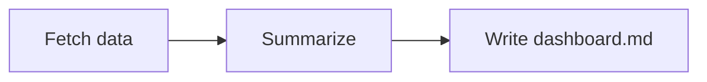

# Markdown Dashboard Viewer

A local viewer for Markdown "dashboard" files: point it at a `content/` directory
and it renders each `.md` file's frontmatter metadata, GFM markdown, and Mermaid
diagrams, with working links between dashboards. See [`prd.md`](./prd.md) for the
full product spec.

## Prerequisites

- Node.js 22+ (npm ships with it)

## Installation

```bash
npm install
```

## Running locally

```bash
npm run dev
```

This starts two processes together (via `concurrently`):

- the Vite dev server at **http://localhost:5173** (the UI)
- a small local Express API at `http://127.0.0.1:3001`, proxied through Vite at
  `/api/*` so the browser only ever talks to `localhost:5173`

Open **http://localhost:5173** and pick a dashboard from the sidebar.

Other scripts:

| Command               | What it does                                  |
| ---------------------- | ---------------------------------------------- |
| `npm run dev:client`   | Vite dev server only                          |
| `npm run dev:server`   | Express API only (`node server/index.js`)     |
| `npm run build`        | Type-check + production build (`dist/`)       |
| `npm run preview`      | Preview the production build                  |
| `npm run lint`         | Run Oxlint                                    |

## Adding or editing a dashboard

Dashboards live as `.md` files under `content/` (sibling of `src/`), one file per
dashboard. Subfolders are supported — a file's path under `content/` (minus
`.md`) becomes its URL, e.g. `content/reports/q1-metrics.md` → `/d/reports/q1-metrics`.

The API reads `content/` **on every request**, not at build time — there's no
watch/hot-reload, but a **browser refresh** after you save the file is enough to
see your change.

### 1. Create or edit a `.md` file in `content/`

Each file starts with YAML frontmatter, then the markdown body:

````markdown
---
title: My New Dashboard
created: 2026-08-01
updated: 2026-08-01
model: claude-opus-5
path: reports/example
---

## Summary

Some findings go here.

- bullet one
- bullet two



| Metric | Value |
| ------ | ----- |
| Users  | 1,204 |

See the [related dashboard](./another-file.md) for more detail.
````

Frontmatter fields:

| Field     | Required | Meaning                                                  |
| --------- | -------- | --------------------------------------------------------- |
| `title`   | yes      | Shown in the sidebar and detail header                    |
| `created` | no       | Display date; falls back to `updated` if omitted          |
| `updated` | no       | Sidebar sorts on this (newest first)                      |
| `model`   | no       | Shown as a badge in the detail header                     |
| `path`    | no       | Free-form tag shown in the header — doesn't need to match the file's actual location |

Dates can be written quoted (`"2026-08-01"`) or unquoted — both work.

### 2. Diagrams

Use a fenced ` ```mermaid ` code block; it renders as an SVG diagram in the
browser. Any [Mermaid diagram type](https://mermaid.js.org/intro/) works
(flowchart, sequence, pie, etc.).

### 3. Linking to another dashboard

Use a normal relative markdown link ending in `.md`, resolved relative to the
current file's folder:

```markdown
[Q1 metrics](./reports/q1-metrics.md)
[Back to overview](../overview.md)
```

These become in-app navigation (no page reload). Links to `http(s)://` or
`mailto:` URLs render as normal external links that open in a new tab.

### 4. Refresh the browser

Save the file, then reload `http://localhost:5173` (or navigate to the new
dashboard's sidebar entry) — the API re-scans `content/` on every request, so
there's nothing to restart.

Three example dashboards are checked in under `content/` (`overview.md`,
`getting-started.md`, `reports/q1-metrics.md`) as a reference — everything else
you add under `content/` is gitignored by default (see `.gitignore`) so
generated output doesn't get committed.

## Project structure

```
content/            Markdown dashboards (frontmatter + body)
server/             Local Express API that reads content/
src/features/dashboards/   Sidebar, detail view, markdown/Mermaid rendering
```
