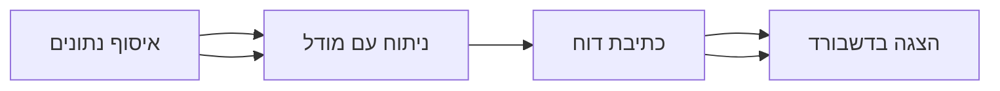

## סיכום

להלן סיכום של נתוני המכירות לרבעון האחרון, שנאסף מתוך כלי ה-MCP ומקורות מידע
באינטרנט. הדוגמה הזו נועדה להדגים תמיכה בתוכן בעברית (RTL) בתוך הדשבורדים.

## מגמות עיקריות

- העלייה בתנועה האורגנית נמשכת גם ברבעון הזה
- מספר הלקוחות החדשים גדל ב-15% לעומת הרבעון הקודם
- זמן התגובה של צוות התמיכה השתפר משמעותית

## הכנסות לפי ערוץ

| ערוץ     | הכנסות   | שינוי |
| -------- | -------- | ----- |
| אורגני   | ₪120,000 | +12%  |
| ישיר     | ₪45,000  | -3%   |
| הפניות   | ₪30,000  | +8%   |

## תרשים זרימה



## קטע קוד

בלוקים של קוד תמיד נשארים משמאל-לימין, גם בתוך טקסט בעברית:

```bash
npm run dev
```

חזרה ל[סקירת המוצר](./overview.md).
