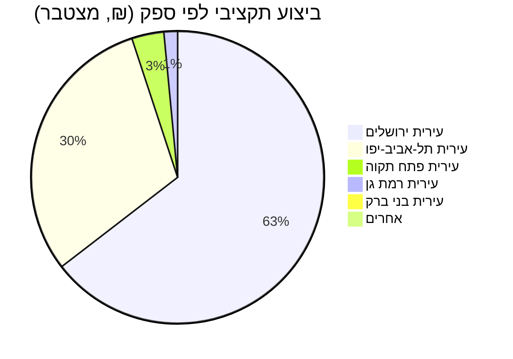

## סיכום

דוח זה סוקר את התקציב והביצוע של שירותי "טיפת חלב" (בריאות המשפחה) בישראל,
המתוקצבים תחת סעיף `24.16.03.62` במשרד הבריאות. הנתונים נשלפו בזמן אמת דרך
כלי ה-MCP של [מפתח התקציב](https://next.obudget.org/) ומכסים את השנים
2016–2026.

## מגמת התקציב לאורך השנים

| שנה  | תקציב מקורי | תקציב מתוקן | ביצוע בפועל |
| ---- | ----------- | ----------- | ------------ |
| 2016 | ₪36.7M      | ₪45.1M      | ₪43.6M       |
| 2017 | ₪37.0M      | ₪45.1M      | ₪43.9M       |
| 2018 | ₪37.7M      | ₪47.7M      | ₪44.3M       |
| 2019 | ₪38.5M      | ₪48.7M      | ₪46.5M       |
| 2020 | —           | ₪50.7M      | ₪48.8M       |
| 2021 | ₪48.2M      | ₪46.8M      | ₪45.4M       |
| 2022 | ₪44.2M      | ₪49.5M      | ₪46.3M       |
| 2023 | ₪47.2M      | ₪53.0M      | ₪50.5M       |
| 2024 | ₪60.2M      | ₪68.8M      | ₪60.3M       |
| 2025 | ₪67.4M      | ₪93.4M      | ₪64.5M       |
| 2026 | ₪70.1M      | ₪70.1M      | טרם בוצע     |

התקציב המתוקן חורג באופן עקבי מהתקציב המקורי כמעט בכל שנה, מגמה שהתחדדה
במיוחד ב-2024–2025 (חריגה של יותר מ-15% ב-2024 ומעל 38% ב-2025), כנראה
כתוצאה מהעלייה בביקוש לשירותי בריאות המשפחה ומהרחבת פעילות התחנות.

## התפלגות ביצוע לפי רשות מקומית / ספק

התרשים הבא מציג את החלוקה בין הרשויות המקומיות והספקים המרכזיים שביצעו את
התקציב תחת סעיף זה (2016–2026):

## עשרת המבצעים הגדולים

| רשות / ספק           | ביצוע מצטבר | מס' התקשרויות |
| --------------------- | ----------- | -------------- |
| עירית ירושלים         | ₪206.1M     | 13             |
| עירית תל-אביב-יפו     | ₪97.1M      | 12             |
| עירית פתח תקוה        | ₪11.3M      | 9              |
| עירית רמת גן          | ₪4.8M       | 12             |
| עירית בני ברק         | ₪3.0M       | 12             |
| שירותי בריאות כללית   | ₪2.2M       | 6              |
| עירית בת-ים           | ₪0.24M      | 2              |
| עיריית נתניה          | ₪0.20M      | 1              |
| עירית ראשון לציון     | ₪0.17M      | 1              |
| עירית רחובות          | ₪0.13M      | 1              |

עיריית ירושלים ועיריית תל-אביב-יפו מפעילות בעצמן חלק ניכר משירותי טיפות
החלב בתחומן (מודל "70:30" בו משרד הבריאות משתתף ב-70% מהעלות), בעוד שברוב
הרשויות האחרות השירות ניתן ישירות על ידי קופות החולים.

## תוכנית התמיכה הייעודית

מעבר להתקשרויות הרכש, קיימת גם תוכנית תמיכה תקציבית ייעודית ("טיפות חלב",
`program_key: 0024160162_טיפותחלב`) של משרד הבריאות הפעילה מאז 2010:

- **סה"כ אושר** (2010–2026): ₪40,851,797
- **סה"כ שולם בפועל**: ₪15,795,477

הפער בין הסכום שאושר לסכום ששולם בפועל עשוי להצביע על תמיכות רב-שנתיות
שטרם מוצו במלואן, או על שינויים בזכאות הרשויות/העמותות המבקשות.

## מקורות

- [סעיף התקציב 24.16.03.62 לשנת 2026](https://next.obudget.org/i/4ffd002f054b)
- [תוכנית התמיכה בטיפות חלב](https://next.obudget.org/i/3e0c6c78d139)
- [התקשרות עירית ירושלים 2023](https://next.obudget.org/i/f93404381692)

חזרה ל[סקירת המוצר](../overview.md).
