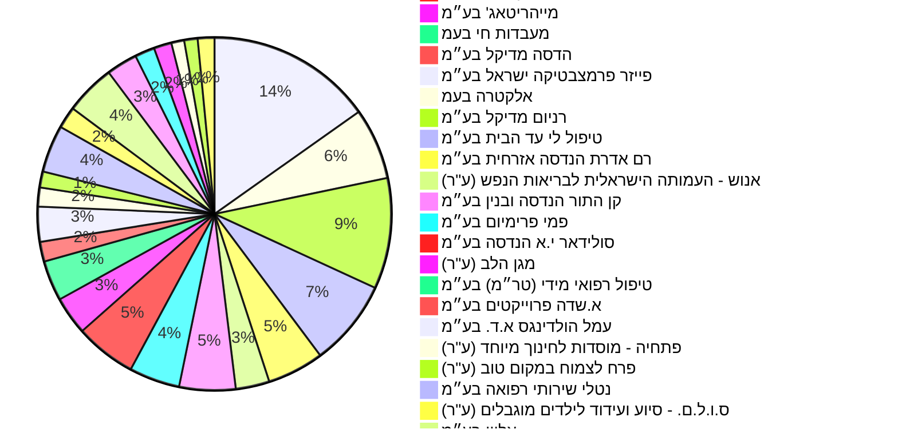

```
---
title: נתוני תקציב, התקשרויות ותמיכות בתחום הבריאות
created: 2026-07-30
updated: 2026-07-30
model: gemini-2.5-flash
path: reports/health
---

# נתוני תקציב, התקשרויות ותמיכות בתחום הבריאות

מסמך זה מציג נתונים מקיפים על תקציב המדינה, התקשרויות ותמיכות בתחום הבריאות, תוך התבססות על המידע הציבורי הנגיש.

**חלון כיסוי:** מכסים את השנים 1997-2026 (נתוני תקציב), ו-2016-2026 (נתוני התקשרויות ותמיכות).

## מגמה תקציבית לאורך זמן

להלן נתוני תקציב הבריאות המאוחדים לפי שנים (באלפי ש"ח), כפי שהוקצו (amount_allocated), תוקנו (amount_revised) ונוצלו (amount_used).

| שנה | תקציב מוקצה (אלפי ש"ח) | תקציב מתוקן (אלפי ש"ח) | תקציב שנוצל (אלפי ש"ח) | מקור |
|---|---|---|---|---|
| 1997 | 10,566,301 | 10,798,623 | 10,589,881 | [קישור](https://next.obudget.org/i/ffe7767306c4) |
| 1998 | 19,761,723 | 19,795,439 | 19,637,999 | [קישור](https://next.obudget.org/i/fff822d91f3d) |
| 1999 | 20,734,863 | 21,216,239 | 21,036,702 | [קישור](https://next.obudget.org/i/ffd9e2424758) |
| 2000 | 22,329,103 | 21,471,443 | 20,981,647 | [קישור](https://next.obudget.org/i/ffdb50127e40) |
| 2001 | 22,462,132 | 22,326,660 | 22,343,582 | [קישור](https://next.obudget.org/i/fff03e3fee99) |
| 2002 | 23,532,933 | 23,916,065 | 23,830,986 | [קישור](https://next.obudget.org/i/ffb4b139c9d2) |
| 2003 | 24,786,357 | 24,542,055 | 23,840,470 | [קישור](https://next.obudget.org/i/ffdecff5126b) |
| 2004 | 24,729,871 | 25,183,870 | 24,936,400 | [קישור](https://next.obudget.org/i/ffef4a034156) |
| 2005 | 25,519,564 | 26,188,002 | 25,763,667 | [קישור](https://next.obudget.org/i/fff3f69a4019) |
| 2006 | 26,443,987 | 27,193,473 | 27,010,771 | [קישור](https://next.obudget.org/i/fff3c879d535) |
| 2007 | 27,994,520 | 27,236,421 | 26,728,564 | [קישור](https://next.obudget.org/i/ff4ae9f0cf2b) |
| 2008 | 27,838,569 | 29,330,487 | 28,956,029 | [קישור](https://next.obudget.org/i/ffca58f3b706) |
| 2009 | 29,302,371 | 30,821,942 | 30,533,860 | [קישור](https://next.obudget.org/i/ff9e3611804e) |
| 2010 | 32,425,496 | 33,608,735 | 33,091,226 | [קישור](https://next.obudget.org/i/ff599e2c922c) |
| 2011 | 34,688,787 | 35,383,824 | 33,283,243 | [קישור](https://next.obudget.org/i/fff18fd40d2c) |
| 2012 | 35,596,695 | 38,069,363 | 37,711,419 | [קישור](https://next.obudget.org/i/fff9fd8befe0) |
| 2013 | 40,415,311 | 42,478,037 | 41,958,729 | [קישור](https://next.obudget.org/i/ffe87a29e140) |
| 2014 | 41,976,917 | 46,729,653 | 46,211,437 | [קישור](https://next.obudget.org/i/ffaa7e134a5b) |
| 2015 | 47,931,525 | 48,953,808 | 48,164,922 | [קישור](https://next.obudget.org/i/ffef00dc294e) |
| 2016 | 49,788,810 | 51,442,839 | 50,967,572 | [קישור](https://next.obudget.org/i/fffdbc7ff4ac) |
| 2017 | 54,578,117 | 55,763,729 | 55,134,727 | [קישור](https://next.obudget.org/i/fff58d08afc7) |
| 2018 | 56,775,920 | 58,713,860 | 57,655,208 | [קישור](https://next.obudget.org/i/ff88251ae101) |
| 2019 | 63,483,758 | 65,267,147 | 64,314,464 | [קישור](https://next.obudget.org/i/fff200bc0a1b) |
| 2020 | *חסר* | 80,156,571 | 77,561,922 | [קישור](https://next.obudget.org/i/ffe18649aa24) |
| 2021 | 83,702,454 | 87,255,098 | 82,485,374 | [קישור](https://next.obudget.org/i/ffa249c92832) |
| 2022 | 72,022,783 | 84,550,024 | 80,023,906 | [קישור](https://next.obudget.org/i/ffbb71579dd7) |
| 2023 | 73,293,067 | 86,774,285 | 83,187,408 | [קישור](https://next.obudget.org/i/ff5704bd028f) |
| 2024 | 82,999,016 | 91,859,082 | 88,022,848 | [קישור](https://next.obudget.org/i/ffc6ea2062bb) |
| 2025 | 88,364,765 | 90,831,372 | 95,518,699 | [קישור](https://next.obudget.org/i/fe382abea73e) |
| 2026 | 94,949,993 | 94,949,993 | *חסר* | [קישור](https://next.obudget.org/i/ffb78a195c27) |

## תכניות פעילות כיום

חלה קפיצה משמעותית בתקציבי הבריאות בשנים האחרונות, במיוחד משנת 2020 ואילך, ככל הנראה בעקבות מגפת הקורונה והשקעות בתשתיות בריאות.
התרשים הבא מציג את התפלגות היקף ההתקשרויות (volume) של משרד הבריאות לפי ספקים עיקריים.



## מקורות תקציב

לא נמצאו נתונים מספיקים ליצירת דיאגרמת סנקי המציגה את הקשר בין מקורות תקציב לפריטי התוכנית באופן מפורט. הנתונים הזמינים מציגים בעיקר את משרד הבריאות כגורם המבצע את ההתקשרות/תמיכה.

## נושאים נוספים

### התקשרויות וחוזים עיקריים (לפי היקף)

| קוד תקציבי | מטרת ההתקשרות | משרד רוכש | היקף (ש"ח) | שולם (ש"ח) | שם ספק | מקור |
|---|---|---|---|---|---|---|
| 24.02.05.82 | פעילות קורונה - בדיקות וחיסונים - קופת חולים כללית | משרד הבריאות | 258,050,645.0 | 258,050,645.0 | שירותי בריאות כללית | [קישור](https://next.obudget.org/i/7d20d507eb7c) |
| 24.16.03.35 | חיסוני שגרה לשנת 2018 | משרד הבריאות | 255,379,352.9 | 227,772,599.53 | נובולוג (פארם אפ 1966) בע״מ | [קישור](https://next.obudget.org/i/92d6a0751314) |
| 24.02.05.89 | חיסון קורונה אסטרה זניקה | משרד הבריאות | 205,920,367.38 | 108,566,809.84 | סלומון לוין ואלשטיין בעמ | [קישור](https://next.obudget.org/i/df253063d6e8) |
| 24.02.05.89 | מסד 505+ 668 627 הסבת התקשרות AIDמעבדה לבדיקות קורונה | משרד הבריאות | 186,543,903.78 | 171,517,791.64 | איי איי די ג'נומיקס בע״מ | [קישור](https://next.obudget.org/i/93d7922a1d6b) |
| 24.07.14.53 | רכש שירותים | משרד הבריאות | 176,840,198.46 | 0.0 | אותי (ע"ר) | [קישור](https://next.obudget.org/i/73a3c789639d) |
| 24.07.14.53 | רכש שירותים | משרד הבריאות | 173,144,224.0 | 0.0 | אותי (ע"ר) | [קישור](https://next.obudget.org/i/a6816cd056e8) |
| 24.02.05.82 | פעילות קורונה - בדיקות וחיסונים - קופת חולים מכבי | משרד הבריאות | 169,423,481.0 | 169,423,481.0 | מכבי שירותי בריאות | [קישור](https://next.obudget.org/i/064825f63cd3) |
| 24.07.14.53 | רכש שירותים | משרד הבריאות | 156,733,958.5 | 0.0 | אלו\"ט - אגודה לאומית לילדים ובוגרים עם אוטיזם (ע''ר) | [קישור](https://next.obudget.org/i/03daa13a46a0) |
| 67.25.03.19 | הקמת מחלקה מתפרצת (קורונה )בתי החולים של קופת חולים | משרד הבריאות | 142,589,090.0 | 0.0 | שירותי בריאות כללית | [קישור](https://next.obudget.org/i/67d998512bc2) |
| 24.02.05.89 | מס\"ד רכש ערכות אנטיגן | משרד הבריאות | 136,398,600.0 | 136,398,600.0 | גוד פארם בע״מ | [קישור](https://next.obudget.org/i/d873c75ed6da) |

### תמיכות תקציביות עיקריות (לפי סכום ששולם)

| שנה | מטרת התמיכה | סכום מאושר (ש"ח) | סכום שולם (ש"ח) | שם מקבל התמיכה | מקור |
|---|---|---|---|---|---|
| 2021 | תמיכה בקופות החולים בגין משבר הקורונה | 2,075,387,479.0 | 1,843,957,501.0 | שירותי בריאות כללית | [קישור](https://next.obudget.org/i/0e1255601e94) |
| 2014 | תמיכה בקופו"ח בגין עמידה ביעדי גירעון 2 | 2,644,000,678.0 | 1,420,100,678.0 | שירותי בריאות כללית | [קישור](https://next.obudget.org/i/22dfee43cb11) |
| 2022 | תמיכה בקופות חולים בגין הסכמי ייצוב | 1,316,300,000.0 | 1,316,300,000.0 | שירותי בריאות כללית | [קישור](https://next.obudget.org/i/9f1ea7278741) |
| 2021 | תמיכה בקופות החולים בגין משבר הקורונה | 1,351,638,297.0 | 1,223,734,575.0 | מכבי שירותי בריאות | [קישור](https://next.obudget.org/i/a6fe177bf1fb) |
| 2020 | תמיכה בקופות חולים בגין הסכמי ייצוב | 2,140,330,000.0 | 1,114,910,000.0 | שירותי בריאות כללית | [קישור](https://next.obudget.org/i/f944d8fb844b) |
| 2021 | תמיכה בקופות חולים בגין הסכמי ייצוב | 1,216,040,000.0 | 1,113,500,000.0 | שירותי בריאות כללית | [קישור](https://next.obudget.org/i/e475e6c73f3c) |
| 2013 | תמיכה בקופו"ח בגין עמידה ביעדי גירעון 2 | 1,016,323,230.0 | 1,010,933,491.0 | שירותי בריאות כללית | [קישור](https://next.obudget.org/i/baeb30d03d6f) |
| 2019 | תמיכה בקופות חולים בגין הסכמי ייצוב | 994,326,000.0 | 994,326,000.0 | מכבי שירותי בריאות | [קישור](https://next.obudget.org/i/540bfabfd069) |
| 2025 | תמיכה בקופות חולים ב | 973,379,000.0 | 923,899,000.0 | שירותי בריאות כללית | [קישור](https://next.obudget.org/i/bec860c4ae78) |
| 2020 | מבחני תמיכה בקופות חולים | 1,358,991,352.0 | 875,542,968.0 | שירותי בריאות כללית | [קישור](https://next.obudget.org/i/d6ac43762628) |

## מקורות

*   [תקציב המדינה - כלל שנות התקציב](https://next.obudget.org/i/ffe7767306c4)
*   [התקשרויות רכש ממשלתיות](https://next.obudget.org/i/73a3c789639d)
*   [תשלומי תמיכות - משרד הבריאות](https://next.obudget.org/i/0e1255601e94)

[חזרה לעמוד הראשי](../../README.md)
```
