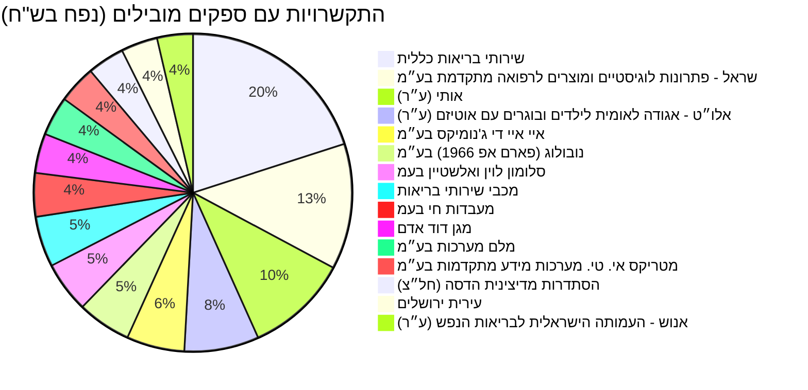

yaml
---
title: נתוני תקציב, התקשרויות והחלטות ממשלה בתחום הבריאות
created: 2026-07-30
updated: 2026-07-30
model: gemini-2.5-flash
path: reports/health
---
```

# נתוני תקציב, התקשרויות והחלטות ממשלה בתחום הבריאות

מסמך זה מציג נתונים מרוכזים וניתוח של תקציבים, התקשרויות והחלטות ממשלה בתחום הבריאות. הנתונים מכסים את השנים 2016-2026.

## מגמה תקציבית לאורך זמן

התקציב המוקצה למשרד הבריאות לשנת 2025 מסתכם ב-59,148,419,000 ש"ח. להלן פירוט הרמות העיקריות בתקציב זה:

| קוד | כותרת | סכום שהוקצה (ש"ח) |
|---|---|---|
| 24 | משרד הבריאות | 59,148,419,000 |
| 24.20 | קופות חולים ובתי חולים | 48,591,091,000 |
| 24.07 | רכש שירותי בריאות | 6,829,669,000 |
| 24.16 | שירותי בריאות הציבור | 1,747,255,000 |
| 24.02 | משרד ראשי | 1,621,393,000 |
| 24.50 | מרכזים רפואיים | 323,597,000 |

## תכניות פעילות כיום

### התקשרויות עם ספקים מובילים (לפי נפח)

להלן התפלגות 15 הספקים המובילים מבחינת נפח ההתקשרויות עם משרד הבריאות:



### 50 ההתקשרויות המובילות לפי נפח

| מטרה | משרד רוכש | שם ספק | נפח (ש"ח) | בוצע (ש"ח) | שנת התחלה | שנת סיום | קישור לפריט |
|---|---|---|---|---|---|---|---|
| פעילות קורונה - בדיקות וחיסונים - קופת חולים כללית | משרד הבריאות | שירותי בריאות כללית | 258,050,645.0 | 258,050,645.0 | 2022 | 2022 | [קישור](https://next.obudget.org/i/7d20d507eb7c) |
| חיסוני שגרה לשנת 2018 | משרד הבריאות | נובולוג (פארם אפ 1966) בע״מ | 255,379,352.9 | 227,772,599.53 | 2017 | 2017 | [קישור](https://next.obudget.org/i/92d6a0751314) |
| חיסון קורונה אסטרה זניקה | משרד הבריאות | סלומון לוין ואלשטיין בעמ | 205,920,367.38 | 108,566,809.84 | 2021 | 2021 | [קישור](https://next.obudget.org/i/df253063d6e8) |
| מסד 505+ 668 627 הסבת התקשרות AIDמעבדה לבדיקות קורונה | משרד הבריאות | איי איי די ג'נומיקס בע״מ | 186,543,903.78 | 171,517,791.64 | 2021 | 2021 | [קישור](https://next.obudget.org/i/93d7922a1d6b) |
| רכש שירותים | משרד הבריאות | אותי (ע״ר) | 176,840,198.46 | 0.0 | 2023 | 2024 | [קישור](https://next.obudget.org/i/73a3c789639d) |
| רכש שירותים | משרד הבריאות | אותי (ע״ר) | 173,144,224.0 | 0.0 | 2019 | 2019 | [קישור](https://next.obudget.org/i/a6816cd056e8) |
| פעילות קורונה - בדיקות וחיסונים - קופת חולים מכבי | משרד הבריאות | מכבי שירותי בריאות | 169,423,481.0 | 169,423,481.0 | 2022 | 2022 | [קישור](https://next.obudget.org/i/064825f63cd3) |
| רכש שירותים | משרד הבריאות | אלו״ט - אגודה לאומית לילדים ובוגרים עם אוטיזם (ע״ר) | 156,733,958.5 | 0.0 | 2024 | 2024 | [קישור](https://next.obudget.org/i/03daa13a46a0) |
| הקמת מחלקה מתפרצת (קורונה )בתי החולים של קופת חולים | משרד הבריאות | שירותי בריאות כללית | 142,589,090.0 | 0.0 | 2020 | 2021 | [קישור](https://next.obudget.org/i/67d998512bc2) |
| מס"ד רכש ערכות אנטיגן | משרד הבריאות | גוד פארם בע״מ | 136,398,600.0 | 136,398,600.0 | 2022 | 2022 | [קישור](https://next.obudget.org/i/d873c75ed6da) |
| רכש שירותים | משרד הבריאות | אותי (ע״ר) | 128,011,905.0 | 118,326,368.88 | 2018 | 2018 | [קישור](https://next.obudget.org/i/fba4e803cc7e) |
| רכש שירותים | משרד הבריאות | אלו״ט - אגודה לאומית לילדים ובוגרים עם אוטיזם (ע״ר) | 126,400,449.0 | 125,033,275.32 | 2020 | 2020 | [קישור](https://next.obudget.org/i/1d555d4a3ae3) |
| מסד 505 + 668 627 MH הסבת התקשרות מעבדה פרטית בדיקות קורונה | משרד הבריאות | מייהריטאג' בע״מ | 111,597,740.0 | 102,956,102.45 | 2021 | 2021 | [קישור](https://next.obudget.org/i/adaf15fdac62) |
| חיסוני שגרה 2023 | משרד הבריאות | שראל - פתרונות לוגיסטיים ומוצרים לרפואה מתקדמת בע״מ | 106,232,263.61 | 0.0 | 2022 | 2022 | [קישור](https://next.obudget.org/i/601ecf296db7) |
| חיסוני שגרה | משרד הבריאות | נובולוג (פארם אפ 1966) בע״מ | 105,095,440.88 | 97,355,466.74 | 2016 | 2016 | [קישור](https://next.obudget.org/i/e28506aee43b) |
| חיסוני שגרה | משרד הבריאות | שראל - פתרונות לוגיסטיים ומוצרים לרפואה מתקדמת בע״מ | 104,722,279.62 | 95,955,190.86 | 2016 | 2016 | [קישור](https://next.obudget.org/i/10dbe26ab337) |
| בשל התפרצות נגיף הקורונה | משרד הבריאות | מעבדות חי בעמ | 103,199,481.56 | 99,370,926.45 | 2020 | 2021 | [קישור](https://next.obudget.org/i/2188d1a5fe7e) |
| רכש שירותים | משרד הבריאות | אותי (ע״ר) | 101,951,044.0 | 85,997,127.66 | 2021 | 2021 | [קישור](https://next.obudget.org/i/e78324fbdf5a) |
| חיסוני שגרה | משרד הבריאות | שראל - פתרונות לוגיסטיים ומוצרים לרפואה מתקדמת בע״מ | 101,544,874.94 | 100,361,495.16 | 2017 | 2017 | [קישור](https://next.obudget.org/i/0bfc9ccb8e12) |
| ריאגנטים לקורונה | משרד הבריאות | מעבדות חי בעמ | 99,585,029.95 | 94,937,077.63 | 2021 | 2021 | [קישור](https://next.obudget.org/i/e4e67109d760) |
| מסד מ 38 רכש אנטיגן בדיקות מהירות קורונה מכרז 1/2022 | משרד הבריאות | הדסה מדיקל בע״מ | 98,982,000.0 | 98,982,000.0 | 2022 | 2022 | [קישור](https://next.obudget.org/i/9d56c83b9885) |
| חיסוני שגרה לשנת 2018 | משרד הבריאות | פייזר פרמצבטיקה ישראל בע״מ | 97,120,397.79 | 87,354,552.87 | 2017 | 2017 | [קישור](https://next.obudget.org/i/a490ced74dbc) |
| הגדלת מלאי ברזל | משרד הבריאות | מעבדות חי בעמ | 96,578,979.01 | 93,926,278.63 | 2020 | 2020 | [קישור](https://next.obudget.org/i/85bafba0b0c0) |
| מסד 701+ 707 מ 51 מכרז מעבדות פרטיות איי איי די | משרד הבריאות | איי איי די ג'נומיקס בע״מ | 95,843,074.86 | 88,909,122.17 | 2021 | 2022 | [קישור](https://next.obudget.org/i/bdf3300c069d) |
| מסד 505+627 הסבת התקשרות מעבדה פרטית לבדיקות קורונה אלקטרה | משרד הבריאות | אלקטרה בעמ | 95,340,721.32 | 89,276,733.81 | 2021 | 2021 | [קישור](https://next.obudget.org/i/9484388958c4) |
| תשלום גנים ומעונות לאוטיסטים | משרד הבריאות | אותי (ע״ר) | 94,962,245.0 | 93,915,693.0 | 2016 | 2016 | [קישור](https://next.obudget.org/i/3832ceb368b6) |
| מסד מ 38 רכש אנטיגן בדיקות מהירות קורונה מכרז 1/2022 | משרד הבריאות | גוד פארם בע״מ | 93,147,964.65 | 93,133,397.6 | 2022 | 2022 | [קישור](https://next.obudget.org/i/8fa0480d1820) |
| שב"כ - מיגון - חרבות ברזל | משרד הבריאות | שירותי בריאות כללית | 92,314,339.0 | 0.0 | 2023 | 2024 | [קישור](https://next.obudget.org/i/8ae1386ece35) |
| פעילות קורונה - בדיקות וחיסונים - קופת חולים כללית | משרד הבריאות | שירותי בריאות כללית | 92,132,940.0 | 92,132,940.0 | 2022 | 2022 | [קישור](https://next.obudget.org/i/0b89ad513800) |
| רכש שירותים | משרד הבריאות | אלו״ט - אגודה לאומית לילדים ובוגרים עם אוטיזם (ע״ר) | 91,506,656.0 | 0.0 | 2019 | 2019 | [קישור](https://next.obudget.org/i/e09a3d2a1e89) |
| הקמת בית חולים לילדים וולפסון | משרד הבריאות | רם אדרת הנדסה אזרחית בע״מ | 91,075,652.46 | 96,541,309.87 | 2016 | 2021 | [קישור](https://next.obudget.org/i/4b130a5e24d8) |
| אנוש | משרד הבריאות | אנוש - העמותה הישראלית לבריאות הנפש (ע״ר) | 89,586,744.0 | 62,143,420.62 | 2018 | 2018 | [קישור](https://next.obudget.org/i/ca4674e33d85) |
| גן מעון אוטיסטים | משרד הבריאות | אלו״ט - אגודה לאומית לילדים ובוגרים עם אוטיזם (ע״ר) | 86,030,000.0 | 82,433,853.03 | 2018 | 2018 | [קישור](https://next.obudget.org/i/d8785e7d7518) |
| רכש שירותים | משרד הבריאות | טיפול לי עד הבית בע״מ | 85,242,692.87 | 0.0 | 2024 | 2024 | [קישור](https://next.obudget.org/i/a7897cacb7cc) |
| רכש שירותים | משרד הבריאות | אותי (ע״ר) | 81,427,233.0 | 79,846,966.89 | 2020 | 2020 | [קישור](https://next.obudget.org/i/73c54b37caab) |
| מסד 717 מכרז מעבדות פרטיות MH | משרד הבריאות | מייהריטאג' בע״מ | 80,842,989.24 | 80,608,458.06 | 2021 | 2022 | [קישור](https://next.obudget.org/i/3dacc2aa45c1) |
| מס"ד רכש ערכות אנטיגן | משרד הבריאות | רניום מדיקל בע״מ | 80,671,500.0 | 80,671,500.01 | 2022 | 2022 | [קישור](https://next.obudget.org/i/247aa5e1d75f) |
| חיסון פרבנר | משרד הבריאות | פייזר פרמצבטיקה ישראל בע״מ | 78,903,501.3 | 73,130,242.77 | 2016 | 2016 | [קישור](https://next.obudget.org/i/dc3770e6ef4b) |
| חיסון קורונה אסטרה זניקה | משרד הבריאות | סלומון לוין ואלשטיין בעמ | 78,340,995.72 | 55,353,685.73 | 2021 | 2021 | [קישור](https://next.obudget.org/i/87a17d79de4a) |
| מסד 701+ 707 מ 51 מכרז מעבדות פרטיות איילקס | משרד הבריאות | אילקס מדיקל בע״מ | 78,336,151.92 | 78,335,934.3 | 2021 | 2022 | [קישור](https://next.obudget.org/i/f27d85103d16) |
| אנוש | משרד הבריאות | אנוש - העמותה הישראלית לבריאות הנפש (ע״ר) | 76,861,375.67 | 67,263,816.54 | 2016 | 2016 | [קישור](https://next.obudget.org/i/127f7d6f474b) |
| אנוש | משרד הבריאות | אנוש - העמותה הישראלית לבריאות הנפש (ע״ר) | 76,065,930.0 | 70,077,604.23 | 2017 | 2017 | [קישור](https://next.obudget.org/i/8c29682943ef) |
| פעילות קורונה - בדיקות וחיסונים - קופת חולים כללית | משרד הבריאות | שירותי בריאות כללית | 75,563,500.0 | 0.0 | 2023 | 2023 | [קישור](https://next.obudget.org/i/e7bcf68c10e5) |
| שיפוי בתי חולים בגין ציוד מיגון | משרד הבריאות | שירותי בריאות כללית | 74,662,960.0 | 68,603,233.0 | 2020 | 2020 | [קישור](https://next.obudget.org/i/cf8a98bdd187) |
| שיפוי בתי חולים בגין ציוד מיגון | משרד הבריאות | שירותי בריאות כללית | 74,662,960.0 | 68,603,233.0 | 2020 | 2020 | [קישור](https://next.obudget.org/i/f0dd71be38db) |
| חיסוני שיגרה 2021 | משרד הבריאות | נובולוג (פארם אפ 1966) בע״מ | 74,017,843.38 | 66,000,048.57 | 2020 | 2021 | [קישור](https://next.obudget.org/i/13c4e482277e) |
| הקמת מתחם הנוער אברבנאל | משרד הבריאות | קן התור הנדסה ובנין בע״מ | 72,999,599.4 | 74,452,197.83 | 2018 | 2021 | [קישור](https://next.obudget.org/i/e440e1e767d1) |
| מסד מ בדיקות מעבדה קורונה פניה פרטנית 2 מכרז 98/2022 | משרד הבריאות | איי איי די ג'נומיקס בע״מ | 72,767,097.0 | 65,401,990.57 | 2022 | 2022 | [קישור](https://next.obudget.org/i/fb5c2a9f99a0) |
| רכש ערכות בדיקה מהירה אנטיגן לאבחון קורונה | משרד הבריאות | גוד פארם בע״מ | 70,785,000.0 | 68,537,131.65 | 2021 | 2021 | [קישור](https://next.obudget.org/i/416e22cea474) |
| רכש שירותים | משרד הבריאות | טיפול לי עד הבית בע״מ | 69,806,569.91 | 68,588,321.37 | 2023 | 2023 | [קישור](https://next.obudget.org/i/e18e7c73c217) |

## מקורות תקציב

להלן פירוט היררכי של הקצאות התקציב העיקריות מתוך תקציב משרד הבריאות לשנת 2025:

```mermaid
graph TD
    A[משרד הבריאות (קוד 24): 59.1 מיליארד ש"ח] --> B[קופות חולים ובתי חולים (24.20): 48.5 מיליארד ש"ח]
    A --> C[רכש שירותי בריאות (24.07): 6.8 מיליארד ש"ח]
    A --> D[שירותי בריאות הציבור (24.16): 1.7 מיליארד ש"ח]
    A --> E[משרד ראשי (24.02): 1.6 מיליארד ש"ח]
    A --> F[מרכזים רפואיים (24.50): 0.3 מיליארד ש"ח]
```

## נושאים נוספים

### התקשרויות עם ספקים

| מטרה | משרד רוכש | שם ספק | נפח (ש"ח) | בוצע (ש"ח) | שנת התחלה | שנת סיום | קישור לפריט |
|---|---|---|---|---|---|---|---|
| פעילות קורונה - בדיקות וחיסונים - קופת חולים כללית | משרד הבריאות | שירותי בריאות כללית | 258,050,645.0 | 258,050,645.0 | 2022 | 2022 | [קישור](https://next.obudget.org/i/7d20d507eb7c) |
| חיסוני שגרה לשנת 2018 | משרד הבריאות | נובולוג (פארם אפ 1966) בע״מ | 255,379,352.9 | 227,772,599.53 | 2017 | 2017 | [קישור](https://next.obudget.org/i/92d6a0751314) |
| חיסון קורונה אסטרה זניקה | משרד הבריאות | סלומון לוין ואלשטיין בעמ | 205,920,367.38 | 108,566,809.84 | 2021 | 2021 | [קישור](https://next.obudget.org/i/df253063d6e8) |
| מסד 505+ 668 627 הסבת התקשרות AIDמעבדה לבדיקות קורונה | משרד הבריאות | איי איי די ג'נומיקס בע״מ | 186,543,903.78 | 171,517,791.64 | 2021 | 2021 | [קישור](https://next.obudget.org/i/93d7922a1d6b) |
| רכש שירותים | משרד הבריאות | אותי (ע״ר) | 176,840,198.46 | 0.0 | 2023 | 2024 | [קישור](https://next.obudget.org/i/73a3c789639d) |
| רכש שירותים | משרד הבריאות | אותי (ע״ר) | 173,144,224.0 | 0.0 | 2019 | 2019 | [קישור](https://next.obudget.org/i/a6816cd056e8) |
| פעילות קורונה - בדיקות וחיסונים - קופת חולים מכבי | משרד הבריאות | מכבי שירותי בריאות | 169,423,481.0 | 169,423,481.0 | 2022 | 2022 | [קישור](https://next.obudget.org/i/064825f63cd3) |
| רכש שירותים | משרד הבריאות | אלו״ט - אגודה לאומית לילדים ובוגרים עם אוטיזם (ע״ר) | 156,733,958.5 | 0.0 | 2024 | 2024 | [קישור](https://next.obudget.org/i/03daa13a46a0) |
| הקמת מחלקה מתפרצת (קורונה )בתי החולים של קופת חולים | משרד הבריאות | שירותי בריאות כללית | 142,589,090.0 | 0.0 | 2020 | 2021 | [קישור](https://next.obudget.org/i/67d998512bc2) |
| מס"ד רכש ערכות אנטיגן | משרד הבריאות | גוד פארם בע״מ | 136,398,600.0 | 136,398,600.0 | 2022 | 2022 | [קישור](https://next.obudget.org/i/d873c75ed6da) |
| רכש שירותים | משרד הבריאות | אותי (ע״ר) | 128,011,905.0 | 118,326,368.88 | 2018 | 2018 | [קישור](https://next.obudget.org/i/fba4e803cc7e) |
| רכש שירותים | משרד הבריאות | אלו״ט - אגודה לאומית לילדים ובוגרים עם אוטיזם (ע״ר) | 126,400,449.0 | 125,033,275.32 | 2020 | 2020 | [קישור](https://next.obudget.org/i/1d555d4a3ae3) |
| מסד 505 + 668 627 MH הסבת התקשרות מעבדה פרטית בדיקות קורונה | משרד הבריאות | מייהריטאג' בע״מ | 111,597,740.0 | 102,956,102.45 | 2021 | 2021 | [קישור](https://next.obudget.org/i/adaf15fdac62) |
| חיסוני שגרה 2023 | משרד הבריאות | שראל - פתרונות לוגיסטיים ומוצרים לרפואה מתקדמת בע״מ | 106,232,263.61 | 0.0 | 2022 | 2022 | [קישור](https://next.obudget.org/i/601ecf296db7) |
| חיסוני שגרה | משרד הבריאות | נובולוג (פארם אפ 1966) בע״מ | 105,095,440.88 | 97,355,466.74 | 2016 | 2016 | [קישור](https://next.obudget.org/i/e28506aee43b) |
| חיסוני שגרה | משרד הבריאות | שראל - פתרונות לוגיסטיים ומוצרים לרפואה מתקדמת בע״מ | 104,722,279.62 | 95,955,190.86 | 2016 | 2016 | [קישור](https://next.obudget.org/i/10dbe26ab337) |
| בשל התפרצות נגיף הקורונה | משרד הבריאות | מעבדות חי בעמ | 103,199,481.56 | 99,370,926.45 | 2020 | 2021 | [קישור](https://next.obudget.org/i/2188d1a5fe7e) |
| רכש שירותים | משרד הבריאות | אותי (ע״ר) | 101,951,044.0 | 85,997,127.66 | 2021 | 2021 | [קישור](https://next.obudget.org/i/e78324fbdf5a) |
| חיסוני שגרה | משרד הבריאות | שראל - פתרונות לוגיסטיים ומוצרים לרפואה מתקדמת בע״מ | 101,544,874.94 | 100,361,495.16 | 2017 | 2017 | [קישור](https://next.obudget.org/i/0bfc9ccb8e12) |
| ריאגנטים לקורונה | משרד הבריאות | מעבדות חי בעמ | 99,585,029.95 | 94,937,077.63 | 2021 | 2021 | [קישור](https://next.obudget.org/i/e4e67109d760) |
| מסד מ 38 רכש אנטיגן בדיקות מהירות קורונה מכרז 1/2022 | משרד הבריאות | הדסה מדיקל בע״מ | 98,982,000.0 | 98,982,000.0 | 2022 | 2022 | [קישור](https://next.obudget.org/i/9d56c83b9885) |
| חיסוני שגרה לשנת 2018 | משרד הבריאות | פייזר פרמצבטיקה ישראל בע״מ | 97,120,397.79 | 87,354,552.87 | 2017 | 2017 | [קישור](https://next.obudget.org/i/a490ced74dbc) |
| הגדלת מלאי ברזל | משרד הבריאות | מעבדות חי בעמ | 96,578,979.01 | 93,926,278.63 | 2020 | 2020 | [קישור](https://next.obudget.org/i/85bafba0b0c0) |
| מסד 701+ 707 מ 51 מכרז מעבדות פרטיות איי איי די | משרד הבריאות | איי איי די ג'נומיקס בע״מ | 95,843,074.86 | 88,909,122.17 | 2021 | 2022 | [קישור](https://next.obudget.org/i/bdf3300c069d) |
| מסד 505+627 הסבת התקשרות מעבדה פרטית לבדיקות קורונה אלקטרה | משרד הבריאות | אלקטרה בעמ | 95,340,721.32 | 89,276,733.81 | 2021 | 2021 | [קישור](https://next.obudget.org/i/9484388958c4) |
| תשלום גנים ומעונות לאוטיסטים | משרד הבריאות | אותי (ע״ר) | 94,962,245.0 | 93,915,693.0 | 2016 | 2016 | [קישור](https://next.obudget.org/i/3832ceb368b6) |
| מסד מ 38 רכש אנטיגן בדיקות מהירות קורונה מכרז 1/2022 | משרד הבריאות | גוד פארם בע״מ | 93,147,964.65 | 93,133,397.6 | 2022 | 2022 | [קישור](https://next.obudget.org/i/8fa0480d1820) |
| שב"כ - מיגון - חרבות ברזל | משרד הבריאות | שירותי בריאות כללית | 92,314,339.0 | 0.0 | 2023 | 2024 | [קישור](https://next.obudget.org/i/8ae1386ece35) |
| פעילות קורונה - בדיקות וחיסונים - קופת חולים כללית | משרד הבריאות | שירותי בריאות כללית | 92,132,940.0 | 92,132,940.0 | 2022 | 2022 | [קישור](https://next.obudget.org/i/0b89ad513800) |
| רכש שירותים | משרד הבריאות | אלו״ט - אגודה לאומית לילדים ובוגרים עם אוטיזם (ע״ר) | 91,506,656.0 | 0.0 | 2019 | 2019 | [קישור](https://next.obudget.org/i/e09a3d2a1e89) |
| הקמת בית חולים לילדים וולפסון | משרד הבריאות | רם אדרת הנדסה אזרחית בע״מ | 91,075,652.46 | 96,541,309.87 | 2016 | 2021 | [קישור](https://next.obudget.org/i/4b130a5e24d8) |
| אנוש | משרד הבריאות | אנוש - העמותה הישראלית לבריאות הנפש (ע״ר) | 89,586,744.0 | 62,143,420.62 | 2018 | 2018 | [קישור](https://next.obudget.org/i/ca4674e33d85) |
| גן מעון אוטיסטים | משרד הבריאות | אלו״ט - אגודה לאומית לילדים ובוגרים עם אוטיזם (ע״ר) | 86,030,000.0 | 82,433,853.03 | 2018 | 2018 | [קישור](https://next.obudget.org/i/d8785e7d7518) |
| רכש שירותים | משרד הבריאות | טיפול לי עד הבית בע״מ | 85,242,692.87 | 0.0 | 2024 | 2024 | [קישור](https://next.obudget.org/i/a7897cacb7cc) |
| רכש שירותים | משרד הבריאות | אותי (ע״ר) | 81,427,233.0 | 79,846,966.89 | 2020 | 2020 | [קישור](https://next.obudget.org/i/73c54b37caab) |
| מסד 717 מכרז מעבדות פרטיות MH | משרד הבריאות | מייהריטאג' בע״מ | 80,842,989.24 | 80,608,458.06 | 2021 | 2022 | [קישור](https://next.obudget.org/i/3dacc2aa45c1) |
| מס"ד רכש ערכות אנטיגן | משרד הבריאות | רניום מדיקל בע״מ | 80,671,500.0 | 80,671,500.01 | 2022 | 2022 | [קישור](https://next.obudget.org/i/247aa5e1d75f) |
| חיסון פרבנר | משרד הבריאות | פייזר פרמצבטיקה ישראל בע״מ | 78,903,501.3 | 73,130,242.77 | 2016 | 2016 | [קישור](https://next.obudget.org/i/dc3770e6ef4b) |
| חיסון קורונה אסטרה זניקה | משרד הבריאות | סלומון לוין ואלשטיין בעמ | 78,340,995.72 | 55,353,685.73 | 2021 | 2021 | [קישור](https://next.obudget.org/i/87a17d79de4a) |
| מסד 701+ 707 מ 51 מכרז מעבדות פרטיות איילקס | משרד הבריאות | אילקס מדיקל בע״מ | 78,336,151.92 | 78,335,934.3 | 2021 | 2022 | [קישור](https://next.obudget.org/i/f27d85103d16) |
| אנוש | משרד הבריאות | אנוש - העמותה הישראלית לבריאות הנפש (ע״ר) | 76,861,375.67 | 67,263,816.54 | 2016 | 2016 | [קישור](https://next.obudget.org/i/127f7d6f474b) |
| אנוש | משרד הבריאות | אנוש - העמותה הישראלית לבריאות הנפש (ע״ר) | 76,065,930.0 | 70,077,604.23 | 2017 | 2017 | [קישור](https://next.obudget.org/i/8c29682943ef) |
| פעילות קורונה - בדיקות וחיסונים - קופת חולים כללית | משרד הבריאות | שירותי בריאות כללית | 75,563,500.0 | 0.0 | 2023 | 2023 | [קישור](https://next.obudget.org/i/e7bcf68c10e5) |
| שיפוי בתי חולים בגין ציוד מיגון | משרד הבריאות | שירותי בריאות כללית | 74,662,960.0 | 68,603,233.0 | 2020 | 2020 | [קישור](https://next.obudget.org/i/cf8a98bdd187) |
| שיפוי בתי חולים בגין ציוד מיגון | משרד הבריאות | שירותי בריאות כללית | 74,662,960.0 | 68,603,233.0 | 2020 | 2020 | [קישור](https://next.obudget.org/i/f0dd71be38db) |
| חיסוני שיגרה 2021 | משרד הבריאות | נובולוג (פארם אפ 1966) בע״מ | 74,017,843.38 | 66,000,048.57 | 2020 | 2021 | [קישור](https://next.obudget.org/i/13c4e482277e) |
| הקמת מתחם הנוער אברבנאל | משרד הבריאות | קן התור הנדסה ובנין בע״מ | 72,999,599.4 | 74,452,197.83 | 2018 | 2021 | [קישור](https://next.obudget.org/i/e440e1e767d1) |
| מסד מ בדיקות מעבדה קורונה פניה פרטנית 2 מכרז 98/2022 | משרד הבריאות | איי איי די ג'נומיקס בע״מ | 72,767,097.0 | 65,401,990.57 | 2022 | 2022 | [קישור](https://next.obudget.org/i/fb5c2a9f99a0) |
| רכש ערכות בדיקה מהירה אנטיגן לאבחון קורונה | משרד הבריאות | גוד פארם בע״מ | 70,785,000.0 | 68,537,131.65 | 2021 | 2021 | [קישור](https://next.obudget.org/i/416e22cea474) |
| רכש שירותים | משרד הבריאות | טיפול לי עד הבית בע״מ | 69,806,569.91 | 68,588,321.37 | 2023 | 2023 | [קישור](https://next.obudget.org/i/e18e7c73c217) |

### ספקים מובילים

| שם ספק | סך נפח (ש"ח) |
|---|---|
| שירותי בריאות כללית | 1,709,192,640.8 |
| שראל - פתרונות לוגיסטיים ומוצרים לרפואה מתקדמת בע״מ | 1,092,475,823.33 |
| אותי (ע״ר) | 893,112,482.5 |
| אלו״ט - אגודה לאומית לילדים ובוגרים עם אוטיזם (ע״ר) | 647,467,705.7 |
| איי איי די ג'נומיקס בע״מ | 502,527,942.65 |
| נובולוג (פארם אפ 1966) בע״מ | 467,115,139.18 |
| סלומון לוין ואלשטיין בעמ | 441,972,968.9 |
| מכבי שירותי בריאות | 439,743,069.06 |
| מעבדות חי בעמ | 378,524,943.36 |
| מגן דוד אדם | 343,570,087.97 |
| מלם מערכות בע״מ | 340,972,459.47 |
| מטריקס אי. טי. מערכות מידע מתקדמות בע״מ | 329,026,326.51 |
| הסתדרות מדיצינית הדסה (חל״צ) | 321,352,259.52 |
| עירית ירושלים | 317,399,476.4 |
| אנוש - העמותה הישראלית לבריאות הנפש (ע״ר) | 310,767,986.17 |
| גוד פארם בע״מ | 300,358,161.65 |
| קופת חולים מאוחדת מרכזית עממי | 295,406,935.4 |
| פמי פרימיום בע״מ | 288,962,787.85 |
| מייהריטאג' בע״מ | 253,585,152.71 |
| תאגיד הבריאות ליד המרכז הרפואי תל-אביב (ע״ר) | 244,517,083.27 |
| קרן מחקרים ושירותי בריאות - שיבא (ע״ר) | 243,918,375.38 |
| פייזר פרמצבטיקה ישראל בע״מ | 236,897,366.41 |
| אס. קיו. לינק בע״מ | 230,086,121.32 |
| קן התור הנדסה ובנין בע״מ | 227,200,482.99 |
| רם אדרת הנדסה אזרחית בע״מ | 224,204,862.23 |
| קידום פרוייקטים שיקומיים ב.ה. בע״מ | 221,638,487.05 |
| אומגה המכון להוראה מודרנית בע״מ | 221,350,793.07 |
| אלקטרה בעמ | 219,755,382.67 |
| טיפול רפואי מידי (טר״מ) בע״מ | 216,250,207.68 |
| אגודה לבריאות הציבור (ע״ר) | 213,037,858.92 |
| נס א.ט. בע״מ | 206,946,759.0 |
| אילקס מדיקל בע״מ | 198,404,858.07 |
| דיבימושיין בע״מ | 183,910,097.51 |
| גוינט ישראל (חל״צ) | 181,711,488.57 |
| טיפול לי עד הבית בע״מ | 181,166,899.33 |
| קרן מחקרים רפואיים, פיתוח תשתית ושרותי בריאות - ליד המרכז הרפואי בני ציון (ע״ר) | 174,885,004.5 |
| עמל הולדינגס א.ד. בע״מ | 174,569,985.44 |
| קבוצת שכולו טוב (ע״ר) | 160,926,242.82 |
| שתית בע״מ | 154,486,412.73 |
| מרכז רפואי שערי צדק (ע״ר) | 152,441,817.76 |
| משרד רוה"מ/לשכת הפרסום הממשלתית | 140,079,177.15 |
| קופת חולים לעובדים לאומיים | 137,737,949.5 |
| מגן הלב (ע״ר) | 133,931,618.75 |
| טלדור יועצים בע״מ | 132,328,824.0 |
| ס.ו.ל.ם. - סיוע ועידוד לילדים מוגבלים (ע״ר) | 128,878,624.72 |
| וואן ליין בע״מ | 126,287,633.28 |
| מטריקס די אנד איי בע״מ | 126,085,658.71 |
| רניום ציוד למעבדות מחקר בע״מ | 120,111,662.47 |
| מעוף משאבי אנוש (מקבוצת מעוף) בע״מ | 116,904,003.56 |
| עירית תל-אביב-יפו | 115,877,246.93 |

### החלטות ממשלה

| title | government | decision_number | publication_date | item_url |
|---|---|---|---|---|
| כניסה לישראל מטעמי איחוד משפחות לבני קהילות גונדר ואדיס אבבה | הממשלה ה- 34, בנימין נתניהו | 1911 | 2016-08-11 | [קישור](https://next.obudget.org/i/25936fe2ae7e) |
| קציבת כהונה בתפקידי ניהול רפואיים בכירים ומנהלי מחלקות במערכת הבריאות הממשלתית | None | 2096 | 2014-10-10 | [קישור](https://next.obudget.org/i/f93a748ff576) |
| מימון השתתפות ישראל בתכנית המסגרת השמינית של האיחוד האירופי | None | 2074 | 2014-10-07 | [קישור](https://next.obudget.org/i/89ce136b33be) |
| הצעת תקציב המדינה לשנת 2015 | None | 2085 | 2014-10-07 | [קישור](https://next.obudget.org/i/011b1fa967ea) |
| מדיניות ממשלתית לקידום שילובם המיטבי של יוצאי אתיופיה בחברה הישראלית תכניות משרד החינוך, משרד הרווחה והשירותים החברתיים ומשרד הבריאות | הממשלה ה- 34, בנימין נתניהו | 666 | 2015-11-08 | [קישור](https://next.obudget.org/i/e1365f4ac381) |
| קידום הייבוא המקביל של מוצרי מזון | None | 1169 | 2014-01-12 | [קישור](https://next.obudget.org/i/4623c2e53e70) |
| מדיניות ממשלתית לקידום שילובם המיטבי של יוצאי אתיופיה בחברה הישראלית - תכניות משרד החינוך, משרד הרווחה והשירותים החברתיים ומשרד הבריאות וצוות יישום ומעקב אחרי התכנית | None | 609 | 2015-10-29 | [קישור](https://next.obudget.org/i/aacbd0bd1f1a) |
| הצעת חוק קביעת מועד לתחילת הוראת סימון מזון ארוז מראש ומכלי משקה, התשע"ד-2013 של חה"כ איילת שקד ואחרים (פ/1986) | None | 1323 | 2014-02-12 | [קישור](https://next.obudget.org/i/10c63e05d586) |
| צירוף חבר הכנסת יעקב ליצמן לממשלה ומינוי לשר הבריאות | None | 503 | 2015-08-31 | [קישור](https://next.obudget.org/i/147c6b413677) |
| הצעת חוק לפיקוח על איכות המזון ולתזונה נכונה בצהרונים, התשע"ו-2016 של חה"כ רחל עזריה ואחרים (פ/2914) | הממשלה ה- 34, בנימין נתניהו | 1535 | 2016-06-16 | [קישור](https://next.obudget.org/i/66aa0e8c0b8f) |
| הקמת צוות בינמשרדי לצמצום בעיית המפחמות | None | 534 | 2015-09-10 | [קישור](https://next.obudget.org/i/95dc90905097) |
| הטלת היטלים מתיירות רפואית וממוסדות רפואיים פרטיים ועדכון סל שירותי הבריאות | None | 2066 | 2014-10-07 | [קישור](https://next.obudget.org/i/095f97581c0c) |
| בית הספר לרפואה בצפת - הקמת מתחם הקבע | הממשלה ה- 34, בנימין נתניהו | 1531 | 2016-06-13 | [קישור](https://next.obudget.org/i/f2d0d3743d93) |
| הצעת חוק ביטוח בריאות ממלכתי (תיקון - בחירה מבין נותני שירותים), התשע"ג-2013 של חה"כ אמנון כהן (פ/1158) | None | 1178 | 2014-01-15 | [קישור](https://next.obudget.org/i/dbc3a4078e78) |
| החלת דין רציפות על הצעת חוק טיפול בחולי נפש (תיקון מס' 8), התשע"ב-2012 (ה"ח הממשלה מס' 673 מיום 19.3.2012) | None | 1176 | 2014-01-15 | [קישור](https://next.obudget.org/i/0709d8f8e473) |
| הצעת תקציב המדינה לשנים 2015 - 2016 | None | 407 | 2015-08-05 | [קישור](https://next.obudget.org/i/82c9c70e3f04) |
| הסרת חסמים ליבוא אישי | None | 1564 | 2014-04-24 | [קישור](https://next.obudget.org/i/c6d261eabfa0) |
| שינוי מבנה קצבת הילדים והנהגת חיסכון ארוך טווח לכל ילד | None | 362 | 2015-08-05 | [קישור](https://next.obudget.org/i/00cfc4c948fa) |
| הצעת חוק זכויות החולה (תיקון - זכות לנוכחות הורה בעת טיפול ביילוד), התשע"ד-2014 של חה"כ עליזה לביא ואחרים (פ/2420) | None | 1853 | 2014-07-17 | [קישור](https://next.obudget.org/i/e6054453b8fd) |
| הכרה בתוספת קבועה לפי חוק שירות המדינה (גמלאות) [נוסח משולב], התש"ל-1970 | None | 1558 | 2014-04-20 | [קישור](https://next.obudget.org/i/e3c6470018c6) |
| החלת חוק שירות המדינה (משמעת), התשכ"ג-1963 על עובדי רשות ניקוז כנרת | None | 1555 | 2014-04-17 | [קישור](https://next.obudget.org/i/41f050d58db5) |
| הסרת חסמים לייבוא מזון רגיל ("קונרפלקס") - אישור החלטת ועדת השרים לענייני חברה וכלכלה | None | 338 | 2015-08-05 | [קישור](https://next.obudget.org/i/a13de2be595c) |
| החלת דין רציפות על הצעת חוק למניעת אלימות במוסדות למתן טיפול (תיקון מס' 2) (הרחבת ההגדרה "אלימות מילולית"), התשע"ה-2014 (ה"ח הכנסת מס' 578 מיום 12.11.2014) | None | 297 | 2015-07-30 | [קישור](https://next.obudget.org/i/c5515155bfc2) |
| הצעת חוק זכויות החולה (תיקון - זכות לנוכחות מלווה בטיפול), התשע"ד-2014 של חה"כ פנינה תמנו-שטה ואחרים (פ/2054) | None | 1505 | 2014-03-27 | [קישור](https://next.obudget.org/i/5b6f734bb0af) |
| שיקום הערבה והיערכות לאומית לטיפול באירועי זיהום סביבתיים בעקבות אירוע פריצת צינור הנפט בבאר אורה | None | 2381 | 2014-12-28 | [קישור](https://next.obudget.org/i/a86ec7ed6354) |
| הצעת חוק לתיקון פקודת בריאות הציבור (מזון) (איסור מכירת מזון פג תוקף), התשע"ד-2014 של חה"כ יריב לוין ואמנון כהן (פ/2133) | None | 1837 | 2014-07-10 | [קישור](https://next.obudget.org/i/0fc3dbda43e9) |
| החלת דין רציפות על הצעת חוק הביטוח הלאומי (תיקון מס' 159) (הגבלת תשלום בעד טיפול בתביעה), התשע"ד-2014 (ה"ח הכנסת מס' 568 מיום 22.7.2014) | None | 192 | 2015-07-09 | [קישור](https://next.obudget.org/i/708a3ce46471) |
| רפורמה בתחום יבוא המזון הרגיל לישראל | None | 1606 | 2014-05-18 | [קישור](https://next.obudget.org/i/afde017c8278) |
| קביעת הסדר למתן רישיונות ישיבה זמניים בישראל למשקיעים ולעובדים מומחים חיוניים מטעמם שהם אזרחי ארה"ב, לרבות לבני משפחותיהם | None | 1528 | 2014-03-30 | [קישור](https://next.obudget.org/i/9d5ee64c22f3) |
| מניעת הדרת הנשים במרחב הציבורי | None | 1526 | 2014-03-30 | [קישור](https://next.obudget.org/i/ba87542bf71f) |

## מקורות

*   [https://next.obudget.org/i/60453078daf7](https://next.obudget.org/i/60453078daf7)
*   [https://next.obudget.org/i/2dadf7ab5fbd](https://next.obudget.org/i/2dadf7ab5fbd)
*   [https://next.obudget.org/i/11e02549e085](https://next.obudget.org/i/11e02549e085)
*   [https://next.obudget.org/i/212d53c87756](https://next.obudget.org/i/212d53c87756)
*   [https://next.obudget.org/i/d95353bdb999](https://next.obudget.org/i/d95353bdb999)
*   [https://next.obudget.org/i/c547b144437d](https://next.obudget.org/i/c547b144437d)
*   [https://next.obudget.org/i/4e175766f4d1](https://next.obudget.org/i/4e175766f4d1)
*   [https://next.obudget.org/i/2f26bdf98224](https://next.obudget.org/i/2f26bdf98224)
*   [https://next.obudget.org/i/91ef138f3be2](https://next.obudget.org/i/91ef138f3be2)
*   [https://next.obudget.org/i/57c73b370088](https://next.obudget.org/i/57c73b370088)
*   [https://next.obudget.org/i/0fd929b3d45c](https://next.obudget.org/i/0fd929b3d45c)
*   [https://next.obudget.org/i/6083c79879f3](https://next.obudget.org/i/6083c79879f3)
*   [https://next.obudget.org/i/a8ef75a5efde](https://next.obudget.org/i/a8ef75a5efde)
*   [https://next.obudget.org/i/5f4c141beba9](https://next.obudget.org/i/5f4c141beba9)
*   [https://next.obudget.org/i/7f701b066562](https://next.obudget.org/i/7f701b066562)
*   [https://next.obudget.org/i/a739808dace6](https://next.obudget.org/i/a739808dace6)
*   [https://next.obudget.org/i/138ffab155be](https://next.obudget.org/i/138ffab155be)
*   [https://next.obudget.org/i/ca37a7c1b8a5](https://next.obudget.org/i/ca37a7c1b8a5)
*   [https://next.obudget.org/i/7d20d507eb7c](https://next.obudget.org/i/7d20d507eb7c)
*   [https://next.obudget.org/i/92d6a0751314](https://next.obudget.org/i/92d6a0751314)
*   [https://next.obudget.org/i/df253063d6e8](https://next.obudget.org/i/df253063d6e8)
*   [https://next.obudget.org/i/93d7922a1d6b](https://next.obudget.org/i/93d7922a1d6b)
*   [https://next.obudget.org/i/73a3c789639d](https://next.obudget.org/i/73a3c789639d)
*   [https://next.obudget.org/i/a6816cd056e8](https://next.obudget.org/i/a6816cd056e8)
*   [https://next.obudget.org/i/064825f63cd3](https://next.obudget.org/i/064825f63cd3)
*   [https://next.obudget.org/i/03daa13a46a0](https://next.obudget.org/i/03daa13a46a0)
*   [https://next.obudget.org/i/67d998512bc2](https://next.obudget.org/i/67d998512bc2)
*   [https://next.obudget.org/i/d873c75ed6da](https://next.obudget.org/i/d873c75ed6da)
*   [https://next.obudget.org/i/fba4e803cc7e](https://next.obudget.org/i/fba4e803cc7e)
*   [https://next.obudget.org/i/1d555d4a3ae3](https://next.obudget.org/i/1d555d4a3ae3)
*   [https://next.obudget.org/i/adaf15fdac62](https://next.obudget.org/i/adaf15fdac62)
*   [https://next.obudget.org/i/601ecf296db7](https://next.obudget.org/i/601ecf296db7)
*   [https://next.obudget.org/i/e28506aee43b](https://next.obudget.org/i/e28506aee43b)
*   [https://next.obudget.org/i/10dbe26ab337](https://next.obudget.org/i/10dbe26ab337)
*   [https://next.obudget.org/i/2188d1a5fe7e](https://next.obudget.org/i/2188d1a5fe7e)
*   [https://next.obudget.org/i/e78324fbdf5a](https://next.obudget.org/i/e78324fbdf5a)
*   [https://next.obudget.org/i/0bfc9ccb8e12](https://next.obudget.org/i/0bfc9ccb8e12)
*   [https://next.obudget.org/i/e4e67109d760](https://next.obudget.org/i/e4e67109d760)
*   [https://next.obudget.org/i/9d56c83b9885](https://next.obudget.org/i/9d56c83b9885)
*   [https://next.obudget.org/i/a490ced74dbc](https://next.obudget.org/i/a490ced74dbc)
*   [https://next.obudget.org/i/85bafba0b0c0](https://next.obudget.org/i/85bafba0b0c0)
*   [https://next.obudget.org/i/bdf3300c069d](https://next.obudget.org/i/bdf3300c069d)
*   [https://next.obudget.org/i/9484388958c4](https://next.obudget.org/i/9484388958c4)
*   [https://next.obudget.org/i/3832ceb368b6](https://next.obudget.org/i/3832ceb368b6)
*   [https://next.obudget.org/i/8fa0480d1820](https://next.obudget.org/i/8fa0480d1820)
*   [https://next.obudget.org/i/8ae1386ece35](https://next.obudget.org/i/8ae1386ece35)
*   [https://next.obudget.org/i/0b89ad513800](https://next.obudget.org/i/0b89ad513800)
*   [https://next.obudget.org/i/e09a3d2a1e89](https://next.obudget.org/i/e09a3d2a1e89)
*   [https://next.obudget.org/i/4b130a5e24d8](https://next.obudget.org/i/4b130a5e24d8)
*   [https://next.obudget.org/i/ca4674e33d85](https://next.obudget.org/i/ca4674e33d85)
*   [https://next.obudget.org/i/d8785e7d7518](https://next.obudget.org/i/d8785e7d7518)
*   [https://next.obudget.org/i/a7897cacb7cc](https://next.obudget.org/i/a7897cacb7cc)
*   [https://next.obudget.org/i/73c54b37caab](https://next.obudget.org/i/73c54b37caab)
*   [https://next.obudget.org/i/3dacc2aa45c1](https://next.obudget.org/i/3dacc2aa45c1)
*   [https://next.obudget.org/i/247aa5e1d75f](https://next.obudget.org/i/247aa5e1d75f)
*   [https://next.obudget.org/i/dc3770e6ef4b](https://next.obudget.org/i/dc3770e6ef4b)
*   [https://next.obudget.org/i/87a17d79de4a](https://next.obudget.org/i/87a17d79de4a)
*   [https://next.obudget.org/i/f27d85103d16](https://next.obudget.org/i/f27d85103d16)
*   [https://next.obudget.org/i/127f7d6f474b](https://next.obudget.org/i/127f7d6f474b)
*   [https://next.obudget.org/i/8c29682943ef](https://next.obudget.org/i/8c29682943ef)
*   [https://next.obudget.org/i/e7bcf68c10e5](https://next.obudget.org/i/e7bcf68c10e5)
*   [https://next.obudget.org/i/cf8a98bdd187](https://next.obudget.org/i/cf8a98bdd187)
*   [https://next.obudget.org/i/f0dd71be38db](https://next.obudget.org/i/f0dd71be38db)
*   [https://next.obudget.org/i/13c4e482277e](https://next.obudget.org/i/13c4e482277e)
*   [https://next.obudget.org/i/e440e1e767d1](https://next.obudget.org/i/e440e1e767d1)
*   [https://next.obudget.org/i/fb5c2a9f99a0](https://next.obudget.org/i/fb5c2a9f99a0)
*   [https://next.obudget.org/i/416e22cea474](https://next.obudget.org/i/416e22cea474)
*   [https://next.obudget.org/i/e18e7c73c217](https://next.obudget.org/i/e18e7c73c217)
*   [https://next.obudget.org/i/25936fe2ae7e](https://next.obudget.org/i/25936fe2ae7e)
*   [https://next.obudget.org/i/f93a748ff576](https://next.obudget.org/i/f93a748ff576)
*   [https://next.obudget.org/i/89ce136b33be](https://next.obudget.org/i/89ce136b33be)
*   [https://next.obudget.org/i/011b1fa967ea](https://next.obudget.org/i/011b1fa967ea)
*   [https://next.obudget.org/i/e1365f4ac381](https://next.obudget.org/i/e1365f4ac381)
*   [https://next.obudget.org/i/4623c2e53e70](https://next.obudget.org/i/4623c2e53e70)
*   [https://next.obudget.org/i/aacbd0bd1f1a](https://next.obudget.org/i/aacbd0bd1f1a)
*   [https://next.obudget.org/i/10c63e05d586](https://next.obudget.org/i/10c63e05d586)
*   [https://next.obudget.org/i/147c6b413677](https://next.obudget.org/i/147c6b413677)
*   [https://next.obudget.org/i/66aa0e8c0b8f](https://next.obudget.org/i/66aa0e8c0b8f)
*   [https://next.obudget.org/i/95dc90905097](https://next.obudget.org/i/95dc90905097)
*   [https://next.obudget.org/i/095f97581c0c](https://next.obudget.org/i/095f97581c0c)
*   [https://next.obudget.org/i/f2d0d3743d93](https://next.obudget.org/i/f2d0d3743d93)
*   [https://next.obudget.org/i/dbc3a4078e78](https://next.obudget.org/i/dbc3a4078e78)
*   [https://next.obudget.org/i/0709d8f8e473](https://next.obudget.org/i/0709d8f8e473)
*   [https://next.obudget.org/i/82c9c70e3f04](https://next.obudget.org/i/82c9c70e3f04)
*   [https://next.obudget.org/i/c6d261eabfa0](https://next.obudget.org/i/c6d261eabfa0)
*   [https://next.obudget.org/i/00cfc4c948fa](https://next.obudget.org/i/00cfc4c948fa)
*   [https://next.obudget.org/i/e6054453b8fd](https://next.obudget.org/i/e6054453b8fd)
*   [https://next.obudget.org/i/e3c6470018c6](https://next.obudget.org/i/e3c6470018c6)
*   [https://next.obudget.org/i/41f050d58db5](https://next.obudget.org/i/41f050d58db5)
*   [https://next.obudget.org/i/a13de2be595c](https://next.obudget.org/i/a13de2be595c)
*   [https://next.obudget.org/i/c5515155bfc2](https://next.obudget.org/i/c5515155bfc2)
*   [https://next.obudget.org/i/5b6f734bb0af](https://next.obudget.org/i/5b6f734bb0af)
*   [https://next.obudget.org/i/a86ec7ed6354](https://next.obudget.org/i/a86ec7ed6354)
*   [https://next.obudget.org/i/0fc3dbda43e9](https://next.obudget.org/i/0fc3dbda43e9)
*   [https://next.obudget.org/i/708a3ce46471](https://next.obudget.org/i/708a3ce46471)
*   [https://next.obudget.org/i/afde017c8278](https://next.obudget.org/i/afde017c8278)
*   [https://next.obudget.org/i/9d5ee64c22f3](https://next.obudget.org/i/9d5ee64c22f3)
*   [https://next.obudget.org/i/ba87542bf71f](https://next.obudget.org/i/ba87542bf71f)

[חזרה לעמוד הראשי](../../README.md)