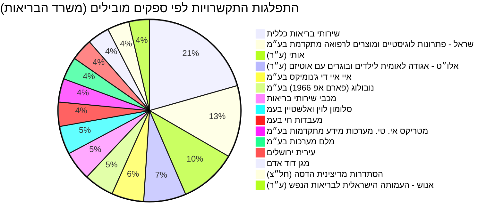

# דוח מרוכז: נתוני תקציב, התקשרויות והחלטות ממשלה בתחום הבריאות

דוח זה מסכם נתונים מרכזיים בתחום הבריאות בישראל, הכוללים מידע תקציבי, התקשרויות ממשלתיות והחלטות ממשלה רלוונטיות. הנתונים מכסים את השנים 1997-2026.

## מגמה תקציבית לאורך זמן

להלן נתוני התקציב המצטברים עבור תחום הבריאות משנת 1997 ועד 2026:

| שנה | סכום שהוקצה (מוערך) | סכום מתוקן (מוערך) | סכום שנוצל (מוערך) |
|---|---|---|---|
| 1997 | 10,566,301,000.0 | 10,798,623,000.0 | 10,589,881,172.0 |
| 1998 | 19,761,723,000.0 | 19,795,439,000.0 | 19,637,999,011.0 |
| 1999 | 20,734,863,000.0 | 21,216,239,000.0 | 21,036,702,587.0 |
| 2000 | 22,329,103,000.0 | 21,471,443,000.0 | 20,981,647,835.0 |
| 2001 | 22,462,132,000.0 | 22,326,660,000.0 | 22,343,582,115.0 |
| 2002 | 23,532,933,000.0 | 23,916,065,000.0 | 23,830,986,354.0 |
| 2003 | 24,786,357,000.0 | 24,542,055,000.0 | 23,840,470,832.0 |
| 2004 | 24,729,871,000.0 | 25,183,870,000.0 | 24,936,400,808.0 |
| 2005 | 25,519,564,000.0 | 26,188,002,000.0 | 25,763,667,476.0 |
| 2006 | 26,443,987,000.0 | 27,193,473,000.0 | 27,010,771,640.0 |
| 2007 | 27,994,520,000.0 | 27,236,421,000.0 | 26,728,564,410.0 |
| 2008 | 27,838,569,000.0 | 29,330,487,000.0 | 28,956,029,208.0 |
| 2009 | 29,302,371,000.0 | 30,821,942,000.0 | 30,533,860,607.0 |
| 2010 | 32,425,496,000.0 | 33,608,735,000.0 | 33,091,226,490.0 |
| 2011 | 34,688,787,000.0 | 35,383,824,000.0 | 33,283,243,688.0 |
| 2012 | 35,596,695,000.0 | 38,069,363,000.0 | 37,711,419,763.0 |
| 2013 | 40,415,311,000.0 | 42,478,037,000.0 | 41,958,729,508.0 |
| 2014 | 41,976,917,000.0 | 46,729,653,000.0 | 46,211,437,117.0 |
| 2015 | 47,931,525,000.0 | 48,953,808,000.0 | 48,164,922,468.0 |
| 2016 | 49,788,810,000.0 | 51,442,839,000.0 | 50,967,572,248.0 |
| 2017 | 54,578,117,000.0 | 55,763,729,000.0 | 55,134,727,269.0 |
| 2018 | 56,775,920,000.0 | 58,713,860,000.0 | 57,655,208,847.0 |
| 2019 | 63,483,758,000.0 | 65,267,147,000.0 | 64,314,464,918.0 |
| 2020 | null | 80,156,571,000.0 | 77,561,922,512.0 |
| 2021 | 83,702,454,000.0 | 87,255,098,000.0 | 82,485,374,118.0 |
| 2022 | 72,022,783,000.0 | 84,550,024,000.0 | 80,023,906,066.0 |
| 2023 | 73,293,067,000.0 | 86,774,285,000.0 | 83,187,408,336.0 |
| 2024 | 82,999,016,000.0 | 91,859,082,000.0 | 88,022,848,628.0 |
| 2025 | 88,364,765,000.0 | 90,831,372,000.0 | 95,518,699,796.0 |
| 2026 | 94,949,993,000.0 | 94,949,993,000.0 | null |

## תכניות פעילות כיום

### התפלגות התקשרויות לפי ספקים מובילים (משרד הבריאות)

הגרף הבא מציג את התפלגות היקף ההתקשרויות של משרד הבריאות מול 15 הספקים המובילים.

### התקשרויות מרכזיות

להלן רשימת 50 ההתקשרויות הגדולות ביותר של משרד הבריאות, מסודרות לפי היקף ההתקשרות (volume) יורד:

| purpose | purchasing_ministry | supplier_entity_name | volume | executed | start_year | end_year | item_url |
|---|---|---|---|---|---|---|---|
| פעילות קורונה - בדיקות וחיסונים - קופת חולים כללית | משרד הבריאות | שירותי בריאות כללית | 258050645.0 | 258050645.0 | 2022 | 2022 | [קישור](https://next.obudget.org/i/7d20d507eb7c) |
| חיסוני שגרה לשנת 2018 | משרד הבריאות | נובולוג (פארם אפ 1966) בע״מ | 255379352.9 | 227772599.53 | 2017 | 2017 | [קישור](https://next.obudget.org/i/92d6a0751314) |
| חיסון קורונה אסטרה זניקה | משרד הבריאות | סלומון לוין ואלשטיין בעמ | 205920367.38 | 108566809.84 | 2021 | 2021 | [קישור](https://next.obudget.org/i/df253063d6e8) |
| מסד 505+ 668 627 הסבת התקשרות AIDמעבדה לבדיקות קורונה | משרד הבריאות | איי איי די ג'נומיקס בע״מ | 186543903.78 | 171517791.64 | 2021 | 2021 | [קישור](https://next.obudget.org/i/93d7922a1d6b) |
| רכש שירותים | משרד הבריאות | אותי (ע"ר) | 176840198.46 | 0.0 | 2023 | 2024 | [קישור](https://next.obudget.org/i/73a3c789639d) |
| רכש שירותים | משרד הבריאות | אותי (ע"ר) | 173144224.0 | 0.0 | 2019 | 2019 | [קישור](https://next.obudget.org/i/a6816cd056e8) |
| פעילות קורונה - בדיקות וחיסונים - קופת חולים מכבי | משרד הבריאות | מכבי שירותי בריאות | 169423481.0 | 169423481.0 | 2022 | 2022 | [קישור](https://next.obudget.org/i/064825f63cd3) |
| רכש שירותים | משרד הבריאות | אלו"ט - אגודה לאומית לילדים ובוגרים עם אוטיזם (ע''ר) | 156733958.5 | 0.0 | 2024 | 2024 | [קישור](https://next.obudget.org/i/03daa13a46a0) |
| הקמת מחלקה מתפרצת (קורונה )בתי החולים של קופת חולים | משרד הבריאות | שירותי בריאות כללית | 142589090.0 | 0.0 | 2020 | 2021 | [קישור](https://next.obudget.org/i/67d998512bc2) |
| מס"ד רכש ערכות אנטיגן | משרד הבריאות | גוד פארם בע״מ | 136398600.0 | 136398600.0 | 2022 | 2022 | [קישור](https://next.obudget.org/i/d873c75ed6da) |
| רכש שירותים | משרד הבריאות | אותי (ע"ר) | 128011905.0 | 118326368.88 | 2018 | 2018 | [קישור](https://next.obudget.org/i/fba4e803cc7e) |
| רכש שירותים | משרד הבריאות | אלו"ט - אגודה לאומית לילדים ובוגרים עם אוטיזם (ע''ר) | 126400449.0 | 125033275.32 | 2020 | 2020 | [קישור](https://next.obudget.org/i/1d555d4a3ae3) |
| מסד 505 + 668 627 MH הסבת התקשרות מעבדה פרטית בדיקות קורונה | משרד הבריאות | מייהריטאג' בע״מ | 111597740.0 | 102956102.45 | 2021 | 2021 | [קישור](https://next.obudget.org/i/adaf15fdac62) |
| חיסוני שגרה 2023 | משרד הבריאות | שראל - פתרונות לוגיסטיים ומוצרים לרפואה מתקדמת בע״מ | 106232263.61 | 0.0 | 2022 | 2022 | [קישור](https://next.obudget.org/i/601ecf296db7) |
| חיסוני שגרה | משרד הבריאות | נובולוג (פארם אפ 1966) בע״מ | 105095440.88 | 97355466.74 | 2016 | 2016 | [קישור](https://next.obudget.org/i/e28506aee43b) |
| חיסוני שגרה | משרד הבריאות | שראל - פתרונות לוגיסטיים ומוצרים לרפואה מתקדמת בע״מ | 104722279.62 | 95955190.86 | 2016 | 2016 | [קישור](https://next.obudget.org/i/10dbe26ab337) |
| בשל התפרצות נגיף הקורונה | משרד הבריאות | מעבדות חי בעמ | 103199481.56 | 99370926.45 | 2020 | 2021 | [קישור](https://next.obudget.org/i/2188d1a5fe7e) |
| רכש שירותים | משרד הבריאות | אותי (ע"ר) | 101951044.0 | 85997127.66 | 2021 | 2021 | [קישור](https://next.obudget.org/i/e78324fbdf5a) |
| חיסוני שגרה | משרד הבריאות | שראל - פתרונות לוגיסטיים ומוצרים לרפואה מתקדמת בע״מ | 101544874.94 | 100361495.16 | 2017 | 2017 | [קישור](https://next.obudget.org/i/0bfc9ccb8e12) |
| ריאגנטים לקורונה | משרד הבריאות | מעבדות חי בעמ | 99585029.95 | 94937077.63 | 2021 | 2021 | [קישור](https://next.obudget.org/i/e4e67109d760) |
| מסד מ 38 רכש אנטיגן בדיקות מהירות קורונה מכרז 1/2022 | משרד הבריאות | הדסה מדיקל בע״מ | 98982000.0 | 98982000.0 | 2022 | 2022 | [קישור](https://next.obudget.org/i/9d56c83b9885) |
| חיסוני שגרה לשנת 2018 | משרד הבריאות | פייזר פרמצבטיקה ישראל בע״מ | 97120397.79 | 87354552.87 | 2017 | 2017 | [קישור](https://next.obudget.org/i/a490ced74dbc) |
| הגדלת מלאי ברזל | משרד הבריאות | מעבדות חי בעמ | 96578979.01 | 93926278.63 | 2020 | 2020 | [קישור](https://next.obudget.org/i/85bafba0b0c0) |
| מסד 701+ 707 מ 51 מכרז מעבדות פרטיות איי איי די | משרד הבריאות | איי איי די ג'נומיקס בע״מ | 95843074.86 | 88909122.17 | 2021 | 2022 | [קישור](https://next.obudget.org/i/bdf3300c069d) |
| מסד 505+627 הסבת התקשרות מעבדה פרטית לבדיקות קורונה אלקטרה | משרד הבריאות | אלקטרה בעמ | 95340721.32 | 89276733.81 | 2021 | 2021 | [קישור](https://next.obudget.org/i/9484388958c4) |
| תשלום גנים ומעונות לאוטיסטים | משרד הבריאות | אותי (ע"ר) | 94962245.0 | 93915693.0 | 2016 | 2016 | [קישור](https://next.obudget.org/i/3832ceb368b6) |
| מסד מ 38 רכש אנטיגן בדיקות מהירות קורונה מכרז 1/2022 | משרד הבריאות | גוד פארם בע״מ | 93147964.65 | 93133397.6 | 2022 | 2022 | [קישור](https://next.obudget.org/i/8fa0480d1820) |
| שב"כ - מיגון - חרבות ברזל | משרד הבריאות | שירותי בריאות כללית | 92314339.0 | 0.0 | 2023 | 2024 | [קישור](https://next.obudget.org/i/8ae1386ece35) |
| פעילות קורונה - בדיקות וחיסונים - קופת חולים כללית | משרד הבריאות | שירותי בריאות כללית | 92132940.0 | 92132940.0 | 2022 | 2022 | [קישור](https://next.obudget.org/i/0b89ad513800) |
| רכש שירותים | משרד הבריאות | אלו"ט - אגודה לאומית לילדים ובוגרים עם אוטיזם (ע''ר) | 91506656.0 | 0.0 | 2019 | 2019 | [קישור](https://next.obudget.org/i/e09a3d2a1e89) |
| הקמת בית חולים לילדים וולפסון | משרד הבריאות | רם אדרת הנדסה אזרחית בע״מ | 91075652.46 | 96541309.87 | 2016 | 2021 | [קישור](https://next.obudget.org/i/4b130a5e24d8) |
| אנוש | משרד הבריאות | אנוש - העמותה הישראלית לבריאות הנפש (ע"ר) | 89586744.0 | 62143420.62 | 2018 | 2018 | [קישור](https://next.obudget.org/i/ca4674e33d85) |
| גן מעון אוטיסטים | משרד הבריאות | אלו"ט - אגודה לאומית לילדים ובוגרים עם אוטיזם (ע''ר) | 86030000.0 | 82433853.03 | 2018 | 2018 | [קישור](https://next.obudget.org/i/d8785e7d7518) |
| רכש שירותים | משרד הבריאות | טיפול לי עד הבית בע״מ | 85242692.87 | 0.0 | 2024 | 2024 | [קישור](https://next.obudget.org/i/a7897cacb7cc) |
| רכש שירותים | משרד הבריאות | אותי (ע"ר) | 81427233.0 | 79846966.89 | 2020 | 2020 | [קישור](https://next.obudget.org/i/73c54b37caab) |
| מסד 717 מכרז מעבדות פרטיות MH | משרד הבריאות | מייהריטאג' בע״מ | 80842989.24 | 80608458.06 | 2021 | 2022 | [קישור](https://next.obudget.org/i/3dacc2aa45c1) |
| מס"ד רכש ערכות אנטיגן | משרד הבריאות | רניום מדיקל בע״מ | 80671500.0 | 80671500.01 | 2022 | 2022 | [קישור](https://next.obudget.org/i/247aa5e1d75f) |
| חיסון פרבנר | משרד הבריאות | פייזר פרמצבטיקה ישראל בע״מ | 78903501.3 | 73130242.77 | 2016 | 2016 | [קישור](https://next.obudget.org/i/dc3770e6ef4b) |
| חיסון קורונה אסטרה זניקה | משרד הבריאות | סלומון לוין ואלשטיין בעמ | 78340995.72 | 55353685.73 | 2021 | 2021 | [קישור](https://next.obudget.org/i/87a17d79de4a) |
| מסד 701+ 707 מ 51 מכרז מעבדות פרטיות איילקס | משרד הבריאות | אילקס מדיקל בע״מ | 78336151.92 | 78335934.3 | 2021 | 2022 | [קישור](https://next.obudget.org/i/f27d85103d16) |
| אנוש | משרד הבריאות | אנוש - העמותה הישראלית לבריאות הנפש (ע"ר) | 76861375.67 | 67263816.54 | 2016 | 2016 | [קישור](https://next.obudget.org/i/127f7d6f474b) |
| אנוש | משרד הבריאות | אנוש - העמותה הישראלית לבריאות הנפש (ע"ר) | 76065930.0 | 70077604.23 | 2017 | 2017 | [קישור](https://next.obudget.org/i/8c29682943ef) |
| פעילות קורונה - בדיקות וחיסונים - קופת חולים כללית | משרד הבריאות | שירותי בריאות כללית | 75563500.0 | 0.0 | 2023 | 2023 | [קישור](https://next.obudget.org/i/e7bcf68c10e5) |
| שיפוי בתי חולים בגין ציוד מיגון | משרד הבריאות | שירותי בריאות כללית | 74662960.0 | 68603233.0 | 2020 | 2020 | [קישור](https://next.obudget.org/i/f0dd71be38db) |
| שיפוי בתי חולים בגין ציוד מיגון | משרד הבריאות | שירותי בריאות כללית | 74662960.0 | 68603233.0 | 2020 | 2020 | [קישור](https://next.obudget.org/i/cf8a98bdd187) |
| חיסוני שיגרה 2021 | משרד הבריאות | נובולוג (פארם אפ 1966) בע״מ | 74017843.38 | 66000048.57 | 2020 | 2021 | [קישור](https://next.obudget.org/i/13c4e482277e) |
| הקמת מתחם הנוער אברבנאל | משרד הבריאות | קן התור הנדסה ובנין בע״מ | 72999599.4 | 74452197.83 | 2018 | 2021 | [קישור](https://next.obudget.org/i/e440e1e767d1) |
| מסד מ בדיקות מעבדה קורונה פניה פרטנית 2 מכרז 98/2022 | משרד הבריאות | איי איי די ג'נומיקס בע״מ | 72767097.0 | 65401990.57 | 2022 | 2022 | [קישור](https://next.obudget.org/i/fb5c2a9f99a0) |
| רכש ערכות בדיקה מהירה אנטיגן לאבחון קורונה | משרד הבריאות | גוד פארם בע״מ | 70785000.0 | 68537131.65 | 2021 | 2021 | [קישור](https://next.obudget.org/i/416e22cea474) |
| רכש שירותים | משרד הבריאות | טיפול לי עד הבית בע״מ | 69806569.91 | 68588321.37 | 2023 | 2023 | [קישור](https://next.obudget.org/i/e18e7c73c217) |

## מקורות תקציב

נכון לעכשיו, לא ניתן להציג תרשים זרימה (Sankey/Flowchart) המפרט את מקורות התקציב וקישורם לסעיפי התוכנית ההיררכיים, מכיוון שהנתונים ההיררכיים המפורטים עבור סעיפי התקציב לשנת 2026 (ברמת פירוט של עד 3 וסכום מוקצה של לפחות 50,000,000 ש"ח) אינם זמינים במערכת. ייתכן שאין סעיפים העומדים בתנאים אלה, או שהנתונים המפורטים לשנה זו עדיין לא פורסמו במלואם.

## נושאים נוספים

### ספקים מובילים

להלן סיכום היקף ההתקשרויות לפי ספק עבור משרד הבריאות (50 הספקים המובילים):

| supplier_entity_name | total_volume |
|---|---|
| שירותי בריאות כללית | 1814952996.52 |
| שראל - פתרונות לוגיסטיים ומוצרים לרפואה מתקדמת בע״מ | 1126392064.4 |
| אותי (ע"ר) | 895251981.5 |
| אלו"ט - אגודה לאומית לילדים ובוגרים עם אוטיזם (ע''ר) | 660772305.7 |
| איי איי די ג'נומיקס בע״מ | 502527942.65 |
| נובולוג (פארם אפ 1966) בע״מ | 467115139.18 |
| מכבי שירותי בריאות | 455446359.96 |
| סלומון לוין ואלשטיין בעמ | 441972968.9 |
| מעבדות חי בעמ | 379070739.81 |
| מטריקס אי. טי. מערכות מידע מתקדמות בע״מ | 366390952.89 |
| מלם מערכות בע״מ | 355271148.12 |
| עירית ירושלים | 344386662.48 |
| מגן דוד אדם | 344222696.38 |
| הסתדרות מדיצינית הדסה (חל״צ) | 341601079.52 |
| אנוש - העמותה הישראלית לבריאות הנפש (ע"ר) | 319997769.13 |
| גוד פארם בע״מ | 300358161.65 |
| קופת חולים מאוחדת מרכזית עממי | 297010965.4 |
| פמי פרימיום בע״מ | 288962787.85 |
| קידום פרוייקטים שיקומיים ב.ה. בע״מ | 259053104.12 |
| מייהריטאג' בע״מ | 253585152.71 |
| תאגיד הבריאות ליד המרכז הרפואי תל-אביב (ע"ר) | 247690494.15 |
| קרן מחקרים ושירותי בריאות - שיבא (ע''ר) | 244058725.38 |
| פייזר פרמצבטיקה ישראל בע״מ | 236897366.41 |
| אס. קיו. לינק בע״מ | 236829832.75 |
| קן התור הנדסה ובנין בע״מ | 227200482.99 |
| רם אדרת הנדסה אזרחית בע״מ | 224204862.23 |
| אומגה המכון להוראה מודרנית בע״מ | 221350793.07 |
| אלקטרה בעמ | 219791053.76 |
| נס א.ט. בע״מ | 217528905.9 |
| טיפול רפואי מידי (טר״מ) בע״מ | 216384695.67 |
| אגודה לבריאות הציבור (ע"ר) | 214372204.68 |
| אילקס מדיקל בע״מ | 199816258.68 |
| עמל הולדינגס א.ד. בע״מ | 192794171.28 |
| קרן מחקרים רפואיים, פיתוח תשתית ושרותי בריאות - ליד המרכז הרפואי בני ציון (ע"ר) | 191225186.5 |
| דיבימושיין בע״מ | 184455857.51 |
| גוינט ישראל (חל״צ) | 181995901.57 |
| טיפול לי עד הבית בע״מ | 181166899.33 |
| קבוצת שכולו טוב (ע"ר) | 162402475.41 |
| מרכז רפואי שערי צדק (ע"ר) | 155183398.76 |
| שתית בע״מ | 154486412.73 |
| משרד רוה"מ/לשכת הפרסום הממשלתית | 140273036.17 |
| קופת חולים לעובדים לאומיים | 138211849.5 |
| מרטנס יועצי מחשוב בע״מ | 138156152.0 |
| מגן הלב (ע"ר) | 134525446.75 |
| טלדור יועצים בע״מ | 132457208.0 |
| וואן ליין בע״מ | 131543279.79 |
| מטריקס די אנד איי בע״מ | 130119018.43 |
| ס.ו.ל.ם. - סיוע ועידוד לילדים מוגבלים (ע"ר) | 130049224.72 |
| עירית תל-אביב-יפו | 127585726.72 |
| סאפ ישראל בע״מ | 125541408.37 |

### החלטות ממשלה

להלן רשימת החלטות ממשלה רלוונטיות לתחום הבריאות:

| title | government | decision_number | publication_date | item_url |
|---|---|---|---|---|
| כניסה לישראל מטעמי איחוד משפחות לבני קהילות גונדר ואדיס אבבה | הממשלה ה- 34, בנימין נתניהו | 1911 | 2016-08-11 | [קישור](https://next.obudget.org/i/25936fe2ae7e) |
| קציבת כהונה בתפקידי ניהול רפואיים בכירים ומנהלי מחלקות במערכת הבריאות הממשלתית | None | 2096 | 2014-10-10 | [קישור](https://next.obudget.org/i/f93a748ff576) |
| מימון השתתפות ישראל בתכנית המסגרת השמינית של האיחוד האירופי | None | 2074 | 2014-10-07 | [קישור](https://next.obudget.org/i/89ce136b33be) |
| הצעת תקציב המדינה לשנת 2015 | None | 2085 | 2014-10-07 | [קישור](https://next.obudget.org/i/011b1fa967ea) |
| מדיניות ממשלתית לקידום שילובם המיטבי של יוצאי אתיופיה בחברה הישראלית תכניות משרד החינוך, משרד הרווחה והשירותים החברתיים ומשרד הבריאות | הממשלה ה- 34, בנימין נתניהו | 666 | 2015-11-08 | [קישור](https://next.obudget.org/i/e1365f4ac381) |
| קידום הייבוא המקביל של מוצרי מזון | None | 1169 | 2014-01-12 | [קישור](https://next.obudget.org/i/4623c2e53e70) |
| מדיניות ממשלתית לקידום שילובם המיטבי של יוצאי אתיופיה בחברה הישראלית - תכניות משרד החינוך, משרד הרווחה והשירותים החברתיים ומשרד הבריאות וצוות יישום ומעקב אחרי התכנית | None | 609 | 2015-10-29 | [קישור](https://next.obudget.org/i/aacbd0bd1f1a) |
| הצעת חוק קביעת מועד לתחילת הוראת סימון מזון ארוז מראש ומכלי משקה, התשע"ד-2013 של חה"כ איילת שקד ואחרים (פ/1986) | None | 1323 | 2014-02-12 | [קישור](https://next.obudget.org/i/10c63e05d586) |
| צירוף חבר הכנסת יעקב ליצמן לממשלה ומינוי לשר הבריאות | None | 503 | 2015-08-31 | [קישור](https://next.obudget.org/i/147c6b413677) |
| הצעת חוק לפיקוח על איכות המזון ולתזונה נכונה בצהרונים, התשע"ו-2016 של חה"כ רחל עזריה ואחרים (פ/2914) | הממשלה ה- 34, בנימין נתניהו | 1535 | 2016-06-16 | [קישור](https://next.obudget.org/i/66aa0e8c0b8f) |
| הקמת צוות בינמשרדי לצמצום בעיית המפחמות | None | 534 | 2015-09-10 | [קישור](https://next.obudget.org/i/95dc90905097) |
| הטלת היטלים מתיירות רפואית וממוסדות רפואיים פרטיים ועדכון סל שירותי הבריאות | None | 2066 | 2014-10-07 | [קישור](https://next.obudget.org/i/095f97581c0c) |
| בית הספר לרפואה בצפת - הקמת מתחם הקבע | הממשלה ה- 34, בנימין נתניהו | 1531 | 2016-06-13 | [קישור](https://next.obudget.org/i/f2d0d3743d93) |
| הצעת חוק ביטוח בריאות ממלכתי (תיקון - בחירה מבין נותני שירותים), התשע"ג-2013 של חה"כ אמנון כהן (פ/1158) | None | 1178 | 2014-01-15 | [קישור](https://next.obudget.org/i/dbc3a4078e78) |
| החלת דין רציפות על הצעת חוק טיפול בחולי נפש (תיקון מס' 8), התשע"ב-2012 (ה"ח הממשלה מס' 673 מיום 19.3.2012) | None | 1176 | 2014-01-15 | [קישור](https://next.obudget.org/i/0709d8f8e473) |
| הצעת תקציב המדינה לשנים 2015 - 2016 | None | 407 | 2015-08-05 | [קישור](https://next.obudget.org/i/82c9c70e3f04) |
| הסרת חסמים ליבוא אישי | None | 1564 | 2014-04-24 | [קישור](https://next.obudget.org/i/c6d261eabfa0) |
| שינוי מבנה קצבת הילדים והנהגת חיסכון ארוך טווח לכל ילד | None | 362 | 2015-08-05 | [קישור](https://next.obudget.org/i/00cfc4c948fa) |
| הצעת חוק זכויות החולה (תיקון - זכות לנוכחות הורה בעת טיפול ביילוד), התשע"ד-2014 של חה"כ עליזה לביא ואחרים (פ/2420) | None | 1853 | 2014-07-17 | [קישור](https://next.obudget.org/i/e6054453b8fd) |
| הכרה בתוספת קבועה לפי חוק שירות המדינה (גמלאות) [נוסח משולב], התש"ל-1970 | None | 1558 | 2014-04-20 | [קישור](https://next.obudget.org/i/e3c6470018c6) |
| החלת חוק שירות המדינה (משמעת), התשכ"ג-1963 על עובדי רשות ניקוז כנרת | None | 1555 | 2014-04-17 | [קישור](https://next.obudget.org/i/41f050d58db5) |
| הסרת חסמים לייבוא מזון רגיל ("קונרפלקס") - אישור החלטת ועדת השרים לענייני חברה וכלכלה | None | 338 | 2015-08-05 | [קישור](https://next.obudget.org/i/a13de2be595c) |
| החלת דין רציפות על הצעת חוק למניעת אלימות במוסדות למתן טיפול (תיקון מס' 2) (הרחבת ההגדרה "אלימות מילולית"), התשע"ה-2014 (ה"ח הכנסת מס' 578 מיום 12.11.2014) | None | 297 | 2015-07-30 | [קישור](https://next.obudget.org/i/c5515155bfc2) |
| הצעת חוק זכויות החולה (תיקון - זכות לנוכחות מלווה בטיפול), התשע"ד-2014 של חה"כ פנינה תמנו-שטה ואחרים (פ/2054) | None | 1505 | 2014-03-27 | [קישור](https://next.obudget.org/i/5b6f734bb0af) |
| שיקום הערבה והיערכות לאומית לטיפול באירועי זיהום סביבתיים בעקבות אירוע פריצת צינור הנפט בבאר אורה | None | 2381 | 2014-12-28 | [קישור](https://next.obudget.org/i/a86ec7ed6354) |
| הצעת חוק לתיקון פקודת בריאות הציבור (מזון) (איסור מכירת מזון פג תוקף), התשע"ד-2014 של חה"כ יריב לוין ואמנון כהן (פ/2133) | None | 1837 | 2014-07-10 | [קישור](https://next.obudget.org/i/0fc3dbda43e9) |
| החלת דין רציפות על הצעת חוק הביטוח הלאומי (תיקון מס' 159) (הגבלת תשלום בעד טיפול בתביעה), התשע"ד-2014 (ה"ח הכנסת מס' 568 מיום 22.7.2014) | None | 192 | 2015-07-09 | [קישור](https://next.obudget.org/i/708a3ce46471) |
| רפורמה בתחום יבוא המזון הרגיל לישראל | None | 1606 | 2014-05-18 | [קישור](https://next.obudget.org/i/afde017c8278) |
| קביעת הסדר למתן רישיונות ישיבה זמניים בישראל למשקיעים ולעובדים מומחים חיוניים מטעמם שהם אזרחי ארה"ב, לרבות לבני משפחותיהם | None | 1528 | 2014-03-30 | [קישור](https://next.obudget.org/i/9d5ee64c22f3) |
| מניעת הדרת הנשים במרחב הציבורי | None | 1526 | 2014-03-30 | [קישור](https://next.obudget.org/i/ba87542bf71f) |

## מקורות

### נתוני תקציב
*   [הורדת נתונים מרוכזים של תקציב הבריאות לפי שנה](https://next.obudget.org/api/download?query=U0VMRUNUIHllYXIsIFNVTShhbW91bnRfYWxsb2NhdGVkKSBBUyB0b3RhbF9hbGxvY2F0ZWQsIFNVTShhbW91bnRfcmV2aXNlZCkgQVMgdG90YWxfcmV2aXNlZCwgU1VNKGFtb3VudF91c2VkKSBBUyB0b3RhbF91c2VkIEZST00gYnVkZ2V0X2l0ZW1zX2RhdGEgV0hFUkUgZnVuY3Rpb25hbF9jbGFzc19kZXRhaWxlZCA9ICfXkdeo15nXkNeV16onIEdST1VQIEJZIHllYXIgT1JERVIgQlkgeWVhciBBU0M%3D&headers=year%3Btotal_allocated%3Btotal_revised%3Btotal_used)

### התקשרויות
*   [הורדת הנתונים המלאים של 50 ההתקשרויות הגדולות](https://next.obudget.org/api/download?query=U0VMRUNUIHB1cnBvc2UsIHB1cmNoYXNpbmdfbWluaXN0cnksIHN1cHBsaWVyX2VudGl0eV9uYW1lLCB2b2x1bWUsIGV4ZWN1dGVkLCBzdGFydF95ZWFyLCBlbmRfeWVhciwgaXRlbV91cmwgRlJPTSBjb250cmFjdHNfZGF0YSBXSEVSRSBwdXJjaGFzaW5nX21pbmlzdHJ5ID0gJ9ee16nXqNeTINeU15HXqNeZ15DXldeqJyBPUkRFUiBCWSB2b2x1bWUgREVTQyBMSU1JVCA1MA%3D%3D&headers=purpose%3Bpurchasing_ministry%3Bsupplier_entity_name%3Bvolume%3Bexecuted%3Bstart_year%3Bend_year%3Bitem_url)
*   [פעילות קורונה - בדיקות וחיסונים - קופת חולים כללית](https://next.obudget.org/i/7d20d507eb7c)
*   [חיסוני שגרה לשנת 2018](https://next.obudget.org/i/92d6a0751314)
*   [חיסון קורונה אסטרה זניקה](https://next.obudget.org/i/df253063d6e8)
*   [מסד 505+ 668 627 הסבת התקשרות AIDמעבדה לבדיקות קורונה](https://next.obudget.org/i/93d7922a1d6b)
*   [רכש שירותים (אותי (ע"ר) - 2023-2024)](https://next.obudget.org/i/73a3c789639d)
*   [רכש שירותים (אותי (ע"ר) - 2019)](https://next.obudget.org/i/a6816cd056e8)
*   [פעילות קורונה - בדיקות וחיסונים - קופת חולים מכבי](https://next.obudget.org/i/064825f63cd3)
*   [רכש שירותים (אלו"ט - אגודה לאומית לילדים ובוגרים עם אוטיזם (ע''ר) - 2024)](https://next.obudget.org/i/03daa13a46a0)
*   [הקמת מחלקה מתפרצת (קורונה )בתי החולים של קופת חולים](https://next.obudget.org/i/67d998512bc2)
*   [מס"ד רכש ערכות אנטיגן](https://next.obudget.org/i/d873c75ed6da)
*   [רכש שירותים (אותי (ע"ר) - 2018)](https://next.obudget.org/i/fba4e803cc7e)
*   [רכש שירותים (אלו"ט - אגודה לאומית לילדים ובוגרים עם אוטיזם (ע''ר) - 2020)](https://next.obudget.org/i/1d555d4a3ae3)
*   [מסד 505 + 668 627 MH הסבת התקשרות מעבדה פרטית בדיקות קורונה](https://next.obudget.org/i/adaf15fdac62)
*   [חיסוני שגרה 2023](https://next.obudget.org/i/601ecf296db7)
*   [חיסוני שגרה (נובולוג)](https://next.obudget.org/i/e28506aee43b)
*   [חיסוני שגרה (שראל)](https://next.obudget.org/i/10dbe26ab337)
*   [בשל התפרצות נגיף הקורונה](https://next.obudget.org/i/2188d1a5fe7e)
*   [רכש שירותים (אותי (ע"ר) - 2021)](https://next.obudget.org/i/e78324fbdf5a)
*   [חיסוני שגרה (שראל - 2017)](https://next.obudget.org/i/0bfc9ccb8e12)
*   [ריאגנטים לקורונה](https://next.obudget.org/i/e4e67109d760)
*   [מסד מ 38 רכש אנטיגן בדיקות מהירות קורונה מכרז 1/2022 (הדסה)](https://next.obudget.org/i/9d56c83b9885)
*   [חיסוני שגרה לשנת 2018 (פייזר)](https://next.obudget.org/i/a490ced74dbc)
*   [הגדלת מלאי ברזל](https://next.obudget.org/i/85bafba0b0c0)
*   [מסד 701+ 707 מ 51 מכרז מעבדות פרטיות איי איי די](https://next.obudget.org/i/bdf3300c069d)
*   [מסד 505+627 הסבת התקשרות מעבדה פרטית לבדיקות קורונה אלקטרה](https://next.obudget.org/i/9484388958c4)
*   [תשלום גנים ומעונות לאוטיסטים](https://next.obudget.org/i/3832ceb368b6)
*   [מסד מ 38 רכש אנטיגן בדיקות מהירות קורונה מכרז 1/2022 (גוד פארם)](https://next.obudget.org/i/8fa0480d1820)
*   [שב"כ - מיגון - חרבות ברזל](https://next.obudget.org/i/8ae1386ece35)
*   [פעילות קורונה - בדיקות וחיסונים - קופת חולים כללית (2022)](https://next.obudget.org/i/0b89ad513800)
*   [רכש שירותים (אלו"ט - אגודה לאומית לילדים ובוגרים עם אוטיזם (ע''ר) - 2019)](https://next.obudget.org/i/e09a3d2a1e89)
*   [הקמת בית חולים לילדים וולפסון](https://next.obudget.org/i/4b130a5e24d8)
*   [אנוש (2018)](https://next.obudget.org/i/ca4674e33d85)
*   [גן מעון אוטיסטים](https://next.obudget.org/i/d8785e7d7518)
*   [רכש שירותים (טיפול לי עד הבית בע״מ - 2024)](https://next.obudget.org/i/a7897cacb7cc)
*   [רכש שירותים (אותי (ע"ר) - 2020)](https://next.obudget.org/i/73c54b37caab)
*   [מסד 717 מכרז מעבדות פרטיות MH](https://next.obudget.org/i/3dacc2aa45c1)
*   [מס"ד רכש ערכות אנטיגן (רניום מדיקל)](https://next.obudget.org/i/247aa5e1d75f)
*   [חיסון פרבנר](https://next.obudget.org/i/dc3770e6ef4b)
*   [חיסון קורונה אסטרה זניקה (סלומון לוין ואלשטיין)](https://next.obudget.org/i/87a17d79de4a)
*   [מסד 701+ 707 מ 51 מכרז מעבדות פרטיות איילקס](https://next.obudget.org/i/f27d85103d16)
*   [אנוש (2016)](https://next.obudget.org/i/127f7d6f474b)
*   [אנוש (2017)](https://next.obudget.org/i/8c29682943ef)
*   [פעילות קורונה - בדיקות וחיסונים - קופת חולים כללית (2023)](https://next.obudget.org/i/e7bcf68c10e5)
*   [שיפוי בתי חולים בגין ציוד מיגון (פ0dd71be38db)](https://next.obudget.org/i/f0dd71be38db)
*   [שיפוי בתי חולים בגין ציוד מיגון (cf8a98bdd187)](https://next.obudget.org/i/cf8a98bdd187)
*   [חיסוני שיגרה 2021](https://next.obudget.org/i/13c4e482277e)
*   [הקמת מתחם הנוער אברבנאל](https://next.obudget.org/i/e440e1e767d1)
*   [מסד מ בדיקות מעבדה קורונה פניה פרטנית 2 מכרז 98/2022](https://next.obudget.org/i/fb5c2a9f99a0)
*   [רכש ערכות בדיקה מהירה אנטיגן לאבחון קורונה](https://next.obudget.org/i/416e22cea474)
*   [רכש שירותים (טיפול לי עד הבית בע״מ - 2023)](https://next.obudget.org/i/e18e7c73c217)

### החלטות ממשלה
*   [כניסה לישראל מטעמי איחוד משפחות לבני קהילות גונדר ואדיס אבבה](https://next.obudget.org/i/25936fe2ae7e)
*   [קציבת כהונה בתפקידי ניהול רפואיים בכירים ומנהלי מחלקות במערכת הבריאות הממשלתית](https://next.obudget.org/i/f93a748ff576)
*   [מימון השתתפות ישראל בתכנית המסגרת השמינית של האיחוד האירופי](https://next.obudget.org/i/89ce136b33be)
*   [הצעת תקציב המדינה לשנת 2015](https://next.obudget.org/i/011b1fa967ea)
*   [מדיניות ממשלתית לקידום שילובם המיטבי של יוצאי אתיופיה בחברה הישראלית תכניות משרד החינוך, משרד הרווחה והשירותים החברתיים ומשרד הבריאות](https://next.obudget.org/i/e1365f4ac381)
*   [קידום הייבוא המקביל של מוצרי מזון](https://next.obudget.org/i/4623c2e53e70)
*   [מדיניות ממשלתית לקידום שילובם המיטבי של יוצאי אתיופיה בחברה הישראלית - תכניות משרד החינוך, משרד הרווחה והשירותים החברתיים ומשרד הבריאות וצוות יישום ומעקב אחרי התכנית](https://next.obudget.org/i/aacbd0bd1f1a)
*   [הצעת חוק קביעת מועד לתחילת הוראת סימון מזון ארוז מראש ומכלי משקה, התשע"ד-2013 של חה"כ איילת שקד ואחרים (פ/1986)](https://next.obudget.org/i/10c63e05d586)
*   [צירוף חבר הכנסת יעקב ליצמן לממשלה ומינוי לשר הבריאות](https://next.obudget.org/i/147c6b413677)
*   [הצעת חוק לפיקוח על איכות המזון ולתזונה נכונה בצהרונים, התשע"ו-2016 של חה"כ רחל עזריה ואחרים (פ/2914)](https://next.obudget.org/i/66aa0e8c0b8f)
*   [הקמת צוות בינמשרדי לצמצום בעיית המפחמות](https://next.obudget.org/i/95dc90905097)
*   [הטלת היטלים מתיירות רפואית וממוסדות רפואיים פרטיים ועדכון סל שירותי הבריאות](https://next.obudget.org/i/095f97581c0c)
*   [בית הספר לרפואה בצפת - הקמת מתחם הקבע](https://next.obudget.org/i/f2d0d3743d93)
*   [הצעת חוק ביטוח בריאות ממלכתי (תיקון - בחירה מבין נותני שירותים), התשע"ג-2013 של חה"כ אמנון כהן (פ/1158)](https://next.obudget.org/i/dbc3a4078e78)
*   [החלת דין רציפות על הצעת חוק טיפול בחולי נפש (תיקון מס' 8), התשע"ב-2012 (ה"ח הממשלה מס' 673 מיום 19.3.2012)](https://next.obudget.org/i/0709d8f8e473)
*   [הצעת תקציב המדינה לשנים 2015 - 2016](https://next.obudget.org/i/82c9c70e3f04)
*   [הסרת חסמים ליבוא אישי](https://next.obudget.org/i/c6d261eabfa0)
*   [שינוי מבנה קצבת הילדים והנהגת חיסכון ארוך טווח לכל ילד](https://next.obudget.org/i/00cfc4c948fa)
*   [הצעת חוק זכויות החולה (תיקון - זכות לנוכחות הורה בעת טיפול ביילוד), התשע"ד-2014 של חה"כ עליזה לביא ואחרים (פ/2420)](https://next.obudget.org/i/e6054453b8fd)
*   [הכרה בתוספת קבועה לפי חוק שירות המדינה (גמלאות) [נוסח משולב], התש"ל-1970](https://next.obudget.org/i/e3c6470018c6)
*   [החלת חוק שירות המדינה (משמעת), התשכ"ג-1963 על עובדי רשות ניקוז כנרת](https://next.obudget.org/i/41f050d58db5)
*   [הסרת חסמים לייבוא מזון רגיל ("קונרפלקס") - אישור החלטת ועדת השרים לענייני חברה וכלכלה](https://next.obudget.org/i/a13de2be595c)
*   [החלת דין רציפות על הצעת חוק למניעת אלימות במוסדות למתן טיפול (תיקון מס' 2) (הרחבת ההגדרה "אלימות מילולית"), התשע"ה-2014 (ה"ח הכנסת מס' 578 מיום 12.11.2014)](https://next.obudget.org/i/c5515155bfc2)
*   [הצעת חוק זכויות החולה (תיקון - זכות לנוכחות מלווה בטיפול), התשע"ד-2014 של חה"כ פנינה תמנו-שטה ואחרים (פ/2054)](https://next.obudget.org/i/5b6f734bb0af)
*   [שיקום הערבה והיערכות לאומית לטיפול באירועי זיהום סביבתיים בעקבות אירוע פריצת צינור הנפט בבאר אורה](https://next.obudget.org/i/a86ec7ed6354)
*   [הצעת חוק לתיקון פקודת בריאות הציבור (מזון) (איסור מכירת מזון פג תוקף), התשע"ד-2014 של חה"כ יריב לוין ואמנון כהן (פ/2133)](https://next.obudget.org/i/0fc3dbda43e9)
*   [החלת דין רציפות על הצעת חוק הביטוח הלאומי (תיקון מס' 159) (הגבלת תשלום בעד טיפול בתביעה), התשע"ד-2014 (ה"ח הכנסת מס' 568 מיום 22.7.2014)](https://next.obudget.org/i/708a3ce46471)
*   [רפורמה בתחום יבוא המזון הרגיל לישראל](https://next.obudget.org/i/afde017c8278)
*   [קביעת הסדר למתן רישיונות ישיבה זמניים בישראל למשקיעים ולעובדים מומחים חיוניים מטעמם שהם אזרחי ארה"ב, לרבות לבני משפחותיהם](https://next.obudget.org/i/9d5ee64c22f3)
*   [מניעת הדרת הנשים במרחב הציבורי](https://next.obudget.org/i/ba87542bf71f)

[חזרה לעמוד הראשי](../../README.md)