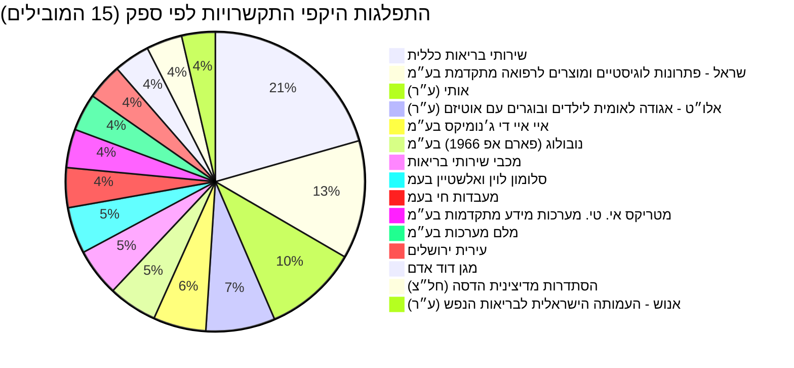

# נתוני תקציב, התקשרויות והחלטות ממשלה בתחום בריאות

תחום הבריאות בישראל מראה צמיחה תקציבית עקבית לאורך השנים, עם עלייה משמעותית מהיקף של כ-10.5 מיליארד ש"ח בשנת 1997 לתקציב מתוכנן של כ-94.9 מיליארד ש"ח לשנת 2026. תקציב משרד הבריאות לשנת 2025 עומד על כ-59.1 מיליארד ש"ח, כאשר חלק ניכר ממנו מופנה לקופות חולים ובתי חולים, רכש שירותי בריאות (בדגש על בריאות הנפש וגריאטריה) ושירותי בריאות הציבור. ההתקשרויות המרכזיות כוללות שירותי בריאות כללית, רכש חיסונים וציוד הקשור להתמודדות עם מגיפת הקורונה. החלטות הממשלה האחרונות בתחום מתמקדמות בחיזוק מערכת הבריאות, חקיקה רלוונטית והיערכות לשעת חירום.

## מגמה תקציבית לאורך זמן

| שנה | תקציב מאושר (ש"ח) | תקציב מתוקן (ש"ח) | ביצוע בפועל (ש"ח) |
|:-----|:-------------------|:------------------|:------------------|
| 1997 | 10,566,301,000     | 10,798,623,000    | 10,589,881,172    |
| 1998 | 19,761,723,000     | 19,795,439,000    | 19,637,999,011    |
| 1999 | 20,734,863,000     | 21,216,239,000    | 21,036,702,587    |
| 2000 | 22,329,103,000     | 21,471,443,000    | 20,981,647,835    |
| 2001 | 22,462,132,000     | 22,326,660,000    | 22,343,582,115    |
| 2002 | 23,532,933,000     | 23,916,065,000    | 23,830,986,354    |
| 2003 | 24,786,357,000     | 24,542,055,000    | 23,840,470,832    |
| 2004 | 24,729,871,000     | 25,183,870,000    | 24,936,400,808    |
| 2005 | 25,519,564,000     | 26,188,002,000    | 25,763,667,476    |
| 2006 | 26,443,987,000     | 27,193,473,000    | 27,010,771,640    |
| 2007 | 27,994,520,000     | 27,236,421,000    | 26,728,564,410    |
| 2008 | 27,838,569,000     | 29,330,487,000    | 28,956,029,208    |
| 2009 | 29,302,371,000     | 30,821,942,000    | 30,533,860,607    |
| 2010 | 32,425,496,000     | 33,608,735,000    | 33,091,226,490    |
| 2011 | 34,688,787,000     | 35,383,824,000    | 33,283,243,688    |
| 2012 | 35,596,695,000     | 38,069,363,000    | 37,711,419,763    |
| 2013 | 40,415,311,000     | 42,478,037,000    | 41,958,729,508    |
| 2014 | 41,976,917,000     | 46,729,653,000    | 46,211,437,117    |
| 2015 | 47,931,525,000     | 48,953,808,000    | 48,164,922,468    |
| 2016 | 49,788,810,000     | 51,442,839,000    | 50,967,572,248    |
| 2017 | 54,578,117,000     | 55,763,729,000    | 55,134,727,269    |
| 2018 | 56,775,920,000     | 58,713,860,000    | 57,655,208,847    |
| 2019 | 63,483,758,000     | 65,267,147,000    | 64,314,464,918    |
| 2020 |              N/A | 80,156,571,000    | 77,561,922,512    |
| 2021 | 83,702,454,000     | 87,255,098,000    | 82,485,374,118    |
| 2022 | 72,022,783,000     | 84,550,024,000    | 80,023,906,066    |
| 2023 | 73,293,067,000     | 86,774,285,000    | 83,187,408,336    |
| 2024 | 82,999,016,000     | 91,859,082,000    | 88,022,848,628    |
| 2025 | 88,364,765,000     | 90,831,372,000    | 95,518,699,796    |
| 2026 | 94,949,993,000     | 94,949,993,000    | N/A               |

## תכניות פעילות כיום

### התפלגות היקפי התקשרויות לפי ספק (15 הספקים המובילים)



## מקורות תקציב

תקציב משרד הבריאות לשנת 2025 עומד על 59,148,419,000 ש"ח. הפריטים המרכזיים בתקציב זה, עם הקצאה של 50,000,000 ש"ח ומעלה, מתפלגים כדלקמן: הקצאה העיקרית מיועדת לקופות חולים ובתי חולים, המהווה את רוב התקציב. לאחר מכן, ניכרת השקעה ברכש שירותי בריאות, הכולל תת-סעיפים משמעותיים לבריאות הנפש וגריאטריה. שירותי בריאות הציבור ומשרד המטה מקבלים גם הם נתחים ניכרים.

```mermaid
graph TD
    A["<a href='https://next.obudget.org/i/60453078daf7' target='_blank'>24: משרד הבריאות (59,148,419,000 ש\"ח)</a>"]

    A --> B1["<a href='https://next.obudget.org/i/11e02549e085' target='_blank'>24.20: קופות חולים ובתי חולים (48,591,091,000 ש\"ח)</a>"]
    A --> B2["<a href='https://next.obudget.org/i/212d53c87756' target='_blank'>24.07: רכש שירותי בריאות (6,829,669,000 ש\"ח)</a>"]
    A --> B3["<a href='https://next.obudget.org/i/4e175766f4d1' target='_blank'>24.16: שירותי בריאות הציבור (1,747,255,000 ש\"ח)</a>"]
    A --> B4["<a href='https://next.obudget.org/i/2f26bdf98224' target='_blank'>24.02: משרד ראשי (1,621,393,000 ש\"ח)</a>"]
    A --> B5["<a href='https://next.obudget.org/i/7f701b066562' target='_blank'>24.50: מרכזים רפואיים (323,597,000 ש\"ח)</a>"]

    B1 --> C1_1["<a href='https://next.obudget.org/i/2dadf7ab5fbd' target='_blank'>24.20.03: קופות ובתי חולים – (48,591,091,000 ש\"ח)</a>"]

    B2 --> C2_1["<a href='https://next.obudget.org/i/d95353bdb999' target='_blank'>24.07.14: בריאות הנפש (3,828,564,000 ש\"ח)</a>"]
    B2 --> C2_2["<a href='https://next.obudget.org/i/c547b144437d' target='_blank'>24.07.10: גריאטריה (1,948,893,000 ש\"ח)</a>"]
    B2 --> C2_3["<a href='https://next.obudget.org/i/a8ef75a5efde' target='_blank'>24.07.09: פעולות מרכזיות (568,187,000 ש\"ח)</a>"]
    B2 --> C2_4["<a href='https://next.obudget.org/i/5f4c141beba9' target='_blank'>24.07.01: הכשרות צוותים רפואיים (484,025,000 ש\"ח)</a>"]

    B3 --> C3_1["<a href='https://next.obudget.org/i/57c73b370088' target='_blank'>24.16.03: רפואה מונעת (933,893,000 ש\"ח)</a>"]
    B3 --> C3_2["<a href='https://obudget.org/i/0fd929b3d45c' target='_blank'>24.16.90: לשכות הבריאות (773,449,000 ש\"ח)</a>"]

    B4 --> C4_1["<a href='https://next.obudget.org/i/91ef138f3be2' target='_blank'>24.02.05: תפעול מטה (962,022,000 ש\"ח)</a>"]
    B4 --> C4_2["<a href='https://next.obudget.org/i/6083c79879f3' target='_blank'>24.02.01: שכר מטה (609,512,000 ש\"ח)</a>"]

    B5 --> C5_1["<a href='https://next.obudget.org/i/a739808dace6' target='_blank'>24.50.03: מרכז גריאטרי פרדס חנה (90,146,000 ש\"ח)</a>"]
    B5 --> C5_2["<a href='https://next.obudget.org/i/138ffab155be' target='_blank'>24.50.01: מרכז גריאטרי נתניה (88,978,000 ש\"ח)</a>"]
    B5 --> C5_3["<a href='https://next.obudget.org/i/ca37a7c1b8a5' target='_blank'>24.50.04: מרכז גריאטרי שמואל (66,319,000 ש\"ח)</a>"]
```

## נושאים נוספים

### התקשרויות/חוזים
להלן רשימת 50 ההתקשרויות המובילות של משרד הבריאות:

| מטרה | משרד רוכש | שם ספק | היקף התקשרות | סכום ששולם בפועל | שנת התחלה | שנת סיום | קישור לפריט |
|:---|:---|:---|:---|:---|:---|:---|:---|
| פעילות קורונה - בדיקות וחיסונים - קופת חולים כללית | משרד הבריאות | שירותי בריאות כללית | 258,050,645.0 | 258,050,645.0 | 2022 | 2022 | [קישור](https://next.obudget.org/i/7d20d507eb7c) |
| חיסוני שגרה לשנת 2018 | משרד הבריאות | נובולוג (פארם אפ 1966) בע״מ | 255,379,352.9 | 227,772,599.53 | 2017 | 2017 | [קישור](https://next.obudget.org/i/92d6a0751314) |
| חיסון קורונה אסטרה זניקה | משרד הבריאות | סלומון לוין ואלשטיין בעמ | 205,920,367.38 | 108,566,809.84 | 2021 | 2021 | [קישור](https://next.obudget.org/i/df253063d6e8) |
| מסד 505+ 668 627 הסבת התקשרות AIDמעבדה לבדיקות קורונה | משרד הבריאות | איי איי די ג'נומיקס בע״מ | 186,543,903.78 | 171,517,791.64 | 2021 | 2021 | [קישור](https://next.obudget.org/i/93d7922a1d6b) |
| רכש שירותים | משרד הבריאות | אותי (ע״ר) | 176,840,198.46 | 0.0 | 2023 | 2024 | [קישור](https://next.obudget.org/i/73a3c789639d) |
| רכש שירותים | משרד הבריאות | אותי (ע״ר) | 173,144,224.0 | 0.0 | 2019 | 2019 | [קישור](https://next.obudget.org/i/a6816cd056e8) |
| פעילות קורונה - בדיקות וחיסונים - קופת חולים מכבי | משרד הבריאות | מכבי שירותי בריאות | 169,423,481.0 | 169,423,481.0 | 2022 | 2022 | [קישור](https://next.obudget.org/i/064825f63cd3) |
| רכש שירותים | משרד הבריאות | אלו״ט - אגודה לאומית לילדים ובוגרים עם אוטיזם (ע״ר) | 156,733,958.5 | 0.0 | 2024 | 2024 | [קישור](https://next.obudget.org/i/03daa13a46a0) |
| הקמת מחלקה מתפרצת (קורונה )בתי החולים של קופת חולים | משרד הבריאות | שירותי בריאות כללית | 142,589,090.0 | 0.0 | 2020 | 2021 | [קישור](https://next.obudget.org/i/67d998512bc2) |
| מס״ד רכש ערכות אנטיגן | משרד הבריאות | גוד פארם בע״מ | 136,398,600.0 | 136,398,600.0 | 2022 | 2022 | [קישור](https://next.obudget.org/i/d873c75ed6da) |
| רכש שירותים | משרד הבריאות | אותי (ע״ר) | 128,011,905.0 | 118,326,368.88 | 2018 | 2018 | [קישור](https://next.obudget.org/i/fba4e803cc7e) |
| רכש שירותים | משרד הבריאות | אלו״ט - אגודה לאומית לילדים ובוגרים עם אוטיזם (ע״ר) | 126,400,449.0 | 125,033,275.32 | 2020 | 2020 | [קישור](https://next.obudget.org/i/1d555d4a3ae3) |
| מסד 505 + 668 627 MH הסבת התקשרות מעבדה פרטית בדיקות קורונה | משרד הבריאות | מייהריטאג' בע״מ | 111,597,740.0 | 102,956,102.45 | 2021 | 2021 | [קישור](https://next.obudget.org/i/adaf15fdac62) |
| חיסוני שגרה 2023 | משרד הבריאות | שראל - פתרונות לוגיסטיים ומוצרים לרפואה מתקדמת בע״מ | 106,232,263.61 | 0.0 | 2022 | 2022 | [קישור](https://next.obudget.org/i/601ecf296db7) |
| חיסוני שגרה | משרד הבריאות | נובולוג (פארם אפ 1966) בע״מ | 105,095,440.88 | 97,355,466.74 | 2016 | 2016 | [קישור](https://next.obudget.org/i/e28506aee43b) |
| חיסוני שגרה | משרד הבריאות | שראל - פתרונות לוגיסטיים ומוצרים לרפואה מתקדמת בע״מ | 104,722,279.62 | 95,955,190.86 | 2016 | 2016 | [קישור](https://next.obudget.org/i/10dbe26ab337) |
| בשל התפרצות נגיף הקורונה | משרד הבריאות | מעבדות חי בעמ | 103,199,481.56 | 99,370,926.45 | 2020 | 2021 | [קישור](https://next.obudget.org/i/2188d1a5fe7e) |
| רכש שירותים | משרד הבריאות | אותי (ע״ר) | 101,951,044.0 | 85,997,127.66 | 2021 | 2021 | [קישור](https://next.obudget.org/i/e78324fbdf5a) |
| חיסוני שגרה | משרד הבריאות | שראל - פתרונות לוגיסטיים ומוצרים לרפואה מתקדמת בע״מ | 101,544,874.94 | 100,361,495.16 | 2017 | 2017 | [קישור](https://next.obudget.org/i/0bfc9ccb8e12) |
| ריאגנטים לקורונה | משרד הבריאות | מעבדות חי בעמ | 99,585,029.95 | 94,937,077.63 | 2021 | 2021 | [קישור](https://next.obudget.org/i/e4e67109d760) |
| מסד מ 38 רכש אנטיגן בדיקות מהירות קורונה מכרז 1/2022 | משרד הבריאות | הדסה מדיקל בע״מ | 98,982,000.0 | 98,982,000.0 | 2022 | 2022 | [קישור](https://next.obudget.org/i/9d56c83b9885) |
| חיסוני שגרה לשנת 2018 | משרד הבריאות | פייזר פרמצבטיקה ישראל בע״מ | 97,120,397.79 | 87,354,552.87 | 2017 | 2017 | [קישור](https://next.obudget.org/i/a490ced74dbc) |
| הגדלת מלאי ברזל | משרד הבריאות | מעבדות חי בעמ | 96,578,979.01 | 93,926,278.63 | 2020 | 2020 | [קישור](https://next.obudget.org/i/85bafba0b0c0) |
| מסד 701+ 707 מ 51 מכרז מעבדות פרטיות איי איי די | משרד הבריאות | איי איי די ג'נומיקס בע״מ | 95,843,074.86 | 88,909,122.17 | 2021 | 2022 | [קישור](https://next.obudget.org/i/bdf3300c069d) |
| מסד 505+627 הסבת התקשרות מעבדה פרטית לבדיקות קורונה אלקטרה | משרד הבריאות | אלקטרה בעמ | 95,340,721.32 | 89,276,733.81 | 2021 | 2021 | [קישור](https://next.obudget.org/i/9484388958c4) |
| תשלום גנים ומעונות לאוטיסטים | משרד הבריאות | אותי (ע״ר) | 94,962,245.0 | 93,915,693.0 | 2016 | 2016 | [קישור](https://next.obudget.org/i/3832ceb368b6) |
| מסד מ 38 רכש אנטיגן בדיקות מהירות קורונה מכרז 1/2022 | משרד הבריאות | גוד פארם בע״מ | 93,147,964.65 | 93,133,397.6 | 2022 | 2022 | [קישור](https://next.obudget.org/i/8fa0480d1820) |
| שב"כ - מיגון - חרבות ברזל | משרד הבריאות | שירותי בריאות כללית | 92,314,339.0 | 0.0 | 2023 | 2024 | [קישור](https://next.obudget.org/i/8ae1386ece35) |
| פעילות קורונה - בדיקות וחיסונים - קופת חולים כללית | משרד הבריאות | שירותי בריאות כללית | 92,132,940.0 | 92,132,940.0 | 2022 | 2022 | [קישור](https://next.obudget.org/i/0b89ad513800) |
| רכש שירותים | משרד הבריאות | אלו״ט - אגודה לאומית לילדים ובוגרים עם אוטיזם (ע״ר) | 91,506,656.0 | 0.0 | 2019 | 2019 | [קישור](https://next.obudget.org/i/e09a3d2a1e89) |
| הקמת בית חולים לילדים וולפסון | משרד הבריאות | רם אדרת הנדסה אזרחית בע״מ | 91,075,652.46 | 96,541,309.87 | 2016 | 2021 | [קישור](https://next.obudget.org/i/4b130a5e24d8) |
| אנוש | משרד הבריאות | אנוש - העמותה הישראלית לבריאות הנפש (ע״ר) | 89,586,744.0 | 62,143,420.62 | 2018 | 2018 | [קישור](https://next.obudget.org/i/ca4674e33d85) |
| גן מעון אוטיסטים | משרד הבריאות | אלו״ט - אגודה לאומית לילדים ובוגרים עם אוטיזם (ע״ר) | 86,030,000.0 | 82,433,853.03 | 2018 | 2018 | [קישור](https://next.obudget.org/i/d8785e7d7518) |
| רכש שירותים | משרד הבריאות | טיפול לי עד הבית בע״מ | 85,242,692.87 | 0.0 | 2024 | 2024 | [קישור](https://next.obudget.org/i/a7897cacb7cc) |
| רכש שירותים | משרד הבריאות | אותי (ע״ר) | 81,427,233.0 | 79,846,966.89 | 2020 | 2020 | [קישור](https://next.obudget.org/i/73c54b37caab) |
| מסד 717 מכרז מעבדות פרטיות MH | משרד הבריאות | מייהריטאג' בע״מ | 80,842,989.24 | 80,608,458.06 | 2021 | 2022 | [קישור](https://next.obudget.org/i/3dacc2aa45c1) |
| מס״ד רכש ערכות אנטיגן | משרד הבריאות | רניום מדיקל בע״מ | 80,671,500.0 | 80,671,500.01 | 2022 | 2022 | [קישור](https://next.obudget.org/i/247aa5e1d75f) |
| חיסון פרבנר | משרד הבריאות | פייזר פרמצבטיקה ישראל בע״מ | 78,903,501.3 | 73,130,242.77 | 2016 | 2016 | [קישור](https://next.obudget.org/i/dc3770e6ef4b) |
| חיסון קורונה אסטרה זניקה | משרד הבריאות | סלומון לוין ואלשטיין בעמ | 78,340,995.72 | 55,353,685.73 | 2021 | 2021 | [קישור](https://next.obudget.org/i/87a17d79de4a) |
| מסד 701+ 707 מ 51 מכרז מעבדות פרטיות איילקס | משרד הבריאות | אילקס מדיקל בע״מ | 78,336,151.92 | 78,335,934.3 | 2021 | 2022 | [קישור](https://next.obudget.org/i/f27d85103d16) |
| אנוש | משרד הבריאות | אנוש - העמותה הישראלית לבריאות הנפש (ע״ר) | 76,861,375.67 | 67,263,816.54 | 2016 | 2016 | [קישור](https://next.obudget.org/i/127f7d6f474b) |
| אנוש | משרד הבריאות | אנוש - העמותה הישראלית לבריאות הנפש (ע״ר) | 76,065,930.0 | 70,077,604.23 | 2017 | 2017 | [קישור](https://next.obudget.org/i/8c29682943ef) |
| פעילות קורונה - בדיקות וחיסונים - קופת חולים כללית | משרד הבריאות | שירותי בריאות כללית | 75,563,500.0 | 0.0 | 2023 | 2023 | [קישור](https://next.obudget.org/i/e7bcf68c10e5) |
| שיפוי בתי חולים בגין ציוד מיגון | משרד הבריאות | שירותי בריאות כללית | 74,662,960.0 | 68,603,233.0 | 2020 | 2020 | [קישור](https://next.obudget.org/i/f0dd71be38db) |
| שיפוי בתי חולים בגין ציוד מיגון | משרד הבריאות | שירותי בריאות כללית | 74,662,960.0 | 68,603,233.0 | 2020 | 2020 | [קישור](https://next.obudget.org/i/cf8a98bdd187) |
| חיסוני שיגרה 2021 | משרד הבריאות | נובולוג (פארם אפ 1966) בע״מ | 74,017,843.38 | 66,000,048.57 | 2020 | 2021 | [קישור](https://next.obudget.org/i/13c4e482277e) |
| הקמת מתחם הנוער אברבנאל | משרד הבריאות | קן התור הנדסה ובנין בע״מ | 72,999,599.4 | 74,452,197.83 | 2018 | 2021 | [קישור](https://next.obudget.org/i/e440e1e767d1) |
| מסד מ בדיקות מעבדה קורונה פניה פרטנית 2 מכרז 98/2022 | משרד הבריאות | איי איי די ג'נומיקס בע״מ | 72,767,097.0 | 65,401,990.57 | 2022 | 2022 | [קישור](https://next.obudget.org/i/fb5c2a9f99a0) |
| רכש ערכות בדיקה מהירה אנטיגן לאבחון קורונה | משרד הבריאות | גוד פארם בע״מ | 70,785,000.0 | 68,537,131.65 | 2021 | 2021 | [קישור](https://next.obudget.org/i/416e22cea474) |
| רכש שירותים | משרד הבריאות | טיפול לי עד הבית בע״מ | 69,806,569.91 | 68,588,321.37 | 2023 | 2023 | [קישור](https://next.obudget.org/i/e18e7c73c217) |

### ספקים
להלן סיכום היקף ההתקשרויות לפי ספק עבור משרד הבריאות:

| שם ספק | סך הכל היקף התקשרות |
|:---|:---|
| שירותי בריאות כללית | 1,814,952,996.52 |
| שראל - פתרונות לוגיסטיים ומוצרים לרפואה מתקדמת בע״מ | 1,126,392,064.4 |
| אותי (ע״ר) | 895,251,981.5 |
| אלו״ט - אגודה לאומית לילדים ובוגרים עם אוטיזם (ע״ר) | 660,772,305.7 |
| איי איי די ג'נומיקס בע״מ | 502,527,942.65 |
| נובולוג (פארם אפ 1966) בע״מ | 467,115,139.18 |
| מכבי שירותי בריאות | 455,446,359.96 |
| סלומון לוין ואלשטיין בעמ | 441,972,968.9 |
| מעבדות חי בעמ | 379,070,739.81 |
| מטריקס אי. טי. מערכות מידע מתקדמות בע״מ | 366,390,952.89 |
| מלם מערכות בע״מ | 355,271,148.12 |
| עירית ירושלים | 344,386,662.48 |
| מגן דוד אדם | 344,222,696.38 |
| הסתדרות מדיצינית הדסה (חל״צ) | 341,601,079.52 |
| אנוש - העמותה הישראלית לבריאות הנפש (ע״ר) | 319,997,769.13 |
| גוד פארם בע״מ | 300,358,161.65 |
| קופת חולים מאוחדת מרכזית עממי | 297,010,965.4 |
| פמי פרימיום בע״מ | 288,962,787.85 |
| קידום פרוייקטים שיקומיים ב.ה. בע״מ | 259,053,104.12 |
| מייהריטאג' בע״מ | 253,585,152.71 |
| תאגיד הבריאות ליד המרכז הרפואי תל-אביב (ע״ר) | 247,690,494.15 |
| קרן מחקרים ושירותי בריאות - שיבא (ע״ר) | 244,058,725.38 |
| פייזר פרמצבטיקה ישראל בע״מ | 236,897,366.41 |
| אס. קיו. לינק בע״מ | 236,829,832.75 |
| קן התור הנדסה ובנין בע״מ | 227,200,482.99 |
| רם אדרת הנדסה אזרחית בע״מ | 224,204,862.23 |
| אומגה המכון להוראה מודרנית בע״מ | 221,350,793.07 |
| אלקטרה בעמ | 219,791,053.76 |
| נס א.ט. בע״מ | 217,528,905.9 |
| טיפול רפואי מידי (טר״מ) בע״מ | 216,384,695.67 |
| אגודה לבריאות הציבור (ע"ר) | 214,372,204.68 |
| אילקס מדיקל בע״מ | 199,816,258.68 |
| עמל הולדינגס א.ד. בע״מ | 192,794,171.28 |
| קרן מחקרים רפואיים, פיתוח תשתית ושרותי בריאות - ליד המרכז הרפואי בני ציון (ע"ר) | 191,225,186.5 |
| דיבימושיין בע״מ | 184,455,857.51 |
| גוינט ישראל (חל״צ) | 181,995,901.57 |
| טיפול לי עד הבית בע״מ | 181,166,899.33 |
| קבוצת שכולו טוב (ע"ר) | 162,402,475.41 |
| מרכז רפואי שערי צדק (ע"ר) | 155,183,398.76 |
| שתית בע״מ | 154,486,412.73 |
| משרד רוה"מ/לשכת הפרסום הממשלתית | 140,273,036.17 |
| קופת חולים לעובדים לאומיים | 138,211,849.5 |
| מרטנס יועצי מחשוב בע״מ | 138,156,152.0 |
| מגן הלב (ע״ר) | 134,525,446.75 |
| טלדור יועצים בע״מ | 132,457,208.0 |
| וואן ליין בע״מ | 131,543,279.79 |
| מטריקס די אנד איי בע״מ | 130,119,018.43 |
| ס.ו.ל.ם. - סיוע ועידוד לילדים מוגבלים (ע״ר) | 130,049,224.72 |
| עירית תל-אביב-יפו | 127,585,726.72 |
| סאפ ישראל בע״מ | 125,541,408.37 |

### החלטות ממשלה
| כותרת | ממשלה | מספר החלטה | תאריך פרסום | קישור |
|:---|:---|:---|:---|:---|
| טיוטת חוק הביטוח הלאומי (תיקון מס') (מימון הסעת יולדת באמבולנס), התשפ"ו-2026 | הממשלה ה- 37 | 4396 | 2026-07-16 | [קישור](https://next.obudget.org/i/105b514fbd86) |
| המשך תגבור מערכת הבריאות בישראל באמצעות הבאת רופאים זכאי שבות | הממשלה ה- 37 | 4254 | 2026-06-16 | [קישור](https://next.obudget.org/i/d8c6beddc32c) |
| הצעת חוק זכויות נפגעי עבירה (תיקון - העברת ערכות דגימה), התשפ"ה-2025 של חה"כ שמחה רוטמן ואחרים (פ/5970) | הממשלה ה- 37 | 4235 | 2026-06-11 | [קישור](https://next.obudget.org/i/853e8fcd10ee) |
| הצעת חוק הגנת הפרטיות (תיקון - מניעת פרסום פרטיו של אדם שנהרג או נפגע ברבים בטרם נמסרה הודעה למשפחה), התשפ"ג-2022 של חה"כ ינון אזולאי (פ/618) | הממשלה ה- 37 | 4233 | 2026-06-11 | [קישור](https://next.obudget.org/i/895091438981) |
| העמדה לדין של מבצעי אירועי טבח ה-7 באוקטובר 2023 (טבח שמיני עצרת התשפ"ד) ותיקון החלטת ממשלה | הממשלה ה- 37 | 4189 | 2026-06-02 | [קישור](https://next.obudget.org/i/c1b0edb68a81) |
| תוכנית להשלמה ולהאצה של המיגון ביישובים בטווח 9-0 ק"מ מגבול לבנון | הממשלה ה- 37 | 4195 | 2026-06-02 | [קישור](https://next.obudget.org/i/d508e113eabf) |
| הצעת חוק ביטוח בריאות ממלכתי (תיקון - הגדרת שנת היעדרות לגבי לימודים אקדמיים בחו"ל), התשפ"ו-2026 של חה"כ יאסר חוג'יראת (פ/6591) | הממשלה ה- 37 | 4149 | 2026-05-28 | [קישור](https://next.obudget.org/i/a49a4cc23d6e) |
| הצעת חוק קידום הליכי הקמת יישוב חדש, התשפ"ו-2026 של חה"כ צבי ידידיה סוכות (פ/6614) | הממשלה ה- 37 | 4130 | 2026-05-21 | [קישור](https://next.obudget.org/i/74fd43889b9d) |
| תכנון והקצאת קרקע למרכז לאוכלוסיות מיוחדות ותיקון החלטות ממשלה | הממשלה ה- 37 | 4116 | 2026-05-17 | [קישור](https://next.obudget.org/i/89682de4bad2) |
| קידום ההתחייבות האחרונה של ישראל לארגון ה-OECD בנוגע לרישום כימיקלים בישראל כבסיס לחקיקה | הממשלה ה- 37 | 4118 | 2026-05-17 | [קישור](https://next.obudget.org/i/00f47e59d9c5) |
| תגבור הליווי והסיוע לעולים בשירות צבאי | הממשלה ה- 37 | 4114 | 2026-05-17 | [קישור](https://next.obudget.org/i/ebe82bc04308) |
| הרשאות לפי חוק נכסי המדינה, התשי"א-1951 לנושאי משרה במשרד העבודה | הממשלה ה- 37 | 9592 | 2026-05-10 | [קישור](https://next.obudget.org/i/c0095c032c02) |
| הסדרת האחריות לטיפול בחללים אזרחים בשעת חירום ותיקון החלטת ממשלה | הממשלה ה- 37 | 4071 | 2026-04-26 | [קישור](https://next.obudget.org/i/d005a0eea9fa) |
| קידום ומימוש אינטרסים אסטרטגיים של מדינת ישראל וחיזוק מעמדה הבין-לאומי בתחום המינרלים הקריטיים | הממשלה ה- 37 | 4069 | 2026-04-26 | [קישור](https://next.obudget.org/i/b83c13e04d58) |
| רפורמה מבנית במערך בדיקות הכשירות הרפואית לנהגי רכב ציבורי וכבד וקביעת מנגנון מעבר | הממשלה ה- 37 | 4017 | 2026-03-24 | [קישור](https://next.obudget.org/i/346f4126d410) |
| העברת סמכויות הנתונות לפי חוק משר הפנים לראש הממשלה בנושאים דחופים | הממשלה ה- 37 | 3976 | 2026-03-15 | [קישור](https://next.obudget.org/i/54b130b77482) |
| תיעדוף הוצאות הממשלה בשנת 2026 עבור הצטיידות משרד הביטחון במבצע "שאגת הארי" | הממשלה ה- 37 | 3975 | 2026-03-15 | [קישור](https://next.obudget.org/i/200a25a9e211) |
| תיעדוף הוצאות משרדי הממשלה בשנת 2027 לצורך מימון תוספת כוח אדם למשרד לביטחון לאומי | הממשלה ה- 37 | 3972 | 2026-03-10 | [קישור](https://next.obudget.org/i/088bfd1e215f) |
| הרחבת סל שירותי הבריאות לשנת 2026 | הממשלה ה- 37 | 3949 | 2026-03-04 | [קישור](https://next.obudget.org/i/0e443319f416) |
| מבצע "כנפי ארי" | הממשלה ה- 37 | 3948 | 2026-03-04 | [קישור](https://next.obudget.org/i/5977fc7f4858) |
| מתן מענה מיידי לתושבים שביתם ניזוק ואינו ראוי למגורים | הממשלה ה- 37 | 3940 | 2026-03-01 | [קישור](https://next.obudget.org/i/a9719e272248) |
| הצעת חוק למניעת אלימות במוסדות למתן טיפול (תיקון - הגברת האכיפה), התשפ״ו-2025 של חה"כ יונתן מישרקי ואחרים (פ/6335) | הממשלה ה- 37 | 3926 | 2026-02-26 | [קישור](https://next.obudget.org/i/9ec75deb6a16) |
| המשך חיזוק היחסים עם הרפובליקה של הודו ותיקון החלטת ממשלה | הממשלה ה- 37 | 3911 | 2026-02-22 | [קישור](https://next.obudget.org/i/043e6eba6b1b) |
| הצעת חוק זכויות הסטודנט (תיקון מס' 12) (התאמות עקב מחלה קשה), התשפ"ו–2026 (פ/5966 של חה"כ יוסף טייב ואחרים) - דיון נוסף לפני קריאה ראשונה | הממשלה ה- 37 | 3896 | 2026-02-19 | [קישור](https://next.obudget.org/i/8ce391c4c39c) |
| טיוטת חוק לתיקון פקודת הרוקחים (תיקון מס'..)(הסרת חסמים ביבוא וייצור תמרוקים), התשפ"ו–2026 | הממשלה ה- 37 | 3898 | 2026-02-19 | [קישור](https://next.obudget.org/i/4e8af20edd25) |
| טיוטת חוק הגנה על בריאות הציבור (מזון) (תיקון מס' 11) (ייעול הליך האימוץ והסרת חסמים ביבוא מזון במסלול ארה"ב), התשפ"ו-2026 | הממשלה ה- 37 | 3897 | 2026-02-19 | [קישור](https://next.obudget.org/i/1ec207a628e0) |
| הצעת חוק ביטוח בריאות ממלכתי (תיקון - שירותי רפואת שיניים), התשפ"ו-2025 של חה"כ מיכאל מרדכי ביטון (פ/6252) | הממשלה ה- 37 | 3871 | 2026-02-12 | [קישור](https://next.obudget.org/i/b39297b71e88) |
| הפעלת מרכזי החוסן בשנת 2026 | הממשלה ה- 37 | 3858 | 2026-02-08 | [קישור](https://next.obudget.org/i/42f2cf09f5b4) |
| אישור אכרזת חומרי נפץ (חומרי נפץ מאושרים) (תיקון), תשפ"ו–2026 | הממשלה ה- 37 | 3861 | 2026-02-08 | [קישור](https://next.obudget.org/i/1165793d3092) |
| השלמת המענים ליישובים צמודי הגדר בגבול הלבנון בדגש על המרחב העירוני | הממשלה ה- 37 | 3841 | 2026-02-01 | [קישור](https://next.obudget.org/i/2a12dcd3b18d) |

## מקורות
**הורדות נתונים:**
*   [התקשרויות מובילות לפי היקף](https://next.obudget.org/api/download?query=U0VMRUNUIHB1cnBvc2UsIHB1cmNoYXNpbmdfbWluaXN0cnksIHN1cHBsaWVyX2VudGl0eV9uYW1lLCB2b2x1bWUsIGV4ZWN1dGVkLCBzdGFydF95ZWFyLCBlbmRfeWVhciwgaXRlbV91cmwgRlJPTSBjb250cmFjdHNfZGF0YSBXSEVSRSBwdXJjaGFzaW5nX21pbmlzdHJ5ID0gJ9ee16nXqNeTINeU15HXqNeZ15DXldeqJyBPUkRFUiBCWSB2b2x1bWUgREVTQyBMSU1JVCA1MA%3D%3D&headers=purpose%3Bpurchasing_ministry%3Bsupplier_entity_name%3Bvolume%3Bexecuted%3Bstart_year%3Bend_year%3Bitem_url)
*   [סיכום היקפי התקשרויות לפי ספק](https://next.obudget.org/api/download?query=U0VMRUNUIHN1cHBsaWVyX2VudGl0eV9uYW1lLCBTVU0odm9sdW1lKSBBUyB0b3RhbF92b2x1bWUgRlJPTSBjb250cmFjdHNfZGF0YSBXSEVSRSBwdXJjaGFzaW5nX21pbmlzdHJ5ID0gJ9ee16nXqNeTINeU15HXqNeZ15DXldeqJyBHUk9VUCBCWSBzdXBwbGllcl9lbnRpdHlfbmFtZSBPUkRFUiBCWSB0b3RhbF92b2x1bWUgREVTQyBMSU1JVCA1MA%3D%3D&headers=supplier_entity_name%3Btotal_volume)

**פריטי תקציב - היררכיה 2025:**
*   [24: משרד הבריאות](https://next.obudget.org/i/60453078daf7)
*   [24.20: קופות חולים ובתי חולים](https://next.obudget.org/i/11e02549e085)
*   [24.20.03: קופות ובתי חולים –](https://next.obudget.org/i/2dadf7ab5fbd)
*   [24.07: רכש שירותי בריאות](https://next.obudget.org/i/212d53c87756)
*   [24.07.14: בריאות הנפש](https://next.obudget.org/i/d95353bdb999)
*   [24.07.10: גריאטריה](https://next.obudget.org/i/c547b144437d)
*   [24.07.09: פעולות מרכזיות](https://next.obudget.org/i/a8ef75a5efde)
*   [24.07.01: הכשרות צוותים רפואיים](https://next.obudget.org/i/5f4c141beba9)
*   [24.16: שירותי בריאות הציבור](https://next.obudget.org/i/4e175766f4d1)
*   [24.16.03: רפואה מונעת](https://next.obudget.org/i/57c73b370088)
*   [24.16.90: לשכות הבריאות](https://next.obudget.org/i/0fd929b3d45c)
*   [24.02: משרד ראשי](https://next.obudget.org/i/2f26bdf98224)
*   [24.02.05: תפעול מטה](https://next.obudget.org/i/91ef138f3be2)
*   [24.02.01: שכר מטה](https://next.obudget.org/i/6083c79879f3)
*   [24.50: מרכזים רפואיים](https://next.obudget.org/i/7f701b066562)
*   [24.50.03: מרכז גריאטרי פרדס חנה](https://next.obudget.org/i/a739808dace6)
*   [24.50.01: מרכז גריאטרי נתניה](https://next.obudget.org/i/138ffab155be)
*   [24.50.04: מרכז גריאטרי שמואל](https://next.obudget.org/i/ca37a7c1b8a5)

**החלטות ממשלה:**
*   [טיוטת חוק הביטוח הלאומי (תיקון מס') (מימון הסעת יולדת באמבולנס), התשפ"ו-2026](https://next.obudget.org/i/105b514fbd86)
*   [המשך תגבור מערכת הבריאות בישראל באמצעות הבאת רופאים זכאי שבות](https://next.obudget.org/i/d8c6beddc32c)
*   [הצעת חוק זכויות נפגעי עבירה (תיקון - העברת ערכות דגימה), התשפ"ה-2025 של חה"כ שמחה רוטמן ואחרים (פ/5970)](https://next.obudget.org/i/853e8fcd10ee)
*   [הצעת חוק הגנת הפרטיות (תיקון - מניעת פרסום פרטיו של אדם שנהרג או נפגע ברבים בטרם נמסרה הודעה למשפחה), התשפ"ג-2022 של חה"כ ינון אזולאי (פ/618)](https://next.obudget.org/i/895091438981)
*   [העמדה לדין של מבצעי אירועי טבח ה-7 באוקטובר 2023 (טבח שמיני עצרת התשפ"ד) ותיקון החלטת ממשלה](https://next.obudget.org/i/c1b0edb68a81)
*   [תוכנית להשלמה ולהאצה של המיגון ביישובים בטווח 9-0 ק"מ מגבול לבנון](https://next.obudget.org/i/d508e113eabf)
*   [הצעת חוק ביטוח בריאות ממלכתי (תיקון - הגדרת שנת היעדרות לגבי לימודים אקדמיים בחו"ל), התשפ"ו-2026 של חה"כ יאסר חוג'יראת (פ/6591)](https://next.obudget.org/i/a49a4cc23d6e)
*   [הצעת חוק קידום הליכי הקמת יישוב חדש, התשפ"ו-2026 של חה"כ צבי ידידיה סוכות (פ/6614)](https://next.obudget.org/i/74fd43889b9d)
*   [תכנון והקצאת קרקע למרכז לאוכלוסיות מיוחדות ותיקון החלטות ממשלה](https://next.obudget.org/i/89682de4bad2)
*   [קידום ההתחייבות האחרונה של ישראל לארגון ה-OECD בנוגע לרישום כימיקלים בישראל כבסיס לחקיקה](https://next.obudget.org/i/00f47e59d9c5)
*   [תגבור הליווי והסיוע לעולים בשירות צבאי](https://next.obudget.org/i/ebe82bc04308)
*   [הרשאות לפי חוק נכסי המדינה, התשי"א-1951 לנושאי משרה במשרד העבודה](https://next.obudget.org/i/c0095c032c02)
*   [הסדרת האחריות לטיפול בחללים אזרחים בשעת חירום ותיקון החלטת ממשלה](https://next.obudget.org/i/d005a0eea9fa)
*   [קידום ומימוש אינטרסים אסטרטגיים של מדינת ישראל וחיזוק מעמדה הבין-לאומי בתחום המינרלים הקריטיים](https://next.obudget.org/i/b83c13e04d58)
*   [רפורמה מבנית במערך בדיקות הכשירות הרפואית לנהגי רכב ציבורי וכבד וקביעת מנגנון מעבר](https://next.obudget.org/i/346f4126d410)
*   [העברת סמכויות הנתונות לפי חוק משר הפנים לראש הממשלה בנושאים דחופים](https://next.obudget.org/i/54b130b77482)
*   [תיעדוף הוצאות הממשלה בשנת 2026 עבור הצטיידות משרד הביטחון במבצע "שאגת הארי"](https://next.obudget.org/i/200a25a9e211)
*   [תיעדוף הוצאות משרדי הממשלה בשנת 2027 לצורך מימון תוספת כוח אדם למשרד לביטחון לאומי](https://next.obudget.org/i/088bfd1e215f)
*   [הרחבת סל שירותי הבריאות לשנת 2026](https://next.obudget.org/i/0e443319f416)
*   [מבצע "כנפי ארי"](https://next.obudget.org/i/5977fc7f4858)
*   [מתן מענה מיידי לתושבים שביתם ניזוק ואינו ראוי למגורים](https://next.obudget.org/i/a9719e272248)
*   [הצעת חוק למניעת אלימות במוסדות למתן טיפול (תיקון - הגברת האכיפה), התשפ״ו-2025 של חה"כ יונתן מישרקי ואחרים (פ/6335)](https://next.obudget.org/i/9ec75deb6a16)
*   [המשך חיזוק היחסים עם הרפובליקה של הודו ותיקון החלטת ממשלה](https://next.obudget.org/i/043e6eba6b1b)
*   [הצעת חוק זכויות הסטודנט (תיקון מס' 12) (התאמות עקב מחלה קשה), התשפ"ו–2026 (פ/5966 של חה"כ יוסף טייב ואחרים) - דיון נוסף לפני קריאה ראשונה](https://next.obudget.org/i/8ce391c4c39c)
*   [טיוטת חוק לתיקון פקודת הרוקחים (תיקון מס'..)(הסרת חסמים ביבוא וייצור תמרוקים), התשפ"ו–2026](https://next.obudget.org/i/4e8af20edd25)
*   [טיוטת חוק הגנה על בריאות הציבור (מזון) (תיקון מס' 11) (ייעול הליך האימוץ והסרת חסמים ביבוא מזון במסלול ארה"ב), התשפ"ו-2026](https://next.obudget.org/i/1ec207a628e0)
*   [הצעת חוק ביטוח בריאות ממלכתי (תיקון - שירותי רפואת שיניים), התשפ"ו-2025 של חה"כ מיכאל מרדכי ביטון (פ/6252)](https://next.obudget.org/i/b39297b71e88)
*   [הפעלת מרכזי החוסן בשנת 2026](https://next.obudget.org/i/42f2cf09f5b4)
*   [אישור אכרזת חומרי נפץ (חומרי נפץ מאושרים) (תיקון), תשפ"ו–2026](https://next.obudget.org/i/1165793d3092)
*   [השלמת המענים ליישובים צמודי הגדר בגבול הלבנון בדגש על המרחב העירוני](https://next.obudget.org/i/2a12dcd3b18d)

[חזרה לעמוד הראשי](../../README.md)