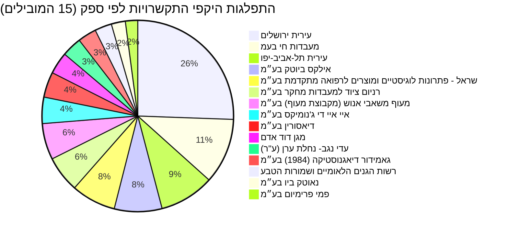

# נתוני תקציב, התקשרויות והחלטות ממשלה בתחום טיפת חלב

תחום "טיפת חלב" בישראל, הממוקד בבריאות האם והילד, מנוהל בעיקר תחת [משרד הבריאות](https://next.obudget.org/i/60453078daf7). ניתוח נתוני התקציב לאורך השנים מראה מגמת עלייה עקבית הן בתקציב המתוכנן והן בתקציב המנוצל, מה שמעיד על הרחבת הפעילות וההשקעה בתחום חשוב זה. בשנת 2025, התקציב המוקצה לנושאים רוחביים הקשורים לבריאות הציבור תחת משרד הבריאות עומד על עשרות מיליארדי שקלים, כאשר פריטים ספציפיים כמו "רפואה מונעת" (24.16.03) ו"לשכות הבריאות" (24.16.90) מהווים חלק בלתי נפרד מתמיכה בשירותי טיפת חלב. נתוני ההתקשרויות חושפים כי עיריות וספקים שונים מעורבים באופן מהותי במתן השירותים ובאחזקת המערך, כאשר עיריות ירושלים ותל אביב-יפו בולטות בהיקפי התקשרויות משמעותיים.

## מגמה תקציבית לאורך זמן

להלן סקירה של נתוני תקציב "טיפת חלב" לאורך השנים, המדגימה את התפתחות ההשקעה והניצול התקציבי בתחום:

| שנה | תקציב מתוכנן (₪) | תקציב מתוקן (₪) | תקציב מנוצל (₪) |
|---|---|---|---|
| 2011 | 35,710,000.0 | 36,078,000.0 | 36,076,082.0 |
| 2012 | 35,710,000.0 | 36,710,000.0 | 36,684,962.0 |
| 2013 | 35,584,000.0 | 37,250,000.0 | 37,216,555.0 |
| 2014 | 36,184,000.0 | 38,045,000.0 | 37,198,136.0 |
| 2015 | 36,184,000.0 | 38,656,000.0 | 36,772,201.0 |
| 2016 | 36,727,000.0 | 45,108,000.0 | 43,617,075.0 |
| 2017 | 37,013,000.0 | 45,084,000.0 | 43,911,098.0 |
| 2018 | 37,733,000.0 | 47,724,000.0 | 44,295,159.0 |
| 2019 | 38,483,000.0 | 48,652,000.0 | 46,491,719.0 |
| 2020 | null | 50,683,000.0 | 48,824,089.0 |
| 2021 | 48,162,000.0 | 46,793,000.0 | 45,425,424.0 |
| 2022 | 44,162,000.0 | 49,500,000.0 | 46,286,360.0 |
| 2023 | 47,162,000.0 | 53,000,000.0 | 50,502,511.0 |
| 2024 | 60,162,000.0 | 68,784,000.0 | 60,289,052.0 |
| 2025 | 67,412,000.0 | 93,356,000.0 | 64,541,489.0 |
| 2026 | 70,138,000.0 | 70,138,000.0 | null |

[להורדת הנתונים המלאים](https://next.obudget.org/api/download?query=U0VMRUNUIHllYXIsIFNVTShhbW91bnRfYWxsb2NhdGVkKSBBUyB0b3RhbF9hbGxvY2F0ZWQsIFNVTShhbW91bnRfcmV2aXNlZCkgQVMgdG90YWxfcmV2aXNlZCwgU1VNKGFtb3VudF91c2VkKSBBUyB0b3RhbF91c2VkIEZST00gYnVkZ2V0X2l0ZW1zX2RhdGEgV0hFUkUgY29kZSBJTiAoJzI0LjE2LjAzLjYyJywgJzI0LjE2LjAxLjYyJykgR1JPVVAgQlkgeWVhciBPUkVSQkkgY29kZSBJTiAnMjQuMTYuMDMuNjInIG9yIGNvZGUgPSAnMjQuMTYuMDEuNjInIE9SREVSIEJZIHllYXI&headers=year%3Btotal_allocated%3Btotal_revised%3Btotal_used)

## תכניות פעילות כיום

### התפלגות היקפי התקשרויות לפי ספק (15 הספקים המובילים)

## מקורות תקציב

סעיפי התקציב ההיררכיים ומבנה התוכניות עבור הנושא 'טיפת חלב' לשנת 2025, עם תקציב מוקצה של 50,000,000 ש"ח ומעלה, מראים כי התחום הוא חלק אינטגרלי מפעילות [משרד הבריאות](https://next.obudget.org/i/60453078daf7). פריטי תקציב גדולים כמו "קופות חולים ובתי חולים" ([24.20](https://next.obudget.org/i/11e02549e085)) ו"רכש שירותי בריאות" ([24.07](https://next.obudget.org/i/212d53c87756)) מכילים בתוכם גם תמיכה בפעילויות רוחביות שמשרתות את שירותי טיפת חלב, בעוד סעיפים כמו "שירותי בריאות הציבור" ([24.16](https://next.obudget.org/i/4e175766f4d1)) ו"רפואה מונעת" ([24.16.03](https://next.obudget.org/i/57c73b370088)) קשורים ישירות לליבת הפעילות.

```mermaid
graph TD
    id_24["<a href='https://next.obudget.org/i/60453078daf7'>24 - משרד הבריאות</a>"] --> id_24_20["<a href='https://next.obudget.org/i/11e02549e085'>24.20 - קופות חולים ובתי חולים</a>"]
    id_24_20 --> id_24_20_03["<a href='https://next.obudget.org/i/2dadf7ab5fbd'>24.20.03 - קופות ובתי חולים –</a>"]
    id_24 --> id_24_07["<a href='https://next.obudget.org/i/212d53c87756'>24.07 - רכש שירותי בריאות</a>"]
    id_24_07 --> id_24_07_14["<a href='https://next.obudget.org/i/d95353bdb999'>24.07.14 - בריאות הנפש</a>"]
    id_24_07 --> id_24_07_10["<a href='https://next.obudget.org/i/c547b144437d'>24.07.10 - גריאטריה</a>"]
    id_24_07 --> id_24_07_09["<a href='https://next.obudget.org/i/a8ef75a5efde'>24.07.09 - פעולות מרכזיות</a>"]
    id_24_07 --> id_24_07_01["<a href='https://next.obudget.org/i/5f4c141beba9'>24.07.01 - הכשרות צוותים רפואיים</a>"]
    id_24 --> id_24_16["<a href='https://next.obudget.org/i/4e175766f4d1'>24.16 - שירותי בריאות הציבור</a>"]
    id_24_16 --> id_24_16_03["<a href='https://next.obudget.org/i/57c73b370088'>24.16.03 - רפואה מונעת</a>"]
    id_24_16 --> id_24_16_90["<a href='https://next.obudget.org/i/0fd929b3d45c'>24.16.90 - לשכות הבריאות</a>"]
    id_24 --> id_24_02["<a href='https://next.obudget.org/i/2f26bdf98224'>24.02 - משרד ראשי</a>"]
    id_24_02 --> id_24_02_05["<a href='https://next.obudget.org/i/91ef138f3be2'>24.02.05 - תפעול מטה</a>"]
    id_24_02 --> id_24_02_01["<a href='https://next.obudget.org/i/6083c79879f3'>24.02.01 - שכר מטה</a>"]
    id_24 --> id_24_50["<a href='https://next.obudget.org/i/7f701b066562'>24.50 - מרכזים רפואיים</a>"]
    id_24_50 --> id_24_50_03["<a href='https://next.obudget.org/i/a739808dace6'>24.50.03 - מרכז גריאטרי פרדס חנה</a>"]
    id_24_50 --> id_24_50_01["<a href='https://next.obudget.org/i/138ffab155be'>24.50.01 - מרכז גריאטרי נתניה</a>"]
    id_24_50 --> id_24_50_04["<a href='https://next.obudget.org/i/ca37a7c1b8a5'>24.50.04 - מרכז גריאטרי שמואל</a>"]
```

### רשימת סעיפי תקציב נבחרים (עם קישורים)
- [24 - משרד הבריאות](https://next.obudget.org/i/60453078daf7)
    - [24.20 - קופות חולים ובתי חולים](https://next.obudget.org/i/11e02549e085)
        - [24.20.03 - קופות ובתי חולים –](https://next.obudget.org/i/2dadf7ab5fbd)
    - [24.07 - רכש שירותי בריאות](https://next.obudget.org/i/212d53c87756)
        - [24.07.14 - בריאות הנפש](https://next.obudget.org/i/d95353bdb999)
        - [24.07.10 - גריאטריה](https://next.obudget.org/i/c547b144437d)
        - [24.07.09 - פעולות מרכזיות](https://next.obudget.org/i/a8ef75a5efde)
        - [24.07.01 - הכשרות צוותים רפואיים](https://next.obudget.org/i/5f4c141beba9)
    - [24.16 - שירותי בריאות הציבור](https://next.obudget.org/i/4e175766f4d1)
        - [24.16.03 - רפואה מונעת](https://next.obudget.org/i/57c73b370088)
        - [24.16.90 - לשכות הבריאות](https://next.obudget.org/i/0fd929b3d45c)
    - [24.02 - משרד ראשי](https://next.obudget.org/i/2f26bdf98224)
        - [24.02.05 - תפעול מטה](https://next.obudget.org/i/91ef138f3be2)
        - [24.02.01 - שכר מטה](https://next.obudget.org/i/6083c79879f3)
    - [24.50 - מרכזים רפואיים](https://next.obudget.org/i/7f701b066562)
        - [24.50.03 - מרכז גריאטרי פרדס חנה](https://next.obudget.org/i/a739808dace6)
        - [24.50.01 - מרכז גריאטרי נתניה](https://next.obudget.org/i/138ffab155be)
        - [24.50.04 - מרכז גריאטרי שמואל](https://next.obudget.org/i/ca37a7c1b8a5)

## נושאים נוספים

### התקשרויות/חוזים
להלן רשימת ההתקשרויות הגדולות ביותר של משרד הבריאות הקשורות באופן ישיר או עקיף ל"טיפת חלב", לרבות רכש שירותים וציוד:

| מטרה | משרד רוכש | שם ספק | נפח (₪) | בוצע (₪) | שנת התחלה | שנת סיום | קישור לפריט |
|---|---|---|---|---|---|---|---|
| הגדלת מלאי ברזל | משרד הבריאות | [מעבדות חי בעמ](https://next.obudget.org/i/85bafba0b0c0) | 96,578,979.01 | 93,926,278.63 | 2020 | 2020 | [לינק](https://next.obudget.org/i/85bafba0b0c0) |
| הרחבה ופיתוח - כפר שיקומי - עלה נגב | משרד הבריאות | [עדי נגב- נחלת ערן (ע"ר)](https://next.obudget.org/i/e9427a8091b4) | 36,000,000.0 | 0.0 | 2018 | 2025 | [לינק](https://next.obudget.org/i/e9427a8091b4) |
| השתתפות בטיפות חלב 70:30 לשנת 2024 | משרד הבריאות | [עירית ירושלים](https://next.obudget.org/i/d4af4b3ce6d8) | 30,711,025.0 | 0.0 | 2024 | 2024 | [לינק](https://next.obudget.org/i/d4af4b3ce6d8) |
| העסקת 350 סלקטורים דרך חברת מעוף לכח אדם עבור תחקיר אפדימיולוגי במשבר קורונה | משרד הבריאות | [מעוף משאבי אנוש (מקבוצת מעוף) בע״מ](https://next.obudget.org/i/bd49ec8c4c64) | 30,594,072.6 | 30,594,072.6 | 2020 | 2023 | [לינק](https://next.obudget.org/i/bd49ec8c4c64) |
| העסקת 350 סלקטורים דרך חברת מעוף לכח אדם עבור תחקיר אפדימיולוגי במשבר קורונה | משרד הבריאות | [מעוף משאבי אנוש (מקבוצת מעוף) בע״מ](https://next.obudget.org/i/e79f10d062a5) | 30,594,072.6 | 30,594,072.6 | 2020 | 2022 | [לינק](https://next.obudget.org/i/e79f10d062a5) |
| השתתפות בטיפות חלב 70:30 | משרד הבריאות | [עירית ירושלים](https://next.obudget.org/i/f93404381692) | 29,331,076.0 | 29,331,076.0 | 2023 | 2023 | [לינק](https://next.obudget.org/i/f93404381692) |
| שירות טיפת חלב בעיר במסגרת 70:30 | משרד הבריאות | [עירית ירושלים](https://next.obudget.org/i/7eb0554b6e88) | 28,117,678.0 | 28,117,677.0 | 2021 | 2021 | [לינק](https://next.obudget.org/i/7eb0554b6e88) |
| השתתפות בטיפות חלב 70:30 | משרד הבריאות | [עירית ירושלים](https://next.obudget.org/i/bc76aeafee2f) | 27,742,676.0 | 0.0 | 2022 | 2022 | [לינק](https://next.obudget.org/i/bc76aeafee2f) |
| השתתפות בטיפות חלב 70:30 | משרד הבריאות | [עירית ירושלים](https://next.obudget.org/i/270ea230ab58) | 27,295,255.0 | 27,295,255.0 | 2020 | 2020 | [לינק](https://next.obudget.org/i/270ea230ab58) |
| הפעלת מוקד בנתב"ג ובדיקות הדבקות בנגיף הקורונה בקהילה | משרד הבריאות | [מגן דוד אדם](https://next.obudget.org/i/de2461d4ab2b) | 26,836,000.0 | 0.0 | 2020 | 2020 | [לינק](https://next.obudget.org/i/de2461d4ab2b) |
| השתתפות משרד הבריאות בשירותי טיפות חלב 70:30 לשנת 2019 | משרד הבריאות | [עירית ירושלים](https://next.obudget.org/i/d101fc71a2fc) | 26,017,335.0 | 26,017,335.0 | 2019 | 2020 | [לינק](https://next.obudget.org/i/d101fc71a2fc) |
| השתתפות משרד הבריאות בשירותי טיפות חלב 70:30 לשנת 2018 | משרד הבריאות | [עירית ירושלים](https://next.obudget.org/i/2b1f68bbb53d) | 25,616,758.0 | 25,616,758.0 | 2018 | 2019 | [לינק](https://next.obudget.org/i/2b1f68bbb53d) |
| השתתפות בשירותי טיפות חלב 70:30 | משרד הבריאות | [עירית ירושלים](https://next.obudget.org/i/72a032ad4a4e) | 25,240,564.0 | 25,240,564.0 | 2017 | 2017 | [לינק](https://next.obudget.org/i/72a032ad4a4e) |
| הזמנת ריאגנטים | משרד הבריאות | [רניום ציוד למעבדות מחקר בע״מ](https://next.obudget.org/i/8fe0fe5a7a10) | 23,318,655.75 | 23,318,655.75 | 2020 | 2020 | [לינק](https://next.obudget.org/i/8fe0fe5a7a10) |
| השתתפות בשירותי טיפות חלב 70:30 | משרד הבריאות | [עירית ירושלים](https://next.obudget.org/i/5a1473434c3f) | 23,077,131.0 | 23,077,131.7 | 2016 | 2016 | [לינק](https://next.obudget.org/i/5a1473434c3f) |
| הזמנת ריאגנטים | משרד הבריאות | [איי איי די ג'נומיקס בע״מ](https://next.obudget.org/i/91a7a060371a) | 22,234,680.0 | 22,234,680.0 | 2020 | 2020 | [לינק](https://next.obudget.org/i/91a7a060371a) |
| הזמנת ריאגנטים | משרד הבריאות | [איי איי די ג'נומיקס בע״מ](https://next.obudget.org/i/df5a4e83ccf8) | 22,234,680.0 | 22,234,680.0 | 2020 | 2020 | [לינק](https://next.obudget.org/i/df5a4e83ccf8) |
| השתתפות בשירותי טיפת חלב עיריית ירושלים | משרד הבריאות | [עירית ירושלים](https://next.obudget.org/i/918f67be997f) | 21,000,000.0 | 20,729,693.0 | 2015 | 2015 | [לינק](https://next.obudget.org/i/918f67be997f) |
| בשל התפרצות נגיף הקורונה | משרד הבריאות | [אילקס ביוטק בע״מ](https://next.obudget.org/i/4a2d534f6064) | 16,836,013.92 | 16,836,013.95 | 2020 | 2020 | [לינק](https://next.obudget.org/i/4a2d534f6064) |
| בשל התפרצות נגיף הקורונה | משרד הבריאות | [אילקס ביוטק בע״מ](https://next.obudget.org/i/d6829d6319ce) | 16,836,013.92 | 16,836,013.95 | 2020 | 2020 | [לינק](https://next.obudget.org/i/d6829d6319ce) |
| קורונה - רכישת מכשירי בדיקה "סופיה" | משרד הבריאות | [שראל - פתרונות לוגיסטיים ומוצרים לרפואה מתקדמת בע״מ](https://next.obudget.org/i/c11866999543) | 15,525,976.05 | 15,680,300.82 | 2020 | 2020 | [לינק](https://next.obudget.org/i/c11866999543) |
| קורונה - רכישת מכשירי בדיקה "סופיה" | משרד הבריאות | [שראל - פתרונות לוגיסטיים ומוצרים לרפואה מתקדמת בע״מ](https://next.obudget.org/i/d2e06f3111a6) | 15,525,976.05 | 15,680,300.82 | 2020 | 2020 | [לינק](https://next.obudget.org/i/d2e06f3111a6) |
| עבור רכש השלמה לסוף שנה של ראגנטים | משרד הבריאות | [אילקס ביוטק בע״מ](https://next.obudget.org/i/44604d9ba412) | 15,275,109.84 | 15,275,109.75 | 2020 | 2020 | [לינק](https://next.obudget.org/i/44604d9ba412) |
| הזמנת ריאגנטים | משרד הבריאות | [רניום ציוד למעבדות מחקר בע״מ](https://next.obudget.org/i/8827f57b4e54) | 15,036,941.79 | 0.0 | 2020 | 2020 | [לינק](https://next.obudget.org/i/8827f57b4e54) |
| הוצאות תחנת אם וילד בתל-אביב | משרד הבריאות | [עירית תל-אביב-יפו](https://next.obudget.org/i/53769831dd28) | 14,551,975.0 | 14,551,975.0 | 2020 | 2020 | [לינק](https://next.obudget.org/i/53769831dd28) |
| עבור רכישת ריאגנטים | משרד הבריאות | [דיאסורין בע״מ](https://next.obudget.org/i/051a61844115) | 14,042,609.8 | 13,740,880.57 | 2020 | 2020 | [לינק](https://next.obudget.org/i/051a61844115) |
| עבור רכישת ריאגנטים | משרד הבריאות | [דיאסורין בע״מ](https://next.obudget.org/i/22df5e14e7f7) | 14,042,609.8 | 0.0 | 2020 | 2020 | [לינק](https://next.obudget.org/i/22df5e14e7f7) |
| עבור רכש השלמה לסוף שנה של ראגנטים | משרד הבריאות | [אילקס ביוטק בע״מ](https://next.obudget.org/i/6da775be1b37) | 13,256,274.84 | 0.0 | 2020 | 2020 | [לינק](https://next.obudget.org/i/6da775be1b37) |
| השתתפות הו"צ טיפות חלב 2023 | משרד הבריאות | [עירית תל-אביב-יפו](https://next.obudget.org/i/e9a8034c78d7) | 12,767,521.0 | 12,767,521.0 | 2023 | 2023 | [לינק](https://next.obudget.org/i/e9a8034c78d7) |
| עבור רכישת רובטוים וביצוע ביקות קורונה בשיטת פולינג | משרד הבריאות | [נאוטק ביו בע״מ](https://next.obudget.org/i/5f2332eb9032) | 12,718,248.66 | 12,678,679.15 | 2020 | 2021 | [לינק](https://next.obudget.org/i/5f2332eb9032) |
| עבור רכישת רובטוים וביצוע ביקות קורונה בשיטת פולינג | משרד הבריאות | [נאוטק ביו בע״מ](https://next.obudget.org/i/459e6a0990ce) | 12,614,539.86 | 12,562,067.33 | 2020 | 2021 | [לינק](https://next.obudget.org/i/459e6a0990ce) |
| השתתפות הו"צ טיפות חלב 2022 | משרד הבריאות | [עירית תל-אביב-יפו](https://next.obudget.org/i/1b22446ab28f) | 12,564,764.0 | 12,564,764.0 | 2021 | 2022 | [לינק](https://next.obudget.org/i/1b22446ab28f) |
| רכש דחוף קיטים למכונות בדיקה | משרד הבריאות | [רניום ציוד למעבדות מחקר בע״מ](https://next.obudget.org/i/dc86a8f31db9) | 12,455,820.0 | 12,455,820.0 | 2020 | 2020 | [לינק](https://next.obudget.org/i/dc86a8f31db9) |
| 100 אלף בדיקות POC למכשיר סופיה | משרד הבריאות | [שראל - פתרונות לוגיסטיים ומוצרים לרפואה מתקדמת בע״מ](https://next.obudget.org/i/7ab2dedf89b6) | 11,970,363.6 | 11,995,355.99 | 2020 | 2020 | [לינק](https://next.obudget.org/i/7ab2dedf89b6) |
| 100 אלף בדיקות POC למכשיר סופיה | משרד הבריאות | [שראל - פתרונות לוגיסטיים ומוצרים לרפואה מתקדמת בע״מ](https://next.obudget.org/i/528d5e891382) | 11,970,363.6 | 11,995,355.99 | 2020 | 2020 | [לינק](https://next.obudget.org/i/528d5e891382) |
| רכישת קיטים ריאגנטים למכונות הפקת בדיקות קורונה | משרד הבריאות | [אילקס ביוטק בע״מ](https://next.obudget.org/i/1dff9ce1d0c2) | 11,536,200.0 | 0.0 | 2020 | 2020 | [לינק](https://next.obudget.org/i/1dff9ce1d0c2) |
| רכישת קיטים ריאגנטים למכונות הפקת בדיקות קורונה | משרד הבריאות | [אילקס ביוטק בע״מ](https://next.obudget.org/i/c80e974077b4) | 11,536,200.0 | 11,536,200.0 | 2020 | 2020 | [לינק](https://next.obudget.org/i/c80e974077b4) |
| הוצאות תחנות אם וילד בתל-אביב | משרד הבריאות | [עירית תל-אביב-יפו](https://next.obudget.org/i/34812960e0ed) | 11,401,109.0 | 11,401,109.0 | 2018 | 2018 | [לינק](https://next.obudget.org/i/34812960e0ed) |
| העברה תקציבית | משרד הבריאות | [עירית תל-אביב-יפו](https://next.obudget.org/i/67fb53e1f575) | 11,127,794.0 | 11,127,794.0 | 2017 | 2017 | [לינק](https://next.obudget.org/i/67fb53e1f575) |
| רכישת קיטים למכונות לבדיקת קורונה | משרד הבריאות | [רניום ציוד למעבדות מחקר בע״מ](https://next.obudget.org/i/c70ccf0a1b75) | 10,717,785.0 | 10,717,785.0 | 2020 | 2020 | [לינק](https://next.obudget.org/i/c70ccf0a1b75) |
| בשל התפרצות נגיף הקורונה | משרד הבריאות | [מעבדות חי בעמ](https://next.obudget.org/i/112dc4676648) | 10,532,493.15 | 10,521,825.11 | 2020 | 2021 | [לינק](https://next.obudget.org/i/112dc4676648) |
| בשל התפרצות נגיף הקורונה | משרד הבריאות | [מעבדות חי בעמ](https://next.obudget.org/i/191694c44052) | 10,532,493.15 | 10,521,825.11 | 2020 | 2021 | [לינק](https://next.obudget.org/i/191694c44052) |
| הוצאות תחנת אם וילד בתל אביב | משרד הבריאות | [עירית תל-אביב-יפו](https://next.obudget.org/i/717862281ab7) | 10,000,000.0 | 10,000,000.0 | 2019 | 2019 | [לינק](https://next.obudget.org/i/717862281ab7) |
| רכש דחוף קיטים למכונות בדיקה | משרד הבריאות | [גאמידור דיאגנוסטיקה (1984) בע״מ](https://next.obudget.org/i/0b071afe3e0d) | 9,860,433.57 | 9,913,479.93 | 2020 | 2020 | [לינק](https://next.obudget.org/i/0b071afe3e0d) |
| העברה תקציבית | משרד הבריאות | [עירית תל-אביב-יפו](https://next.obudget.org/i/95aa3e88d51b) | 9,219,803.0 | 9,219,803.0 | 2015 | 2015 | [לינק](https://next.obudget.org/i/95aa3e88d51b) |
| בשל התפרצות נגיף הקורונה רכש ריאנגטים | משרד הבריאות | [גאמידור דיאגנוסטיקה (1984) בע״מ](https://next.obudget.org/i/57c706411b9c) | 9,146,046.28 | 9,039,556.41 | 2020 | 2020 | [לינק](https://next.obudget.org/i/57c706411b9c) |
| בשל התפרצות נגיף הקורונה רכש ריאנגטים | משרד הבריאות | [גאמידור דיאגנוסטיקה (1984) בע״מ](https://next.obudget.org/i/22da0dd1003e) | 9,146,046.28 | 9,039,556.41 | 2020 | 2020 | [לינק](https://next.obudget.org/i/22da0dd1003e) |
| פיקוח ניטור וברק על השקייה בקולחין לשנת 2021 | משרד הבריאות | [רשות הגנים הלאומיים ושמורות הטבע](https://next.obudget.org/i/8cbf6efb0d98) | 9,009,000.0 | 8,916,242.0 | 2019 | 2021 | [לינק](https://next.obudget.org/i/8cbf6efb0d98) |
| עבור רכישת ריאגנטים | משרד הבריאות | [דיאסורין בע״מ](https://next.obudget.org/i/632741b10432) | 8,874,157.5 | 8,571,738.74 | 2020 | 2020 | [לינק](https://next.obudget.org/i/632741b10432) |
| עבור רכישת ריאגנטים | משרד הבריאות | [דיאסורין בע״מ](https://next.obudget.org/i/4269246991e1) | 8,874,157.5 | 8,571,738.74 | 2020 | 2020 | [לינק](https://next.obudget.org/i/4269246991e1) |

[להורדת נתוני ההתקשרויות המלאים](https://next.obudget.org/api/download?query=U0VMRUNUIHB1cnBvc2UsIHB1cmNoYXNpbmdfbWluaXN0cnksIHN1cHBsaWVyX2VudGl0eV9uYW1lLCB2b2x1bWUsIGV4ZWN1dGVkLCBzdGFydF95ZWFyLCBlbmRfeWVhciwgaXRlbV91cmwgRlJPTSBjb250cmFjdHNfZGF0YSBXSEVSRSAoYnVkZ2V0X2NvZGUgSU4gKCcyNC4xNi4wMy42MicsICc2Ny4yNS4wMy4xMCcsICcyNC4xNi4wMy4wMycsICcyNC4xNi4wNi4wOCcpIEFORCBwdXJjaGFzaW5nX21pbmlzdHJ5ID0gJ9ee16nXqNeTINeU15HXqNeZ15DXldeqJykgT1JERVIgQlkgdm9sdW1lIERFU0MgTElNSVQgNTA%3D&headers=purpose%3Bpurchasing_ministry%3Bsupplier_entity_name%3Bvolume%3Bexecuted%3Bstart_year%3Bend_year%3Bitem_url)

### ספקים
סיכום התקשרויות לפי ספק, המציג את 50 הספקים המובילים הקשורים לפעילות משרד הבריאות וטיפת חלב:

| שם ספק | סך נפח (₪) |
|---|---|
| עירית ירושלים | 273,439,417.07 |
| מעבדות חי בעמ | 118,490,708.31 |
| עירית תל-אביב-יפו | 99,060,173.0 |
| אילקס ביוטק בע״מ | 86,060,329.74 |
| שראל - פתרונות לוגיסטיים ומוצרים לרפואה מתקדמת בע״מ | 80,456,804.69 |
| רניום ציוד למעבדות מחקר בע״מ | 65,527,610.19 |
| מעוף משאבי אנוש (מקבוצת מעוף) בע״מ | 65,428,810.05 |
| איי איי די ג'נומיקס בע״מ | 47,599,110.0 |
| דיאסורין בע״מ | 45,833,534.6 |
| מגן דוד אדם | 39,634,572.0 |
| עדי נגב- נחלת ערן (ע"ר) | 36,000,000.0 |
| גאמידור דיאגנוסטיקה (1984) בע״מ | 33,599,791.73 |
| רשות הגנים הלאומיים ושמורות הטבע | 30,618,000.0 |
| נאוטק ביו בע״מ | 25,356,650.75 |
| פמי פרימיום בע״מ | 22,294,827.42 |
| מילגם בע״מ | 20,639,440.37 |
| עירית פתח תקוה | 13,211,356.7 |
| שירותי בריאות כללית | 11,798,380.2 |
| מדיסון פארמה בע״מ | 10,717,855.2 |
| מטריקס אי. טי. מערכות מידע מתקדמות בע״מ | 9,810,761.77 |
| קרן מחקרים רפואיים ופיתוח תשתית ושרותי בריאות - ליד המרכז הרפואי ע"ש א. וולפסון, חולון (ע"ר) | 9,580,100.0 |
| וואן ליין בע״מ | 9,132,201.13 |
| משרד רוה"מ/לשכת הפרסום הממשלתית | 8,600,000.0 |
| עמותת חאג' עיסא ג'ועבה (ע"ר) | 8,567,500.0 |
| עירית באר שבע | 8,230,801.7 |
| עירית בני ברק | 5,903,965.0 |
| מרטנס יועצי מחשוב בע״מ | 5,689,209.56 |
| מ.א. אל קסום | 5,668,353.16 |
| מדיקר בריאות (נובולוג) בע״מ | 5,599,999.95 |
| עירית רמת גן | 4,815,908.3 |
| מגן דוד אדום בישראל | 4,700,000.0 |
| עירית נתיבות | 4,471,109.9 |
| עירית אופקים | 4,250,000.0 |
| עדי ירושלים (ע"ר) | 4,000,000.0 |
| משרד החינוך והתרבות/המשרד הראשי | 3,800,000.0 |
| מ. מ. תל שבע | 3,700,000.0 |
| דין דיאגנוסטיקה בע״מ | 3,494,049.14 |
| סטארלימס מערכות בע״מ | 3,150,296.37 |
| טרי בי ווי בע״מ | 3,100,500.0 |
| מ. מ. מג'אר | 3,044,044.4 |
| קרן מחקרים רפואיים, פיתוח תשתית ושרותי בריאות - ליד המרכז הרפואי בני ציון (ע"ר) | 2,900,000.0 |
| קולפלו תוכנה בע״מ | 2,888,126.01 |
| עירית שדרות | 2,800,000.0 |
| בית בריאות האשה - בשבילך (ע"ר) | 2,500,000.0 |
| מ.נ.ש יעוץ בע״מ | 2,499,998.8 |
| קנדו שרותי סביבה בע״מ | 2,494,335.0 |
| מלם מערכות בע״מ | 2,353,378.95 |
| ג'ון ברייס הדרכה בע״מ | 2,351,975.14 |
| חברת מאזני שקל 2008 בע״מ | 2,340,272.93 |
| מרכז השלטון המקומי בישראל (ע"ר) | 2,200,000.0 |

[להורדת נתוני סיכום ההתקשרויות לפי ספק](https://next.obudget.org/api/download?query=U0VMRUNUIHN1cHBsaWVyX2VudGl0eV9uYW1lLCBTVU0odm9sdW1lKSBBUyB0b3RhbF92b2x1bWUgRlJPTSBjb250cmFjdHNfZGF0YSBXSEVSRSAoYnVkZ2V0X2NvZGUgSU4gKCcyNC4xNi4wMy42MicsICc2Ny4yNS4wMy4xMCcsICcyNC4xNi4wMy4wMycsICcyNC4xNi4wNi4wOCcpIEFORCBwdXJjaGFzaW5nX21pbmlzdHJ5ID0gJ9ee16nXqNeTINeU15HXqNeZ15DXldeqJykgR1JPVVAgQlkgc3VwcGxpZXJfZW50aXR5X25hbWUgT1JERVIgQlkgdG90YWxfdm9sdW1lIERFU0MgTElNSVQgNTA%3D&headers=supplier_entity_name%3Btotal_volume)

### החלטות ממשלה
החלטות ממשלה רלוונטיות לתחומי בריאות הציבור, רווחה, וחיזוק קהילתי, שיכולות להשפיע באופן עקיף או ישיר על שירותי טיפת חלב:

| כותרת | ממשלה | מס' החלטה | תאריך פרסום |
|---|---|---|---|
| [שיפור השירותים בתחום הבריאות, הרווחה, החינוך ותרבות הפנאי בירושלים](https://next.obudget.org/i/aaf6d3f84db7) | הממשלה ה- 34, בנימין נתניהו | 1487 | 2016-06-02 |
| [תכנית רב שנתית לפיתוח הדרום](https://next.obudget.org/i/f093a9cdb036) | null | 2025 | 2014-09-23 |
| [סיוע בהקמת העיר חריש](https://next.obudget.org/i/2dd9d04f1036) | הממשלה ה- 34, בנימין נתניהו | 870 | 2015-12-20 |
| [ייעול והסדרת עבודת הממשלה בתחום מוסדות הציבור](https://next.obudget.org/i/7196b9c0a116) | הממשלה ה- 34, בנימין נתניהו | 1842 | 2016-08-11 |
| [הקצאת מקרקעין לשם הקמת קריית חינוך בירושלים - כפר עקב](https://next.obudget.org/i/c5abb625de91) | הממשלה ה- 36, נפתלי בנט | 1520 | 2022-05-29 |
| [תכנית לחיזוק החוסן האזרחי בשדרות וביישובי "עוטף רצועת עזה" לשנים 2021 - 2022 ותיקון החלטות ממשלה](https://next.obudget.org/i/b07788cbc0ce) | הממשלה ה- 35, בנימין נתניהו | 566 | 2020-11-22 |
| [תכנית להאצת השירותים הדיגיטליים לציבור ולקידום הלמידה הדיגיטלית ותיקון החלטת ממשלה](https://next.obudget.org/i/09435f972deb) | הממשלה ה- 35, בנימין נתניהו | 260 | 2020-07-26 |
| [מדיניות ממשלתית להתמודדות עם הפוליגמיה - יישום ומעקב אחר עקרונות דו"ח הצוות הבין-משרדי  להתמודדות עם השלכותיה השליליות של הפוליגמיה](https://next.obudget.org/i/6bbb96505de9) | הממשלה ה- 34, בנימין נתניהו | 4211 | 2018-10-25 |
| [הגדרת אזורים שבהם שיעור מסתננים גבוה כאזורי עדיפות לאומית](https://next.obudget.org/i/caa064715411) | הממשלה ה- 34, בנימין נתניהו | 4023 | 2018-07-23 |

## מקורות
- **נתוני תקציב מצרפיים**: [נתונים מלאים של תקציב טיפת חלב לפי שנים](https://next.obudget.org/api/download?query=U0VMRUNUIHllYXIsIFNVTShhbW91bnRfYWxsb2NhdGVkKSBBUyB0b3RhbF9hbGxvY2F0ZWQsIFNVTShhbW91bnRfcmV2aXNlZCkgQVMgdG90YWxfcmV2aXNlZCwgU1VNKGFtb3VudF91c2VkKSBBUyB0b3RhbF91c2VkIEZST00gYnVkZ2V0X2l0ZW1zX2RhdGEgV0hFUkUgY29kZSBJTiAoJzI0LjE2LjAzLjYyJywgJzI0LjE2LjAxLjYyJykgR1JPVVAgQlkgeWVhciBPUkVSQkkgY29kZSBJTiAnMjQuMTYuMDMuNjInIG9yIGNvZGUgPSAnMjQuMTYuMDEuNjInIE9SREVSIEJZIHllYXI&headers=year%3Btotal_allocated%3Btotal_revised%3Btotal_used)
- **סעיפי תקציב היררכיים**: [נתונים מלאים של סעיפי תקציב 2025 במשרד הבריאות](https://next.obudget.org/api/download?query=U0VMRUNUIGNvZGUsIHRpdGxlLCBhbW91bnRfYWxsb2NhdGVkLCBsZXZlbCwgaXRlbV91cmwgRlJPTSBidWRnZXRfaXRlbXNfZGF0YSBXSEVSRSB5ZWFyID0gMjAyNSBBTkQgY29kZSBMSUtFICcyNCUnIEFORCBsZXZlbCA8PSAzIEFORCBhbW91bnRfYWxsbG9jYXRlZCA%29PTUwMDAwMDAwIE9SREVSIEJZIGFtb3VudF9hbGxvY2F0ZWQgREVTQw%3D%3D&headers=code%3Btitle%3Bamount_allocated%3Blevel%3Bitem_url)
    - [משרד הבריאות - 24](https://next.obudget.org/i/60453078daf7)
    - [קופות חולים ובתי חולים - 24.20](https://next.obudget.org/i/11e02549e085)
    - [רכש שירותי בריאות - 24.07](https://next.obudget.org/i/212d53c87756)
    - [שירותי בריאות הציבור - 24.16](https://next.obudget.org/i/4e175766f4d1)
    - [משרד ראשי - 24.02](https://next.obudget.org/i/2f26bdf98224)
    - [מרכזים רפואיים - 24.50](https://next.obudget.org/i/7f701b066562)
- **התקשרויות**: [נתוני ההתקשרויות המלאים של משרד הבריאות הקשורות לטיפת חלב](https://next.obudget.org/api/download?query=U0VMRUNUIHB1cnBvc2UsIHB1cmNoYXNpbmdfbWluaXN0cnksIHN1cHBsaWVyX2VudGl0eV9uYW1lLCB2b2x1bWUsIGV4ZWN1dGVkLCBzdGFydF95ZWFyLCBlbmRfeWVhciwgaXRlbV91cmwgRlJPTSBjb250cmFjdHNfZGF0YSBXSEVSRSAoYnVkZ2V0X2NvZGUgSU4gKCcyNC4xNi4wMy42MicsICc2Ny4yNS4wMy4xMCcsICcyNC4xNi4wMy4wMycsICcyNC4xNi4wNi4wOCcpIEFORCBwdXJjaGFzaW5nX21pbmlzdHJ5ID0gJ9ee16nXqNeTINeU15HXqNeZ15DXldeqJykgT1JERVIgQlkgdm9sdW1lIERFU0MgTElNSVQgNTA%3D&headers=purpose%3Bpurchasing_ministry%3Bsupplier_entity_name%3Bvolume%3Bexecuted%3Bstart_year%3Bend_year%3Bitem_url)
- **סיכום התקשרויות לפי ספק**: [נתוני סיכום התקשרויות משרד הבריאות לפי ספקים](https://next.obudget.org/api/download?query=U0VMRUNUIHN1cHBsaWVyX2VudGl0eV9uYW1lLCBTVU0odm9sdW1lKSBBUyB0b3RhbF92b2x1bWUgRlJPTSBjb250cmFjdHNfZGF0YSBXSEVSRSAoYnVkZ2V0X2NvZGUgSU4gKCcyNC4xNi4wMy42MicsICc2Ny4yNS4wMy4xMCcsICcyNC4xNi4wMy4wMycsICcyNC4xNi4wNi4wOCcpIEFORCBwdXJjaGFzaW5nX21pbmlzdHJ5ID0gJ9ee16nXqNeTINeU15HXqNeZ15DXldeqJykgR1JPVVAgQlkgc3VwcGxpZXJfZW50aXR5X25hbWUgT1JERVIgQlkgdG90YWxfdm9sdW1lIERFU0MgTElNSVQgNTA%3D&headers=supplier_entity_name%3Btotal_volume)
- **החלטות ממשלה**:
    - [שיפור השירותים בתחום הבריאות, הרווחה, החינוך ותרבות הפנאי בירושלים](https://next.obudget.org/i/aaf6d3f84db7)
    - [תכנית רב שנתית לפיתוח הדרום](https://next.obudget.org/i/f093a9cdb036)
    - [סיוע בהקמת העיר חריש](https://next.obudget.org/i/2dd9d04f1036)
    - [ייעול והסדרת עבודת הממשלה בתחום מוסדות הציבור](https://next.obudget.org/i/7196b9c0a116)
    - [הקצאת מקרקעין לשם הקמת קריית חינוך בירושלים - כפר עקב](https://next.obudget.org/i/c5abb625de91)
    - [תכנית לחיזוק החוסן האזרחי בשדרות וביישובי "עוטף רצועת עזה" לשנים 2021 - 2022 ותיקון החלטות ממשלה](https://next.obudget.org/i/b07788cbc0ce)
    - [תכנית להאצת השירותים הדיגיטליים לציבור ולקידום הלמידה הדיגיטלית ותיקון החלטת ממשלה](https://next.obudget.org/i/09435f972deb)
    - [מדיניות ממשלתית להתמודדות עם הפוליגמיה - יישום ומעקב אחר עקרונות דו"ח הצוות הבין-משרדי להתמודדות עם השלכותיה השליליות של הפוליגמיה](https://next.obudget.org/i/6bbb96505de9)
    - [הגדרת אזורים שבהם שיעור מסתננים גבוה כאזורי עדיפות לאומית](https://next.obudget.org/i/caa064715411)

[חזרה לעמוד הראשי](../../README.md)