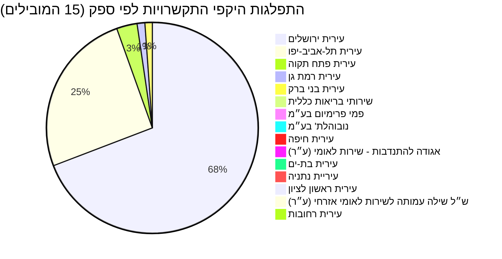

# נתוני תקציב, התקשרויות והחלטות ממשלה בתחום טיפת חלב

מסמך זה מציג נתונים תקציביים, התקשרויות והחלטות ממשלה הנוגעות לנושא **טיפת חלב**. התקציב המוקצה לתחום זה, המנוהל בעיקר על ידי [משרד הבריאות](https://next.obudget.org/i/budget/24), הראה עלייה עקבית לאורך השנים, מ-35.7 מיליון ש"ח בשנת 2011 לכ-70.1 מיליון ש"ח מתוכננים לשנת 2026. עיקר ההתקשרויות בתחום הן מול רשויות מקומיות כמו עיריות ירושלים ותל אביב-יפו, המספקות שירותי טיפת חלב, וכן מול ספקים פרטיים וארגוני שירות לאומי. החלטות ממשלה רלוונטיות נוגעות בין היתר לשיפור שירותי בריאות ורווחה, תכניות פיתוח אזוריות וחיזוק חוסן אזרחי.

## מגמה תקציבית לאורך זמן

| שנה | תקציב מתוכנן (₪) | תקציב מתוקן (₪) | תקציב שנוצל (₪) |
|---|---|---|---|
| 2011 | 35,710,000 | 36,078,000 | 36,076,082 |
| 2012 | 35,710,000 | 36,710,000 | 36,684,962 |
| 2013 | 35,584,000 | 37,250,000 | 37,216,555 |
| 2014 | 36,184,000 | 38,045,000 | 37,198,136 |
| 2015 | 36,184,000 | 38,656,000 | 36,772,201 |
| 2016 | 36,727,000 | 45,108,000 | 43,617,075 |
| 2017 | 37,013,000 | 45,084,000 | 43,911,098 |
| 2018 | 37,733,000 | 47,724,000 | 44,295,159 |
| 2019 | 38,483,000 | 48,652,000 | 46,491,719 |
| 2020 | *אין נתונים* | 50,683,000 | 48,824,089 |
| 2021 | 48,162,000 | 46,793,000 | 45,425,424 |
| 2022 | 44,162,000 | 49,500,000 | 46,286,360 |
| 2023 | 47,162,000 | 53,000,000 | 50,502,511 |
| 2024 | 60,162,000 | 68,784,000 | 60,289,052 |
| 2025 | 67,412,000 | 93,356,000 | 64,541,489 |
| 2026 | 70,138,000 | 70,138,000 | *אין נתונים* |

## תכניות פעילות כיום

### התפלגות היקפי התקשרויות לפי ספק (15 הספקים המובילים)

## מקורות תקציב

הנתונים התקציביים המוצגים בטבלה לעיל עבור "טיפת חלב" כוללים את סעיפי התקציב הספציפיים `24.16.03.62` ו-`24.16.01.62` במשרד הבריאות. מכיוון שלא נמצא פריט תקציבי ברמה 4 עם התיאור המדויק "טיפת חלב" בחיפוש הראשוני, היררכיית התקציב המפורטת לסעיף זה אינה זמינה כרגע. עם זאת, ניתוח ההתקשרויות מצביע על פעילות ענפה מצד משרד הבריאות בשיתוף עם רשויות מקומיות וגורמים נוספים לאספקת שירותים אלו.

### רשימת סעיפי תקציב נבחרים (עם קישורים)
*   **הערה:** היררכיית התקציב המפורטת עבור "טיפת חלב" לא נמצאה באופן ישיר בפריטי התקציב ברמה 4. הנתונים הכוללים מתייחסים לסעיפים [24.16.03.62](https://next.obudget.org/i/budget/24-16-03-62) ו-[24.16.01.62](https://next.obudget.org/i/budget/24-16-01-62) במשרד הבריאות.

## נושאים נוספים

### התקשרויות/חוזים
**50 ההתקשרויות הגבוהות ביותר לפי היקף:**

| Purpose | Purchasing Ministry | Supplier Entity Name | Volume (₪) | Executed (₪) | Start Year | End Year | Item URL |
|---|---|---|---|---|---|---|---|
| השתתפות בטיפות חלב 70:30 לשנת 2024 | משרד הבריאות | עירית ירושלים | 30,711,025.0 | 0.0 | 2024 | 2024 | [קישור](https://next.obudget.org/i/d4af4b3ce6d8) |
| השתתפות בטיפות חלב 70:30 | משרד הבריאות | עירית ירושלים | 29,331,076.0 | 29,331,076.0 | 2023 | 2023 | [קישור](https://next.obudget.org/i/f93404381692) |
| שירות טיפת חלב בעיר במסגרת 70:30 | משרד הבריאות | עירית ירושלים | 28,117,678.0 | 28,117,677.0 | 2021 | 2021 | [קישור](https://next.obudget.org/i/7eb0554b6e88) |
| השתתפות בטיפות חלב 70:30 | משרד הבריאות | עירית ירושלים | 27,742,676.0 | 0.0 | 2022 | 2022 | [קישור](https://next.obudget.org/i/bc76aeafee2f) |
| השתתפות בטיפות חלב 70:30 | משרד הבריאות | עירית ירושלים | 27,295,255.0 | 27,295,255.0 | 2020 | 2020 | [קישור](https://next.obudget.org/i/270ea230ab58) |
| השתתפות משרד הבריאות בשירותי טיפות חלב 70:30 לשנת 2019 | משרד הבריאות | עירית ירושלים | 26,017,335.0 | 26,017,335.0 | 2019 | 2020 | [קישור](https://next.obudget.org/i/d101fc71a2fc) |
| השתתפות משרד הבריאות בשירותי טיפות חלב 70:30 לשנת 2018 | משרד הבריאות | עירית ירושלים | 25,616,758.0 | 25,616,758.0 | 2018 | 2019 | [קישור](https://next.obudget.org/i/2b1f68bbb53d) |
| השתתפות בשירותי טיפות חלב 70:30 | משרד הבריאות | עירית ירושלים | 25,240,564.0 | 25,240,564.0 | 2017 | 2017 | [קישור](https://next.obudget.org/i/72a032ad4a4e) |
| השתתפות בשירותי טיפות חלב 70:30 | משרד הבריאות | עירית ירושלים | 23,077,131.0 | 23,077,131.7 | 2016 | 2016 | [קישור](https://next.obudget.org/i/5a1473434c3f) |
| הוצאות תחנת אם וילד בתל-אביב | משרד הבריאות | עירית תל-אביב-יפו | 14,551,975.0 | 14,551,975.0 | 2020 | 2020 | [קישור](https://next.obudget.org/i/53769831dd28) |
| השתתפות הו"צ טיפות חלב 2023 | משרד הבריאות | עירית תל-אביב-יפו | 12,767,521.0 | 12,767,521.0 | 2023 | 2023 | [קישור](https://next.obudget.org/i/e9a8034c78d7) |
| השתתפות הו"צ טיפות חלב 2022 | משרד הבריאות | עירית תל-אביב-יפו | 12,564,764.0 | 12,564,764.0 | 2021 | 2022 | [קישור](https://next.obudget.org/i/1b22446ab28f) |
| הוצאות תחנות אם וילד בתל-אביב | משרד הבריאות | עירית תל-אביב-יפו | 11,401,109.0 | 11,401,109.0 | 2018 | 2018 | [קישור](https://next.obudget.org/i/34812960e0ed) |
| העברה תקציבית | משרד הבריאות | עירית תל-אביב-יפו | 11,127,794.0 | 11,127,794.0 | 2017 | 2017 | [קישור](https://next.obudget.org/i/67fb53e1f575) |
| הוצאות תחנת אם וילד בתל אביב | משרד הבריאות | עירית תל-אביב-יפו | 10,000,000.0 | 10,000,000.0 | 2019 | 2019 | [קישור](https://next.obudget.org/i/717862281ab7) |
| ע"ח התחשבנות תחנות טיפות חלב | משרד הבריאות | עירית תל-אביב-יפו | 6,900,000.0 | 6,900,000.0 | 2016 | 2016 | [קישור](https://next.obudget.org/i/df52a1113082) |
| העברה תקציבית | משרד הבריאות | עירית תל-אביב-יפו | 5,007,178.0 | 5,007,178.0 | 2016 | 2016 | [קישור](https://next.obudget.org/i/59a06b519994) |
| הוצאות תחנת אם וילד בתל אביב | משרד הבריאות | עירית תל-אביב-יפו | 2,597,095.0 | 2,597,095.0 | 2019 | 2019 | [קישור](https://next.obudget.org/i/819dfd02a428) |
| הוצאות תחנות אם וילד בתל-אביב | משרד הבריאות | עירית תל-אביב-יפו | 2,254,984.0 | 332,625.0 | 2018 | 2018 | [קישור](https://next.obudget.org/i/bd7629fbb87a) |
| שירותי תזונאיות עבור תחנות טיפת חלב ברחבי הארץ באישור החשב | משרד הבריאות | פמי פרימיום בע״מ | 2,149,804.98 | 0.0 | 2019 | 2025 | [קישור](https://next.obudget.org/i/c18d5f14c2a5) |
| עבור הוצאות רפאוה מונעת לשנת 2015 | משרד הבריאות | עירית פתח תקוה | 2,000,000.0 | 1,946,337.0 | 2016 | 2016 | [קישור](https://next.obudget.org/i/d72335b98c3f) |
| עבור הוצאה מונעת לשנת 2022-2023 | משרד הבריאות | עירית פתח תקוה | 1,780,763.0 | 0.0 | 2023 | 2023 | [קישור](https://next.obudget.org/i/f96113029676) |
| עבור הוצאות רפואה מונעת לשנת 2018 | משרד הבריאות | עירית פתח תקוה | 1,775,353.0 | 1,734,344.0 | 2019 | 2020 | [קישור](https://next.obudget.org/i/404092d41db7) |
| עבור הוצאות רפואה מונעת לשנת 2017 | משרד הבריאות | עירית פתח תקוה | 1,775,353.0 | 1,775,353.0 | 2018 | 2019 | [קישור](https://next.obudget.org/i/edcad26e4c50) |
| הוצאות רפואה מונעת לשנת 2017 | משרד הבריאות | עירית פתח תקוה | 1,463,616.0 | 1,463,616.0 | 2017 | 2018 | [קישור](https://next.obudget.org/i/734d03512c43) |
| הקמת תחנת ט"ח בני ברק | משרד הבריאות | עירית בני ברק | 1,175,000.0 | 0.0 | 2022 | 2025 | [קישור](https://next.obudget.org/i/e378fa4f1759) |
| עבור הוצאה מונעת לשנת 2020 | משרד הבריאות | עירית פתח תקוה | 1,098,757.0 | 1,098,757.0 | 2021 | 2021 | [קישור](https://next.obudget.org/i/5d5544836a23) |
| עבור הוצאות רפואה מונעת לשנת 2019 | משרד הבריאות | עירית פתח תקוה | 1,079,288.0 | 1,079,228.0 | 2020 | 2020 | [קישור](https://next.obudget.org/i/642d754b8dd1) |
| הרחבת שירות טיפת חלב בעיר במסגרת 70:30 באישור מנכ"ל משרד הבריאות | משרד הבריאות | עירית ירושלים | 945,000.0 | 0.0 | 2019 | 2020 | [קישור](https://next.obudget.org/i/0713860a8826) |
| עבור מכרז פומבי 117/2023 למתן שירותי טיפות חלב חיוניים במרכזי פינוי אוכלו | משרד הבריאות | נובוהלת' בע״מ | 893,759.99 | 0.0 | 2023 | 2024 | [קישור](https://next.obudget.org/i/c9e9983212a0) |
| הוצאות תחנת אם וילד ברמת גן | משרד הבריאות | עירית רמת גן | 765,118.0 | 765,118.0 | 2022 | 2022 | [קישור](https://next.obudget.org/i/efdd31b50a56) |
| העברה תקציבית | משרד הבריאות | עירית רמת גן | 675,471.0 | 675,471.0 | 2017 | 2017 | [קישור](https://next.obudget.org/i/6a07396ba7c4) |
| השתתפות הו"צ טיפות חלב 2023 | משרד הבריאות | עירית בני ברק | 665,012.0 | 665,012.0 | 2023 | 2023 | [קישור](https://next.obudget.org/i/6729303fd320) |
| שילוב שירותים | משרד הבריאות | שירותי בריאות כללית | 622,000.0 | 622,000.0 | 2018 | 2020 | [קישור](https://next.obudget.org/i/9d0c0ae7ccd9) |
| התחשבנות 70:30 | משרד הבריאות | עירית תל-אביב-יפו | 618,450.0 | 618,450.0 | 2017 | 2017 | [קישור](https://next.obudget.org/i/4005a64c82fc) |
| הוצאות תחנות אם וילד ברמת-גן | משרד הבריאות | עירית רמת גן | 553,227.0 | 553,227.0 | 2018 | 2018 | [קישור](https://next.obudget.org/i/f3382bfaf272) |
| הוצאות תחנת אם וילד בבני-ברק | משרד הבריאות | עירית בני ברק | 524,283.0 | 524,283.0 | 2022 | 2022 | [קישור](https://next.obudget.org/i/3ac6b9a125e5) |
| מימון הפרשי הוצאות תפעול טיפות חלב עיריית ירושלים | משרד הבריאות | עירית ירושלים | 500,000.0 | 500,000.0 | 2016 | 2017 | [קישור](https://next.obudget.org/i/d970edf7f3e8) |
| הוצאות תחנת אם וילד בני ברק | משרד הבריאות | עירית בני ברק | 467,872.0 | 467,872.0 | 2020 | 2020 | [קישור](https://next.obudget.org/i/306362110a62) |
| הוצאות תחנת אם וילד ברמת גן 2023 | משרד הבריאות | עירית רמת גן | 466,403.0 | 466,403.0 | 2023 | 2023 | [קישור](https://next.obudget.org/i/470f829a9bd1) |
| השתתפות בעלות שיפוץ תחנת טיפת חלב | משרד הבריאות | עירית בני ברק | 375,000.0 | 375,000.0 | 2021 | 2021 | [קישור](https://next.obudget.org/i/00e61e1617e3) |
| העברה תקציבית | משרד הבריאות | עירית רמת גן | 374,074.0 | 374,074.0 | 2016 | 2016 | [קישור](https://next.obudget.org/i/e8e77a5ed0b3) |
| הוצאות תחנת אם וילד ברמת-גן | משרד הבריאות | עירית רמת גן | 338,289.0 | 338,289.0 | 2020 | 2020 | [קישור](https://next.obudget.org/i/dfa1a060a666) |
| שילוב שירותים | משרד הבריאות | שירותי בריאות כללית | 311,000.0 | 311,000.0 | 2017 | 2018 | [קישור](https://next.obudget.org/i/35cbcb5dc533) |
| שילוב שירותים לשנת 2020 | משרד הבריאות | שירותי בריאות כללית | 311,000.0 | 311,000.0 | 2020 | 2020 | [קישור](https://next.obudget.org/i/8919c5f0274b) |
| שילוב שירותים לשנת 2021 | משרד הבריאות | שירותי בריאות כללית | 311,000.0 | 311,000.0 | 2021 | 2021 | [קישור](https://next.obudget.org/i/0f42bc32278a) |
| שילוב שירותים | משרד הבריאות | שירותי בריאות כללית | 311,000.0 | 311,000.0 | 2022 | 2022 | [קישור](https://next.obudget.org/i/55087c2b00bf) |
| שילוב שירותים | משרד הבריאות | שירותי בריאות כללית | 311,000.0 | 311,000.0 | 2016 | 2017 | [קישור](https://next.obudget.org/i/a15c2413edc1) |
| תשלום בין משרדים | משרד הבריאות | עירית רמת גן | 309,000.0 | 309,000.0 | 2016 | 2016 | [קישור](https://next.obudget.org/i/27cce8b48884) |
| הוצאות תחנת אם וילד ברמת גן | משרד הבריאות | עירית רמת גן | 300,000.0 | 300,000.0 | 2019 | 2019 | [קישור](https://next.obudget.org/i/483e2368c928) |

### ספקים
**סיכום היקפי התקשרויות לפי ספק:**

| Supplier Entity Name | Total Volume (₪) | Supplier Entity Page |
|---|---|---|
| [עירית ירושלים](https://next.obudget.org/i/org/municipality/500230008) | 244,795,061.12 | [קישור](https://next.obudget.org/i/org/municipality/500230008) |
| [עירית תל-אביב-יפו](https://next.obudget.org/i/org/municipality/500250006) | 89,790,870.0 | [קישור](https://next.obudget.org/i/org/municipality/500250006) |
| [עירית פתח תקוה](https://next.obudget.org/i/org/municipality/500279005) | 11,113,914.7 | [קישור](https://next.obudget.org/i/org/municipality/500279005) |
| [עירית רמת גן](https://next.obudget.org/i/org/municipality/500286000) | 4,195,421.3 | [קישור](https://next.obudget.org/i/org/municipality/500286000) |
| [עירית בני ברק](https://next.obudget.org/i/org/municipality/500261003) | 3,992,621.0 | [קישור](https://next.obudget.org/i/org/municipality/500261003) |
| [שירותי בריאות כללית](https://next.obudget.org/i/org/ottoman-association/589906114) | 2,177,000.0 | [קישור](https://next.obudget.org/i/org/ottoman-association/589906114) |
| [פמי פרימיום בע״מ](https://next.obudget.org/i/org/company/512676206) | 2,149,804.98 | [קישור](https://next.obudget.org/i/org/company/512676206) |
| [נובוהלת' בע״מ](https://next.obudget.org/i/org/company/513060806) | 893,759.99 | [קישור](https://next.obudget.org/i/org/company/513060806) |
| [עירית חיפה](https://next.obudget.org/i/org/municipality/500240007) | 270,421.0 | [קישור](https://next.obudget.org/i/org/municipality/500240007) |
| [אגודה להתנדבות - שירות לאומי (ע״ר)](https://next.obudget.org/i/org/association/580025708) | 268,920.0 | [קישור](https://next.obudget.org/i/org/association/580025708) |
| [עירית בת-ים](https://next.obudget.org/i/org/municipality/500262001) | 248,369.61 | [קישור](https://next.obudget.org/i/org/municipality/500262001) |
| [עיריית נתניה](https://next.obudget.org/i/org/municipality/500274006) | 197,099.74 | [קישור](https://next.obudget.org/i/org/municipality/500274006) |
| [עירית ראשון לציון](https://next.obudget.org/i/org/municipality/500283007) | 166,711.7 | [קישור](https://next.obudget.org/i/org/municipality/500283007) |
| [ש״ל שילה עמותה לשירות לאומי אזרחי (ע״ר)](https://next.obudget.org/i/org/association/580354090) | 163,800.0 | [קישור](https://next.obudget.org/i/org/association/580354090) |
| [עירית רחובות](https://next.obudget.org/i/org/municipality/500284005) | 126,765.7 | [קישור](https://next.obudget.org/i/org/municipality/500284005) |
| [עירית רמלה](https://next.obudget.org/i/org/municipality/500285002) | 98,605.3 | [קישור](https://next.obudget.org/i/org/municipality/500285002) |
| [עירית נצרת](https://next.obudget.org/i/org/municipality/500273008) | 91,195.9 | [קישור](https://next.obudget.org/i/org/municipality/500273008) |
| [עירית חדרה](https://next.obudget.org/i/org/municipality/500265004) | 64,022.0 | [קישור](https://next.obudget.org/i/org/municipality/500265004) |
| [עירית טבריה](https://next.obudget.org/i/org/municipality/500267000) | 63,072.61 | [קישור](https://next.obudget.org/i/org/municipality/500267000) |
| [עירית בית-שמש](https://next.obudget.org/i/org/municipality/500226105) | 56,185.3 | [קישור](https://next.obudget.org/i/org/municipality/500226105) |
| [עירית שפרעם](https://next.obudget.org/i/org/municipality/500288006) | 54,891.6 | [קישור](https://next.obudget.org/i/org/municipality/500288006) |
| [עירית קרית אתא](https://next.obudget.org/i/org/municipality/500268008) | 53,605.0 | [קישור](https://next.obudget.org/i/org/municipality/500268008) |
| [עירית ביתר עילית](https://next.obudget.org/i/org/municipality/500237805) | 48,998.0 | [קישור](https://next.obudget.org/i/org/municipality/500237805) |
| [אופק לקידום מתנדבים צעירים בישראל (ע״ר)](https://next.obudget.org/i/org/association/580600138) | 47,344.0 | [קישור](https://next.obudget.org/i/org/association/580600138) |
| [עיריית נוף הגליל](https://next.obudget.org/i/org/municipality/500210612) | 44,045.0 | [קישור](https://next.obudget.org/i/org/municipality/500210612) |
| [מ. מ. מעלה עירון](https://next.obudget.org/i/org/municipality/500213277) | 43,300.0 | [קישור](https://next.obudget.org/i/org/municipality/500213277) |
| [דפוס נח מדיה בע״מ](https://next.obudget.org/i/org/company/514724343) | 42,471.0 | [קישור](https://next.obudget.org/i/org/company/514724343) |
| [מ. מ. פרדס-חנה-כרכור](https://next.obudget.org/i/org/municipality/500278007) | 41,534.0 | [קישור](https://next.obudget.org/i/org/municipality/500278007) |
| [מ. מ. כפר-כנא](https://next.obudget.org/i/org/municipality/500205091) | 39,440.5 | [קישור](https://next.obudget.org/i/org/municipality/500205091) |
| [חוליות פתרונות אחסון בע״מ](https://next.obudget.org/i/org/company/511979361) | 39,292.34 | [קישור](https://next.obudget.org/i/org/company/511979361) |
| [עירית עפולה](https://next.obudget.org/i/org/municipality/500277009) | 37,075.1 | [קישור](https://next.obudget.org/i/org/municipality/500277009) |
| [עירית קרית שמונה](https://next.obudget.org/i/org/municipality/500228002) | 36,691.2 | [קישור](https://next.obudget.org/i/org/municipality/500228002) |
| [עירית אום-אל-פחם](https://next.obudget.org/i/org/municipality/500227103) | 36,449.0 | [קישור](https://next.obudget.org/i/org/municipality/500227103) |
| [מודיעין-מכבים-רעות](https://next.obudget.org/i/org/municipality/500213517) | 36,311.3 | [קישור](https://next.obudget.org/i/org/municipality/500213517) |
| [עיריית אלעד](https://next.obudget.org/i/org/municipality/500213095) | 35,158.0 | [קישור](https://next.obudget.org/i/org/municipality/500213095) |
| [פאן ייצור ויבוא ציוד משרדי בע״מ](https://next.obudget.org/i/org/company/511807596) | 30,420.0 | [קישור](https://next.obudget.org/i/org/company/511807596) |
| [מ. מ. זכרון יעקב](https://next.obudget.org/i/org/municipality/500293006) | 28,100.0 | [קישור](https://next.obudget.org/i/org/municipality/500293006) |
| [עירית קרית ים](https://next.obudget.org/i/org/municipality/500296009) | 28,010.0 | [קישור](https://next.obudget.org/i/org/municipality/500296009) |
| [עירית טמרה](https://next.obudget.org/i/org/municipality/500289004) | 27,270.6 | [קישור](https://next.obudget.org/i/org/municipality/500289004) |
| [עירית נשר](https://next.obudget.org/i/org/municipality/500225008) | 27,088.0 | [קישור](https://next.obudget.org/i/org/municipality/500225008) |
| [עירית נהריה](https://next.obudget.org/i/org/municipality/500291000) | 24,450.0 | [קישור](https://next.obudget.org/i/org/municipality/500291000) |
| [עירית קרית ביאליק](https://next.obudget.org/i/org/municipality/500295001) | 23,309.0 | [קישור](https://next.obudget.org/i/org/municipality/500295001) |
| [ויטראז' בע״מ](https://next.obudget.org/i/org/company/510950082) | 23,166.0 | [קישור](https://next.obudget.org/i/org/company/510950082) |
| [מ. מ. ינוח ג'ת](https://next.obudget.org/i/org/municipality/500212956) | 22,117.9 | [קישור](https://next.obudget.org/i/org/municipality/500212956) |
| [עירית צפת](https://next.obudget.org/i/org/municipality/500280003) | 21,739.1 | [קישור](https://next.obudget.org/i/org/municipality/500280003) |
| [מ. א. הגלבוע](https://next.obudget.org/i/org/municipality/500223086) | 21,417.5 | [קישור](https://next.obudget.org/i/org/municipality/500223086) |
| [שראל - פתרונות לוגיסטיים ומוצרים לרפואה מתקדמת בע״מ](https://next.obudget.org/i/org/company/511900805) | 21,212.1 | [קישור](https://next.obudget.org/i/org/company/511900805) |
| [מ. מ. ריינה](https://next.obudget.org/i/org/municipality/500205422) | 20,315.4 | [קישור](https://next.obudget.org/i/org/municipality/500205422) |
| [מ. א. אל-בטוף](https://next.obudget.org/i/org/municipality/500225651) | 20,052.7 | [קישור](https://next.obudget.org/i/org/municipality/500225651) |
| [מ. א. בוסתאן אל-מרג'](https://next.obudget.org/i/org/municipality/500225669) | 19,677.9 | [קישור](https://next.obudget.org/i/org/municipality/500225669) |

### החלטות ממשלה
| Title | Government | Decision Number | Publication Date | Item URL |
|---|---|---|---|---|
| שיפור השירותים בתחום הבריאות, הרווחה, החינוך ותרבות הפנאי בירושלים | הממשלה ה- 34, בנימין נתניהו | 1487 | 2016-06-02 | [קישור](https://next.obudget.org/i/aaf6d3f84db7) |
| תכנית רב שנתית לפיתוח הדרום | | 2025 | 2014-09-23 | [קישור](https://next.obudget.org/i/f093a9cdb036) |
| סיוע בהקמת העיר חריש | הממשלה ה- 34, בנימין נתניהו | 870 | 2015-12-20 | [קישור](https://next.obudget.org/i/2dd9d04f1036) |
| ייעול והסדרת עבודת הממשלה בתחום מוסדות הציבור | הממשלה ה- 34, בנימין נתניהו | 1842 | 2016-08-11 | [קישור](https://next.obudget.org/i/7196b9c0a116) |
| הקצאת מקרקעין לשם הקמת קריית חינוך בירושלים - כפר עקב | הממשלה ה- 36, נפתלי בנט | 1520 | 2022-05-29 | [קישור](https://next.obudget.org/i/c5abb625de91) |
| תכנית לחיזוק החוסן האזרחי בשדרות וביישובי "עוטף רצועת עזה" לשנים 2021 - 2022 ותיקון החלטות ממשלה | הממשלה ה- 35, בנימין נתניהו | 566 | 2020-11-22 | [קישור](https://next.obudget.org/i/b07788cbc0ce) |
| תכנית להאצת השירותים הדיגיטליים לציבור ולקידום הלמידה הדיגיטלית ותיקון החלטת ממשלה | הממשלה ה- 35, בנימין נתניהו | 260 | 2020-07-26 | [קישור](https://next.obudget.org/i/09435f972deb) |
| מדיניות ממשלתית להתמודדות עם הפוליגמיה - יישום ומעקב אחר עקרונות דו"ח הצוות הבין-משרדי להתמודדות עם השלכותיה השליליות של הפוליגמיה | הממשלה ה- 34, בנימין נתניהו | 4211 | 2018-10-25 | [קישור](https://next.obudget.org/i/6bbb96505de9) |
| הגדרת אזורים שבהם שיעור מסתננים גבוה כאזורי עדיפות לאומית | הממשלה ה- 34, בנימין נתניהו | 4023 | 2018-07-23 | [קישור](https://next.obudget.org/i/caa064715411) |

## מקורות
*   **תקציב:** [נתוני תקציב מצטברים עבור סעיפי טיפת חלב](https://next.obudget.org/api/download?query=U0VMRUNUIHllYXIsIFNVTShhbW91bnRfYWxsb2NhdGVkKSBBUyB0b3RhbF9hbGxvY2F0ZWQsIFNVTShhbW91bnRfcmV2aXNlZCkgQVMgdG90YWxfcmV2aXNlZCwgU1VNKGFtb3VudF91c2VkKSBBUyB0b3RhbF91c2VkIEZST00gYnVkZ2V0X2l0ZW1zX2RhdGEgV0hFUkUgY29kZSBJTiAoJzI0LjE2LjAzLjYyJywgJzI0LjE2LjAxLjYyJykgR1JPVVAgQlkgeWVhciBPUkVEUiBCWSB5ZWFy&headers=year%3Btotal_allocated%3Btotal_revised%3Btotal_used)
*   **התקשרויות:** [התקשרויות ממשלתיות בתחום טיפת חלב](https://next.obudget.org/search?q=%D7%98%D7%99%D7%A4%D7%AA%20%D7%97%D7%9C%D7%91&selected_tab=contracts)
*   **החלטות ממשלה:** [החלטות ממשלה רלוונטיות לטיפת חלב](https://next.obudget.org/search?q=%D7%98%D7%99%D7%A4%D7%AA%20%D7%97%D7%9C%D7%91&selected_tab=gov_decisions)

[חזרה לעמוד הראשי](../../README.md)