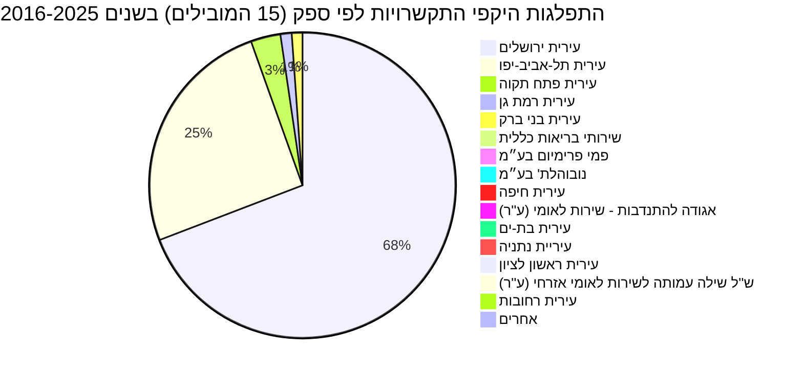
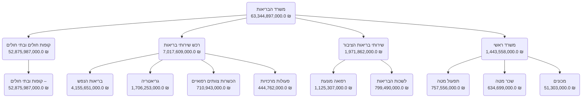

# נתוני תקציב, התקשרויות והחלטות ממשלה בתחום טיפת חלב

דוח זה מציג ניתוח מקיף של נתוני התקציב, ההתקשרויות והחלטות הממשלה הקשורים לתחום [טיפת חלב](https://next.obudget.org/i/3c061edef005) בישראל. הנתונים מראים כי התקציב המוקצה לנושא מנוהל בעיקר דרך [משרד הבריאות](https://next.obudget.org/i/613c4ef0295a), תחת סעיפים כמו [שירותי בריאות הציבור](https://next.obudget.org/i/25ec4cd4faaf) ו[רפואה מונעת](https://next.obudget.org/i/3c061edef005). לאורך השנים, ניכרת מגמת עלייה בהיקפי התקציב והניצול, במיוחד משנת 2008. מרבית ההתקשרויות הן עם רשויות מקומיות, המובילות שבהן עיריית ירושלים ועיריית תל-אביב-יפו, לאספקת שירותי טיפת חלב. בנוסף, נמצאו החלטות ממשלה רלוונטיות התומכות בחיזוק שירותי הבריאות בקהילה.

## מגמה תקציבית לאורך זמן

| שנה | סכום שהוקצה (NIS) | סכום מתוקן (NIS) | סכום שנוצל (NIS) |
|---|---|---|---|
| 2000 | 750,000 | 1,500,000 | 1,298,223 |
| 2001 | 1,403,000 | 1,445,000 | 1,444,336 |
| 2002 | 1,408,000 | 2,676,000 | 2,657,531 |
| 2003 | 1,347,000 | 1,365,000 | 1,365,000 |
| 2004 | 1,286,000 | 1,286,000 | 1,285,993 |
| 2005 | 1,286,000 | 2,797,000 | 2,737,946 |
| 2006 | 1,286,000 | 6,386,000 | 2,785,972 |
| 2007 | 1,286,000 | 19,584,000 | 13,196,781 |
| 2008 | 92,032,000 | 107,847,000 | 119,917,896 |
| 2009 | 109,495,000 | 119,563,000 | 134,753,096 |
| 2010 | 114,112,000 | 133,179,000 | 147,255,458 |
| 2011 | 35,710,000 | 36,310,000 | 36,076,082 |
| 2012 | 35,710,000 | 36,942,000 | 36,831,594 |
| 2013 | 35,584,000 | 37,335,000 | 37,216,555 |
| 2014 | 36,184,000 | 38,128,000 | 37,198,136 |
| 2015 | 36,184,000 | 38,656,000 | 36,772,201 |
| 2016 | 36,727,000 | 46,908,000 | 43,617,075 |
| 2017 | 42,683,000 | 45,084,000 | 43,911,098 |
| 2018 | 43,403,000 | 50,181,000 | 46,242,659 |
| 2019 | 46,278,000 | 50,985,000 | 48,824,219 |
| 2020 | *אין נתונים* | 50,683,000 | 48,824,089 |
| 2021 | 48,162,000 | 46,793,000 | 45,425,424 |
| 2022 | 44,162,000 | 49,500,000 | 46,286,360 |
| 2023 | 47,162,000 | 53,000,000 | 50,502,511 |
| 2024 | 60,162,000 | 68,784,000 | 60,289,052 |
| 2025 | 67,412,000 | 93,356,000 | 64,541,489 |
| 2026 | 70,138,000 | 70,138,000 | *אין נתונים* |

## תכניות פעילות כיום

### התפלגות היקפי התקשרויות לפי ספק (15 הספקים המובילים) בשנים 2016-2025

## מקורות תקציב

סעיף התקציב המרכזי ל"טיפת חלב" נמצא תחת [משרד הבריאות](https://next.obudget.org/i/613c4ef0295a). בתוך תקציב המשרד, הוא משתייך בעיקר לסעיף [שירותי בריאות הציבור](https://next.obudget.org/i/25ec4cd4faaf), ובאופן ספציפי יותר תחת [רפואה מונעת](https://next.obudget.org/i/3c061edef005). זה משקף את המיקוד של שירותי טיפת חלב בקידום בריאות ומניעת מחלות בקרב אמהות ותינוקות.

### רשימת סעיפי תקציב נבחרים (עם קישורים)
*   [24 משרד הבריאות](https://next.obudget.org/i/613c4ef0295a)
    *   [24.20 קופות חולים ובתי חולים](https://next.obudget.org/i/dac9b945bd69)
        *   [24.20.03 קופות ובתי חולים –](https://next.obudget.org/i/1abace30f37b)
    *   [24.07 רכש שירותי בריאות](https://next.obudget.org/i/22e9bacadf2a)
        *   [24.07.14 בריאות הנפש](https://next.obudget.org/i/b748e28f2ed0)
        *   [24.07.10 גריאטריה](https://next.obudget.org/i/44c7034a835f)
        *   [24.07.01 הכשרות צוותים רפואיים](https://next.obudget.org/i/4b44ddc69a23)
        *   [24.07.09 פעולות מרכזיות](https://next.obudget.org/i/a2f3a39ecf8c)
    *   [24.16 שירותי בריאות הציבור](https://next.obudget.org/i/25ec4cd4faaf)
        *   [24.16.03 רפואה מונעת](https://next.obudget.org/i/3c061edef005)
        *   [24.16.90 לשכות הבריאות](https://next.obudget.org/i/cbf1ab700244)
    *   [24.02 משרד ראשי](https://next.obudget.org/i/0b149e10bcf6)
        *   [24.02.05 תפעול מטה](https://next.obudget.org/i/8eb18fda9e56)
        *   [24.02.01 שכר מטה](https://next.obudget.org/i/096074a41f90)
        *   [24.02.18 מכונים](https://next.obudget.org/i/aa25d181307f)

## נושאים נוספים

### התקשרויות/חוזים
| מטרה | משרד רוכש | ספק | היקף (NIS) | בוצע (NIS) | שנת התחלה | שנת סיום |
|---|---|---|---|---|---|---|
| [השתתפות בטיפות חלב 70:30 לשנת 2024](https://next.obudget.org/i/d4af4b3ce6d8) | משרד הבריאות | עירית ירושלים | 30711025.0 | 0.0 | 2024 | 2024 |
| [השתתפות בטיפות חלב 70:30](https://next.obudget.org/i/f93404381692) | משרד הבריאות | עירית ירושלים | 29331076.0 | 29331076.0 | 2023 | 2023 |
| [שירות טיפת חלב בעיר במסגרת 70:30](https://next.obudget.org/i/7eb0554b6e88) | משרד הבריאות | עירית ירושלים | 28117678.0 | 28117677.0 | 2021 | 2021 |
| [השתתפות בטיפות חלב 70:30](https://next.obudget.org/i/bc76aeafee2f) | משרד הבריאות | עירית ירושלים | 27742676.0 | 0.0 | 2022 | 2022 |
| [השתתפות בטיפות חלב 70:30](https://next.obudget.org/i/270ea230ab58) | משרד הבריאות | עירית ירושלים | 27295255.0 | 27295255.0 | 2020 | 2020 |
| [השתתפות משרד הבריאות בשירותי טיפות חלב 70:30 לשנת 2019](https://next.obudget.org/i/d101fc71a2fc) | משרד הבריאות | עירית ירושלים | 26017335.0 | 26017335.0 | 2019 | 2020 |
| [השתתפות משרד הבריאות בשירותי טיפות חלב 70:30 לשנת 2018](https://next.obudget.org/i/2b1f68bbb53d) | משרד הבריאות | עירית ירושלים | 25616758.0 | 25616758.0 | 2018 | 2019 |
| [השתתפות בשירותי טיפות חלב 70:30](https://next.obudget.org/i/72a032ad4a4e) | משרד הבריאות | עירית ירושלים | 25240564.0 | 25240564.0 | 2017 | 2017 |
| [השתתפות בשירותי טיפות חלב 70:30](https://next.obudget.org/i/5a1473434c3f) | משרד הבריאות | עירית ירושלים | 23077131.0 | 23077131.7 | 2016 | 2016 |
| [הוצאות תחנת אם וילד בתל-אביב](https://next.obudget.org/i/53769831dd28) | משרד הבריאות | עירית תל-אביב-יפו | 14551975.0 | 14551975.0 | 2020 | 2020 |
| [השתתפות הו"צ טיפות חלב 2023](https://next.obudget.org/i/e9a8034c78d7) | משרד הבריאות | עירית תל-אביב-יפו | 12767521.0 | 12767521.0 | 2023 | 2023 |
| [השתתפות הו"צ טיפות חלב 2022](https://next.obudget.org/i/1b22446ab28f) | משרד הבריאות | עירית תל-אביב-יפו | 12564764.0 | 12564764.0 | 2021 | 2022 |
| [הוצאות תחנות אם וילד בתל-אביב](https://next.obudget.org/i/34812960e0ed) | משרד הבריאות | עירית תל-אביב-יפו | 11401109.0 | 11401109.0 | 2018 | 2018 |
| [העברה תקציבית](https://next.obudget.org/i/67fb53e1f575) | משרד הבריאות | עירית תל-אביב-יפו | 11127794.0 | 11127794.0 | 2017 | 2017 |
| [הוצאות תחנת אם וילד בתל אביב](https://next.obudget.org/i/717862281ab7) | משרד הבריאות | עירית תל-אביב-יפו | 10000000.0 | 10000000.0 | 2019 | 2019 |
| [ע"ח התחשבנות תחנות טיפות חלב](https://next.obudget.org/i/df52a1113082) | משרד הבריאות | עירית תל-אביב-יפו | 6900000.0 | 6900000.0 | 2016 | 2016 |
| [העברה תקציבית](https://next.obudget.org/i/59a06b519994) | משרד הבריאות | עירית תל-אביב-יפו | 5007178.0 | 5007178.0 | 2016 | 2016 |
| [הוצאות תחנת אם וילד בתל אביב](https://next.obudget.org/i/819dfd02a428) | משרד הבריאות | עירית תל-אביב-יפו | 2597095.0 | 2597095.0 | 2019 | 2019 |
| [הוצאות תחנות אם וילד בתל-אביב](https://next.obudget.org/i/bd7629fbb87a) | משרד הבריאות | עירית תל-אביב-יפו | 2254984.0 | 332625.0 | 2018 | 2018 |
| [שירותי תזונאיות עבור תחנות טיפת חלב ברחבי הארץ באישור החשב](https://next.obudget.org/i/c18d5f14c2a5) | משרד הבריאות | פמי פרימיום בע״מ | 2149804.98 | 0.0 | 2019 | 2025 |
| [עבור הוצאות רפאוה מונעת לשנת 2015](https://next.obudget.org/i/d72335b98c3f) | משרד הבריאות | עירית פתח תקוה | 2000000.0 | 1946337.0 | 2016 | 2016 |
| [עבור הוצאה מונעת לשנת 2022-2023](https://next.obudget.org/i/f96113029676) | משרד הבריאות | עירית פתח תקוה | 1780763.0 | 0.0 | 2023 | 2023 |
| [עבור הוצאות רפואה מונעת לשנת 2018](https://next.obudget.org/i/404092d41db7) | משרד הבריאות | עירית פתח תקוה | 1775353.0 | 1734344.0 | 2019 | 2020 |
| [עבור הוצאות רפואה מונעת לשנת 2017](https://next.obudget.org/i/edcad26e4c50) | משרד הבריאות | עירית פתח תקוה | 1775353.0 | 1775353.0 | 2018 | 2019 |
| [הוצאות רפואה מונעת לשנת 2017](https://next.obudget.org/i/734d03512c43) | משרד הבריאות | עירית פתח תקוה | 1463616.0 | 1463616.0 | 2017 | 2018 |
| [הקמת תחנת ט"ח בני ברק](https://next.obudget.org/i/e378fa4f1759) | משרד הבריאות | עירית בני ברק | 1175000.0 | 0.0 | 2022 | 2025 |
| [עבור הוצאה מונעת לשנת 2020](https://next.obudget.org/i/5d5544836a23) | משרד הבריאות | עירית פתח תקוה | 1098757.0 | 1098757.0 | 2021 | 2021 |
| [עבור הוצאות רפואה מונעת לשנת 2019](https://next.obudget.org/i/642d754b8dd1) | משרד הבריאות | עירית פתח תקוה | 1079288.0 | 1079228.0 | 2020 | 2020 |
| [הרחבת שירות טיפת חלב בעיר במסגרת 70:30 באישור מנכ"ל משרד הבריאות](https://next.obudget.org/i/0713860a8826) | משרד הבריאות | עירית ירושלים | 945000.0 | 0.0 | 2019 | 2020 |
| [עבור מכרז פומבי 117/2023 למתן שירותי טיפות חלב חיוניים במרכזי פינוי אוכלו](https://next.obudget.org/i/c9e9983212a0) | משרד הבריאות | נובוהלת' בע״מ | 893759.99 | 0.0 | 2023 | 2024 |
| [הוצאות תחנת אם וילד ברמת גן](https://next.obudget.org/i/efdd31b50a56) | משרד הבריאות | עירית רמת גן | 765118.0 | 765118.0 | 2022 | 2022 |
| [העברה תקציבית](https://next.obudget.org/i/6a07396ba7c4) | משרד הבריאות | עירית רמת גן | 675471.0 | 675471.0 | 2017 | 2017 |
| [השתתפות הו"צ טיפות חלב 2023](https://next.obudget.org/i/6729303fd320) | משרד הבריאות | עירית בני ברק | 665012.0 | 665012.0 | 2023 | 2023 |
| [שילוב שירותים](https://next.obudget.org/i/9d0c0ae7ccd9) | משרד הבריאות | שירותי בריאות כללית | 622000.0 | 622000.0 | 2018 | 2020 |
| [התחשבנות 70:30](https://next.obudget.org/i/4005a64c82fc) | משרד הבריאות | עירית תל-אביב-יפו | 618450.0 | 618450.0 | 2017 | 2017 |
| [הוצאות תחנות אם וילד ברמת-גן](https://next.obudget.org/i/f3382bfaf272) | משרד הבריאות | עירית רמת גן | 553227.0 | 553227.0 | 2018 | 2018 |
| [הוצאות תחנת אם וילד בבני-ברק](https://next.obudget.org/i/3ac6b9a125e5) | משרד הבריאות | עירית בני ברק | 524283.0 | 524283.0 | 2022 | 2022 |
| [מימון הפרשי הוצאות תפעול טיפות חלב עיריית ירושלים](https://next.obudget.org/i/d970edf7f3e8) | משרד הבריאות | עירית ירושלים | 500000.0 | 500000.0 | 2016 | 2017 |
| [הוצאות תחנת אם וילד בני ברק](https://next.obudget.org/i/306362110a62) | משרד הבריאות | עירית בני ברק | 467872.0 | 467872.0 | 2020 | 2020 |
| [הוצאות תחנת אם וילד ברמת גן 2023](https://next.obudget.org/i/470f829a9bd1) | משרד הבריאות | עירית רמת גן | 466403.0 | 466403.0 | 2023 | 2023 |
| [השתתפות בעלות שיפוץ תחנת טיפת חלב](https://next.obudget.org/i/00e61e1617e3) | משרד הבריאות | עירית בני ברק | 375000.0 | 375000.0 | 2021 | 2021 |
| [העברה תקציבית](https://next.obudget.org/i/e8e77a5ed0b3) | משרד הבריאות | עירית רמת גן | 374074.0 | 374074.0 | 2016 | 2016 |
| [הוצאות תחנת אם וילד ברמת-גן](https://next.obudget.org/i/dfa1a060a666) | משרד הבריאות | עירית רמת גן | 338289.0 | 338289.0 | 2020 | 2020 |
| [שילוב שירותים](https://next.obudget.org/i/a15c2413edc1) | משרד הבריאות | שירותי בריאות כללית | 311000.0 | 311000.0 | 2016 | 2017 |
| [שילוב שירותים לשנת 2021](https://next.obudget.org/i/0f42bc32278a) | משרד הבריאות | שירותי בריאות כללית | 311000.0 | 311000.0 | 2021 | 2021 |
| [שילוב שירותים](https://next.obudget.org/i/55087c2b00bf) | משרד הבריאות | שירותי בריאות כללית | 311000.0 | 311000.0 | 2022 | 2022 |
| [שילוב שירותים לשנת 2020](https://next.obudget.org/i/8919c5f0274b) | משרד הבריאות | שירותי בריאות כללית | 311000.0 | 311000.0 | 2020 | 2020 |
| [שילוב שירותים](https://next.obudget.org/i/35cbcb5dc533) | משרד הבריאות | שירותי בריאות כללית | 311000.0 | 311000.0 | 2017 | 2018 |
| [תשלום בין משרדים](https://next.obudget.org/i/27cce8b48884) | משרד הבריאות | עירית רמת גן | 309000.0 | 309000.0 | 2016 | 2016 |
| [הוצאות תחנת אם וילד ברמת גן](https://next.obudget.org/i/483e2368c928) | משרד הבריאות | עירית רמת גן | 300000.0 | 300000.0 | 2019 | 2019 |

### ספקים
| שם הספק | היקף כולל (NIS) |
|---|---|
| [עירית ירושלים](https://next.obudget.org/i/org/municipality/500230008) | 244795061.12 |
| [עירית תל-אביב-יפו](https://next.obudget.org/i/org/municipality/500250006) | 89790870.0 |
| [עירית פתח תקוה](https://next.obudget.org/i/org/municipality/500279005) | 11113914.7 |
| [עירית רמת גן](https://next.obudget.org/i/org/municipality/500286000) | 4195421.3 |
| [עירית בני ברק](https://next.obudget.org/i/org/municipality/500261003) | 3992621.0 |
| [שירותי בריאות כללית](https://next.obudget.org/i/org/ottoman-association/589906114) | 2177000.0 |
| [פמי פרימיום בע״מ](https://next.obudget.org/i/org/company/512676206) | 2149804.98 |
| [נובוהלת' בע״מ](https://next.obudget.org/i/org/company/513060806) | 893759.99 |
| [עירית חיפה](https://next.obudget.org/i/org/municipality/500240007) | 270421.0 |
| [אגודה להתנדבות - שירות לאומי (ע''ר)](https://next.obudget.org/i/org/association/580025708) | 268920.0 |
| [עירית בת-ים](https://next.obudget.org/i/org/municipality/500262001) | 248369.61 |
| [עיריית נתניה](https://next.obudget.org/i/org/municipality/500274006) | 197099.74 |
| [עירית ראשון לציון](https://next.obudget.org/i/org/municipality/500283007) | 166711.7 |
| [ש''ל שילה עמותה לשירות לאומי אזרחי (ע''ר)](https://next.obudget.org/i/org/association/580354090) | 163800.0 |
| [עירית רחובות](https://next.obudget.org/i/org/municipality/500284005) | 126765.7 |
| [עירית רמלה](https://next.obudget.org/i/org/municipality/500285002) | 98605.3 |
| [עירית נצרת](https://next.obudget.org/i/org/municipality/500273008) | 91195.9 |
| [עירית חדרה](https://next.obudget.org/i/org/municipality/500265004) | 64022.0 |
| [עירית טבריה](https://next.obudget.org/i/org/municipality/500267000) | 63072.61 |
| [עירית בית-שמש](https://next.obudget.org/i/org/municipality/500226105) | 56185.3 |
| [עירית שפרעם](https://next.obudget.org/i/org/municipality/500288006) | 54891.6 |
| [עירית קרית אתא](https://next.obudget.org/i/org/municipality/500268008) | 53605.0 |
| [עירית ביתר עילית](https://next.obudget.org/i/org/municipality/500237805) | 48998.0 |
| [אופק לקידום מתנדבים צעירים בישראל (ע''ר)](https://next.obudget.org/i/org/association/580600138) | 47344.0 |
| [עיריית נוף הגליל](https://next.obudget.org/i/org/municipality/500210612) | 44045.0 |
| [מ. מ. מעלה עירון](https://next.obudget.org/i/org/municipality/500213277) | 43300.0 |
| [דפוס נח מדיה בע״מ](https://next.obudget.org/i/org/company/514724343) | 42471.0 |
| [מ. מ. פרדס-חנה-כרכור](https://next.obudget.org/i/org/municipality/500278007) | 41534.0 |
| [מ. מ. כפר-כנא](https://next.obudget.org/i/org/municipality/500205091) | 39440.5 |
| [חוליות פתרונות אחסון בע״מ](https://next.obudget.org/i/org/company/511979361) | 39292.34 |
| [עירית עפולה](https://next.obudget.org/i/org/municipality/500277009) | 37075.1 |
| [עירית קרית שמונה](https://next.obudget.org/i/org/municipality/500228002) | 36691.2 |
| [עירית אום-אל-פחם](https://next.obudget.org/i/org/municipality/500227103) | 36449.0 |
| [מודיעין-מכבים-רעות](https://next.obudget.org/i/org/municipality/500213517) | 36311.3 |
| [עיריית אלעד](https://next.obudget.org/i/org/municipality/500213095) | 35158.0 |
| [פאן ייצור ויבוא ציוד משרדי בע״מ](https://next.obudget.org/i/org/company/511807596) | 30420.0 |
| [מ. מ. זכרון יעקב](https://next.obudget.org/i/org/municipality/500293006) | 28100.0 |
| [עירית קרית ים](https://next.obudget.org/i/org/municipality/500296009) | 28010.0 |
| [עירית טמרה](https://next.obudget.org/i/org/municipality/500289004) | 27270.6 |
| [עירית נשר](https://next.obudget.org/i/org/municipality/500225008) | 27088.0 |
| [עירית נהריה](https://next.obudget.org/i/org/municipality/500291000) | 24450.0 |
| [עירית קרית ביאליק](https://next.obudget.org/i/org/municipality/500295001) | 23309.0 |
| [ויטראז' בע״מ](https://next.obudget.org/i/org/company/510950082) | 23166.0 |
| [מ. מ. ינוח ג'ת](https://next.obudget.org/i/org/municipality/500212956) | 22117.9 |
| [עירית צפת](https://next.obudget.org/i/org/municipality/500280003) | 21739.1 |
| [מ. א. הגלבוע](https://next.obudget.org/i/org/municipality/500223086) | 21417.5 |
| [שראל - פתרונות לוגיסטיים ומוצרים לרפואה מתקדמת בע״מ](https://next.obudget.org/i/org/company/511900805) | 21212.1 |
| [מ. מ. ריינה](https://next.obudget.org/i/org/municipality/500205422) | 20315.4 |
| [מ. א. אל-בטוף](https://next.obudget.org/i/org/municipality/500225651) | 20052.7 |
| [מ. א. בוסתאן אל-מרג'](https://next.obudget.org/i/org/municipality/500225669) | 19677.9 |

### החלטות ממשלה
| כותרת | ממשלה | מספר החלטה | תאריך פרסום |
|---|---|---|---|
| [שיפור השירותים בתחום הבריאות, הרווחה, החינוך ותרבות הפנאי בירושלים](https://next.obudget.org/i/aaf6d3f84db7) | הממשלה ה- 34, בנימין נתניהו | 1487 | 2016-06-02 |
| [תכנית רב שנתית לפיתוח הדרום](https://next.obudget.org/i/f093a9cdb036) | null | 2025 | 2014-09-23 |
| [סיוע בהקמת העיר חריש](https://next.obudget.org/i/2dd9d04f1036) | הממשלה ה- 34, בנימין נתניהו | 870 | 2015-12-20 |
| [ייעול והסדרת עבודת הממשלה בתחום מוסדות הציבור](https://next.obudget.org/i/7196b9c0a116) | הממשלה ה- 34, בנימין נתניהו | 1842 | 2016-08-11 |
| [הקצאת מקרקעין לשם הקמת קריית חינוך בירושלים - כפר עקב](https://next.obudget.org/i/c5abb625de91) | הממשלה ה- 36, נפתלי בנט | 1520 | 2022-05-29 |
| [תכנית לחיזוק החוסן האזרחי בשדרות וביישובי "עוטף רצועת עזה" לשנים 2021 - 2022 ותיקון החלטות ממשלה](https://next.obudget.org/i/b07788cbc0ce) | הממשלה ה- 35, בנימין נתניהו | 566 | 2020-11-22 |
| [תכנית להאצת השירותים הדיגיטליים לציבור ולקידום הלמידה הדיגיטלית ותיקון החלטת ממשלה](https://next.obudget.org/i/09435f972deb) | הממשלה ה- 35, בנימין נתניהו | 260 | 2020-07-26 |
| [מדיניות ממשלתית להתמודדות עם הפוליגמיה - יישום ומעקב אחר עקרונות דו"ח הצוות הבין-משרדי  להתמודדות עם השלכותיה השליליות של הפוליגמיה](https://next.obudget.org/i/6bbb96505de9) | הממשלה ה- 34, בנימין נתניהו | 4211 | 2018-10-25 |
| [הגדרת אזורים שבהם שיעור מסתננים גבוה כאזורי עדיפות לאומית](https://next.obudget.org/i/caa064715411) | הממשלה ה- 34, בנימין נתניהו | 4023 | 2018-07-23 |

## מקורות
*   **נתוני תקציב:**
    *   [נתוני תקציב מצרפיים לטיפת חלב](https://next.obudget.org/api/download?query=U0VMRUNUIHllYXIsIFNVTShhbW91bnRfYWxsb2NhdGVkKSBBUyB0b3RhbF9hbGxvY2F0ZWQsIFNVTShhbW91bnRfcmV2aXNlZCkgQVMgdG90YWxfcmV2aXNlZCwgU1VNKGFtb3VudF91c2VkKSBBUyB0b3RhbF91c2VkIEZST00gYnVkZ2V0X2l0ZW1zX2RhdGEgV0hFUkUgdGl0bGUgTElLRSAnJdeY15nXpNeV16og15fXnNeRJScgR1JPVVAgQlkgeWVhciBPUkRFUiBCWSB5ZWFyIEFTQw%3D%3D&headers=year%3Btotal_allocated%3Btotal_revised%3Btotal_used)
    *   [משרד הבריאות](https://next.obudget.org/i/613c4ef0295a)
    *   [שירותי בריאות הציבור](https://next.obudget.org/i/25ec4cd4faaf)
    *   [רפואה מונעת](https://next.obudget.org/i/3c061edef005)

*   **התקשרויות וספקים:**
    *   [התקשרות עם עירית ירושלים (2024)](https://next.obudget.org/i/d4af4b3ce6d8)
    *   [התקשרות עם פמי פרימיום בע״מ](https://next.obudget.org/i/c18d5f14c2a5)
    *   [התקשרות עם נובוהלת' בע״מ](https://next.obudget.org/i/c9e9983212a0)
    *   [דף ספק: עירית ירושלים](https://next.obudget.org/i/org/municipality/500230008)
    *   [דף ספק: עירית תל-אביב-יפו](https://next.obudget.org/i/org/municipality/500250006)
    *   [דף ספק: פמי פרימיום בע״מ](https://next.obudget.org/i/org/company/512676206)

*   **החלטות ממשלה:**
    *   [החלטה 1487: שיפור שירותים בירושלים](https://next.obudget.org/i/aaf6d3f84db7)
    *   [החלטה 2025: תכנית רב שנתית לפיתוח הדרום](https://next.obudget.org/i/f093a9cdb036)
    *   [החלטה 870: סיוע בהקמת העיר חריש](https://next.obudget.org/i/2dd9d04f1036)
    *   [החלטה 1842: ייעול והסדרת עבודת הממשלה](https://next.obudget.org/i/7196b9c0a116)
    *   [החלטה 1520: הקצאת מקרקעין לקריית חינוך בירושלים](https://next.obudget.org/i/c5abb625de91)
    *   [החלטה 566: תכנית לחיזוק החוסן האזרחי בשדרות](https://next.obudget.org/i/b07788cbc0ce)
    *   [החלטה 260: תכנית להאצת השירותים הדיגיטליים](https://next.obudget.org/i/09435f972deb)
    *   [החלטה 4211: מדיניות ממשלתית להתמודדות עם פוליגמיה](https://next.obudget.org/i/6bbb96505de9)
    *   [החלטה 4023: הגדרת אזורים שבהם שיעור מסתננים גבוה כאזורי עדיפות לאומית](https://next.obudget.org/i/caa064715411)

[חזרה לעמוד הראשי](../../README.md)