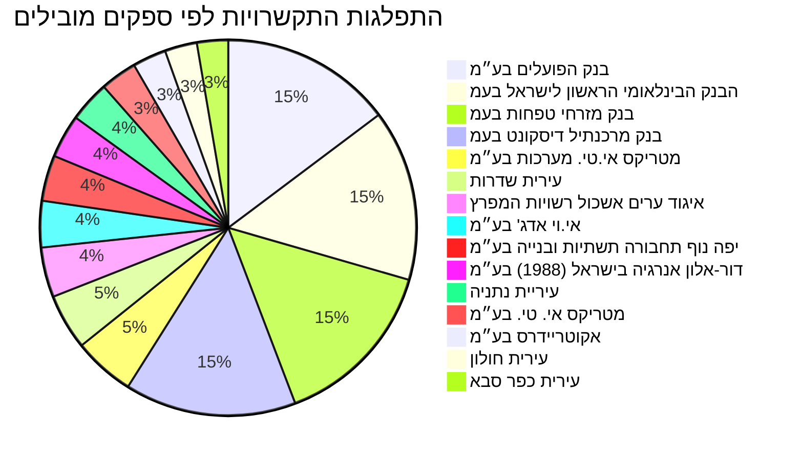

# נתוני אנרגיה ירוקה - דשבורד מפורט

דשבורד זה מרכז נתונים עדכניים בתחום האנרגיה הירוקה בישראל, מתוך תקציב המדינה, התקשרויות ממשלתיות והחלטות ממשלה.

## סקירה כללית
הנתונים המוצגים מכסים את השנים 2018-2028 עבור התקשרויות, ומתייחסים לשנת התקציב 2025 עבור סעיפי התקציב.

## מגמה תקציבית לאורך זמן

המידע שסופק אינו כולל נתוני תקציב היסטוריים מפורטים המאפשרים הצגת מגמה תקציבית לאורך זמן (מוקצה, מתוקן, מבוצע בפועל) עבור סעיפי האנרגיה הירוקה שנאספו. עם זאת, להלן מבט תקציבי לשנת 2025 עבור הסעיפים ההיררכיים העיקריים הקשורים לנושא, כפי שנדלו ממשרד האנרגיה:

| קוד        | כותרת              | סכום שהוקצה (ש"ח) | רמה |
| :--------- | :---------------- | :--------------- | :- |
| `34`       | משרד האנרגיה      | 541,020,000      | 1  |
| `34.30`    | מטה המשרד          | 455,939,000      | 2  |
| `34.30.03` | יחידות מקצועיות  | 335,523,000      | 3  |
| `34.30.01` | הוצאות שכר        | 76,610,000       | 3  |
| `34.31`    | מכון גיאולוגי    | 63,847,000       | 2  |

## תכניות פעילות כיום

### התפלגות התקשרויות לפי ספקים מובילים (נפח כולל)

להלן גרף המציג את התפלגות 15 הספקים המובילים מבחינת נפח ההתקשרויות בתחום האנרגיה הירוקה.



### טבלת התקשרויות מובילות
להלן 50 ההתקשרויות הגדולות ביותר בנושא אנרגיה ירוקה, ממוינות לפי נפח התקשרות יורד:

| מטרה | משרד רוכש | שם ספק | נפח התקשרות | בוצע בפועל | שנת התחלה | שנת סיום | קישור לפריט |
|---|---|---|---|---|---|---|---|
| תקצוב תוחלת סיכון- הלוואות בערבות מדינה לפרוייקטי התייעלות אנרגטית | משרד האוצר | בנק הפועלים בע״מ | 37,500,000.0 | 0.0 | 2018 | 2024 | [קישור](https://next.obudget.org/i/63c7e7572a70) |
| תקצוב תוחלת סיכון- הלוואות בערבות מדינה לפרוייקטי התייעלות אנרגטית | משרד האוצר | הבנק הבינלאומי הראשון לישראל בעמ | 37,500,000.0 | 0.0 | 2018 | 2024 | [קישור](https://next.obudget.org/i/5b2b9f737a15) |
| תקצוב תוחלת סיכון- הלוואות בערבות מדינה לפרוייקטי התייעלות אנרגטית | משרד האוצר | בנק מרכנתיל דיסקונט בעמ | 37,500,000.0 | 0.0 | 2018 | 2024 | [קישור](https://next.obudget.org/i/aa6e3bc4ad3d) |
| תקצוב תוחלת סיכון- הלוואות בערבות מדינה לפרוייקטי התייעלות אנרגטית | משרד האוצר | בנק מזרחי טפחות בעמ | 37,500,000.0 | 0.0 | 2018 | 2024 | [קישור](https://next.obudget.org/i/8eab64f64e5e) |
| פרויקט המאיץ להיערכות לשינוי אקלים ואנרגיה מקיימת בשלטון המקומי | משרד האנרגיה | מטריקס אי.טי. מערכות בע״מ | 6,437,340.0 | 0.0 | 2022 | 2024 | [קישור](https://next.obudget.org/i/27960b3be7ff) |
| פרויקט המאיץ להיערכות לשינוי אקלים ואנרגיה מקיימת בשלטון המקומי | משרד האנרגיה | מטריקס אי.טי. מערכות בע״מ | 6,437,340.0 | 0.0 | 2022 | 2024 | [קישור](https://next.obudget.org/i/9e654495f6d3) |
| פרויקט המאיץ להיערכות לשינוי אקלים ואנרגיה מקיימת בשלטון המקומי | משרד האנרגיה | מטריקס אי. טי. בע״מ | 6,378,840.0 | 0.0 | 2023 | 2025 | [קישור](https://next.obudget.org/i/d3718adec231) |
| יישום תוכניות פעולה ברשויות מקומיות | משרד האנרגיה | יפה נוף תחבורה תשתיות ובנייה בע״מ | 5,000,000.0 | 0.0 | 2022 | 2025 | [קישור](https://next.obudget.org/i/33e2df69911d) |
| יישום תוכניות פעולה ברשויות מקומיות | משרד האנרגיה | יפה נוף תחבורה תשתיות ובנייה בע״מ | 5,000,000.0 | 0.0 | 2022 | 2025 | [קישור](https://next.obudget.org/i/781ecdfefc8c) |
| יישום תוכניות פעולה 28/23 | משרד האנרגיה | עירית ראשון לציון | 4,999,800.0 | 0.0 | 2023 | 2026 | [קישור](https://next.obudget.org/i/80f61d37ccf0) |
| יישום תוכניות פעולה ברשויות מקומיות | משרד האנרגיה | עירית שדרות | 4,679,138.0 | 0.0 | 2022 | 2025 | [קישור](https://next.obudget.org/i/edac35d17382) |
| יישום תוכניות פעולה ברשויות מקומיות | משרד האנרגיה | עירית שדרות | 4,679,138.0 | 0.0 | 2022 | 2025 | [קישור](https://next.obudget.org/i/cc3908523ef8) |
| יישום תוכניות פעולה ברשויות מקומיות | משרד האנרגיה | איגוד ערים אשכול רשויות המפרץ | 4,568,850.0 | 0.0 | 2022 | 2025 | [קישור](https://next.obudget.org/i/712d6610a743) |
| יישום תוכניות פעולה ברשויות מקומיות | משרד האנרגיה | איגוד ערים אשכול רשויות המפרץ | 4,568,850.0 | 0.0 | 2022 | 2025 | [קישור](https://next.obudget.org/i/2d182dc6a2ea) |
| יישום תוכניות פעולה 28/23 | משרד האנרגיה | עירית תל-אביב-יפו | 3,946,050.0 | 0.0 | 2023 | 2026 | [קישור](https://next.obudget.org/i/bee67775572b) |
| יישום תוכניות פעולה ברשויות מקומיות | משרד האנרגיה | עירית כפר סבא | 3,410,925.0 | 0.0 | 2022 | 2025 | [קישור](https://next.obudget.org/i/bbdd4931e75d) |
| יישום תוכניות פעולה ברשויות מקומיות | משרד האנרגיה | עירית כפר סבא | 3,410,925.0 | 0.0 | 2022 | 2025 | [קישור](https://next.obudget.org/i/27f7559c89e3) |
| יישום תוכניות פעולה 28/23 | משרד האנרגיה | מ. מ. ג'לג'וליה | 3,298,051.02 | 0.0 | 2023 | 2026 | [קישור](https://next.obudget.org/i/6146f431da8d) |
| יישום תוכניות פעולה 28/23 | משרד האנרגיה | עירית בית-שמש | 3,281,429.0 | 0.0 | 2023 | 2026 | [קישור](https://next.obudget.org/i/e11317ff3adf) |
| יישום תוכניות פעולה 28/23 | משרד האנרגיה | עירית ביתר עילית | 3,281,429.0 | 0.0 | 2023 | 2026 | [קישור](https://next.obudget.org/i/79cabd12b8b6) |
| יישום תוכניות פעולה 28/23 | משרד האנרגיה | החברה לפיתוח מודיעין עלית בע״מ | 3,281,428.98 | 0.0 | 2023 | 2026 | [קישור](https://next.obudget.org/i/1ef229dcc411) |
| עמדות טעינה | משרד האנרגיה | דור-אלון אנרגיה בישראל (1988) בע״מ/ | 3,249,590.76 | 0.0 | 2022 | 2026 | [קישור](https://next.obudget.org/i/cf0e233a8267) |
| עמדות טעינה | משרד האנרגיה | דור-אלון אנרגיה בישראל (1988) בע״מ/ | 3,249,590.76 | 0.0 | 2022 | 2026 | [קישור](https://next.obudget.org/i/d1b0a23c1034) |
| קול קורא 104/21 עמדות טעינה | משרד האנרגיה | אי.וי אדג' בע״מ | 3,153,621.51 | 0.0 | 2022 | 2028 | [קישור](https://next.obudget.org/i/6681aefe19a7) |
| קול קורא 104/21 עמדות טעינה | משרד האנרגיה | אי.וי אדג' בע״מ | 3,153,621.51 | 0.0 | 2022 | 2028 | [קישור](https://next.obudget.org/i/fc61ba12e6b2) |
| מענק להקמת עמדות טעינה מהירות 104/2021 | משרד האנרגיה | מילגם אי וי אדג' טעינה חשמלית שותפות מוגבלת | 3,004,999.3 | 0.0 | 2023 | 2026 | [קישור](https://next.obudget.org/i/75320eb40e50) |
| מענק להקמת עמדות טעינה מהירות 104/2021 | משרד האנרגיה | דור-אלון אנרגיה בישראל (1988) בע״מ/ | 2,992,434.08 | 0.0 | 2023 | 2026 | [קישור](https://next.obudget.org/i/1434fc64b8d7) |
| שירותי ייעוץ מגוונים לאגף אנרגיה | משרד האנרגיה | אקוטריידרס בע״מ | 2,889,085.13 | 0.0 | 2022 | 2026 | [קישור](https://next.obudget.org/i/c283f00c2a3d) |
| פרויקטים ברשויות מקומיות | משרד האנרגיה | עיריית נתניה | 2,850,100.0 | 0.0 | 2024 | 2027 | [קישור](https://next.obudget.org/i/38958957086a) |
| פרויקטים ברשויות מקומיות | משרד האנרגיה | עירית באר שבע | 2,799,660.0 | 0.0 | 2024 | 2027 | [קישור](https://next.obudget.org/i/72f78d41ce80) |
| פרויקטים ברשויות מקומיות | משרד האנרגיה | עירית בית-שמש | 2,790,000.0 | 0.0 | 2024 | 2027 | [קישור](https://next.obudget.org/i/d3af6bbed1ef) |
| יישום תוכניות פעולה ברשויות מקומיות | משרד האנרגיה | עירית אילת | 2,790,000.0 | 0.0 | 2022 | 2025 | [קישור](https://next.obudget.org/i/ced8e015daf7) |
| יישום תוכניות פעולה ברשויות מקומיות | משרד האנרגיה | עירית אילת | 2,790,000.0 | 0.0 | 2022 | 2025 | [קישור](https://next.obudget.org/i/a759929a4237) |
| פרויקטים ברשויות מקומיות | משרד האנרגיה | עירית פתח תקוה | 2,782,782.0 | 0.0 | 2024 | 2027 | [קישור](https://next.obudget.org/i/4d968133feeb) |
| יישום תוכניות פעולה 28/23 | משרד האנרגיה | עירית יבנה | 2,775,000.0 | 0.0 | 2023 | 2026 | [קישור](https://next.obudget.org/i/9ff7e1c5b4cf) |
| יישום תוכניות פעולה ברשויות מקומיות | משרד האנרגיה | עירית חולון | 2,735,400.0 | 0.0 | 2022 | 2025 | [קישור](https://next.obudget.org/i/fbd944e89906) |
| יישום תוכניות פעולה ברשויות מקומיות | משרד האנרגיה | עירית חולון | 2,735,400.0 | 0.0 | 2022 | 2025 | [קישור](https://next.obudget.org/i/71312e59bf9f) |
| יישום תוכניות פעולה 28/23 | משרד האנרגיה | עירית אופקים | 2,683,872.0 | 0.0 | 2023 | 2026 | [קישור](https://next.obudget.org/i/bcf1af53886a) |
| מענק להקמת עמדות טעינה מהירות 104/2021 | משרד האנרגיה | אי.וי אדג' בע״מ | 2,674,230.05 | 0.0 | 2023 | 2026 | [קישור](https://next.obudget.org/i/cedbac306597) |
| פרויקטים ברשויות מקומיות | משרד האנרגיה | החברה לפיתוח מודיעין עלית בע״מ | 2,550,000.0 | 0.0 | 2024 | 2027 | [קישור](https://next.obudget.org/i/630112c99c1c) |
| יישום תוכניות פעולה 28/23 | משרד האנרגיה | איגוד ערים אשכול רשויות גליל והע | 2,452,940.0 | 0.0 | 2023 | 2026 | [קישור](https://next.obudget.org/i/da2616a39e95) |
| שירותי ייעוץ מגוונים לאגף אנרגיה | משרד האנרגיה | אקוטריידרס בע״מ | 2,441,218.81 | 1,036,791.18 | 2022 | 2024 | [קישור](https://next.obudget.org/i/e680157985cc) |
| יישום תוכניות פעולה ברשויות מקומיות | משרד האנרגיה | עיריית נתניה | 2,408,661.0 | 0.0 | 2022 | 2025 | [קישור](https://next.obudget.org/i/2aef04e02cd8) |
| יישום תוכניות פעולה ברשויות מקומיות | משרד האנרגיה | עיריית נתניה | 2,408,661.0 | 0.0 | 2022 | 2025 | [קישור](https://next.obudget.org/i/a15937bc9b95) |
| פרויקטים ברשויות מקומיות | משרד האנרגיה | מודיעין-מכבים-רעות | 2,395,000.0 | 0.0 | 2024 | 2027 | [קישור](https://next.obudget.org/i/e1fdd2228e24) |
| פרויקטים ברשויות מקומיות | משרד האנרגיה | עירית קרית שמונה | 2,250,000.0 | 0.0 | 2024 | 2027 | [קישור](https://next.obudget.org/i/498ef842020b) |
| פרויקטים ברשויות מקומיות | משרד האנרגיה | מ. מ. פרדס-חנה-כרכור | 2,200,000.0 | 0.0 | 2024 | 2027 | [קישור](https://next.obudget.org/i/0fc0a934cac0) |
| עמדות טעינה | משרד האנרגיה | פז קמעונאות ואנרגיה בע״מ | 2,079,792.0 | 0.0 | 2022 | 2028 | [קישור](https://next.obudget.org/i/3de2e98bdff9) |
| עמדות טעינה | משרד האנרגיה | פז קמעונאות ואנרגיה בע״מ | 2,079,792.0 | 0.0 | 2022 | 2028 | [קישור](https://next.obudget.org/i/279fd9e157f6) |
| החלטת ממשלה | משרד האנרגיה | משרד הכלכלה/המשרד הראשי | 2,000,000.0 | 0.0 | 2018 | 2018 | [קישור](https://next.obudget.org/i/525755a66290) |

## מקורות תקציב

להלן תרשים זרימה (Flowchart) המציג את ההיררכיה התקציבית העיקרית במשרד האנרגיה, כולל קישורי גישה ישירים לפריטי התקציב. הסכומים מתייחסים לשנת 2025.

```mermaid
graph TD
    A[34: משרד האנרגיה - 541,020,000 ש"ח] --> B(34.30: מטה המשרד - 455,939,000 ש"ח);
    A --> C(34.31: מכון גיאולוגי - 63,847,000 ש"ח);
    B --> D(34.30.03: יחידות מקצועיות - 335,523,000 ש"ח);
    B --> E(34.30.01: הוצאות שכר - 76,610,000 ש"ח);

    click A "https://next.obudget.org/i/40d823f53af7" "משרד האנרגיה"
    click B "https://next.obudget.org/i/b8044e7c08bc" "מטה המשרד"
    click C "https://next.obudget.org/i/2e33fe2466b8" "מכון גיאולוגי"
    click D "https://next.obudget.org/i/0d4ed065a54d" "יחידות מקצועיות"
    click E "https://next.obudget.org/i/015b95e07b2c" "הוצאות שכר"
```

## נושאים נוספים

### ספקים מובילים
טבלת סיכום התקשרויות לפי ספקים מובילים (50 הספקים עם נפח ההתקשרות הגבוה ביותר):

| שם ספק | סך נפח התקשרות |
|---|---|
| בנק הפועלים בע״מ | 37,500,000.0 |
| הבנק הבינלאומי הראשון לישראל בעמ | 37,500,000.0 |
| בנק מזרחי טפחות בעמ | 37,500,000.0 |
| בנק מרכנתיל דיסקונט בעמ | 37,500,000.0 |
| מטריקס אי.טי. מערכות בע״מ | 13,424,679.45 |
| עירית שדרות | 12,208,924.0 |
| איגוד ערים אשכול רשויות המפרץ | 10,926,932.0 |
| אי.וי אדג' בע״מ | 10,166,920.81 |
| יפה נוף תחבורה תשתיות ובנייה בע״מ | 10,000,000.0 |
| דור-אלון אנרגיה בישראל (1988) בע״מ/ | 9,491,615.6 |
| עיריית נתניה | 9,002,422.0 |
| מטריקס אי. טי. בע״מ | 8,009,235.0 |
| אקוטריידרס בע״מ | 7,361,247.85 |
| עירית חולון | 7,048,452.0 |
| עירית כפר סבא | 6,821,850.0 |
| עירית בית-שמש | 6,691,429.0 |
| סונול אי. וי. איי. פתרונות לרכב חשמלי בע״מ | 6,531,001.31 |
| מילגם אי וי אדג' טעינה חשמלית שותפות מוגבלת | 6,442,985.8 |
| עירית ראשון לציון | 6,389,800.0 |
| עירית אילת | 6,373,600.0 |
| פז קמעונאות ואנרגיה בע״מ | 5,981,976.0 |
| עירית אשדוד | 5,928,769.0 |
| החברה לפיתוח מודיעין עלית בע״מ | 5,831,428.98 |
| איגוד ערים אשכול רשויות גליל והע | 4,988,820.0 |
| זאן אנרגיה טעינה בע״מ | 4,872,444.88 |
| מבנה נדל״ן (כ.ד) בע״מ | 4,812,508.19 |
| מכון התקנים הישראלי | 4,746,446.64 |
| ג'ינרג'י בע״מ | 4,424,966.67 |
| א.מ.ן מחשבים בעמ | 4,075,274.21 |
| עירית ביתר עילית | 3,968,609.0 |
| עירית תל-אביב-יפו | 3,950,000.0 |
| עירית אופקים | 3,883,674.0 |
| מ. מ. מטולה | 3,597,788.0 |
| איגוד ערים אשכול רשויות בית הכרם | 3,581,000.0 |
| עירית באר שבע | 3,575,708.0 |
| מ. מ. ג'לג'וליה | 3,298,051.02 |
| עירית דימונה | 3,187,900.0 |
| משרד הכלכלה/המשרד הראשי | 3,050,000.0 |
| עירית קרית גת | 3,026,778.0 |
| החברה הכלכלית לעכו בעמ | 2,907,507.03 |
| תאסק תל אביב ייעוץ אסטרטגי בע״מ | 2,833,120.99 |
| עירית פתח תקוה | 2,782,782.0 |
| עירית יבנה | 2,775,000.0 |
| אפקון תחבורה חשמלית בע״מ | 2,682,728.72 |
| איגוד ערים אשכול רשויות גליל מער | 2,665,000.0 |
| מ. מ. ירוחם | 2,522,880.0 |
| מודיעין-מכבים-רעות | 2,395,000.0 |
| עירית קרית שמונה | 2,250,000.0 |
| קבוצת דוראל משאבי אנרגיה מתחדשת בע״מ | 2,249,999.1 |
| מ. מ. פרדס-חנה-כרכור | 2,200,000.0 |

### החלטות ממשלה

להלן החלטות ממשלה רלוונטיות לתחום האנרגיה הירוקה:

| כותרת | ממשלה | מספר החלטה | תאריך פרסום | קישור לפריט |
|---|---|---|---|---|
| תכנית לאומית למניעה ולצמצום של זיהום האוויר ופליטות גזי החממה בישראל - תכנית יישום | הממשלה ה- 36, נפתלי בנט | 1282 | 2022-03-14 | [קישור](https://next.obudget.org/i/a802cad9480c) |
| מתווה מהיר לשיפור איכות הרגולציה והקלה על המשק - "ניקיון אביב" | הממשלה ה- 36, נפתלי בנט | 987 | 2022-01-16 | [קישור](https://next.obudget.org/i/43bf79bee034) |
| מעבר לאנרגיה ירוקה ותיקון החלטת ממשלה | הממשלה ה- 36, נפתלי בנט | 208 | 2021-08-01 | [קישור](https://next.obudget.org/i/30e5eadf9127) |
| אספקת חשמל לגוש דן | הממשלה ה- 36, נפתלי בנט | 211 | 2021-08-01 | [קישור](https://next.obudget.org/i/88d17fe02926) |

## מקורות

### סעיפי תקציב
*   [משרד האנרגיה](https://next.obudget.org/i/40d823f53af7)
*   [מטה המשרד](https://next.obudget.org/i/b8044e7c08bc)
*   [יחידות מקצועיות](https://next.obudget.org/i/0d4ed065a54d)
*   [הוצאות שכר](https://next.obudget.org/i/015b95e07b2c)
*   [מכון גיאולוגי](https://next.obudget.org/i/2e33fe2466b8)

### התקשרויות
*   [תקצוב תוחלת סיכון- הלוואות בערבות מדינה לפרוייקטי התייעלות אנרגטית](https://next.obudget.org/i/63c7e7572a70)
*   [תקצוב תוחלת סיכון- הלוואות בערבות מדינה לפרוייקטי התייעלות אנרגטית](https://next.obudget.org/i/5b2b9f737a15)
*   [תקצוב תוחלת סיכון- הלוואות בערבות מדינה לפרוייקטי התייעלות אנרגטית](https://next.obudget.org/i/aa6e3bc4ad3d)
*   [תקצוב תוחלת סיכון- הלוואות בערבות מדינה לפרוייקטי התייעלות אנרגטית](https://next.obudget.org/i/8eab64f64e5e)
*   [פרויקט המאיץ להיערכות לשינוי אקלים ואנרגיה מקיימת בשלטון המקומי](https://next.obudget.org/i/27960b3be7ff)
*   [פרויקט המאיץ להיערכות לשינוי אקלים ואנרגיה מקיימת בשלטון המקומי](https://next.obudget.org/i/9e654495f6d3)
*   [פרויקט המאיץ להיערכות לשינוי אקלים ואנרגיה מקיימת בשלטון המקומי](https://next.obudget.org/i/d3718adec231)
*   [יישום תוכניות פעולה ברשויות מקומיות](https://next.obudget.org/i/33e2df69911d)
*   [יישום תוכניות פעולה ברשויות מקומיות](https://next.obudget.org/i/781ecdfefc8c)
*   [יישום תוכניות פעולה 28/23](https://next.obudget.org/i/80f61d37ccf0)
*   [יישום תוכניות פעולה ברשויות מקומיות](https://next.obudget.org/i/edac35d17382)
*   [יישום תוכניות פעולה ברשויות מקומיות](https://next.obudget.org/i/cc3908523ef8)
*   [יישום תוכניות פעולה ברשויות מקומיות](https://next.obudget.org/i/712d6610a743)
*   [יישום תוכניות פעולה ברשויות מקומיות](https://next.obudget.org/i/2d182dc6a2ea)
*   [יישום תוכניות פעולה 28/23](https://next.obudget.org/i/bee67775572b)
*   [יישום תוכניות פעולה ברשויות מקומיות](https://next.obudget.org/i/bbdd4931e75d)
*   [יישום תוכניות פעולה ברשויות מקומיות](https://next.obudget.org/i/27f7559c89e3)
*   [יישום תוכניות פעולה 28/23](https://next.obudget.org/i/6146f431da8d)
*   [יישום תוכניות פעולה 28/23](https://next.obudget.org/i/e11317ff3adf)
*   [יישום תוכניות פעולה 28/23](https://next.obudget.org/i/79cabd12b8b6)
*   [יישום תוכניות פעולה 28/23](https://next.obudget.org/i/1ef229dcc411)
*   [עמדות טעינה](https://next.obudget.org/i/cf0e233a8267)
*   [עמדות טעינה](https://next.obudget.org/i/d1b0a23c1034)
*   [קול קורא 104/21 עמדות טעינה](https://next.obudget.org/i/6681aefe19a7)
*   [קול קורא 104/21 עמדות טעינה](https://next.obudget.org/i/fc61ba12e6b2)
*   [מענק להקמת עמדות טעינה מהירות 104/2021](https://next.obudget.org/i/75320eb40e50)
*   [מענק להקמת עמדות טעינה מהירות 104/2021](https://next.obudget.org/i/1434fc64b8d7)
*   [שירותי ייעוץ מגוונים לאגף אנרגיה](https://next.obudget.org/i/c283f00c2a3d)
*   [פרויקטים ברשויות מקומיות](https://next.obudget.org/i/38958957086a)
*   [פרויקטים ברשויות מקומיות](https://next.obudget.org/i/72f78d41ce80)
*   [פרויקטים ברשויות מקומיות](https://next.obudget.org/i/d3af6bbed1ef)
*   [יישום תוכניות פעולה ברשויות מקומיות](https://next.obudget.org/i/ced8e015daf7)
*   [יישום תוכניות פעולה ברשויות מקומיות](https://next.obudget.org/i/a759929a4237)
*   [פרויקטים ברשויות מקומיות](https://next.obudget.org/i/4d968133feeb)
*   [יישום תוכניות פעולה 28/23](https://next.obudget.org/i/9ff7e1c5b4cf)
*   [יישום תוכניות פעולה ברשויות מקומיות](https://next.obudget.org/i/fbd944e89906)
*   [יישום תוכניות פעולה ברשויות מקומיות](https://next.obudget.org/i/71312e59bf9f)
*   [יישום תוכניות פעולה 28/23](https://next.obudget.org/i/bcf1af53886a)
*   [מענק להקמת עמדות טעינה מהירות 104/2021](https://next.obudget.org/i/cedbac306597)
*   [פרויקטים ברשויות מקומיות](https://next.obudget.org/i/630112c99c1c)
*   [יישום תוכניות פעולה 28/23](https://next.obudget.org/i/da2616a39e95)
*   [שירותי ייעוץ מגוונים לאגף אנרגיה](https://next.obudget.org/i/e680157985cc)
*   [יישום תוכניות פעולה ברשויות מקומיות](https://next.obudget.org/i/2aef04e02cd8)
*   [יישום תוכניות פעולה ברשויות מקומיות](https://next.obudget.org/i/a15937bc9b95)
*   [פרויקטים ברשויות מקומיות](https://next.obudget.org/i/e1fdd2228e24)
*   [פרויקטים ברשויות מקומיות](https://next.obudget.org/i/498ef842020b)
*   [פרויקטים ברשויות מקומיות](https://next.obudget.org/i/0fc0a934cac0)
*   [עמדות טעינה](https://next.obudget.org/i/3de2e98bdff9)
*   [עמדות טעינה](https://next.obudget.org/i/279fd9e157f6)
*   [החלטת ממשלה](https://next.obudget.org/i/525755a66290)

### החלטות ממשלה
*   [תכנית לאומית למניעה ולצמצום של זיהום האוויר ופליטות גזי החממה בישראל - תכנית יישום](https://next.obudget.org/i/a802cad9480c)
*   [מתווה מהיר לשיפור איכות הרגולציה והקלה על המשק - "ניקיון אביב"](https://next.obudget.org/i/43bf79bee034)
*   [מעבר לאנרגיה ירוקה ותיקון החלטת ממשלה](https://next.obudget.org/i/30e5eadf9127)
*   [אספקת חשמל לגוש דן](https://next.obudget.org/i/88d17fe02926)

[חזרה לעמוד הראשי](../../README.md)